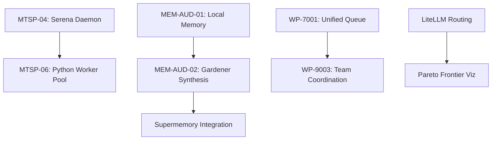

# Unified Master Implementation Plan

**Status:** Living Document | **Phase:** Multi-Platform Integration
**Goal:** Execute the Harmonious Agent Experience (HAX) across all subsystems.

---

## 1. Unified Roadmap (Consolidated)

| Phase | Title | Major Deliverables | Effort | Status |
|-------|-------|--------------------|--------|--------|
| **1** | **Foundational Optimizations** | MTSP-04 (Serena), MTSP-13/14 (Atomic Tx), MEM-AUD-01 (Memory Store) | Medium | ✓ DONE |
| **2** | **Memory & Synthesis** | MEM-AUD-02 (Gardener), WP-5001-SM (Supermemory Integration) | Medium | ⏳ IN_PROGRESS |
| **3** | **LiteLLM Routing** | TaskRouter integration, Pareto frontier visualization, Model failover | Medium | ⏳ PENDING |
| **4** | **Platform Parity** | WP-7001 (Unified Queue), WP-9003 (Team Protocol), Rules Sync | High | ⏳ PENDING |
| **5** | **Governance & Verification** | Forensic Snapshotting, Spec Verifier, Complexity Ratchet | Medium | ⏳ PENDING |

---

## 2. Integrated Work Breakdown Structure (Feb 2026 Focus)

### 2.1 Stream: Context & Memory (Gardener)
- [x] Create `agents/gardener.md` definition.
- [x] Implement `thegent memory garden` CLI command.
- [ ] Implement `SupermemoryProvider` for cloud-scale context (L3/L4).
- [ ] Connect `generate_continuity_packet` to Supermemory API.

### 2.2 Stream: Process Optimization (MTSP)
- [x] Persistent Serena daemon (MTSP-04).
- [x] Atomic Transaction tool (MTSP-13).
- [x] Edit Leasing Manager (MTSP-14).
- [ ] **Next**: Persistent Python Worker Pool (MTSP-06) to eliminate startup latency.

### 2.3 Stream: Routing & Economic Depth (LiteLLM)
- [ ] Add `litellm` dependency and classification layer.
- [ ] Implement `LiteLLM_Router` wrapper.
- [ ] Wire `CodexProxyRunner` to consume resolved routing metadata.
- [ ] Pareto Frontier Visualization TUI.

### 2.4 Stream: Multi-Platform Parity (HAX)
- [x] Teammate Coordination Protocol (WP-9003) - Voting/Broadcast.
- [ ] Unified Prompt Queue (`.thegent/prompt_queue.jsonl`).
- [ ] Multi-Platform Rules Sync (Cursor <-> Claude <-> Codex).
- [ ] Platform Handoff Injection (`$defer` support in all runners).

---

## 3. Dependency Graph (Critical Paths)

---
*Cross-ref: [PRD.md](./PRD.md) | [02-UNIFIED-WBS.md](./docs/plans/02-UNIFIED-WBS.md) | [03-UNIFIED-DAG.md](./docs/plans/03-UNIFIED-DAG.md)*
