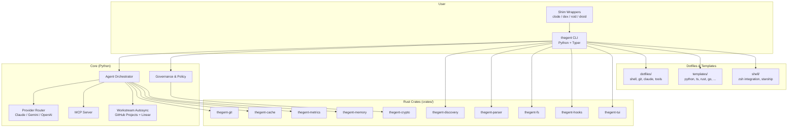

<!-- AI-DD-META:START -->
<!-- This repository is planned, maintained, and managed by AI Agents only. -->
<!-- Slop issues are expected and intentionally present as part of an HITL-less -->
<!-- /minimized AI-DD metaproject of learning, refining, and building brute-force -->
<!-- training for both agents and the human operator. -->


> ⚠️ **AI-Agent-Only Repository**
>
> This repo is **planned, maintained, and managed exclusively by AI Agents**.
> Slop issues, rough edges, and AI artifacts are **expected and intentionally
> present** as part of an **HITL-less / minimized AI-DD** metaproject focused
> on learning, refining, and brute-force training both the agents and the
> human operator. Bug reports and contributions are still welcome, but please
> expect AI-generated code, comments, and documentation throughout.
<!-- AI-DD-META:END -->
> **Work state:** ACTIVE · **Progress:** `██████░░░░ 60%`
> Python agent runtime: tool registry, LLM provider abstraction, orchestration · updated 2026-06-02

---


[](https://opensource.org/licenses/MIT)
[](https://www.rust-lang.org/)
[](https://www.python.org/)
[](https://sladge.net)

# thegent

@trace META-001: Task Decomposition
@trace META-002: Agent Selection
@trace META-003: Plan Execution
@trace META-004: Context Management
@trace META-005: Reflection
@trace META-007: Multi-Agent Coordination

**Phenotype dotfiles manager, platform bootstrap tool, and polyglot development hub.**

thegent is the single entry point for bootstrapping developer machines, managing AI agent
workflows, orchestrating multi-agent swarms, and enforcing governance across the Phenotype
ecosystem. It combines a Python CLI with Rust performance extensions and ships project
templates for 10+ language stacks.

---

## Table of Contents

- [Architecture](#architecture)
- [Key Features](#key-features)
- [Quick Start](#quick-start)
- [Directory Structure](#directory-structure)
- [Rust Crates](#rust-crates)
- [CLI Commands](#cli-commands)
- [Dotfiles and System Bootstrap](#dotfiles-and-system-bootstrap)
- [Templates](#templates)
- [Performance](#performance)
- [Development](#development)
- [License](#license)

---

## Architecture



---

## Key Features

- **Platform Bootstrap** -- Set up any macOS, Linux, or WSL system with a single command. Shell configs, git settings, tool installations, and project scaffolding.
- **Agent Orchestration** -- Run, monitor, and govern AI agents with built-in cost caps, quality gates, and audit trails.
- **Multi-Provider Routing** -- Route across Claude, Gemini, OpenAI, and custom proxies with automatic failover.
- **Rust Performance Layer** -- Tool detection in <1ms, PATH resolution in <0.5ms, 10-100x over shell baselines.
- **MCP Native** -- Full Model Context Protocol support for servers and resources.
- **Project Templates** -- Scaffolding for Python, TypeScript, Rust, Go, Ruby, Java, C++, PHP, Bash, and Zig projects with linters, formatters, and CI pre-configured.
- **Governance & Policy** -- Centralized policy enforcement, HITL gates, cost control, and release supply chain controls.
- **Workstream Sync** -- Bidirectional sync between `WORK_STREAM.md`, GitHub Projects, and Linear.

---

## Two thegents, two roles

The thegent ecosystem ships **two distinct surfaces** under the same brand. New users routinely confuse them — this section disambiguates.

| Surface | Language | Repo | Role |
|---------|----------|------|------|
| **`thegent` CLI** | Python (Typer) | this repo (`KooshaPari/thegent`) | Dotfiles manager, platform bootstrap, session orchestration, governance, multi-provider routing |
| **`thegent-dispatch`** | Rust (clap) | [`KooshaPari/thegent-dispatch`](https://github.com/KooshaPari/thegent-dispatch) | Provider-agnostic CLI dispatcher — translates a unified prompt schema into native argv for Forge, Codex, Gemini, Copilot, Cursor, Droid, Minimax, Kimi, Claude. Also exposed as a Claude Code skill (`thegent`). |

**Pick the right tool:**
- Setting up a machine, managing dotfiles, running governance gates, or orchestrating an agent session? Use the **Python `thegent` CLI** below.
- Routing a single prompt to a specific external provider CLI (e.g. "run this on Codex with high reasoning")? Use **`thegent-dispatch`** or invoke the `thegent` Claude skill.

### Hello world: dispatch a task to a provider CLI

```bash
# Install thegent-dispatch
git clone https://github.com/KooshaPari/thegent-dispatch
cd thegent-dispatch && cargo build --release

# Dispatch a prompt to Forge (primary provider)
./target/release/thegent-dispatch \
  --provider forge \
  --prompt "What is 2+2?"

# Preview the generated argv without executing
./target/release/thegent-dispatch \
  --provider codex \
  --prompt "What is 2+2?" \
  --dry-run
```

From inside Claude Code, the same dispatch is available via the bundled `thegent` skill — see [`KooshaPari/thegent-dispatch`](https://github.com/KooshaPari/thegent-dispatch) for the full provider matrix and options.

---

## Quick Start

```bash
# Clone and install
git clone https://github.com/KooshaPari/thegent
cd thegent
uv sync --all-extras

# Bootstrap your system
thegent install -t all --scope both --full
thegent doctor

# Run your first agent
thegent run free "Analyze the current directory structure"
```

For Windows:

```powershell
irm https://raw.githubusercontent.com/KooshaPari/thegent/main/scripts/install.ps1 | iex
```

---

## Directory Structure

| Directory | Purpose |
|-----------|---------|
| `src/thegent/` | Python source -- 100+ modules: agents, CLI, routing, governance, MCP, research |
| `crates/` | Rust workspace -- 28 crates for performance-critical paths |
| `cli/` | CLI command definitions (Python/Typer) |
| `agents/` | Agent persona definitions and registry |
| `templates/` | Project scaffolding templates (Python, TS, Rust, Go, Ruby, Java, C++, PHP, Bash, Zig) |
| `dotfiles/` | Shell configs, git settings, Claude configs, tool installations |
| `shell/` | Zsh integration, starship prompt, profile templates |
| `config/` | Runtime configuration and environment schemas |
| `contracts/` | Agent contracts and interface definitions |
| `governance/` | Policy modules and enforcement rules |
| `docs/` | VitePress docsite, guides, research, references |
| `hooks/` | Git hooks and quality gate scripts |
| `scripts/` | Bootstrap and utility scripts |
| `tools/` | Development tooling |
| `apps/` | Standalone applications (byteport) |
| `web/` | Web interface components |
| `mobile/` | Mobile automation support |
| `specs/` | Specification documents |
| `tests/` | Test suite (pytest) |

---

## Rust Crates

All crates live under `crates/` in a Cargo workspace. They use `gix` (gitoxide) for pure-Rust git operations.

| Crate | Purpose |
|-------|---------|
| `thegent-parser` | Fast parsing for configs, manifests, and agent output |
| `thegent-discovery` | Tool and environment discovery (<1ms) |
| `thegent-git` | Git operations via gix (gitoxide) |
| `thegent-crypto` | Cryptographic utilities for secret management |
| `thegent-fs` | High-performance filesystem operations |
| `thegent-hooks` | Git hook execution engine |
| `thegent-memory` | Agent memory and context persistence |
| `thegent-metrics` | Telemetry and performance metrics collection |
| `thegent-cache` | Caching layer for tool detection and configs |
| `thegent-docs` | Documentation generation utilities |
| `thegent-jsonl` | JSONL streaming for audit logs |
| `thegent-offload` | Background task offloading |
| `thegent-policy` | Policy evaluation engine |
| `thegent-router` | Request routing and load balancing |
| `thegent-maif` | MAIF (Multi-Agent Interaction Framework) support |
| `thegent-shims` | CLI wrapper shims (clode, dex, roid, droid) |
| `thegent-shm` | Shared memory for inter-process communication |
| `thegent-subprocess` | Subprocess management and monitoring |
| `thegent-tui` | Terminal UI compositor |
| `thegent-utils` | Shared utility functions |
| `thegent-wasm-tools` | WASM/Extism plugin support |
| `thegent-zmx` | ZMX message exchange protocol |
| `thegent-zmx-interop` | ZMX interop bridge |
| `thegent-resources` | Resource management and allocation |
| `thegent-tool-detect` | Tool detection and PATH resolution |
| `thegent-watcher` | File watcher (excluded from default build) |
| `thegent-path-resolve` | Fast PATH resolution (<0.5ms) |
| `harness-native` | Native test harness |

---

## CLI Commands

| Command | Description |
|---------|-------------|
| `thegent install -t all --scope both --full` | Bootstrap system with all assets |
| `thegent doctor` | Verify environment health |
| `thegent run free <prompt>` | Execute a task with the free agent |
| `thegent run agent <prompt> --bg` | Start a background agent session |
| `thegent run agent <prompt> --loop` | Continuously process work items |
| `thegent ps` | List active and historical agent sessions |
| `thegent skill list` | List discovered skills |
| `thegent plan next` | Find the next actionable work item |
| `thegent govern approve/reject <run-id>` | HITL gate management |
| `thegent worktree new <domain> <scale> <anchor>` | Create a structured worktree |
| `thegent sync autopilot` | Bidirectional workstream sync |
| `thegent scaffold greenfield ./project --profile cli_tool` | Scaffold a new project |
| `thegent scaffold brownfield ./project` | Onboard an existing project |

---

## Dotfiles and System Bootstrap

thegent serves as the central dotfiles manager for the Phenotype ecosystem. The `dotfiles/` directory contains:

- **Shell** -- Zsh configs, profile templates, starship prompt configuration
- **Git** -- Global git config, ignore patterns, hook templates
- **Claude** -- Claude Code configuration and agent instructions
- **Tools** -- Tool installation manifests and verification scripts

Bootstrap a fresh system:

```bash
# Install thegent
curl -fsSL https://raw.githubusercontent.com/KooshaPari/thegent/main/scripts/bootstrap.sh | sh -s -- install

# Full system bootstrap (shell, git, tools, project templates)
thegent install -t all --scope both --full

# Verify everything
thegent doctor
```

Worktree governance is built in:

```bash
thegent worktree new <domain> <scale> <change-anchor> [start-point]
thegent worktree list
thegent worktree check
```

---

## Templates

thegent ships project scaffolding templates for:

| Stack | Template Path | Includes |
|-------|--------------|----------|
| Python | `templates/python/` | pyproject.toml, ruff, pytest, tach |
| TypeScript | `templates/typescript/` | package.json, oxlint, vitest |
| Rust | `templates/rust/` | Cargo.toml, clippy, rustfmt |
| Go | `templates/go/` | go.mod, golangci-lint, gofumpt |
| Ruby | `templates/ruby/` | Gemfile, rubocop |
| Java | `templates/java/` | pom.xml, checkstyle, spotbugs |
| C++ | `templates/cpp/` | CMakeLists.txt, clang-tidy, clang-format |
| PHP | `templates/php/` | composer.json, phpstan, psalm |
| Bash | `templates/bash/` | shellcheck, shfmt, bats |
| Zig | `templates/zig/` | build.zig |
| VitePress | `templates/vitepress-full/` | Full docsite with custom theme |

Use `thegent scaffold greenfield ./project --profile <name>` to generate a new project from any template.

---

## Performance

| Operation | Shell Baseline | thegent (Rust) | Speedup |
|-----------|---------------|----------------|---------|
| Tool Detection | 60ms | 1ms | 60x |
| PATH Resolution | 20ms | 0.5ms | 40x |
| Process Scanning | 50ms | 0.5ms | 100x |
| Hook Execution | 200ms | 20ms | 10x |

---

## Development

### Prerequisites

- Python 3.13+
- Rust (stable)
- [uv](https://docs.astral.sh/uv/) for Python dependency management
- [Task](https://taskfile.dev/) for running development commands

### Local Development

```bash
# Install Python deps
uv sync --all-extras

# Run quality checks
task quality        # tach + vale + ruff
task quality:full   # + ruff format --check

# Run tests
uv run pytest tests/

# Build Rust crates
cd crates && cargo build --workspace
cargo test --workspace
cargo clippy --workspace -- -D warnings
```

### Quality Gates

| Tool | Scope | Command |
|------|-------|---------|
| Ruff | Python lint + format | `task ruff` / `task ruff:format` |
| Tach | Module boundaries | `task tach` |
| Vale | Prose quality | `task vale` |
| Cargo clippy | Rust lint | `cargo clippy --workspace` |
| Cargo test | Rust tests | `cargo test --workspace` |
| pytest | Python tests | `uv run pytest tests/` |

---

## License

Distributed under the MIT License. See [LICENSE](LICENSE) for details.
