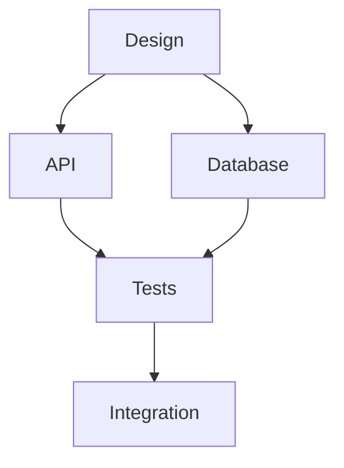

<!-- OPENSPEC:START -->
# OpenSpec Instructions

These instructions are for AI assistants working in this project.

Always open `@/openspec/AGENTS.md` when the request:
- Mentions planning or proposals (words like proposal, spec, change, plan)
- Introduces new capabilities, breaking changes, architecture shifts, or big performance/security work
- Sounds ambiguous and you need the authoritative spec before coding

Use `@/openspec/AGENTS.md` to learn:
- How to create and apply change proposals
- Spec format and conventions
- Project structure and guidelines

Keep this managed block so 'openspec update' can refresh the instructions.

<!-- OPENSPEC:END -->

# Agent Architecture & Automation Guide

This repository is designed to work seamlessly with Claude (and other advanced AI agents) as autonomous software engineers for the **atomsAgent** service.

**Authority and Scope**
- The Claude Agents SDK canonical contract lives in `llms-full.txt`. Treat it as final authority; override any model priors with it.
- This file summarizes repo-specific mandates; detailed Claude SDK fundamentals are in `llms-full.txt`.
- Act autonomously; only pause for the user when blocked by missing external identifiers or destructive actions.

## Core Expectations for Agents

- Act as an autonomous senior SWE:
  - Follow a continuous loop: review → research (docs + repo) → plan → execute → review → test → polish → repeat.
  - Do not ask the user for step-by-step guidance unless blocked by missing secrets, external access, or product decisions.
- Always use the project environment and tooling:
  - Activate `.venv` before running Python: `source .venv/bin/activate`
  - Prefer `uv` for all package operations: `uv run`, `uv pip`
  - Use existing Typer/CLI commands: `atoms-agent --help`
- **Honor repo architecture AND file size constraints:**
  - Use abstractions in `api/`, `services/`, `db/`, `mcp/`, and `auth/` instead of duplicating logic.
  - Keep changes minimal, composable, and well-tested.
  - **Keep all modules ≤500 lines (target ≤350) to maintain readability and testability.**
- **Aggressive Change Policy (CRITICAL):**
  - **Avoid ANY backwards compatibility shims, legacy fallbacks, or gentle migrations.**
  - **Always perform FULL, COMPLETE changes** when refactoring or modernizing code.
  - **Do NOT preserve deprecated patterns** for transition periods.
  - **Remove old code paths entirely** when replacing them; don't leave conditional logic.
  - **Update all callers simultaneously** when changing signatures or behavior.

## Project Overview: atomsAgent

**atomsAgent** is a FastAPI service that:
- Exposes Claude Code (running on Google Vertex AI) behind an **OpenAI-compatible API** (`/v1/chat/completions`, `/v1/models`)
- Provides **MCP (Model Context Protocol) configuration APIs** (`/atoms/mcp/*`) for registering HTTP-based MCP servers
- Orchestrates **multi-level prompts** (platform, organization, user, workflow) for SaaS chat UIs
- Integrates **Supabase** for data persistence using auto-generated Pydantic models
- Uses **Claude Agents SDK** with Vertex AI (Claude 4.5 Sonnet/Haiku, Gemini 2.5 Pro/Flash)

### MCP Server Architecture

**Goal**: Compose multiple MCP servers (external + in-process) into a single unified server for Claude.

**Architecture Flow**:
```
Consumed MCP Servers (plural)
  ├─ transport: {stdio, http, sse}
  └─ auth_type: {bearer, oauth, env, none}
         │
         ▼
FastMCP Proxy Layer
  ├─ Translates MCP protocol features
  ├─ Handles authentication (bearer/oauth/env/none)
  └─ Normalizes transport types (stdio → HTTP proxy)
         │
         ▼
FastMCP Proxied Servers
  └─ Unified interface (HTTP/SSE, resolved auth)
         │
         ▼
Composition Layer
  ├─ Handles live reload
  ├─ Manages atoms metadata (disabled, enabled, scopes)
  └─ Filters/enables servers based on context
         │
         ▼
Single Composed MCP Server
  └─ Loaded by Claude Agent SDK
```

**MCP Integration Details**:
- **Location**: `mcp/integration.py` - Server composition logic
- **Database Queries**: `mcp/database.py` - Fetches server configurations
- **OAuth Service**: `services/mcp_oauth/` - OAuth flow orchestration
- **Sandbox Tools**: `mcp/server/` - In-process FastMCP server with Vercel sandbox execution tools
- **Server Scopes**: System, Organization, User, Project

**Server Composition Flow**:
1. Start with default servers (if any)
2. Add system-scoped servers (platform-managed)
3. Add user-specific servers from `user_mcp_servers`
4. Add org-specific servers (org-scoped installations)
5. Add project-specific servers (project-scoped registry entries)
6. Resolve OAuth tokens for authenticated servers
7. Add in-process sandbox tools server (`atoms-sandbox-tools`)
8. Return configuration dict for Claude Agent SDK

**In-Process Sandbox Tools**:
- `execute_in_sandbox`: Execute code in Vercel Sandbox with Claude Agent SDK
- `get_execution_metrics`: Get execution performance metrics
- `get_execution_trace`: Get distributed tracing data for debugging
- `stream_sandbox_execution`: Stream execution results in real-time

**Authentication**:
- **Bearer Tokens**: Stored in `auth_config.bearerToken`
- **OAuth Tokens**: Fetched from `mcp_oauth_tokens` table
- **User Tokens**: AuthKit JWT for internal Atoms MCPs
- **API Keys**: Stored in `auth_config.apiKey`
- **Environment**: Environment variable-based auth

**Future: FastMCP Proxy Layer** (to be implemented):
- Proxy stdio servers through HTTP
- Normalize transport types
- Handle auth translation
- Provide unified interface

**Deployment**:
- **Local**: `python -m atomsAgent` or `uv run python app.py`
- **Production**: Vercel/serverless via FastAPI
- **Environment**: `.env` for auth secrets, model endpoints, database URLs

### Key Technologies
- **FastAPI**: Modern async Python web framework
- **Claude Agents SDK**: Anthropic's official SDK for Claude on Vertex AI
- **MCP**: Model Context Protocol (external servers only)
- **Supabase**: PostgreSQL backend with RLS
- **Vertex AI**: Google Cloud AI platform hosting Claude models
- **Typer + Rich**: CLI interface
- **Pydantic**: Type-safe configuration and data validation

## Repo-Specific Architecture Mandates

### Directory Structure
```
atomsAgent/
├── src/atomsAgent/
│   ├── api/              # FastAPI routes (OpenAI-compatible, MCP, files, health)
│   ├── auth/             # Authentication (WorkOS integration, JWT validation)
│   ├── cli/              # Typer CLI commands
│   ├── db/               # Supabase models and repositories
│   ├── mcp/              # MCP server composition and database queries
│   ├── services/         # Business logic (Claude client, prompts, MCP registry, etc.)
│   ├── settings/         # Configuration and secrets management
│   ├── schemas/          # Pydantic request/response models
│   └── main.py           # FastAPI app factory
├── config/               # YAML configuration files
│   ├── config.yml        # Non-sensitive settings
│   └── secrets.yml       # Sensitive credentials (gitignored)
├── tests/                # Pytest test suite
└── docs/                 # Documentation
```

### Core Components

#### 1. API Layer (`api/`)
- **OpenAI Routes** (`routes/openai.py`): `/v1/chat/completions`, `/v1/models`
  - OpenAI-compatible interface backed by Claude on Vertex AI
  - Streaming and non-streaming support
- **MCP Routes** (`routes/mcp.py`): `/atoms/mcp/*`
  - CRUD for MCP server configurations
  - Marketplace and installation management
  - OAuth DCR and bearer token auth flows
- **Files Routes** (`routes/files.py`): File upload/download
- **Health Routes**: `/health`, `/ready`

#### 2. Services Layer (`services/`)
- **`claude_client.py`**: Claude Agents SDK wrapper for Vertex AI
- **`prompts.py`**: Multi-level prompt orchestration (platform, org, user, workflow)
- **`mcp_registry.py`**: MCP server configuration management
- **`mcp_oauth/`**: OAuth 2.0 + PKCE flow for MCP servers
- **`vertex_models.py`**: Vertex AI model discovery and listing
- **`chat_history.py`**: Session and message persistence
- **`artifacts.py`**: Document and artifact management

#### 3. MCP Integration (`mcp/`)
- **`integration.py`**: MCP server composition
  - Composes external MCP servers based on user/org/project context
  - Handles OAuth token resolution
  - Includes in-process sandbox tools server
  - Returns server configurations for Claude Agent SDK
- **`database.py`**: Database queries for MCP server configurations
  - Fetches user/org/project/system-scoped servers
  - Converts database records to MCP config format
- **`server/`**: In-process FastMCP server with Vercel sandbox tools
  - `execute_in_sandbox`: Execute code in Vercel Sandbox
  - `get_execution_metrics`: Get execution performance metrics
  - `get_execution_trace`: Get distributed tracing data
  - `stream_sandbox_execution`: Stream execution results
- **Architecture**: Consumed MCP servers → FastMCP proxy → Composition → Single server for Claude

#### 4. Database Layer (`db/`)
- **`models.py`**: Auto-generated Pydantic models from Supabase schema
- **`repositories.py`**: Data access layer with RLS-aware queries
- **Supabase Integration**: Uses service role key for admin operations, user JWTs for RLS

#### 5. Configuration (`settings/`)
- **`config.py`**: Application settings (models, tools, permissions)
- **`secrets.py`**: Sensitive credentials (Vertex AI, Supabase, WorkOS)
- **YAML-based**: `config/config.yml` and `config/secrets.yml`

## Development Workflow

### ⚡ CRITICAL: Use `atoms-agent` CLI First

**ALWAYS prefer the `atoms-agent` CLI over direct Python/pytest commands.**

The `atoms-agent` CLI is the **official, production-grade interface** for all atomsAgent operations. Using it ensures:
- ✅ Consistent environment setup
- ✅ Proper configuration loading
- ✅ Standardized output formatting
- ✅ Integration with Factory hooks
- ✅ Better error handling and diagnostics

**Rule of Thumb**: If you're about to run `python -m ...` or `uv run pytest ...`, check if there's an `atoms-agent` command first.

### 1. Setup
```bash
# Install dependencies
uv pip install -e ".[dev]"

# Generate Supabase models (use CLI!)
atoms-agent supabase generate-models

# Run server (use CLI!)
atoms-agent server run --reload

# Alternative: Direct uvicorn (only if CLI unavailable)
uvicorn atomsAgent.main:app --reload
```

### 2. CLI Commands (PREFERRED)

**Testing** (ALWAYS use CLI):
```bash
# Run all tests
atoms-agent test

# Run with coverage
atoms-agent test --cov

# Run specific test file
atoms-agent test tests/unit/test_auth.py

# AVOID: uv run pytest (use CLI instead!)
```

**MCP Management**:
```bash
# List MCP configurations
atoms-agent mcp list --org <uuid>

# Create MCP server
atoms-agent mcp create --org <uuid> --name "My MCP" --url "https://..."

# Update MCP configuration
atoms-agent mcp update --id <uuid> --enabled false

# Delete MCP server
atoms-agent mcp delete --id <uuid>
```

**Vertex AI Operations**:
```bash
# List available models from Vertex AI
atoms-agent vertex models

# Generate Supabase models
atoms-agent supabase generate-models --schema db/schema.sql --output src/atomsAgent/db

# Show merged prompt stack
atoms-agent prompt show --org <uuid> --user <uuid>

# Run server via CLI
atoms-agent server run --host 0.0.0.0 --port 3284 --reload
```

### 3. Testing
```bash
# Run all tests
uv run pytest tests/

# Run with coverage
uv run pytest --cov=atomsAgent --cov-report=html tests/

# Run specific test file
uv run pytest tests/test_claude_client.py
```

## Agent Behaviors & Best Practices

### Autonomous SWE Loop (Mandatory)
All agents act as autonomous staff-level engineers. For every non-trivial task:
1. **Review**: Translate the request into clear, testable objectives using current repo state.
2. **Research**: Locate and read relevant code, tests, config files, and logs.
3. **Plan**: Produce a concise, impact-focused plan that respects existing patterns.
4. **Execute**: Implement end-to-end in small, coherent, reviewable changes.
5. **Review**: Check diffs for correctness, security, performance, consistency.
6. **Polish**: Remove duplication, tighten types, clarify flows.
7. **Test**: Run relevant tests (`uv run pytest`); fix all issues.
8. **Re-Review**: Confirm system state after fixes; ensure no regressions.
9. **Loop**: Iterate until complete or blocked by missing information.

Agents should only ask the user when requirements are ambiguous or depend on undiscoverable external decisions.

### Universal Guidelines
1. **Python Environment**: Always activate `.venv` before running Python
2. **Package Management**: Use `uv` for all package operations
3. **Type Safety**: Maintain strict typing with Pydantic and mypy
4. **Configuration**: Use YAML files in `config/`, never hardcode secrets
5. **Database Access**: Use Supabase client with proper RLS policies
6. **Error Handling**: Comprehensive error boundaries with structured logging
7. **Testing**: Write tests for all new features and bug fixes
8. **File Size**: Keep modules ≤500 lines (target ≤350)

### Code Organization Rules
1. **API Layer**: Only route handling, validation, and response formatting
2. **Service Layer**: Business logic, external API calls, orchestration
3. **Repository Layer**: Database queries and data access
4. **No Cross-Layer Bypass**: Always go through proper abstractions
5. **Stateless Design**: Pass context explicitly; avoid global state

### File Naming & Organization (CRITICAL - Prevent Duplication)

**Canonical Naming Rules:**
- **NO prefixes or suffixes that don't describe decomposition or valid variants**
- **ONE file per concern**; merge/consolidate when two files address the same concern
- **Descriptive names** that clearly indicate the file's single responsibility
- **Test files mirror production structure** with `test_` prefix only

**Valid Naming Patterns:**

✅ **GOOD - Clear decomposition by concern:**
```
# Different aspects of the same feature
services/auth/password.py          # Password hashing/validation
services/auth/session.py           # Session management
services/auth/token.py             # JWT token operations

# Test variants describing different scenarios
tests/auth/test_password_strong.py     # Strong password tests
tests/auth/test_password_weak.py       # Weak password tests
tests/auth/test_session_expiry.py      # Session expiration tests
```

✅ **GOOD - Variant describes a valid decomposition:**
```
# Different contexts for the same concern
models/user_public.py              # Public user model
models/user_internal.py            # Internal user model with secrets

# Different implementations of the same interface
storage/file_local.py              # Local filesystem storage
storage/file_s3.py                 # S3 storage
```

❌ **BAD - Meaningless prefixes/suffixes:**
```
# DON'T: Generic speed/quality suffixes
services/auth_fast.py              # Merge into auth.py
services/auth_slow.py              # Merge into auth.py
tests/test_auth.py                 # Vague
tests/test_auth_complete.py        # What's incomplete about the other?

# DON'T: Duplicate concerns
api/routes/user.py                 # These should be ONE file
api/routes/user_endpoints.py       # unless they handle different resources

# DON'T: Version suffixes without clear purpose
services/claude_client_v2.py       # Use git history; delete old version
services/claude_client_new.py      # Merge or delete old

# DON'T: Redundant naming
db/models/models.py                # Just db/models.py
api/routes/route_handlers.py       # Just api/routes/<resource>.py
```

**When to Split Files:**

Only split when you can clearly name DIFFERENT concerns:

✅ **Valid splits:**
- `auth/password.py` vs `auth/session.py` - Different auth concerns
- `claude/streaming.py` vs `claude/batch.py` - Different execution modes
- `test_auth_success.py` vs `test_auth_failure.py` - Different test scenarios

❌ **Invalid splits (MERGE THESE):**
- `user.py` vs `user_helper.py` - Both about users; merge
- `test_api.py` vs `test_api_2.py` - Arbitrary split; merge
- `service.py` vs `service_utils.py` - Utils belong in service.py
- `chat.py` vs `chat_v2.py` - Delete old version entirely

**File Organization Audit Checklist:**

Before creating ANY new file, ask:
1. ✅ Does a file for this concern already exist? → If yes, add to existing file
2. ✅ Can I name this file with a clear, single-purpose noun/verb? → If no, rethink
3. ✅ Does the name describe a decomposition (aspect/variant)? → If no, probably wrong
4. ✅ Will future developers understand this split? → If no, merge
5. ✅ Is the existing file >350 lines? → If no, add to it instead

**Consolidation Examples:**

When you find duplicate concerns, consolidate immediately:

```python
# BEFORE (BAD):
# api/routes/chat.py - 150 lines
# api/routes/chat_handlers.py - 100 lines
# Both handling chat endpoints

# AFTER (GOOD):
# api/routes/chat.py - 250 lines
# Single file, all chat routing

# BEFORE (BAD):
# tests/test_auth.py - basic auth tests
# tests/test_auth_complete.py - more auth tests
# tests/auth_tests.py - even more auth tests

# AFTER (GOOD):
# tests/auth/test_password.py - password-specific tests
# tests/auth/test_session.py - session-specific tests
# tests/auth/test_token.py - token-specific tests
# OR if small enough:
# tests/test_auth.py - all auth tests in one file
```

**Naming Convention Summary:**

| Type | Pattern | Example |
|------|---------|---------|
| Module | `<noun>.py` | `auth.py`, `database.py` |
| Submodule | `<feature>/<aspect>.py` | `auth/password.py` |
| Test | `test_<module>.py` | `test_auth.py` |
| Test variant | `test_<module>_<scenario>.py` | `test_auth_expired.py` |
| Implementation | `<interface>_<impl>.py` | `storage_s3.py` |

**Enforcement:**

When reviewing code:
1. Search for similar filenames: `rg -l "auth" --glob "*.py"`
2. Check if concerns overlap
3. Merge files that address the same concern
4. Delete old versions entirely (no `_old`, `_backup`, `_v1` suffixes)
5. Update all imports simultaneously

### Security & Auth
1. **Vertex AI Auth**: Use Google Cloud credentials for Vertex AI access
2. **Supabase Auth**: Service role key for admin, user JWTs for RLS
3. **WorkOS Integration**: OAuth/OIDC for user authentication
4. **MCP Auth**: Support both bearer tokens and OAuth DCR flows
5. **Secrets Management**: All secrets in `config/secrets.yml` (gitignored)

### Testing Strategy
1. **Unit Tests**: Test individual functions and classes
2. **Integration Tests**: Test API routes and service interactions
3. **Mock External Services**: Mock Vertex AI, Supabase, external MCP servers
4. **Async Tests**: Use `pytest-asyncio` for async code
5. **Coverage**: Aim for >80% coverage on critical paths

## Delegation & Coordination

### When to Delegate
- **Database Tasks**: Use specialized DB agents for schema design and migrations
- **Security Audits**: Delegate to security-focused agents for auth/RLS review
- **Testing Tasks**: Specialized testing agents can write comprehensive test suites
- **Documentation**: Technical writers can improve docs and API specs

### Work Breakdown (DAG/WBS)
1. Decompose complex tasks into small, verifiable units
2. Define clear dependencies between units
3. Run independent tasks in parallel when possible
4. Continuously integrate and validate results
5. Primary agent remains accountable for end-to-end outcome

## Emergency Procedures

### Service Issues
```bash
# Check service health
curl http://localhost:8000/health

# Check Vertex AI connectivity
atoms-agent vertex models

# Verify Supabase connection
# Check logs for database errors
```

### Configuration Issues
```bash
# Validate config files
atoms-agent config validate

# Regenerate Supabase models
atoms-agent supabase generate-models

# Check environment variables
env | grep ATOMS_
```

## Performance Metrics

### Key Indicators
- **API Response Time**: <500ms for non-streaming requests
- **Claude Latency**: <2s for first token in streaming
- **Database Query Time**: <100ms for simple queries
- **Test Execution**: <30s for full test suite
- **Code Coverage**: >80% for critical paths

### Optimization Targets
- Use async/await for all I/O operations
- Cache Vertex AI model listings
- Optimize Supabase queries with proper indexes
- Stream responses for long-running operations
- Use connection pooling for database access

## Documentation Management (CRITICAL - Prevent MD Creep)

**Problem**: Agents constantly generate markdown files scattered throughout the codebase, causing documentation sprawl and maintenance burden.

**Solution**: Structured session-based documentation in `docs/` with consolidation and cleanup requirements.

### Documentation Structure

```
docs/
├── sessions/                    # Session-specific work
│   ├── 2025-11-13-feature-x/   # Date-based session folder
│   │   ├── DAG.md              # Dependency graph / WBS
│   │   ├── SPEC.md             # Full specification with ARUs
│   │   ├── RESEARCH.md         # Research findings
│   │   ├── IMPL_STRATEGY.md   # Implementation approach
│   │   ├── ISSUES.md           # Known issues and fixes
│   │   └── STATE.md            # Current state and progress
│   └── 2025-11-14-bugfix-y/
│       └── ...
├── architecture/                # Permanent architecture docs
├── api/                         # API documentation
└── guides/                      # How-to guides
```

### Rules for Documentation

#### 1. **Session Folder Creation** (MANDATORY)

When starting ANY non-trivial work:

```bash
# Create session folder with date and brief description
mkdir -p docs/sessions/$(date +%Y-%m-%d)-<brief-description>
cd docs/sessions/$(date +%Y-%m-%d)-<brief-description>

# Create core documents
touch DAG.md          # Work breakdown and dependencies
touch SPEC.md         # Full specification with ARUs
touch STATE.md        # Current progress tracking
```

#### 2. **Required Session Documents**

Every session folder MUST contain:

**DAG.md** - Work Breakdown Structure
```markdown
# Work Breakdown: [Feature/Bug Name]

## Dependency Graph


## Task Breakdown
- [ ] Design phase (blocks: API, Database)
- [ ] API implementation (depends: Design)
- [ ] Database schema (depends: Design)
- [ ] Test suite (depends: API, Database)
- [ ] Integration (depends: Tests)
```

**SPEC.md** - Full Specification
```markdown
# Specification: [Feature/Bug Name]

## Acceptance Requirements (ARUs)
- [ ] ARU-1: API returns valid JSON for all requests
- [ ] ARU-2: Database enforces RLS policies
- [ ] ARU-3: All endpoints have >80% test coverage

## Functional Requirements
...

## Non-Functional Requirements
...

## API Contract
...

## Database Schema
...
```

**STATE.md** - Progress Tracking
```markdown
# State: [Feature/Bug Name]

Last Updated: 2025-11-13 14:30

## Current Status
- Phase: Implementation
- Progress: 60%
- Blockers: None

## Completed
- [x] Database schema designed
- [x] API routes defined
- [x] Core service logic implemented

## In Progress
- [ ] Test suite (60% complete)
- [ ] Integration tests

## Next Steps
1. Complete test suite
2. Run full integration tests
3. Update documentation
```

#### 3. **Optional Session Documents**

Add as needed:

- **RESEARCH.md** - Research findings, alternatives considered, decisions made
- **IMPL_STRATEGY.md** - Implementation approach, design patterns, technical decisions
- **ISSUES.md** - Known issues, workarounds, fixes applied
- **MEETING_NOTES.md** - Discussion points, decisions, action items

#### 4. **Update, Don't Duplicate**

**ALWAYS update existing session documents**. Never create:
- `SPEC_v2.md`, `SPEC_final.md`, `SPEC_updated.md`
- `notes.md`, `more_notes.md`, `additional_notes.md`
- `TODO.md`, `TODO_new.md`, `TASKS.md`

Instead:
- Update `SPEC.md` with version history section
- Append to existing documents with timestamps
- Use git history for versioning

#### 5. **Markdown Creep Prevention**

**Before creating ANY .md file, check:**

1. ✅ **Is this session-specific?** → Put in `docs/sessions/<date-description>/`
2. ✅ **Is this permanent documentation?** → Put in `docs/architecture/` or `docs/api/`
3. ✅ **Does a document for this already exist?** → Update existing, don't create new
4. ✅ **Is this temporary?** → Use comments in code or PR description instead

**Forbidden locations for new markdown:**
- ❌ Root directory (except README.md, CHANGELOG.md)
- ❌ `src/` directory
- ❌ `tests/` directory
- ❌ Random subdirectories

#### 6. **Consolidation Process**

When you find markdown creep:

```bash
# 1. Find all markdown files outside docs/
find . -name "*.md" -not -path "./docs/*" -not -path "./node_modules/*" -not -name "README.md"

# 2. Review each file
# - Is it session-specific? → Move to docs/sessions/
# - Is it permanent? → Move to docs/architecture/ or docs/api/
# - Is it redundant? → Merge into existing doc and delete
# - Is it outdated? → Delete

# 3. Move session docs to proper location
mv notes.md docs/sessions/2025-11-13-feature-x/RESEARCH.md

# 4. Consolidate duplicates
cat SPEC_v2.md >> docs/sessions/2025-11-13-feature-x/SPEC.md
rm SPEC_v2.md

# 5. Delete if unnecessary
rm temp_notes.md scratch.md brainstorm.md

# 6. Update references
rg "notes\.md" -l | xargs sed -i '' 's|notes.md|docs/sessions/2025-11-13-feature-x/RESEARCH.md|g'
```

#### 7. **Document Lifecycle**

**During Work:**
- Create session folder
- Maintain STATE.md with current progress
- Update SPEC.md as requirements evolve
- Add findings to RESEARCH.md
- Track issues in ISSUES.md

**After Completion:**
- Final update to STATE.md (mark complete)
- Archive or delete temporary notes
- Extract permanent insights to architecture docs
- Clean up any markdown creep

**Long-Term:**
- Archive old session folders (move to `docs/archive/`)
- Keep only relevant permanent documentation
- Consolidate similar sessions if patterns emerge

#### 8. **Examples**

**✅ GOOD Structure:**
```
docs/
├── sessions/
│   └── 2025-11-13-claude-streaming/
│       ├── DAG.md              # Work breakdown
│       ├── SPEC.md             # Full spec with ARUs
│       ├── STATE.md            # Progress tracking
│       ├── RESEARCH.md         # SSE vs WebSocket research
│       ├── IMPL_STRATEGY.md   # Chosen approach
│       └── ISSUES.md           # Buffering issues + fixes
└── architecture/
    └── streaming.md            # Permanent streaming patterns
```

**❌ BAD Structure:**
```
.
├── notes.md                    # Root clutter
├── SPEC.md                     # Vague location
├── spec_v2.md                  # Duplication
├── TODO.md                     # Should be in session
├── streaming_notes.md          # Should be in session
└── src/
    └── api/
        └── NOTES.md            # Wrong location
```

#### 9. **Session Naming Convention**

Format: `YYYY-MM-DD-brief-description`

Examples:
- `2025-11-13-claude-streaming-implementation`
- `2025-11-14-fix-auth-token-expiry`
- `2025-11-15-optimize-db-queries`
- `2025-11-16-add-mcp-tool-workflow`

#### 10. **Enforcement Checklist**

Before committing:

```bash
# Check for markdown creep
find . -name "*.md" -not -path "./docs/*" -not -path "./node_modules/*" \
  -not -name "README.md" -not -name "CHANGELOG.md" -not -name "LICENSE.md"

# Should return empty or only allowed files

# Check for duplicate specs/notes
find docs/ -name "*_v[0-9]*.md" -o -name "*_new.md" -o -name "*_old.md"

# Should return empty

# Verify session structure
ls docs/sessions/$(date +%Y-%m-%d)-*/

# Should show DAG.md, SPEC.md, STATE.md at minimum
```

### Quick Reference Commands

```bash
# Start new session
SESSION="docs/sessions/$(date +%Y-%m-%d)-$(read -p 'Brief description: ' desc; echo $desc | tr ' ' '-')"
mkdir -p "$SESSION"
touch "$SESSION"/{DAG,SPEC,STATE,RESEARCH,IMPL_STRATEGY,ISSUES}.md

# Update session state
echo "## Update $(date '+%Y-%m-%d %H:%M')" >> "$SESSION/STATE.md"
echo "- Progress: ..." >> "$SESSION/STATE.md"

# Find and clean markdown creep
find . -name "*.md" -not -path "./docs/*" -not -path "./node_modules/*" \
  -not -name "README.md" -not -name "CHANGELOG.md" -exec echo "Review: {}" \;

# Archive old sessions
mv docs/sessions/2025-10-* docs/archive/
```

## OpenSpec Spec-Driven Development (MANDATORY)

**OpenSpec is installed and MUST be used for all development work.**

### Why OpenSpec is Required

1. **Eliminates Ambiguity**: Machine-readable specs define exactly what to build
2. **Enables Autonomy**: Agents work from specs to completion without human intervention
3. **Enforces Completeness**: Full specifications prevent MVP/incomplete implementations
4. **Tracks Evolution**: Delta-based changes create audit trail of all decisions

### OpenSpec Structure

```
atomsAgent/
├── openspec/
│   ├── specs/                    # Current system truth (living documentation)
│   │   ├── api/
│   │   │   ├── openai.md        # OpenAI-compatible API spec
│   │   │   └── mcp.md           # MCP endpoints spec
│   │   ├── services/
│   │   │   ├── claude.md        # Claude client spec
│   │   │   ├── prompts.md       # Prompt orchestration spec
│   │   │   └── mcp-registry.md  # MCP registry spec
│   │   ├── database/
│   │   │   └── supabase.md      # Database schema spec
│   │   └── auth/
│   │       └── workos.md        # WorkOS auth spec
│   ├── changes/                  # Active development changes
│   │   └── add-feature-x/
│   │       ├── proposal.md      # Why and what (business case)
│   │       ├── tasks.md         # Complete implementation checklist
│   │       ├── design.md        # Technical decisions and approach
│   │       └── specs/           # Spec deltas (ADDED/MODIFIED/REMOVED)
│   │           └── services/
│   │               └── claude.md
│   └── archive/                  # Completed changes (historical record)
└── docs/sessions/               # Session documentation (separate concern)
    └── 2025-11-13-feature-x/
        ├── DAG.md               # Work breakdown
        ├── SPEC.md              # Links to openspec/changes/
        ├── STATE.md             # Progress tracking
        └── RESEARCH.md          # Research findings
```

### Integration: OpenSpec + Session Docs

**Two complementary systems:**

| OpenSpec (`openspec/`) | Session Docs (`docs/sessions/`) |
|------------------------|----------------------------------|
| Machine-readable | Human-readable |
| What to build (requirements, scenarios) | Why and how (research, strategy) |
| AI agents primary source | Team collaboration and knowledge |
| Structured, formal | Flexible, narrative |

**Workflow:**
1. Create OpenSpec change: `openspec/changes/feature-x/`
2. Create session folder: `docs/sessions/2025-11-13-feature-x/`
3. Link in SPEC.md: "Detailed requirements: see `openspec/changes/feature-x/specs/`"
4. Maintain both throughout development
5. Archive OpenSpec change when complete
6. Keep session docs for historical reference

### Mandatory OpenSpec Workflow

#### Step 1: Research (Comprehensive, No Shortcuts)

**Before creating any OpenSpec proposal, agents MUST:**

```bash
# 1. Search codebase exhaustively
rg "<feature-keywords>" --type py
rg -l "<related-functionality>" src/

# 2. Research web (REQUIRED for external APIs, standards, best practices)
# Search: "<technology> best practices"
# Search: "<API-name> Python implementation examples"
# Search: "<standard> specification"
# Search: "<problem> common pitfalls"

# 3. Read existing specs
cat openspec/specs/<related-area>/*.md

# 4. Check for related changes
openspec list
openspec show <related-change>
```

**Research must be documented:**
- `docs/sessions/<date-desc>/RESEARCH.md` - Research findings, alternatives, decisions
- Reference from OpenSpec proposal.md

#### Step 2: Create Complete Proposal (No Human Approval Needed)

```bash
# Agent creates proposal autonomously
# This happens automatically - no manual command needed
# Agent writes to: openspec/changes/<feature-name>/

# Proposal must include:
# - Business justification
# - Complete requirements with ALL scenarios
# - Technical approach
# - Full task breakdown
# - Performance targets
# - Testing strategy
```

**Example: Complete Requirement (NOT MVP)**

```markdown
# openspec/changes/add-streaming/specs/services/claude.md

## ADDED Requirements

### Requirement: Real-Time Response Streaming
The system SHALL provide real-time streaming of Claude responses via Server-Sent Events (SSE) with complete error handling, performance monitoring, and OpenAI-compatible formatting.

#### Scenario: Initiate streaming on valid request
- GIVEN a chat completion request with `"stream": true`
- WHEN the request is valid and authenticated
- THEN the system SHALL respond with HTTP 200
- AND SHALL set Content-Type to text/event-stream
- AND SHALL begin streaming within 2 seconds
- AND SHALL send initial metadata event

#### Scenario: Stream tokens incrementally as generated
- GIVEN an active streaming response
- WHEN Claude generates tokens
- THEN the system SHALL send each token chunk within 100ms
- AND SHALL maintain OpenAI-compatible event format
- AND SHALL include token metadata (id, model, created)

#### Scenario: Handle client disconnection gracefully
- GIVEN an active stream
- WHEN the client disconnects mid-stream
- THEN the system SHALL detect disconnection within 1 second
- AND SHALL cancel Claude generation immediately
- AND SHALL clean up all resources (memory, connections)
- AND SHALL log disconnection with metadata

#### Scenario: Complete stream with proper finalization
- GIVEN a streaming response in progress
- WHEN Claude completes generation
- THEN the system SHALL send final event with finish_reason
- AND SHALL send [DONE] marker per OpenAI spec
- AND SHALL close connection cleanly
- AND SHALL log complete metrics (tokens, latency, errors)

#### Scenario: Handle errors during streaming
- GIVEN a streaming response
- WHEN an error occurs (network, API timeout, rate limit)
- THEN the system SHALL send error event with details
- AND SHALL close stream gracefully
- AND SHALL return system to ready state
- AND SHALL log error with full context for debugging
- AND SHALL not leave orphaned resources

#### Scenario: Track token usage accurately
- GIVEN a completed streaming response
- WHEN calculating usage statistics
- THEN the system SHALL count all streamed tokens
- AND SHALL match non-streaming token counts (±1%)
- AND SHALL include prompt and completion tokens separately
- AND SHALL store usage in database for billing/analytics
```

**Example: Complete Task Breakdown (NOT High-Level)**

```markdown
# openspec/changes/add-streaming/tasks.md

## 1. API Layer Implementation
- [ ] 1.1 Extend ChatCompletionRequest schema
  - Add streaming: bool field (default false)
  - Add stream_options: dict field (optional)
  - Validate streaming parameter type
  - Add validation for incompatible parameters
- [ ] 1.2 Create streaming response handler
  - Implement /v1/chat/completions with streaming support
  - Set proper SSE headers (Content-Type, Cache-Control, Connection: keep-alive)
  - Create async generator for event stream
  - Add client disconnection detection
- [ ] 1.3 Implement OpenAI-compatible SSE formatting
  - Format events: "data: {json}\n\n"
  - Escape special characters in JSON
  - Add [DONE] marker as final event
  - Include all required fields (id, object, created, model, choices)
- [ ] 1.4 Add comprehensive error handling
  - Detect and handle client disconnects
  - Handle mid-stream exceptions
  - Send error events in SSE format
  - Ensure cleanup on all error paths

## 2. Service Layer Implementation
- [ ] 2.1 Extend ClaudeClient with streaming
  - Add stream_chat_completion() async method
  - Accept same parameters as non-streaming variant
  - Return AsyncGenerator[dict, None]
  - Maintain full type safety
- [ ] 2.2 Implement Claude SDK streaming integration
  - Use claude.messages.stream() API
  - Handle message_start events
  - Handle content_block_delta events  
  - Handle message_stop events
  - Handle error events
- [ ] 2.3 Add stream management
  - Implement immediate streaming (no buffering)
  - Add timeout detection (30s idle timeout)
  - Implement backpressure handling
  - Track stream state for cleanup
- [ ] 2.4 Implement token tracking
  - Count tokens in real-time during stream
  - Track prompt tokens separately
  - Track completion tokens separately
  - Validate against Claude's reported usage

## 3. Testing (100% Coverage Required)
- [ ] 3.1 Unit tests for SSE formatting (12 tests)
  - Test event structure
  - Test JSON escaping
  - Test [DONE] marker
  - Test metadata fields
  - Test error event format
- [ ] 3.2 Unit tests for streaming logic (15 tests)
  - Test token extraction
  - Test event ordering
  - Test state management
  - Test timeout detection
  - Test cleanup logic
- [ ] 3.3 Integration tests (10 tests)
  - Test end-to-end streaming
  - Test with various prompt types
  - Test concurrent streams
  - Test stream cancellation
  - Test resource cleanup
- [ ] 3.4 Error scenario tests (10 tests)
  - Test client disconnect
  - Test Claude API errors
  - Test timeout scenarios
  - Test rate limit handling
  - Test network errors
- [ ] 3.5 Performance tests (5 tests)
  - Measure first token latency (<2s required)
  - Measure token delivery rate (>10 tokens/sec)
  - Measure memory usage (must not leak)
  - Measure cleanup time (<100ms)
  - Load test (10 concurrent streams)

## 4. Documentation
- [ ] 4.1 API documentation
  - Document streaming parameter
  - Add SSE format examples
  - Document error responses
  - Add usage examples
- [ ] 4.2 Inline code documentation
  - Add docstrings to all streaming methods
  - Document performance characteristics
  - Add examples in docstrings
  - Document error scenarios
```

#### Step 3: Implement Fully and Aggressively (No MVP)

**Agents MUST implement EVERY task before archiving:**

```bash
# Agent works through tasks autonomously
# No command needed - agent reads from:
# openspec/changes/<feature>/tasks.md

# Agent must:
# 1. Complete EVERY task (no skipping)
# 2. Write COMPLETE tests (all scenarios)
# 3. Handle ALL error cases (from spec scenarios)
# 4. Optimize for production (no TODOs)
# 5. Document inline (docstrings for all public APIs)
```

**Forbidden shortcuts:**
- ❌ "Implement basic version, optimize later"
- ❌ "Skip error handling for MVP"
- ❌ "Add TODO for edge cases"
- ❌ "Write tests after merging"
- ❌ "Leave optimization for follow-up"

**Required completeness:**
- ✅ All scenarios from spec implemented
- ✅ All error paths tested
- ✅ Production-grade error handling
- ✅ Performance optimized to targets
- ✅ Complete inline documentation

#### Step 4: Validate Autonomously (No Human Check)

```bash
# Agent validates before archiving:

# 1. Check all tasks complete
grep -c "\[ \]" openspec/changes/<feature>/tasks.md
# Must be 0

# 2. Run all tests
uv run pytest tests/ --cov=atomsAgent
# Must pass 100%, coverage >80%

# 3. Verify all scenarios
# Check each scenario in spec has corresponding test

# 4. Performance check
# Verify performance targets from spec are met

# 5. Type check
uv run mypy src/atomsAgent
# Must pass with no errors
```

#### Step 5: Archive and Update Specs

```bash
# Agent runs automatically when validation passes:
openspec archive <feature-name> --yes

# This:
# 1. Moves openspec/changes/<feature>/ to openspec/archive/
# 2. Merges spec deltas into openspec/specs/
# 3. Updates system documentation
# 4. Marks work complete
```

### Forward-Only Development (MANDATORY)

**NEVER use git revert, reset, or delete-and-rewrite. ALWAYS fix forward.**

#### Rule 1: No Git Reversions

❌ **FORBIDDEN:**
```bash
git revert abc123
git reset --hard HEAD~5
git checkout old-implementation
```

✅ **REQUIRED:**
```bash
# Create fix-forward change
# openspec/changes/fix-<issue>/proposal.md explains problem
# Implement fix in new change
# Archive when complete
```

#### Rule 2: No Delete-and-Rewrite

❌ **FORBIDDEN:**
```bash
rm src/services/claude_client.py
# Write new version from scratch
```

✅ **REQUIRED:**
```bash
# Create refactor change
# openspec/changes/refactor-claude-client/specs/services/claude.md:
## MODIFIED Requirements
### Requirement: Claude Client Interface
PREVIOUS: Synchronous interface with blocking calls
UPDATED: Fully async interface with concurrent request support

Reason: Performance optimization - blocking calls caused request queuing
```

#### Rule 3: Use Spec Deltas for Changes

**Every behavior change requires spec delta:**

```markdown
# openspec/changes/optimize-streaming/specs/services/claude.md

## MODIFIED Requirements

### Requirement: Real-Time Response Streaming

PREVIOUS in Scenario "Stream tokens incrementally":
- THEN the system SHALL send each token chunk within 100ms

UPDATED:
- THEN the system SHALL buffer tokens for up to 50ms to reduce SSE overhead
- AND SHALL send batches of up to 5 tokens per event
- AND SHALL never delay more than 50ms between events

Reason for change: Production metrics showed excessive SSE events (200+/response) causing client-side processing bottlenecks. Batching reduces events by 80% while maintaining sub-50ms perceived latency.

Performance impact:
- Before: 200 SSE events/response, 15ms client processing overhead
- After: 40 SSE events/response, 3ms client processing overhead
- User-perceived latency: Unchanged (<50ms per token batch)
```

#### Rule 4: Fix Bugs Forward

**Bug found after archiving:**

```markdown
# openspec/changes/fix-streaming-memory-leak/proposal.md

## Problem Identified
The add-claude-streaming change (archived 2025-11-13) introduced memory leak when streams interrupted.

## Root Cause
Stream interruption handler doesn't release Claude SDK resources or clear token buffers.

## Solution Approach
Add explicit cleanup in interruption handler with verification tests.

# openspec/changes/fix-streaming-memory-leak/specs/services/claude.md

## MODIFIED Requirements

### Requirement: Handle client disconnection gracefully

ADDED to existing scenario:
- AND SHALL release all Claude SDK client resources
- AND SHALL clear token buffers from memory (verify < 1MB residual)
- AND SHALL verify cleanup in automated tests
- AND SHALL log cleanup completion with resource metrics

# openspec/changes/fix-streaming-memory-leak/tasks.md

## 1. Fix Memory Leak
- [ ] 1.1 Add explicit resource cleanup
  - Release Claude SDK client connection
  - Clear token buffer arrays
  - Null out references to enable GC
- [ ] 1.2 Add cleanup verification
  - Track memory before/after cleanup
  - Verify <1MB residual after cleanup
  - Add assertions in tests

## 2. Testing
- [ ] 2.1 Memory leak test
  - Run 100 interrupted streams
  - Measure memory growth
  - Verify <100MB total growth (1MB per stream)
- [ ] 2.2 Resource cleanup test
  - Mock Claude SDK client
  - Verify disconnect() called
  - Verify buffer cleared
```

### OpenSpec Commands Quick Reference

```bash
# List active changes
openspec list

# View change details
openspec show <change-name>

# Validate change structure
openspec validate <change-name>

# Archive completed change (agent runs automatically)
openspec archive <change-name> --yes

# Interactive dashboard
openspec view
```

### Autonomous Operation Principles

1. **No Human Approval Required**
   - Agents create proposals autonomously after research
   - Agents implement without waiting for approval
   - Agents validate and archive automatically

2. **Research First, Ask Never**
   - Exhaustive codebase search before any work
   - Comprehensive web research for best practices
   - Read all related specs and changes
   - Document findings, never ask for information

3. **Complete Specifications Only**
   - All scenarios defined upfront
   - All error cases specified
   - Performance targets explicit
   - Testing strategy complete

4. **Aggressive Implementation**
   - No MVP mindset
   - No incremental compromises
   - No "good enough"
   - Production-grade from start

5. **Forward-Only Progress**
   - Never revert
   - Never delete and rewrite
   - Fix bugs with new changes
   - Track all evolution via deltas

This documentation serves as the primary reference for all AI agents working on the atomsAgent service.

## Future Enhancements

- Add Workflow builder + agent "playbooks" for repeatable sequences.
- Add multi-agent collaboration (planner/critic/executor) gated by org settings.
- Integrate voice input/output for natural interaction.
