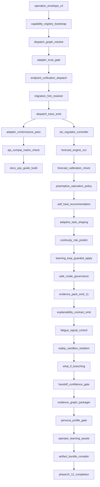

# Thegent DAG Extension — Phases 10 to 12

**Status:** Draft  
**Date:** 2026-02-15  
**Purpose:** Extend DAG and control graph for interface convergence, adaptive resilience, and enterprise hardening.

## 1) Node set and flow

## 2) Gates

- `G10` after `N10010`: must pass dispatch determinism and migration fallback behavior.
- `G11` after `N11010`: must pass forecast calibration and safe-control rollback policy.
- `G12` after `N12010`: must pass replay safety, explainability, and export integrity checks.

## 3) Failure and recovery paths

- From `N10003` if dispatch mismatch:
  - `N10003-R1` (dispatch_conflict) → `N10003-R1A` (log dispatch_reason) → `N10003-R1B` (owner_review) → `N10003-R1C` (fallback_to_stable_registry)  

- From `N11001` if control instability detected:
  - `N11001-R2` (oscillation_detected) → `N11001-R2A` (pause_auto_adjust) → `N11001-R2B` (notify_ops) → `N11001-R2C` (manual_policy_override)

- From `N12003` if replay mutation attempt is detected:
  - `N12003-R3` (mutation_attempt) → `N12003-R3A` (force_read_only) → `N12003-R3B` (requires_execute_approval) → `N12003-R3C` (incident_log)

## 4) Node contracts

| Node | Inputs | Outputs | Validation intent |
|---|---|---|---|
| N10001 | invocation, policy_context, actor | normalized envelope | Schema v2 compliance |
| N10002 | registry config | capability map | Version + trust + latency metadata |
| N10003 | envelope + policy | dispatch target + decision path | deterministic mapping |
| N10004 | adapter metadata | trust decision | deny by default rule application |
| N10005 | dispatch target | operation route | parity across interfaces |
| N10007 | dispatch metadata | trace event | immutable audit reference |
| N11001 | telemetry + gates | adjustment proposal | bounded control change |
| N11002 | graph + dependency + history | forecast bands | bounded uncertainty ranges |
| N11003 | forecast bands + history | calibrated parameters | quality threshold enforcement |
| N11006 | workload + continuity score | split/join plan | non-harmful task re-shape |
| N12001 | run/decision state | explanation bundle | stable schema IDs |
| N12003 | event stream + run state | isolated replay result | no mutation in replay mode |
| N12006 | events + evidence IDs | evidence graph + manifest | complete edge links |
| N12009 | artifacts + signatures | export bundle | reproducible release pack |

## 5) Execution policy

1. Phase 10 nodes must complete before Phase 11 control nodes mutate runtime behavior.
2. `G10` hard gates enable any control change path in Phase 11.
3. `N12003` (replay sandbox isolation) is mandatory for all what-if simulation nodes.
4. `G11` must confirm no control oscillation before entering `N12001`.
5. `G12` requires signed evidence graph and deterministic artifact output.

---
## See also

- [WORK_STREAM.md](../reference/WORK_STREAM.md) — canonical backlog
- [00-MASTER-INDEX.md](../plans/00-MASTER-INDEX.md) — plan index

