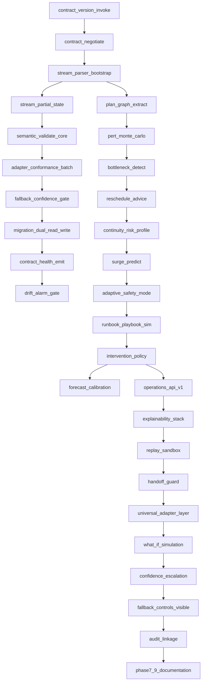
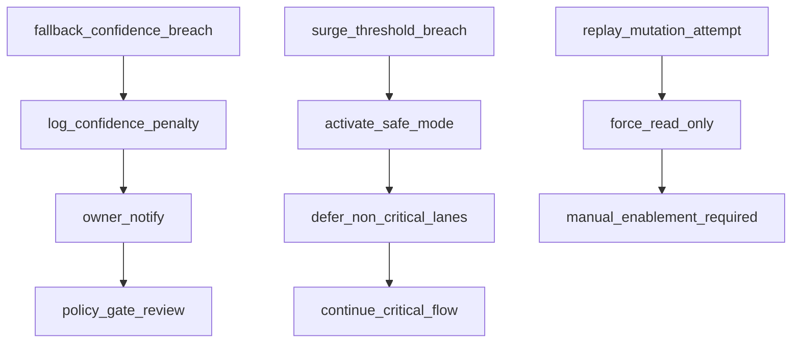

# thegent DAG Extension — Phases 7, 8, 9

**Status:** Draft  
**Date:** 2026-02-15  
**Purpose:** Add explicit execution nodes for contract convergence, predictive reliability, and operation productization.

## 1) Added node set

## 2) Gate nodes

- `G7` after `N7010`: block critical-lane release on unresolved drift.
- `G8` after `N8010`: block go-live if forecast quality below target.
- `G9` after `N9010`: block rollout if replay can mutate state or evidence links are missing.

## 3) Recovery and escalation nodes

- From `N7007` any fallback confidence breach routes to `N-R1`.
- From `N8006` if surge exceeds threshold routes to `N-R2`.
- From `N9003` if replay mode enters execution context routes to `N-R3`.

## 4) Data contracts per node

| Node | Inputs | Outputs | Schema intent |
|---|---|---|---|
| N7001 | session context | version list | `contract_support_list` |
| N7003 | stream chunks | parser state | `stream_parser_state` |
| N7004 | parser state | commit events | `partial_state_checkpoint` |
| N7005 | normalized payload | validation result | `validator_report` |
| N7008 | migration window config | cutover metrics | `migration_rollout_report` |
| N8002 | critical path + perturbations | duration bands | `risk_distribution` |
| N8004 | risk bands + workload | recommended edits | `reschedule_advice` |
| N8007 | surge score | safe-mode decision | `safety_mode_decision` |
| N9001 | operation request | op result | `operation_envelope` |
| N9006 | replay request | timeline + diff | `replay_plan` |

## 5) Execution policy

1. Any node in Phase 7 must complete before dependent Phase 8 nodes execute.
2. `G7` and `G8` are hard gates; if failed, only stabilization nodes continue.
3. `N9001` requires both contract negotiation and parser health checks as preconditions.
4. `G9` must record explicit owner signoff for replay safety and explainability.

---
## See also

- [WORK_STREAM.md](../reference/WORK_STREAM.md) — canonical backlog
- [00-MASTER-INDEX.md](../plans/00-MASTER-INDEX.md) — plan index

