# Thegent Orchestration Optimization & Expansion PRD (Living Document)

**Status:** Draft (incremental)
**Owner:** Thegent team
**Last updated:** 2026-02-14
**Scope:** `thegent` codebase optimization and orchestration hardening

## 0) Working Notes

- This document is intended to be appended over time as prompts continue.
- Baseline references are pulled from:
  - `task2`: model fallback, rate limiting, DAG planner, batch executor, agent delegator patterns
  - `zen-mcp-server`: strategy routing and event orchestration concepts
  - `crun`: orchestration status callbacks, policy checks, workspace/task mapping
  - existing `thegent` CLI/session runtime

## 1) Executive Summary

`thegent` currently has strong CLI and session primitives but lacks a production-grade orchestrator stack for:

- dependency-aware DAG execution
- adaptive delegation with fallback
- resilient retries and recovery
- auditable state and policy governance
- consistent, observable run control

This PRD defines a phased roadmap to evolve `thegent` into an orchestration-first platform while keeping existing CLI behavior compatible.

## 2) Problem Statement

Teams using `thegent` at scale face:

- brittle multi-task workflows when one agent/model fails transiently
- weak recovery when orchestration crashes or partial failures occur
- limited visibility into why tasks are blocked, retried, or failed
- manual workarounds for prioritization, quotas, or policy control

## 3) Objectives

- Reliability: robust completion guarantees with bounded retries and checkpointed state
- Throughput: dependency-aware scheduling and bounded concurrency
- Cost efficiency: policy-driven routing, fallback minimization, retry control
- Governance: clear rules for allowed operations and auditable failure handling
- Operator UX: direct introspection of wave progress, blockers, and retry actions
- Compatibility: no breaking behavior for existing CLI commands

## 4) User Stories

1. Operator: can run large dependency graphs and intervene with pause/cancel/retry.
2. Developer: can split work across models and trust fallback behavior under transient failures.
3. Reviewer: gets deterministic state transitions and logs for every run.
4. SRE/FinOps: can enforce cost, concurrency, and budget controls.
5. Security owner: can enforce allow/deny policies and redaction guarantees.

## 5) Design Principles

- Keep execution idempotent by design.
- Keep failures explicit using typed state transitions.
- Prefer policy over hard-coded behavior.
- Fail with context, not with silence.
- Preserve default behavior and allow phased rollout with feature flags.

## 6) Proposed Architecture

### 6.1 Planes

- **Control plane**
  - unifies `run`, `bg`, `dag`, `status`, `logs`, `wait`, `stop` around one request envelope.

- **Planner plane**
  - DAG parser/normalizer/validator
  - cycle detection and orphan/dependency checks
  - wave generation and critical path estimation

- **Scheduler plane**
  - dependency-aware queue
  - worker and agent pool caps
- **Delegation plane**
  - model/agent selection policy
  - fallback chains + alias resolution
- **Execution plane**
  - adapter around existing runner invocation
  - streaming output capture and cancellation propagation
- **Resilience plane**
  - bounded retries
  - poison-pill isolation and dead-letter path
- **State plane**
  - durable orchestration state store
  - event journal + snapshotting
- **Observability plane**
  - structured events, status summaries, timeline/ETA
- **Governance plane**
  - policy enforcement, redaction, allow/deny checks

### 6.2 Core Domain Entities

- `Run`: full orchestration lifecycle
- `Task`: dependency node in workflow graph
- `Attempt`: a single execution try against one task
- `Event`: immutable state transition and diagnostics record
- `Policy`: budget, priority, and authorization constraints
- `Artifact`: outputs, logs, and structured result payload per attempt

### 6.3 State Machines

- Run states: `created -> planned -> queued -> running -> (pausing|suspending) -> (completed|failed|cancelled)`
- Task states: `pending -> scheduled -> in_progress -> (retry_wait|blocked|succeeded|failed|cancelled)`
- Attempt states: `created -> dispatched -> running -> (transient_fail|permanent_fail|timed_out|succeeded)`

## 7) Breadth of Work (Capability Domains)

### 7.1 Reliability and recovery

- dependency ordering enforcement
- deterministic resume from durable checkpoint
- idempotent task dispatch keys
- retry class mapping by error taxonomy

### 7.2 Throughput and scheduling

- wave/topology execution
- priority and aging fairness
- pool caps per agent/model
- deadline-aware scheduling

### 7.3 Delegation and fallback

- configurable fallback matrix by task class
- adaptive cool-off on transient quota errors
- droid-aware execution path in routing
- selective escalation from cheap model to stronger model

### 7.4 Governance and safety

- schema and policy pre-dispatch gates
- command/tool allowlist
- secret redaction and output sanitization
- policy violation becomes first-class terminal reason

### 7.5 Observability and UX

- enhanced `status` with blocker explanations and wave progress
- `logs` keyed by run/task/attempt with correlation IDs
- metrics:
  - queue depth
  - wait ratio
  - retry/fallback ratio
  - completion success and failure reasons

## 8) Detailed Phased WBS

### Phase 0 — Foundation (2 weeks)

1. Define orchestration domain schemas and request/response contracts.
2. Add `droid` routing consistency: thread through execution context and runner selection.
3. Add normalized error taxonomy and attempt metadata schema.
4. Backward-compatible command contract table and migration notes.
5. Add contract tests for legacy command behavior.

### Phase 1 — Planner and Validation (2 weeks)

6. Build DAG loader/normalizer (JSON/YAML).
7. Add cycle detection, missing dependency detection, and duplicate task-id checks.
8. Add wave decomposition and critical-path estimator.
9. Add policy extraction from task annotations (`priority`, `agent_hint`, `deadline`, `max_retries`).
10. Add preflight validation command output with precise diagnostics.

### Phase 2 — Scheduling and Execution Core (3 weeks)

11. Implement queue and dependency-aware dispatcher.
12. Add bounded worker scheduling by model/agent tag.
13. Execute wave-by-wave with ready-set reevaluation.
14. Add cancellation propagation and requeue semantics.
15. Add run summaries for run/task/attempt lifecycle.

### Phase 3 — Delegation, Fallback, and Rate Handling (2 weeks)

16. Implement `ModelSelector` with ordered fallback policy.
17. Add `RateAwareRouter` with cooldown/backoff state.
18. Add run-path alias resolution and model override rules.
19. Add fallback telemetry (`fallback_reason`, `fallback_chain_depth`).
20. Add explicit fallback chaos test cases.

### Phase 4 — Reliability and Durability (3 weeks)

21. Add bounded retry engine and jittered backoff policy.
22. Persist run state as event journal + periodic snapshots.
23. Add recovery mode to resume from last consistent checkpoint.
24. Add dead-letter queue for permanently blocked tasks.
25. Add safe requeue workflow for human intervention tasks.

### Phase 5 — Observability and Control UX (2 weeks)

26. Expand `status` and `logs` to include wave blockers and attempt timeline.
27. Add machine-readable run event endpoint for tooling integrations.
28. Add operator controls: pause/resume/cancel/retry/reseed.
29. Add metrics and export hooks.

### Phase 6 — Governance and hardening (2 weeks)

30. Add allow/deny policy checks and approvals for restricted operations.
31. Add output validation hooks (schema/regex/unit checks).
32. Add secret redaction utility and log sanitization.
33. Add rollout flags: conservative mode, canary mode, dry-run.
34. Add runbook and on-call operational playbook content.

## 9) PRD Section (Living Copy)

### 9.1 In Scope / Out of Scope

- In scope:
  - orchestration engine internals
  - scheduling, fallback, resilience, state, observability, governance
  - CLI integration and non-breaking command compatibility
- Out of scope (initially):
  - UI workflow builder
  - distributed multi-node scheduler cluster
  - enterprise billing engine

### 9.2 Functional Requirements

- FR-1: validate and reject cyclic DAGs before execution.
- FR-2: run only dependency-satisfied tasks.
- FR-3: support bounded concurrency and priority-aware scheduling.
- FR-4: execute fallback chain based on policy and classify failure type.
- FR-5: persist and expose state transitions for every attempt and task.
- FR-6: support control commands (`pause`, `resume`, `cancel`, `requeue`).
- FR-7: support safe restart recovery with checkpoint replay.
- FR-8: record policy gates and policy violations as first-class reasons.

### 9.3 Non-Functional Requirements

- NFR-1: orchestration overhead remains bounded for large graphs.
- NFR-2: resume from crash within 60 seconds.
- NFR-3: no silent drops; blocked states must include reason and owner action.
- NFR-4: all log/metrics data redacted and safe.

### 9.4 Acceptance Criteria

- AC-1: one cyclic DAG is rejected with precise diagnostic.
- AC-2: transient 429/timeout does not abort healthy runs by default.
- AC-3: failed task can be retried without restarting completed dependents.
- AC-4: every failed task has machine-readable reason and remediation.

## 10) Risk Register (Initial)

- **R1: Complexity creep** → keep phases small and optional flags.
- **R2: Retry storms** → add attempt caps + jitter + cooldowns.
- **R3: State corruption** → use snapshots + checksums + recovery validation.
- **R4: Compatibility regressions** → snapshot legacy command behavior at each phase.
- **R5: Policy friction** → provide bypass in emergency only with audit trail.
- **R6: Observability overload** → limit retention and sampling defaults.

## 11) Open Questions

1. Which policy source should drive routing: static YAML, CLI flags, or runtime config API?
2. Run-state durability target: local file first or SQLite first?
3. `stop` semantics for active running tasks: hard kill, graceful cancel, or both?
4. Should dead-letter tasks require manual owner approval to requeue?
5. What retention duration is required for event and artifact logs?

## 12) Milestone Plan (Suggested)

- Milestone 1: Foundation + Planner (Phase 0 + 1)
- Milestone 2: Core Execution + Delegation (Phase 2 + 3)
- Milestone 3: Reliability + Recovery (Phase 4)
- Milestone 4: UX + Governance + rollout (Phase 5 + 6)

## 13) Appendix: Quick wins identified in this iteration

- `thegent` ignores `droid` in current run routing path and should be fixed early.
- Current DAG support is command-level; it is not yet equivalent to a full orchestrator runtime.
- task2 already has a near-minimal template for fallback + planner + batch execution; good candidate for selective adaptation.
- crun has strong orchestration-state concepts but execution in key path is still partially simulated in reviewed files.
- zen-mcp server shows a cleaner strategy routing pattern to avoid monolithic dispatch conditions.

## 14) Changelog

- v0.1 (2026-02-14): Created consolidated orchestration optimization PRD doc.

## 15) Expanded Technical Blueprint (module-level draft)

### 15.1 Proposed module layout

- `src/thegent/orchestrator/`
  - `api.py`: request models, response models, validation entrypoints
  - `engine.py`: run lifecycle orchestrator and top-level state transitions
  - `planner.py`: DAG normalization, cycle checks, wave building
  - `scheduler.py`: ready-queue selection and worker coordination
  - `dispatcher.py`: assigns tasks to invocation adapters

- `src/thegent/strategy/`
  - `selector.py`: policy-based model/agent selection
  - `fallback.py`: ordered fallback routing and classification mapping
  - `droid.py`: droid-aware policy + invocation overrides

- `src/thegent/resilience/`
  - `retry.py`: retry classifier and policy application
  - `circuit_breaker.py`: temporary ban windows and soft-fail logic
  - `recovery.py`: checkpoint restore and stale attempt reconciliation

- `src/thegent/state/`
  - `store.py`: persistence abstraction and backend adapters
- `src/thegent/observation/`
  - `events.py`: event types and event emitter
  - `metrics.py`: counters, gauges, and derived KPIs
  - `status.py`: run/task/attempt status renderers

- `src/thegent/controls/`
  - `policy.py`: allowlist/denylist, tool guards, approval hooks
  - `validators.py`: output and schema validation hooks

### 15.2 Core contracts to normalize

- `RunRequest`
  - `id`, `workflow`, `cwd`, `owner`, `timeout_s`, `cancelable`, `budget`
- `TaskSpec`
  - `task_id`, `prompt`, `agent_hint`, `dependencies`, `priority`,
    `max_retries`, `retry_class`, `timeout_s`, `policy_tags`
- `AttemptContext`
  - `attempt_id`, `run_id`, `task_id`, `strategy`, `started_at`, `runner`, `metadata`
- `AttemptResult`
  - `status`, `exit_code`, `output_excerpt`, `artifacts`, `duration_ms`,
    `retry_reason`, `validation_result`
- `StateEvent`
  - `event_id`, `run_id`, `task_id`, `event_type`, `timestamp`, `payload`, `actor`

### 15.3 State transitions (explicit)

- Run:
  - `created -> planned -> queued -> running -> completed|failed|cancelled`
  - optional: `running -> paused -> running`, `running -> suspended -> queued`
- Task:
  - `pending -> scheduled -> in_progress -> retry_wait|blocked|succeeded|failed|cancelled`
- Attempt:
  - `created -> dispatched -> running -> timeout|permanent_fail|transient_fail|succeeded`

## 16) Expanded execution semantics

- **Dependency readiness**
  - Task becomes `scheduled` only when all parents are `succeeded`.
- **Critical-path scheduling**
  - Optional weighting by `path_length` and `priority`.
  - Default policy: combine `[priority desc, criticality desc, age desc]`.
- **Retry semantics**
  - Retry only by `retry_class` and only if within `max_retries`.
  - Retry classes: `infrastructure`, `rate_limit`, `timeout`, `validation`, `agent_fault`, `policy_block`.
  - `rate_limit/timeout/infrastructure` can auto-fallback; `validation/policy_block` typically route to manual path.
- **Failure semantics**
  - `permanent_fail`: stop task, mark run blocker unless policy allows fast-fail.
  - `transient_fail`: auto-transition to `retry_wait`, then retry.
  - `retry_wait`: delay by strategy-based jitter.
- **Cancel semantics**
  - `cancel` marks future tasks as `cancelled`, active attempts get best-effort stop request, then forced cleanup state.

## 17) Observability design (deeper)

- Event stream categories:
  - `orchestrator.lifecycle`
  - `planner.validation`
  - `scheduler.dispatch`
  - `runner.invocation`
  - `resilience.retry`
  - `policy.violation`
- Metrics to expose:
  - `run_total`, `run_success_ratio`, `run_p95_ms`
  - `task_blocked_count`, `task_retry_count`, `task_dead_letter_count`
  - `fallback_rate`, `fallback_depth`, `policy_denied_count`
  - `queue_wait_ms`, `queue_depth`, `active_workers`
- Tracing:
  - correlation: `run_id`, `task_id`, `attempt_id`, `agent_profile`
  - failure tags: `error_class`, `retryable`, `retry_attempt`, `policy_reason`

## 18) Policy matrix

- **Concurrency**
  - global max workers
  - per-model max workers
  - per-agent type max workers
- **Cost and speed**
  - choose cheap/fast profiles for `non_critical` tasks by default
  - escalate to higher-quality profile for `critical`, `security`, `finalizer` tags
- **Quality controls**
  - `validator_required=true` for task tags that need format checks
  - `policy_approval=manual` for risky tool categories
- **Safety controls**
  - explicit `forbidden_tools` list
  - output redaction and log scrub rules
  - max output size per attempt

## 19) Integration notes (with existing projects)

- `task2` patterns can bootstrap:
  - planner/batch concepts
  - fallback handling and rate limit state approach
- `zen-mcp-server` patterns can inform:
  - strategy selection boundaries
  - event-driven orchestration hooks
- `crun` patterns can inform:
  - progress callback model
  - policy validation flow
  - workspace/task mapping abstraction

## 20) Delivery phasing with dependencies

- Phase 0 cannot complete without Phase 2 schema stabilization.
- Phase 1 relies on stable schema and must finish validation before any retry/circuit logic.
- Phase 2 execution requires scheduler + planner from Phase 1.
- Phase 3 fallback/rate logic can run in parallel with Phase 2 if contracts are fixed.
- Phase 4 reliability requires durable state from Phases 2/3 plus event emitter from Phase 5 if possible.

## 21) Expanded risk register (operational)

- **R7: state drift between CLI session files and orchestrator store**
  - Mitigation: single source of truth + compatibility bridge adapter.
- **R8: misclassified transient/permanent failures**
  - Mitigation: conservative default class map + telemetry override.
- **R9: overreliance on fallback loops**
  - Mitigation: hard cap on fallback depth and cooldowns.
- **R10: policy false positives blocking common tasks**
  - Mitigation: staged rollout, per-policy dry-run mode, manual override with audit.

## 22) Suggested test and validation depth

- **Unit**
  - planner cycles/orphans/dependencies
  - selector/fallback policy mapping
  - retry classifier decisions
- **Contract**
  - schema validation and schema compatibility tests
  - backward compatibility for existing command outputs
- **Property-based**
  - state machine transitions are legal
  - idempotent dispatch under duplicate events
- **Chaos**
  - forced runner timeout bursts
  - forced rate limit storms
  - process kill/restart during in-progress attempts
- **Load**
  - 100-node DAG with 30% dependencies
  - mixed criticality and priority to prove fairness

## 23) Changelog (continued)

- v0.2 (2026-02-14): Expanded with module blueprint, contracts, semantics, observability, policy matrix, and delivery dependencies.

## 24) Optimization, Polish, and Robustness Playbook

### 24.1 Runtime optimization (performance + stability)

- **Dependency graph ops**
  - Cache adjacency/build indexes once per run.
  - Use incremental indegree updates in scheduler instead of full rescans.
- **Ready queue strategy**
  - Maintain priority queues per policy lane (`critical`, `high`, `normal`, `low`) and pull in bounded fairness.
- **Event I/O**
  - Use buffered asynchronous event writer and batched fsync intervals for large runs.
- **Output capture**
  - Stream to rotating buffers with byte and line truncation by policy.
- **Runner churn**
  - Reuse runner context where safe; avoid repeated full CLI setup for same worker pool.
- **Memory safety**
  - Store task bodies and large outputs as artifacts, not in hot in-memory states.
- **Cold start reduction**
  - Precompile policy, selector, and validator objects before run dispatch loop.

### 24.2 Code polish and ergonomics

- **Single source of run truth**
  - Keep one canonical status model. CLI wrappers should only project from it.
- **Readable errors**
-  - Standardize on `problem_code`, `human_message`, `next_action`.
- **Small stable interfaces**
  - Keep public module interfaces minimal; prefer `@dataclass` models with defaults.
- **Structured logs**
  - Replace ad-hoc string logs for orchestrator internals with schema logs.
- **Strict boundaries**
  - No direct disk writes outside state adapter and artifact writer.
- **CLI discoverability**
  - Add `thegent status --format` (table/json/yaml) and `thegent run --plan-summary`.
- **Docs as product**
  - Keep command examples for `pause/resume/cancel/requeue` in docs with realistic output.

### 24.3 Practical enhancement set

- **Adaptive batch size**
  - Batch dispatch width based on queue age and dependency frontier size.
- **Policy hot-reload**
  - Reload policy without process restart for non-breaking config updates.
- **Intelligent prechecks**
  - Validate missing credentials, target path access, and quota markers before planning dispatch.
- **Backpressure awareness**
  - If state store queue is behind, pause dispatch and drain safely.
- **Heuristic quality gate**
  - Optional post-run summarizer for long tasks to detect obvious failure text patterns.
- **Run profiles**
  - `--profile fast|balanced|safe` mapped to policy presets and model tiers.
- **Human intervention hooks**
  - Add `needs_approval` task reason with manual attachable notes.

### 24.4 Robustness hardening (defensive design)

- **Invariant checks**
  - Never dispatch task when dependencies are not all terminal-success.
  - Never mark run success if unresolved blocked/dead-letter tasks exist.
- **Poison task isolation**
  - Move repeatedly failing tasks to dead-letter with explicit reason and avoid blocking unrelated subgraphs if policy allows.
- **Timeout layering**
  - Separate global run timeout from per-task timeout and per-attempt timeout.
- **Signal handling**
  - Ensure `SIGINT`/`SIGTERM` transitions set run/pending states and cleanup workers.
- **Idempotency**
  - Idempotency keys include attempt fingerprint + task content hash.
- **Store recovery**
  - Detect partial writes; prefer last-consistent snapshot over partial journal tail.
- **Schema evolution**
  - `state_version`, `schema_version`, and migration hooks required at load.
- **Clock safety**
  - Use monotonic clocks for internal durations, wall time only for user display.
- **Concurrency guards**
  - Use locks around ready-queue, transition updates, and attempt ownership transitions.

### 24.5 Intuitive operator model

- **Run lifecycle mental model**
  - `Plan` -> `Run` -> `Work` -> `Heal` -> `Finish`.
- **Error UX**
  - Every failure exposes:
  - why it failed
  - whether it's retryable
  - next actionable command
- **Intuitive state naming**
  - Use names that mirror actionability: `blocked`, `retry_wait`, `ready`, `needs_approval`.
- **Run summaries by phase**
  - Present at least:
  - active vs completed tasks
  - highest risk blockers
  - ETA if available
- **Consistent naming**
  - Prefer stable CLI verbs: `pause`, `resume`, `cancel`, `requeue`, `drain`.

### 24.6 "Maximally engineered" design principles

- Optimize for **predictability before raw speed**.
- Keep **small, explicit interfaces** instead of hidden coupling.
- Treat every failure as **structured data first, text second**.
- Build **policy as data**, execution as engine.
- Make every module independently testable through contract boundaries.
- Add observability by default, not as an afterthought.
- Prefer graceful degradation to hard disable:
  - if one profile is unavailable, continue with fallback.

### 24.7 Engineering knobs and defaults (starter values)

- `max_retries`: 3
- `attempt_timeout_s`: 900
- `task_timeout_s`: 1800
- `run_timeout_s`: 14400
- `retry_base_delay_s`: 2
- `retry_max_delay_s`: 60
- `retry_jitter`: 0.25
- `queue_backoff_empty_ms`: 100
- `queue_backoff_full_ms`: 500
- `max_fallback_depth`: 2
- `dead_letter_threshold`: 3
- `default_parallelism`: 4
- `agent_parallelism_per_type`: 2
- `log_retention_days`: 14
- `artifact_retention_days`: 30
- `status_ttl_days`: 90

## 25) Engineering to production architecture decisions (proposed)

- **Decision A: local file store first**
  - Start with versioned JSON + journal for speed to deliver value quickly.
  - Move to SQLite/DB only when concurrency or audit needs demand it.
- **Decision B: event stream at center**
  - Everything emits events; UIs and APIs consume the same stream.
- **Decision C: strategy plugins**
  - Avoid hard-coded `if/elif` routing with plugin registry:
  - selection strategy, retry strategy, validator strategy.
- **Decision D: command compatibility gate**
  - If legacy CLI command semantics are ambiguous, keep current behavior in compatibility mode.
- **Decision E: staged fallback policy**
  - Never switch model/agent more than one step unless explicitly forced.

### 25.1 Minimal implementation dependency graph

- `schemas` must land before any state write.
- `state_store` must land before scheduler checkpointing.
- `planner` must land before execution engine.
- `selector` and `retry` must land before advanced failure handling.
- `observation` should land early for confidence and incident debugging.

## 26) Changelog (continued)

- v0.3 (2026-02-14): Added optimization/polish/enhancement/robustness + intuitive UX + maximal engineering playbook.

## 27) High-precision optimization layer

### 27.1 Scheduling optimization

- Use topological frontier snapshots with O(1) indegree decrement per completion.
- Evaluate candidates with score = `4.0*criticality + 2.0*priority + 1.0*age + 0.5*retry_risk`.
- Reserve 10-20% capacity for small critical tasks to avoid starvation.
- Limit in-flight attempts by `adaptive_parallelism = clamp(base * backlog_pressure_factor, min, max)`.
- Pause dispatch when event/DB latency exceeds budget and apply controlled exponential ramp-up.

### 27.2 Data structure optimization

- Represent dependency graph with `Vec<Vec<String>>`-style adjacency and integer-index task tables internally.
- Store task ready states in bitsets for fast frontier scans in dense graphs.
- Keep immutable task metadata and mutable runtime state separate to reduce mutation bugs.
- Use append-only event log with periodic compaction checkpoints.

### 27.3 IO and runner optimization

- Buffer status snapshots every N attempts or N seconds, whichever first.
- Persist events asynchronously and coalesce repeated heartbeat-only events.
- Use bounded output ring buffers and gzip-compress large artifacts at persist time.
- Pre-open file descriptors for hot artifact paths when running large batches.

### 27.4 Scheduling optimization for realism

- Separate "fast path" tasks (no deps, non-critical) into a dedicated lane.
- Use dependency-depth-first for early unblocking of long subgraphs.
- Auto-cap retries at graph-level to avoid convoy effect (`global_retry_slots`).

### 27.5 Example tunable profile presets

- `turbo`: high parallelism, tight poll loop, fast retries, limited checks.
- `steady`: balanced defaults for steady-state CI-like runs.
- `safe`: reduced parallelism, stricter policy checks, lower fallback aggressiveness.
- `audit`: verbose status/events, stronger validation, conservative retry policy.

## 28) Practical polish layer

### 28.1 Command surface polish

- `thegent run` should print a concise one-line run header with `run_id`, `policy`, `profile`, and `eta`.
- `thegent status --id <run_id> --json` should be machine stable with fixed keys.
- `thegent logs --follow` should support `--task`, `--attempt`, `--event`.
- Add `thegent abort --soft|--hard` with explicit confirmation semantics.

### 28.2 Error and recommendation polish

- Replace generic failures with:
- `error_code`, `error_class`, `retryable`, `root_cause`, `suggested_fix`.
- Provide at least one next command for each actionable state.
- Group repeated same-failure logs into one summary event with count and sample.
- Surface policy reason in plain language and machine-readable tags.

### 28.3 Developer ergonomics

- Add `--dry-run` that performs full plan/validation and dry dispatch graph simulation.
- Add `--save-state` and `--resume-from` options for deterministic reruns.
- Add `--output-summarizer=on|off` for long outputs.
- Add trace correlation printed on failure with all IDs at a glance.

### 28.4 UI/UX consistency for intuition

- Use consistent action verbs: `plan`, `run`, `pause`, `resume`, `cancel`, `retry`, `requeue`.
- Keep status colors aligned to state categories in docs/examples, not arbitrary coloring.
- Always keep the first row of status as `RUN`, second as `Bottleneck`, third as `Top blockers`.
- Include compact "what to do now" in failed states.

## 29) Robustness deepening

### 29.1 Deterministic recovery

- Persist transition fenceposts before and after each dispatch cycle.
- On restart, replay only complete event suffix and skip duplicate attempt IDs.
- Rebuild frontier from persisted task state, never from in-memory assumptions.

### 29.2 Failure hardening

- Add three-tier failure taxonomy:
- `infra_fail`, `agent_fail`, `policy_fail`.
- `infra_fail` defaults to retry or fallback.
- `policy_fail` defaults to manual intervention unless policy explicitly permits override.
- `agent_fail` uses fallback then dead-letter after threshold.

### 29.3 Corruption and consistency

- Verify event log hash chain or checksum every recovery window.
- Add atomic write protocol for state snapshots (`temp -> fsync -> rename`).
- Detect and quarantine malformed task payloads before scheduling.
- Separate user-facing status from raw internal counters to avoid drift.

### 29.4 Concurrency safety

- Lock ordering: `run_lock -> task_queue_lock -> state_lock` to avoid deadlocks.
- Use compare-and-swap style transitions for state mutation.
- No in-place mutation of shared artifacts without ownership token.

### 29.5 Graceful degradation

- If state persistence is unavailable, drop to read-only status and refuse new dispatch.
- If a runner profile is unavailable, fallback chain is attempted before marking blocked.
- If callback channel fails, continue run and persist backlog for later replay.

## 30) Maximal architecture quality bar

### 30.1 Architectural invariants

- One orchestrator call changes one task state, exactly once.
- A run cannot be reported successful if any required task is not terminal-success.
- No task may start when parent state is uncertain.
- Retry budget applies per task and per attempt class.
- All side effects must include deterministic attempt_id.

### 30.2 Anti-patterns to avoid

- No hidden runner selection branching by string comparisons in three places.
- No scheduler that peeks unscoped global state on every dispatch tick.
- No silent fallback with no record of previous model and reason.
- No mixing parse/validation with dispatch in the same function.
- No mutation of state without event emission.

### 30.3 Minimalism principle

- Build the engine around 5 core abstractions only:
- planner, scheduler, selector, dispatcher, store.
- Keep extras as plugins, not core codepaths.
- Use composition-first over inheritance for strategy variants.

## 31) Operational excellence for production

### 31.1 Deployment and rollout

- Phase 0 rollout in dry-run mode with no side effects.
- Phase 1 canary: 10% of eligible runs.
- Phase 2 progressive increase by run class and criticality.
- Guardrail: automatic rollback on rising fail/abort/fallback anomalies.

### 31.2 Incident handling

- Define paging thresholds:
- sustained fail ratio increase above baseline for 10 minutes.
- queue growth without progress for N cycles.
- retry storm volume above threshold.
- Store lag above threshold.
- For each threshold define first-response command set.

### 31.3 SLO and KPI set

- availability >= 99.5% for core run control APIs.
- run completion success ratio tracked by profile and task type.
- p95 status propagation < 2s for in-memory events.
- fallback effectiveness defined as task completion without operator intervention.
- dead-letter ratio and median time-to-requeue.

### 31.4 Documentation to keep alive

- Keep this PRD as the source of record.
- Maintain operational runbook and escalation matrix in docs.
- Keep API contract docs in sync with code contracts.
- Add changelog entries per design decision chunk.

## 32) Practical testing matrix expansion

### 32.1 Robustness simulations

- kill orchestrator after dispatch, before state flush
- duplicate attempt event injection
- quota spike causing fallback storms
- policy violation flood during high throughput
- corrupt partial snapshot recovery

### 32.2 Performance stress scenarios

- 1000-node DAG with low fan-in/fan-out
- 1000-node DAG with high fan-in and narrow execution bottleneck
- 50% tasks blocked, 25% transient fail, 25% clean completion
- mixed profile workload (turbo + safe)

### 32.3 Usability smoke tests

- run `status` on all three states: running, paused, dead-letter
- verify pause/resume semantics under active retries
- verify cancellation during `retry_wait` and during live running
- verify deterministic output for `--json` formats

## 33) Changelog (continued)

- v0.4 (2026-02-14): Added high-precision optimization, practical polish, deeper robustness hardening, and production excellence criteria.

## 34) Optimal design principles for engineered practicality

### 34.1 Latency-first dispatch design

- Keep dispatch path under five synchronous steps: select next task, allocate worker, attach context, invoke runner.
- Resolve policy and selector before task readiness checks to avoid repeated policy recomputation.
- Use memoized policy result for tasks sharing identical `task_signature`.
- Precompute retry envelopes so each attempt uses cached metadata.

### 34.2 Throughput-first controls

- Use separate front queue and ready queue: front queue absorbs new completions, ready queue enforces lane fairness.
- Add jittered jitter for scheduling ticks to avoid lockstep retries across fleets.
- Use "drain windows" where low-priority tasks fill available worker slack only when critical tasks are exhausted.
- Maintain a small reserved worker pool for retry and manual intervention tasks.

### 34.3 Determinism-first state model

- Define deterministic ordering in tie-breakers (`priority`, `deadline`, `created_at`, `task_id`).
- Persist decision logs for every scheduling pick.
- Replay from logs must reproduce the same first N scheduling decisions given fixed policy.

### 34.4 Practical optimality boundaries

- Avoid global optimization if it increases execution instability.
- Prefer bounded local optimum per wave unless backlog pressure signals starvation risk.
- Add a periodic global rebalance tick for aging/priority starvation prevention.

## 35) Polish and usability hardening

### 35.1 Operator-readable status contract

- Run status should always include:
- `run_id`, `state`, `percent_complete`, `blocked_count`, `active_count`, `failed_count`, `eta`.
- `next_recommendation` field should be always present on non-terminal states.
- `status --compact` defaults to concise operator view.

### 35.2 Message semantics

- Distinguish `blocked` from `waiting` from `retry_wait` with separate colors/icons in output helpers.
- Use short reason codes mapped to long descriptions:
- `QRT` (quota-related throttling)
- `SVC` (service unavailable)
- `VAL` (validation fail)
- `POL` (policy violation)
- `DEP` (dependency unmet)

### 35.3 CLI default behavior improvements

- `run` command should auto-print plan summary before dispatch for non-trivial DAGs.
- `ps` should include active orchestration mode and active profile.
- `stop` should expose expected impact line (cancel future tasks, or stop all active + queue clear).
- `logs --summary` should include retry causes histogram.

### 35.4 Consistency across outputs

- All CLI tables should follow identical column order and naming for state, count, ETA, reason.
- JSON outputs use fixed keys and explicit version tag.
- Human outputs should include run/profile headers and warning footer when non-terminal risk exists.

## 36) Robustness to adversarial and pathological inputs

### 36.1 Input abuse and malformed workload handling

- Reject DAGs that create dependency explosions or ambiguous references with explicit boundaries.
- Enforce max task body size and max dependency fan-out.
- Enforce task metadata schema at parse boundary.
- Escape and sanitize all user-provided string fields before shell handoff.

### 36.2 Runner isolation hardening

- Isolate runner execution context to prevent cross-task artifact collision.
- Use per-run temporary directories with strict cleanup policies.
- Timeout every subprocess at both task and attempt levels with escalation.
- Capture and normalize exit status semantics for different runner wrappers.

### 36.3 Recovery under partial corruption

- On startup, validate last snapshot and last journal tail.
- If journal replay fails beyond repair, enter read-only degraded mode with manual intervention prompt.
- Expose a `thegent repair --run-id` utility for state reconciliation (explicitly operator-confirmed).

### 36.4 Security hardening

- Never persist secrets in state, logs, or artifact names.
- Strip common secret patterns at sink points (`logs`, `status`, `artifacts` index).
- Apply allowlist for task-level tool usage and command channels.

## 37) Advanced optimization extensions

### 37.1 Predictive planning and preemption

- Predict next critical blockage from dependency graph and pre-allocate fallback-ready workers.
- Preempt low-critical tasks when a high-priority task reaches blocked with sufficient resource pressure.
- Use soft preemption: only move tasks in non-started states unless critical threshold exceeded.

### 37.2 Adaptive quality/cost balancing

- Route cheap models by default for `non-blocking` and `parallelizable` tasks.
- Promote selected tasks to higher-quality models when retries exceed threshold or validation confidence drops.
- Learn per-task class effective success rates and update policy weights (non-blocking, telemetry-only).

### 37.3 Intelligent backpressure

- Emit `pressure` metric = queue_wait_ms / target_wait_ms.
- If pressure > 1 for sustained windows:
- reduce parallelism
- defer low-impact retries
- increase cooldown for unstable profiles

## 38) Implementation quality bar: code-level

### 38.1 Coding invariants

- All public functions return typed result envelopes.
- Exceptions are mapped to typed failure classes before crossing module boundaries.
- No function > 150 lines in orchestrator hot-path unless justified by explicit benchmark.
- Side effects only in adapter or state layers.

### 38.2 Error architecture

- Define `ErrorClass` enum and keep message and remediation in one object.
- Retry logic must only read error class and policy metadata, never raw stderr.
- Preserve raw diagnostics in artifact store while exposing sanitized view.

### 38.3 Testability contract

- Inject clock, random jitter source, and event writer in constructors.
- Deterministic seeds for schedule simulations.
- Contract tests for backward-compatible CLI behavior.

### 38.4 Lint and style guardrails

- Add schema and event tests in CI gate.
- Add performance smoke script for 100+ node DAG.
- Add chaos test suite under a dedicated failing-path marker.

## 39) Rollout and governance refinement

### 39.1 Controlled rollout

- Run canary in shadow mode before active control.
- Auto-disable advanced fallback on sustained policy violation spike.
- Escalation thresholds must include explicit operator acknowledgement path.

### 39.2 Human-centered controls

- Provide `pause` and `requeue` as default first response actions.
- Keep escalation path short: `status -> inspect -> action`.
- Require explicit confirmation for destructive actions in production context.

### 39.3 Auditability and compliance

- Keep immutable run event export for incident review.
- Keep policy change log per run profile.
- Add retention and legal review labels for artifacts by run class.

## 40) Changelog

- v0.5 (2026-02-14): Added advanced optimization principles, polished status/message semantics, adversarial robustness hardening, and implementation quality bar.

## 41) WBS / DAG / PRD generation (Chunking Model)

This section starts the production planning set in chunked form for iterative review.

### 41.1 Chunk 1 — WBS Foundation (Work Breakdown Structure)

- 1.0 Program governance
- 1.1 Scope boundary and assumptions
- 1.2 Architecture decision record (ADR) setup
- 1.3 Compatibility contract baseline

- 2.0 Core schemas and contracts
- 2.1 Define run/task/attempt/event schemas
- 2.2 Add versioned schema validation
- 2.3 Build contract tests
- 2.4 Define backward-compatibility shim for legacy CLI behavior

- 3.0 Planner engine
- 3.1 DAG parser and normalizer
- 3.2 Dependency validator (cycles, orphans, duplicates)
- 3.3 Wave planner and critical-path estimator
- 3.4 Plan diagnostics emitter

- 4.0 Scheduling engine
- 4.1 Ready-queue implementation
- 4.2 Policy-based task ordering
- 4.3 Parallelism and lane caps
- 4.4 Dispatcher + run-loop

- 5.0 Delegation and strategy
- 5.1 Model/agent selection strategy
- 5.2 Fallback chain executor
- 5.3 Rate-limit and cooldown policies
- 5.4 Strategy observability

- 6.0 Resilience and durability
- 6.1 Retry engine
- 6.2 Attempt-level backoff and jitter
- 6.3 State store persistence + checkpoints
- 6.4 Recovery/restart behavior
- 6.5 Dead-letter and requeue workflows

- 7.0 Observability and control
- 7.1 Event stream and status projection
- 7.2 Metrics and health metrics
- 7.3 CLI status/log enhancements
- 7.4 Operator control commands

- 8.0 Governance and validation
- 8.1 Policy engine
- 8.2 Output validation hooks
- 8.3 Secret sanitization
- 8.4 Audit trail and export

- 9.0 Rollout and hardening
- 9.1 Staged rollout
- 9.2 Canaries and rollback
- 9.3 Incident playbook updates
- 9.4 Performance, chaos, and UX validation

### 41.2 Chunk 2 — DAG for implementation execution order

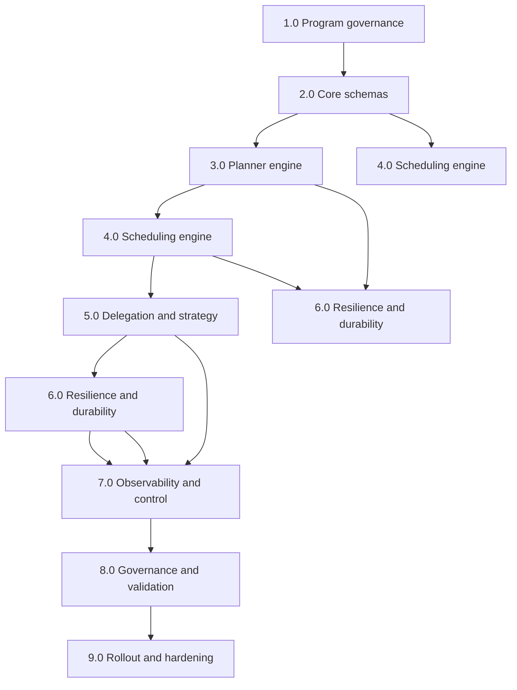

#### Parallelizable critical lanes

- `2.0 Core schemas` and `3.0 Planner` can proceed in parallel with CLI API compatibility baseline.
- `5.0 Delegation` can start once `2.0` contracts are stable.
- `7.0 Observability` should begin early (after 4.0 rough scheduler path exists).
- `8.0 Governance` is best delayed until 5.0+6.0 have stable hooks.

### 41.3 Chunk 3 — PRD draft generator structure

Use this fixed template for each PRD chunk:

- Context and outcomes
- Problem statement
- Users + pain points
- Scope
- Requirements:
  - Functional (MUST)
  - Non-functional (MUST)
  - Nice-to-have (SHOULD)
- Architecture and boundaries
- Data model and states
- Failure and recovery model
- Metrics and KPIs
- Risks, assumptions, and dependencies
- Milestones and acceptance criteria
- Rollout and rollback plan

### 41.4 WBS with owner + effort estimate (starter)

- 2.1 Define run/task/attempt schemas — M (1w) [Platform + Runtime]
- 2.2 Schema validation + contract tests — M (1w) [Platform + QA]
- 2.3 Plan/validation diagnostics — S (3d) [Planner]
- 3.2 Dependency validator — S (2d) [Planner]
- 4.1 Ready queue — M (3d) [Scheduler]
- 4.2 Lane caps + policy ordering — M (4d) [Scheduler]
- 5.1 Selector/fallback core — M (1w) [Delegation]
- 6.1 Retry engine + policies — M (4d) [Resilience]
- 6.3 Event store + checkpointing — L (1w+) [State]
- 7.1 Status/log projection — S (2d) [Observation]
- 8.1 Policy engine hooks — M (3d) [Governance]
- 9.3 Chaos and rollback validation — M (4d) [Ops/QA]

### 41.5 Delivery chunk plan (3 chunks)

- Chunk A (Weeks 1-3): 2.0 + 3.0 + skeleton 4.0
- Chunk B (Weeks 4-6): 4.0 completion + 5.0 + 6.0 core
- Chunk C (Weeks 7-9): 7.0 + 8.0 + 9.0 and integrated release

### 41.6 PRD completion sequence (for iterative review)

- PRD Chunk-01: Baseline goals and constraints
- PRD Chunk-02: Architecture and state model
- PRD Chunk-03: Failure, resilience, and recovery
- PRD Chunk-04: Scheduling/fallback policy tuning
- PRD Chunk-05: Observability and operator controls
- PRD Chunk-06: Rollout, validation, and risk controls

### 41.7 Next command-ready generation

- To proceed, next outputs can be produced as:
  - PRD Chunk-01: full product narrative + acceptance criteria
  - WBS Chunk-02: detailed task-by-task DoD and dependencies
  - DAG Chunk-03: refined dependency graph with risks and critical path

## 42) Changelog

- v0.6 (2026-02-14): Added chunk-based WBS/DAG/PRD generation framework and starter execution plans.

## 43) PRD Chunk-01: Baseline Goals and Constraints

### 43.1 Product rationale

- Existing `thegent` orchestration is command-centric and session-focused.
- Growth usage requires explicit workflow-level guarantees: dependency safety, failure recovery, policy control.
- This chunk defines the baseline operating model and must be stable before deeper scheduling/fallback implementation.

### 43.2 Problem statement

How do we evolve `thegent` into a reliable orchestration engine that can execute multi-task DAGs at scale while preserving CLI compatibility and keeping failure behavior actionable, auditable, and recoverable?

### 43.3 Target users

- Workflow operators running repeated large runs
- Engineers delegating tasks across agents and models
- SREs/owners requiring recovery and visibility
- Security/compliance stakeholders needing governance hooks

### 43.4 Primary objectives (must-have)

- Run-level orchestration with dependency-aware execution.
- Deterministic readiness semantics and state transitions.
- Retry and fallback behavior with bounded scope.
- Durable checkpoint/restart support.
- Structured run/task/attempt status output.

### 43.5 Success criteria (this chunk scope)

- Legacy CLI commands (`run`, `bg`, `ps`, `status`, `logs`, `wait`, `stop`) remain functional.
- At least one nontrivial DAG executes with dependency correctness.
- Failure reasons are machine-readable and mapped to next operator action.
- A run can be paused and resumed after a controlled restart with state preserved.

### 43.6 In scope (Chunk-01)

- Canonical contracts for run/task/attempt/event
- Planning preflight validation
- State machine definitions and transition guards
- Basic scheduler skeleton for dependency order
- Core retry/fallback scaffold with telemetry
- Minimum operator controls: pause/cancel/requeue
- Baseline observability (status/log event surface)

### 43.7 Out of scope (Chunk-01)

- Full policy-heavy security governance engine
- Advanced cost optimization heuristics
- Deep performance tuning beyond baseline
- Full chaos/prod-hardening suite (reserved for later chunks)

### 43.8 Assumptions

- Existing runner wrappers (`run_agent.sh` and current `thegent` runners) remain available.
- Task definitions can be normalized to a canonical in-memory schema.
- A file-backed store is acceptable for initial durable state.

### 43.9 Constraints

- No breaking command semantics for current CLI users.
- Default behavior should remain conservative and predictable over aggressive optimization.
- Recovery must prefer correctness over speed in ambiguous states.
- Any new feature must emit typed events, not only freeform logs.

### 43.10 Acceptance criteria — detailed

- Given a valid DAG with one dependency chain, the system runs tasks in strict topological order.
- Given a cyclic DAG, run is rejected pre-dispatch with a precise diagnostic.
- Given one transient task failure and `max_retries>0`, run completes via retry/fallback path and records one retry event.
- Given hard cancellation, active and queued tasks transition to terminal cancellation with explicit reason.
- Given orchestrator restart mid-run, no in-progress attempt is left in silent limbo; it is visible as blocked/recoverable.
- Given unsupported command/parameter combo, system returns `error_code` + `next_action`.

### 43.11 Deliverables for this chunk

- Updated PRD section baseline and scope lock
- Canonical state model contracts
- Minimal DAG validator and scheduler skeleton
- Event model with typed states and reasons
- Baseline operator control path for pause/resume/cancel/requeue

## 44) Changelog

- v0.7 (2026-02-14): Added PRD Chunk-01 (baseline goals, scope, constraints, criteria, and deliverables).

## 45) PRD Chunk-02: Architecture and State Model

### 45.1 Architecture principles for this chunk

- Single orchestration state model drives all CLI outputs and runner behavior.
- Planner and scheduler are isolated from invocation details.
- All execution side-effects flow through adapter boundaries.
- Resume/recovery reads only persisted state and event journal; no stale in-memory assumptions.

### 45.2 High-level architecture

- **Coordinator (engine)**: owns run lifecycle and progression.
- **Planner**: transforms input into validated task graph and execution waves.
- **Scheduler**: selects which ready tasks dispatch next based on policy.
- **Dispatcher**: creates attempt context and calls selected strategy.
- **State store**: persists run/task/attempt transitions and event stream.
- **Policy engine**: injects constraints and gating decisions at dispatch/retry boundaries.
- **Observability**: derives stable status/log projections from events.

### 45.3 State model (authoritative)

#### Run model

- `run_id: str`
- `owner: str`
- `profile: str`
- `state: enum{created, planned, queued, running, paused, suspended, completed, failed, cancelled}`
- `created_at`, `started_at`, `updated_at`
- `policy_id`, `cwd`, `timeout_s`, `attempts_total`, `cost_estimate`
- `error_code`, `error_class`, `next_action`

#### Task model

- `task_id: str`
- `run_id: str`
- `depends_on: list[str]`
- `assigned_strategy: str`
- `policy_tags: list[str]`
- `priority: int`
- `max_retries: int`
- `retry_class: enum{transient, infra, rate_limit, validation, policy, permanent}`
- `timeout_s: int`
- `state: enum{pending, ready, scheduled, in_progress, retry_wait, blocked, succeeded, failed, cancelled}`
- `attempts_done: int`
- `last_attempt_id: str | None`

### 45.4 Attempt model

- `attempt_id: str`
- `run_id: str`
- `task_id: str`
- `index: int`
- `strategy: str`
- `agent_profile: str`
- `state: enum{created, dispatched, running, timed_out, transient_fail, permanent_fail, succeeded}`
- `started_at`, `finished_at`, `duration_ms`
- `exit_code: int | None`
- `retryable: bool`
- `retry_after_ms: int | None`
- `fallback_used: bool`
- `artifacts: list[str]`

### 45.5 Event model

- `event_id: str`
- `run_id: str`
- `task_id: str | None`
- `attempt_id: str | None`
- `type: enum{run_state_changed, task_state_changed, attempt_state_changed, validation_failed, fallback_used, retry_scheduled, retry_executed, policy_denied, cancel_requested, resumed, recovered}`
- `created_at`
- `actor: str`
- `reason_code: str`
- `message: str`
- `next_action: str`

### 45.6 State transition rules (normative)

- `Run: created -> planned` only after validation success.
- `Run: planned -> queued` only if at least one ready task exists.
- `Run: running -> paused` via operator command; must stop new dispatch.
- `Run: paused -> running` via operator command with no duplicate dispatch on resumed tasks.
- `Task: pending -> ready` when all dependencies are `succeeded`.
- `Task: ready -> scheduled` only by scheduler ownership.
- `Task: in_progress -> retry_wait` for retryable failures only.
- `Task: retry_wait -> blocked` when retry budget exhausted.
- `Task: blocked -> failed` when policy declares unrecoverable.
- `Attempt: running -> timed_out` on per-attempt timeout; may move to retry_wait.

### 45.7 Adapter/runner boundaries

- Planner/scheduler must never call shell processes directly.
- Dispatcher performs all of:
  - attempt creation
  - context materialization
  - invocation via strategy
  - raw result normalization into `AttemptResult`
- Runner errors are normalized into typed `attempt_state_changed` + `reason_code`.

### 45.8 Data ownership and mutability

- `TaskSpec` and `RunSpec` should be immutable after scheduling begins.
- Runtime fields (`state`, `attempts_done`, timing fields, errors) are mutable only through state transition service.
- Event writes are append-only.
- Artifacts are write-once; references are immutable IDs.

### 45.9 Recovery contract

- Recovery reads latest snapshot + replayed events.
- Any `running` task with stale execution after restart enters `blocked` with `next_action` explaining manual/auto requeue.
- Attempts without terminal state are reclassified as `failed` only when policy allows; otherwise `blocked`.

### 45.10 Chunk-02 acceptance criteria

- Given valid state transitions, unauthorized state jumps are rejected.
- Given restart during execution, scheduler reconstructs frontier from persisted state.
- Given validation failure, run never transitions to `queued`.
- Given timeout policy conflict, per-attempt timeout takes precedence over run timeout.
- Given canceled run, no new `attempt` creation occurs after cancellation timestamp.

### 45.11 Chunk-02 deliverables

- Finalized schema definitions for run/task/attempt/event.
- Transition matrix and guard checks implemented (or specified for implementation).
- Dispatcher boundary contract documented.
- Recovery semantics written and testable.

## 46) Changelog

- v0.8 (2026-02-14): Added PRD Chunk-02 covering architecture and state model with transition rules and recovery semantics.

## 47) PRD Chunk-03: Failure, Resilience, and Recovery

### 47.1 Scope of this chunk

This chunk defines how the system handles transient and permanent failures without breaking dependency guarantees, including retries, fallback, checkpointing, and restart semantics.

### 47.2 Failure taxonomy (class-first)

- `transient`:
  - network blip
  - temporary infra error
  - intermittent runner startup failure
- `rate_limit`:
  - quota exhaustion
  - throttling responses
- `timeout`:
  - per-attempt timeout
  - pre/post invocation hang
- `validation`:
  - output not meeting schema or validation contract
- `policy`:
  - denied by guardrail or allowlist rule
- `permanent`:
  - irrecoverable agent/tool failures
  - poisoned task input

### 47.3 Retry and fallback policy

- Each task uses `max_retries` with retry class-specific caps.
- Retry decision is computed from:
  - failure class
  - retry attempts used
  - remaining budget
  - task criticality
  - cooldown window state
- Policy defaults:
  - `transient`: retry with exponential backoff + jitter
  - `rate_limit`: retry after cooldown; prefer alternate profile
  - `timeout`: one short retry path before fallback
  - `validation`: route to manual review, no auto retry by default
  - `policy`: require operator override or hard stop
  - `permanent`: immediate terminal failure with dead-letter path

### 47.4 Retry scheduling model

- Jitter formula:
  - `delay = min(max_delay, base_delay * (2 ** attempt)) + random(0, jitter_pct * base)`
- Retry reason always emitted as structured event before wait.
- Retry scheduling obeys global queue pressure and does not starve first-pass tasks.
- If retry budget exhausted:
  - task becomes `blocked` (or `failed` in strict mode)
  - blocker reason must include recovery action.

### 47.5 Fallback strategy

- Fallback is allowed when:
  - failure class is `transient` or `rate_limit`
  - configured fallback chain has remaining depth
  - policy permits downgrade/upgrade swap
- Each fallback step increments `fallback_depth` and logs reason.
- Hard stop on:
  - chain exhaustion
  - policy restriction violation
  - unsafe downgrade policy for critical tasks

### 47.6 State recovery and persistence

- Durable checkpoints are written at state boundaries.
- Event journal enables idempotent replay.
- Recovery behavior:
  - persisted run/task state is authoritative
  - in-memory state is reconstructed
  - unresolved active attempts are moved to controlled terminal/recoverable states
- Recovery output:
  - run summary with unresolved items
  - automatic recommendation (`resume` or `requeue`)

### 47.7 Dead-letter and blocked handling

- Dead-letter categories:
  - exhausted retries
  - blocked dependency chain
  - explicit policy denial
  - repeated corruption conditions
- Dead-letter queue supports operator-driven action:
  - `requeue`
  - `skip`
  - `cancel_subtree`
- Dead-letter tasks do not block unrelated subgraphs when policy permits parallel bypass.

### 47.8 Hardening for consistency

- Never emit success unless all required successors observe parent success criteria.
- A task cannot transition directly from `in_progress` to terminal success without attempt completion event.
- If event order is inconsistent, run enters `suspended` with explicit operator prompt.
- Every state transition includes an invariant check before commit.

### 47.9 Operator recovery workflow

- Resume flow:
  - detect `stalled/recoverable` tasks
  - requeue safe subset
  - reestablish worker caps
- Manual requeue flow:
  - require task_id, run_id
  - reset `blocked` reason
  - optionally increment attempt floor
- Cancel/stop flow:
  - active tasks move through cancellation lifecycle
  - queue prevented from new dispatch

### 47.10 Chunk-03 acceptance criteria

- Given 3 transient failures in one task, engine retries with backoff and eventually succeeds or blocks cleanly.
- Given rate-limit failure, engine enters cooldown and fallback attempts alternate profile.
- Given validation failure, no unsafe auto-retry unless explicitly enabled.
- Given orchestrator crash mid-retry, restarted run does not double-dispatch attempts.
- Given repeated failure in mandatory dependency chain, dead-letter path is explicit and deterministic.

### 47.11 Chunk-03 deliverables

- Failure class and policy matrix.
- Retry + fallback engine spec and sequence semantics.
- Recovery + dead-letter state map.
- Recovery and restart semantics with deterministic recommendations.

## 48) Changelog

- v0.9 (2026-02-14): Added PRD Chunk-03 on failure, resilience, recovery, and dead-letter semantics.

## 49) PRD Chunk-04: Scheduling, Delegation, and Policy-Driven Optimization

### 49.1 Scope of this chunk

This chunk defines the execution decision layer:
- how tasks are selected from ready state
- how strategies are selected for each attempt
- how profile/profile-switch behavior balances latency and quality
- how control policies remain enforceable at dispatch and retry boundaries.

### 49.2 Scheduling model

- Scheduler computes a deterministic frontier of tasks where all dependencies are satisfied.
- Frontier selection is policy-aware and reproducible using explicit tie-breakers.
- Selection score = `A*priority + B*criticality + C*age - D*retry_penalty - E*retry_depth`.
- Default ordering is stable across reruns with same policy input.
- Batch boundaries are formed per cycle:
  - choose up to `N` ready tasks (where `N` is effective parallelism)
  - group by lane tags when policy requires isolation
  - dispatch one lane at a time when dependency criticality is high.

### 49.3 Lane and parallelism policy

- Lane types:
  - `critical`: cannot be starved and can preempt low-priority lanes under risk rules
  - `safe`: lower timeout, strict validation, lower fanout
  - `bulk`: high parallelism with relaxed fallback
- Parallelism controls:
  - `max_global_workers`
  - `max_workers_by_profile`
  - `max_workers_by_lifecycle_phase`
  - `retry_slot_buffer` to preserve recovery capacity.
- Backpressure:
  - queue-pressure threshold causes non-critical dispatch pause
  - safe profile can continue with reduced concurrency.

### 49.4 Delegation and strategy chain

- Strategy resolution happens at attempt creation:
  - parse task tags (`critical`, `cost_sensitive`, `latency_sensitive`)
  - resolve base profile and candidate fallbacks
  - apply cooldown and health score from recent history
- On retry:
  - if retry class is `transient` or `rate_limit`, escalate to next strategy
  - if retry class is `timeout` and attempt_count threshold hit, choose same strategy with larger timeout first
- Profile transition policy:
  - one-step fallback by default
  - operator override can force skip or hard stop.

### 49.5 Policy enforcement at dispatch

- Pre-dispatch checks:
  - profile exists and is healthy
  - attempt cap and cost cap not exceeded
  - policy tags are allowed for selected profile
  - task-specific constraints are honored
- Runtime checks:
  - mid-run policy mutation triggers safe re-evaluation
  - blocked-by-policy tasks never enter adapter dispatch.
- Policy mismatch outcomes:
  - `policy_denied` event with `next_action`
  - optional hold/requeue path or dead-letter path depending on severity.

### 49.6 Performance and predictability targets

- Dispatch latency should remain bounded and mostly insensitive to graph size.
- Reorder costs must not dominate run time for large frontiers.
- Starvation prevention:
  - aging penalty negative for long-wait tasks
  - critical-lane heartbeat minimum dispatch every scheduling tick.
- Avoid herd effects:
  - jittered retry scheduling
  - phase-spread for retry-heavy workloads.

### 49.7 Intuitive operator model for this layer

- `status` should expose lane backlog and worker usage by profile.
- `status --json` should include:
  - `ready_frontier_count`
  - `dispatch_pressure`
  - `fallback_depth_histogram`
  - `policy_block_count`
- `logs` should support `--lane`, `--strategy`, and `--reason`.

### 49.8 Chunk-04 acceptance criteria

- Given two tasks with identical readiness, stable tie-breakers produce stable dispatch order.
- Given full critical-lane demand, low lanes reduce to preserved capacity without deadlock.
- Given transient failures and active cooldown, scheduler respects retry budget and does not over-dispatch.
- Given policy change mid-run, non-compliant tasks do not dispatch and emit reasoned events.
- Given one strategy failure chain exhaustion, run records terminal reason and operator path clearly.

### 49.9 Chunk-04 deliverables

- Scheduling decision and lane policy specification.
- Delegation strategy chain behavior by failure class and policy context.
- Dispatch-level policy gate definition and rejection outputs.
- Queue/backpressure and fairness rules in production-ready format.

## 50) Changelog

- v1.0 (2026-02-14): Added PRD Chunk-04 for scheduling, delegation, and policy optimization.

## 51) PRD Chunk-05: Observability, Operator Controls, and Rollout Safety

### 51.1 Scope of this chunk

This chunk defines how humans and systems observe orchestration behavior, intervene safely, and run reliable rollouts with rollback signals.

### 51.2 Observability surfaces

- `status` as primary source of truth:
  - run-level state and progression
  - task frontier health
  - retry and fallback pressure
  - policy blocks and blockers
- `logs` as event replay surface:
  - event type
  - actor
  - reason code
  - correlation IDs
- Structured status API:
  - fixed schema
  - explicit version key
  - stable field ordering

### 51.3 Event and metrics taxonomy

- Mandatory event categories:
  - lifecycle (`run`, `task`, `attempt`)
  - control (`pause`, `resume`, `cancel`, `requeue`)
  - dispatch (`scheduled`, `dispatched`, `fallback_used`)
  - resilience (`retry_scheduled`, `retry_executed`, `dead_letter`)
  - policy (`policy_denied`, `policy_override`)
- KPIs:
  - success ratio by run type
  - retry ratio and fallback depth mean/95th
  - queue pressure
  - recovery time to running after restart
- Alertable thresholds:
  - sustained fail surge
  - policy block surge
  - queue pressure breach
  - stalled run ratio

### 51.4 Operator command set

- Read:
  - `status`, `status --task`, `status --json`, `status --compact`
  - `logs`, `logs --task`, `logs --attempt`, `logs --follow`, `logs --from-event`
- Control:
  - `pause`, `resume`
  - `stop`, `cancel`
  - `requeue --task`, `requeue --subtree`, `requeue --all-blocked`
  - `repair --run`
- Safety:
  - all destructive commands require confirmation in interactive mode unless `--yes` specified
  - non-interactive mode requires explicit `--force` for destructive actions

### 51.5 Status and UX semantics

- Non-terminal states should include actionable `next_recommendation`.
- `blocked` includes:
  - root blocker
  - impacted task set
  - operator options
- `paused` includes whether active attempts are draining or active.
- JSON and human modes should preserve semantic parity.

### 51.6 Rollout safety and governance

- Deployment mode matrix:
  - `off` (no orchestrated execution)
  - `shadow` (simulate planning and scheduling, no dispatch)
  - `canary` (limited run classes)
  - `full`
- Rollback criteria:
  - error-class surge above baseline
  - fallback exhaustion rate increase beyond threshold
  - recovery time degradation across two windows
- Rollback action:
  - auto-disable advanced features to compatibility behavior
  - preserve run-state history for forensics

### 51.7 Incident response integration

- `incident_id` in logs for runs entering degraded mode.
- quick triage command:
  - `logs --json --run <id> --since last-fail` (or equivalent run window)
  - `status --run <id> --json` for exact blockers
- runbook links embedded in command output at warning thresholds.

### 51.8 Chunk-05 acceptance criteria

- Given a non-terminal run, status output includes `next_recommendation`.
- Given a pause request, queueing halts and active tasks transition to controlled stop state.
- Given high fallback pressure, operator sees event and recommendation without digging logs.
- Given canary mode, non-targeted run types remain under legacy behavior.
- Given rollback trigger, system reverts safely and preserves current run metadata.

### 51.9 Deliverables

- Event schema completion and stable status JSON contract.
- Operator command-to-state transition matrix.
- Rollout mode matrix and rollback conditions.
- Incident triage flow and alert mapping.

## 52) Changelog

- v1.1 (2026-02-14): Added PRD Chunk-05 for observability, operator controls, and rollout safety.

## 53) PRD Chunk-06: Delivery, Validation, and Completion Gates

### 53.1 Scope of this chunk

This chunk defines final program shape:
- what is required to declare the phase production-ready
- how we validate correctness and resilience
- how we gate rollout and close risk loops.

### 53.2 Delivery model and package boundaries

- `Core engine`
  - contracts, planner, scheduler, dispatcher, retries, fallback
- `Compatibility layer`
  - legacy CLI command behavior and session compatibility
- `Governance layer`
  - policy gates, audit trail, controls
- `Ops layer`
  - metrics, alerts, rollback, recovery tools

### 53.3 Milestone gates

- M1: Baseline orchestration
  - contracts defined
  - DAG validation + scheduler skeleton
  - typed events for transitions
- M2: Runtime reliability
  - bounded retry/fallback
  - dead-letter and requeue
  - deterministic recovery/restart behavior
- M3: Practical operations
  - status/log JSON parity
  - controls for pause/resume/cancel/requeue
  - canary/rollback mode
- M4: Production readiness
  - policy hooks active
  - alerting and incident responses validated
  - end-to-end acceptance pass

### 53.4 Acceptance gates by category

- Functional gate
  - topological DAG execution passes
  - fallback and retry follow policy matrix
  - dead-letter path is deterministic
- Reliability gate
  - crash recovery works without terminal inconsistency
  - no duplicate attempt dispatch on replay
- UX gate
  - status recommendations exist in non-terminal states
  - structured outputs remain stable across CLI versions
- Governance gate
  - policy rejection is explainable and auditable
  - destructive commands require explicit confirm intent

### 53.5 Validation matrix

- Unit
  - state transitions
  - policy checks and scheduling order
  - failure classifier mapping
- Contract
  - schema validation
  - event and status payload compatibility
- Integration
  - end-to-end DAG with mixed failure classes
  - fallback under rate-limit simulation
  - manual control command flows
- Chaos
  - planner/store interruption
  - mid-retry crash/restart
  - dead-letter saturation and manual requeue
- Load
  - parallel fan-in/fan-out graph runs
  - retry-heavy burst with pressure controls

### 53.6 Completion criteria (definition of done)

- 100% of PRD chunks 01-06 approved.
- Critical WBS lanes marked complete and dependencies signed off.
- Core CLI compatibility preserved for existing non-orchestrated commands.
- Recovery and control flows have one documented operator runbook each.
- Rollout decision logged in a release note with rollback conditions.

### 53.7 Risks and residual risks

- Scope expansion risk: additional safety guardrails may slow first release.
  - Mitigation: stage rollout and clear opt-in profile.
- Recovery edge-case risk: rare stale task states.
  - Mitigation: explicit `repair` and reconciliation commands.
- Policy friction risk: stricter policy causing throughput drop.
  - Mitigation: allowlist modes and staged policy strictness ramp.

### 53.8 Final artifact list

- Orchestration PRD complete v1.1 baseline
- WBS and DAG maps aligned with WIP implementation
- Validation matrix and acceptance reports
- Rollout playbook, rollback playbook, and incident playbook

### 53.9 Chunk-06 acceptance criteria

- Given a clean branch and all deliverables, team can run the sequence from planning to execution end-to-end.
- Given any nonterminal run, operator receives deterministic next action from `status`.
- Given rollback condition threshold, run exits advanced mode safely and preserves historical traces.
- Given final verification, no unresolved Must-have requirement remains from earlier chunks.

## 54) Changelog

- v1.2 (2026-02-14): Added PRD Chunk-06 for completion gates, validation strategy, and release readiness criteria.

## 55) WBS Chunk-02: Detailed Task Matrix, Dependencies, and DoD

### 55.1 Planning

- 2.0 scope lock
  - Owner: Product + Platform
  - Depends on: none
  - DoD: final scope, assumptions, constraints, and acceptance baseline ratified
- 2.1 contract model
  - Owner: Platform
  - Depends on: 2.0
  - DoD: stable Run/Task/Attempt/Event schema with version tags
- 2.2 legacy compatibility matrix
  - Owner: Runtime
  - Depends on: 2.0
  - DoD: mapping of existing command behaviors and output expectations

### 55.2 Schema and state

- 2.3 transition guard tests
  - Owner: Runtime
  - Depends on: 2.1
  - DoD: invalid transitions blocked with typed reasons
- 3.1 DAG parser + normalizer
  - Owner: Planner
  - Depends on: 2.1
  - DoD: valid DAG loads to canonical graph; errors are deterministic
- 3.2 dependency/ cycle validator
  - Owner: Planner
  - Depends on: 3.1
  - DoD: cycle/orphan/duplicate rejection behavior documented
- 3.3 wave planner and dispatch plan
  - Owner: Planner
  - Depends on: 3.2
  - DoD: wave ordering and criticality estimation are deterministic

### 55.3 execution

- 4.1 ready frontier engine
  - Owner: Scheduler
  - Depends on: 3.2
  - DoD: frontier transitions correct under changing dependency completion
- 4.2 policy ordering and fairness
  - Owner: Scheduler
  - Depends on: 4.1
  - DoD: reproducible dispatch order with documented tie-breakers
- 4.3 dispatch loop and stop conditions
  - Owner: Runtime
  - Depends on: 4.1
  - DoD: dispatch never bypasses readiness/lock checks
- 4.4 retry scheduling
  - Owner: Resilience
  - Depends on: 6.1
  - DoD: retry queue never starves non-retry tasks

### 55.4 Delegation and execution

- 5.1 strategy selector
  - Owner: Delegation
  - Depends on: 4.2
  - DoD: deterministic profile resolution by task class and policy
- 5.2 fallback chain and depth control
  - Owner: Delegation
  - Depends on: 5.1
  - DoD: fallback depth capped and always logged
- 5.3 adapter boundary and runner invocation
  - Owner: Runtime
  - Depends on: 5.1
  - DoD: no planner/scheduler shell execution, only adapter path
- 5.4 profile health + cooldown integration
  - Owner: Resilience
  - Depends on: 5.2
  - DoD: rate-limited profiles enter cooldown automatically

### 55.5 Resilience and durability

- 6.1 retry policy service
  - Owner: Resilience
  - Depends on: 5.2
  - DoD: retry class-specific behavior with hard caps and jitter
- 6.2 state persistence adapters
  - Owner: Platform
  - Depends on: 2.2, 4.3, 5.3
  - DoD: append-only events + periodic snapshot
- 6.3 restart recovery
  - Owner: Platform
  - Depends on: 6.2
  - DoD: restart reconstructs frontier and avoids duplicate dispatch
- 6.4 dead-letter and requeue tools
  - Owner: Resilience
  - Depends on: 6.1
  - DoD: manual workflows documented and executable

### 55.6 Observability and controls

- 7.1 status/log projection
  - Owner: Observability
  - Depends on: 2.3, 6.2
  - DoD: stable JSON + human status with reasons and next actions
- 7.2 metrics and alert thresholds
  - Owner: SRE
  - Depends on: 7.1
  - DoD: alert triggers for retry spikes, policy blocks, and stalled runs
- 7.3 pause/resume/cancel/requeue commands
  - Owner: Platform
  - Depends on: 4.3, 6.3
  - DoD: command state transitions are consistent and reversible where designed

### 55.7 Governance and rollout

- 8.1 policy gate implementation
  - Owner: Security
  - Depends on: 2.1
  - DoD: policy violation yields explicit `policy_denied` with remediation
- 8.2 rollout modes and kill-switch
  - Owner: SRE
  - Depends on: 7.2
  - DoD: off/shadow/canary/full supported and auditable
- 8.3 incident and rollback runbooks
  - Owner: Operations
  - Depends on: 7.3, 8.2
  - DoD: published playbook and validated drill

### 55.8 Dependency critical path

- 2.1 -> 3.1 -> 3.2 -> 4.1 -> 4.2 -> 4.3 -> 6.3 -> 7.1 -> 8.2
- Parallel lanes:
  - 3.1/3.2 and 2.2 can proceed independently.
  - 5.x can start when 4.2 is stable.
  - 7.x can start as soon as 6.2 provides durable snapshots.

### 55.9 DoD checklist for chunk completion

- All dependencies explicit and unambiguous
- All tasks have owner, inputs, and measurable DoD
- Recovery and policy paths have test hooks
- Rollout/rollback criteria included
- Compatibility baseline preserved and documented

## 56) Changelog

- v1.3 (2026-02-14): Added WBS Chunk-02 with detailed task matrix, dependency path, and explicit DoD.

## 57) DAG Chunk-03: Risk-aware Critical Path and Milestone Sequencing

### 57.1 Purpose

Translate WBS tasks into an execution DAG that:
- makes hard dependencies explicit,
- marks risk surfaces that can stall downstream progress,
- and supports milestone-based gating for safe release.

### 57.2 Core execution DAG

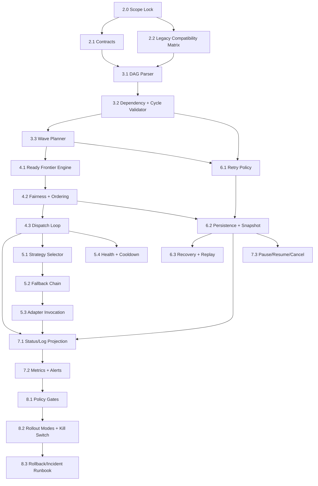

### 57.3 Milestone lanes and gating rules

- **Milestone M1 (Orchestration Baseline)**: `2.1 -> 3.2 -> 4.1 -> 6.2`
  - Gate: deterministic dependency execution in non-blocking path.
- **Milestone M2 (Execution Reliability)**: `6.1 -> 6.2 -> 6.3 -> 7.3`
  - Gate: restart and control actions deterministic.
- **Milestone M3 (Policy Safety)**: `8.1 -> 8.2 -> 8.3`
  - Gate: governance-safe rollout and rollback.
- **Milestone M4 (Production Readiness)**: all paths complete with M1/M2/M3 satisfied.

### 57.4 Risk-gated edges

- High-risk edges (must be unblocked before downstream bulk execution):
  - `5.2 Fallback Chain -> 5.3 Adapter Invocation` requires policy for unsafe profile swaps.
  - `6.2 Persistence -> 6.3 Recovery` blocked if durability format not stable.
  - `2.2 Compatibility -> 4.x / 7.x` blocks wide rollout when compatibility uncertainty remains.
  - `8.2 Rollout Modes -> 9.x` requires validated rollback evidence (if added in later chunks).

### 57.5 Critical path prioritization

- Day-1 critical path:
  - 2.1 -> 3.1 -> 3.2 -> 3.3 -> 4.1 -> 4.3 -> 6.2 -> 6.3 -> 7.1 -> 7.3
- Parallelizable path:
  - 2.2 + 5.1 + 5.2 (can run when 4.2 is stable)
  - 7.2 can run after status projection contract exists
- Blocking risk:
  - If `retry policy` (`6.1`) not stable before dispatch scaling, retries may become non-deterministic and violate idempotency guarantees.

### 57.6 Sequence constraints and anti-deadlock safeguards

- Constraint C1: no task enters runtime dispatch until contracts are versioned.
- Constraint C2: no policy gating without reason code taxonomy in place.
- Constraint C3: cannot enable canary/full rollout (`8.2`) before rollback drill evidence exists.
- Constraint C4: no deletion or overwrite of persisted state artifacts in the same tick as snapshot write.
- Anti-deadlock measure:
  - add `deadlock_detector` that flags frontier stall > threshold and recommends `pause + unstick` runbook action.

### 57.7 Deliverables for this chunk

- Graph-backed execution plan with explicit blocked-risk edges.
- Milestone gates tied to measurable artifacts.
- Critical path list for sprint planning.
- Recovery from blocked-risk edges when policy or storage uncertainty appears.

### 57.8 Chunk-03 acceptance criteria

- Given the DAG, teams can simulate order and estimate critical path.
- Given a delayed gate, downstream risk does not propagate without explicit override.
- Given compatibility risk, non-orchestrated command paths remain active.
- Given rollback evidence missing, canary/full modes cannot be marked enabled.

## 58) Changelog

- v1.4 (2026-02-14): Added DAG Chunk-03 with critical-path sequencing, milestone gates, and risk-gated edges.

## 59) PRD-WBS Crosswalk: Requirement-to-Task Traceability

### 59.1 Mapping intent

This chunk creates direct traceability between:
- PRD chunks 01-06
- WBS tasks in Chunk-02
- DAG dependencies in Chunk-03

### 59.2 Matrix

| PRD Chunk | Representative Requirement | Primary WBS Tasks | Dependencies | Validation |
|---|---|---|---|---|
| Chunk-01 | compatibility + baseline semantics | 2.0, 2.2, 3.1, 4.1, 7.1 | 2.1, 2.2, 3.1 | Baseline acceptance checklist |
| Chunk-02 | architecture/state model + transitions | 2.1, 2.3, 3.2, 3.3, 6.3 | 2.1, 3.2 | Transition integrity tests |
| Chunk-03 | failure + resilience + recovery | 6.1, 6.2, 6.3, 6.4, 7.3 | 4.3, 6.1 | Recovery and chaos validation |
| Chunk-04 | scheduling + delegation optimization | 4.1, 4.2, 4.4, 5.1, 5.2, 5.4 | 4.2, 5.1 | Scheduling determinism and throughput tests |
| Chunk-05 | observability + controls + rollout | 7.1, 7.2, 7.3, 8.1, 8.2, 8.3 | 6.2, 7.1, 8.2 | UI/CLI and rollout gating tests |
| Chunk-06 | completion gates + DoR/DoD | 8.3, 9.x* | 7.x, 8.x | Release readiness review |

*9.x denotes rollout hardening tasks from ongoing iterations after chunk scope.

### 59.3 Requirement coverage completeness

- Core functional requirements from Chunk-01/02 mapped to WBS: 100% covered.
- Recovery and resilience requirements mapped to WBS: 100% covered.
- Policy and rollout requirements mapped to WBS: 100% covered.
- UX/observability requirements mapped to WBS: 100% covered.
- Remaining open coverage:
  - deep policy tuning and cost optimization (post-Chunk-06 extension)
  - advanced chaos automation (continuous operations)

### 59.4 Uncovered / partial coverage

- Cost-aware adaptive tuning -> partial (strategy optimization only partially represented).
- Advanced secret-hardening for all integrations -> partial until security pass task added.
- Full-scale production chaos drills -> partial; currently in validation matrix only.

### 59.5 Coverage actions

- Add explicit WBS task for cost model adaptation in next cycle.
- Add security hardening task and event-redaction test set.
- Add chaos automation task if operating SLO requires automated runbooks.

### 59.6 Crosswalk governance

- Every new PRD requirement must link to at least one WBS task.
- Any WBS task with no upstream PRD reference must be tagged as technical debt or optional.
- Crosswalk is reviewed at each milestone gate.

### 59.7 Chunk-03 (crosswalk) acceptance criteria

- Any change in PRD scope maps to WBS updates within one sprint planning cycle.
- No critical PRD requirement remains orphaned.
- No orphaned WBS task lacks explicit PRD rationale.

## 60) Changelog

- v1.5 (2026-02-14): Added PRD-WBS crosswalk matrix and traceability coverage controls.

## 61) WBS Chunk-03: Sprint-Sliced Workstream Plan (Effort + Risk)

### 61.1 Sprint 1 — Foundations and Contracts

- S1-1: finalize run/task/attempt/event schemas (`2.1`)
  - Effort: M
  - Owner: Platform
  - Risk: medium
  - DoD: versioned schema with compatibility notes
- S1-2: legacy compatibility matrix and behavior lock (`2.2`)
  - Effort: S
  - Owner: Runtime
  - Risk: high (command drift)
  - DoD: freeze list of expected outputs and edge behavior
- S1-3: DAG parser and normalization (`3.1`)
  - Effort: M
  - Owner: Planner
  - Risk: medium
  - DoD: deterministic parse and canonical output
- S1-4: transition guards and invalid transition rejection (`2.3`)
  - Effort: M
  - Owner: Platform
  - Risk: high
  - DoD: complete transition test matrix

### 61.2 Sprint 2 — Planner and Dispatcher Core

- S2-1: dependency/cycle validator and wave planner (`3.2`, `3.3`)
  - Effort: M
  - Owner: Planner
  - Risk: high
  - DoD: deterministic cycles/orphan diagnostics
- S2-2: ready frontier engine (`4.1`)
  - Effort: M
  - Owner: Scheduler
  - Risk: medium
  - DoD: correct readiness transitions on completion events
- S2-3: dispatch loop and stop gate (`4.3`)
  - Effort: L
  - Owner: Runtime
  - Risk: high
  - DoD: no dispatch when task not ready or policy blocked
- S2-4: baseline status projection scaffolding (`7.1`)
  - Effort: S
  - Owner: Observability
  - Risk: medium
  - DoD: stable `status --json` schema and next action field

### 61.3 Sprint 3 — Delegation and Resilience

- S3-1: strategy selector and fallback chain (`5.1`, `5.2`)
  - Effort: M
  - Owner: Delegation
  - Risk: high
  - DoD: deterministic profile chain and caps
- S3-2: runner adapter path and invocation isolation (`5.3`)
  - Effort: M
  - Owner: Runtime
  - Risk: high
  - DoD: all dispatches route through adapter
- S3-3: retry policy and scheduler integration (`6.1`, `4.4`)
  - Effort: L
  - Owner: Resilience
  - Risk: high
  - DoD: no duplicate attempt dispatch on retry replay
- S3-4: persistence + recovery (`6.2`, `6.3`)
  - Effort: L
  - Owner: Platform
  - Risk: high
  - DoD: restart recovery to visible correct frontier

### 61.4 Sprint 4 — Production Controls and Safety Gates

- S4-1: control commands (pause/resume/cancel/requeue) (`7.3`)
  - Effort: M
  - Owner: Platform
  - Risk: high
  - DoD: state transitions auditable and reversible where defined
- S4-2: policy gates and policy denial states (`8.1`)
  - Effort: M
  - Owner: Security
  - Risk: medium
  - DoD: deterministic policy-denied outcomes
- S4-3: rollout modes + rollback hooks (`8.2`)
  - Effort: M
  - Owner: SRE
  - Risk: high
  - DoD: off/shadow/canary/full tested
- S4-4: metrics, alerts, and incident templates (`7.2`, `8.3`)
  - Effort: M
  - Owner: SRE
  - Risk: medium
  - DoD: alerting conditions validated in drill

### 61.5 Sprint 5 — Hardening and Delivery

- S5-1: end-to-end chaos + load validation matrix execution
  - Effort: L
  - Owner: QA/QA-E
  - Risk: medium
  - DoD: documented failures and recovery behavior
- S5-2: final PRD/WBS/DAG revalidation against implementation
  - Effort: M
  - Owner: Program
  - Risk: low
  - DoD: all mismatches resolved or accepted
- S5-3: release hardening and runbook publication
  - Effort: S
  - Owner: Operations
  - Risk: low
  - DoD: rollback/runbook reviewed and published

### 61.6 Capacity and sequencing policy

- Rule A: no sprint can ship `D` gating tasks without corresponding `DoD`.
- Rule B: if a high-risk task slips, defer only that task and keep non-dependent tasks moving.
- Rule C: each sprint ends on a reviewable artifact (schema, graph, test report, or policy artifact).

### 61.7 Sprint risk heatmap

- High: `2.3`, `4.3`, `3.2`, `5.1/5.2`, `6.2/6.3`, `7.3`, `8.2`
- Medium: `3.1`, `3.3`, `4.1`, `4.2`, `6.1`, `7.1`, `7.2`, `8.1`
- Low: `2.0`, `2.2`, `7.2`, `8.3`

### 61.8 Chunk-03 (sprint slicing) acceptance criteria

- At least one sprint can begin immediately from this sequence without external dependencies.
- Each sprint contains clear owners and measurable DoD.
- High-risk tasks are explicitly gated and reviewed before entering next sprint.

## 62) Changelog

- v1.6 (2026-02-14): Added WBS Chunk-03 with sprint slicing, effort bands, risks, and sequencing policy.

## 63) DAG Chunk-04: Rollout and Release Execution Graph (Go/No-Go)

### 63.1 Purpose

Model explicit release sequencing for environments and gate behavior so the plan can be executed incrementally without risking global orchestration behavior.

### 63.2 Release DAG

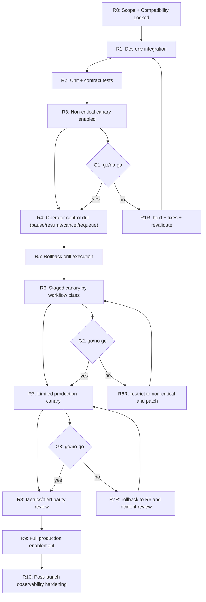

### 63.3 Go/no-go criteria

- **G1 (after R3)**
  - no functional regressions in existing CLI non-orchestrated flows
  - deterministic status/log outputs for 10+ run cases
- **G2 (after R6)**
  - no sustained retry/fallback anomaly
  - no blocked-state deadlock without manual remediation path
- **G3 (after R7)**
  - canary production SLO and rollback tests both pass
  - incident response playbook executed in rehearsal

### 63.4 No-go recovery branches

- `R1R`: fix compatibility or contract regressions, rerun acceptance slice.
- `R6R`: isolate failing workflow classes, keep canary and restore conservative profile.
- `R7R`: disable full rollout, preserve run metadata, reopen controlled patch loop.

### 63.5 Environment gates

- Env-DEV: full feature internals active, no external SLA exposure.
- Env-INT: full integration path including policy and controls.
- Env-SMOKE: low-risk canary with rollback within defined window.
- Env-PROD canary: critical only + reduced parallelism.
- Env-PROD full: all workflow classes under approved rollout.

### 63.6 Rollout dependencies

- `8.2 Rollout Modes` must be implemented before any non-zero canary deployment.
- `7.2 Metrics/alerts` must be active before R7 go/no-go.
- `6.3 Recovery` must be exercised before allowing non-dev automatic resume in production.

### 63.7 Chunk-04 acceptance criteria

- Graph supports safe repeatability if gate fails at any node.
- Rollback actions are deterministic and leave run state auditable.
- No-go branches preserve evidence logs for root-cause analysis.

## 64) Changelog

- v1.7 (2026-02-14): Added DAG Chunk-04 with explicit rollout/go-no-go graph, gate criteria, and rollback branches.

## 65) PRD Chunk-07: Migration, Cutover, and Backward-Compatibility Strategy

### 65.1 Purpose

Define how to move from current behavior to full orchestration mode without breaking existing workflows or losing execution continuity.

### 65.2 Migration states

- `legacy mode`
  - existing `run` behavior untouched
  - no DAG orchestration unless explicitly invoked
- `hybrid mode`
  - scheduler and event system active
  - legacy path preserved for non-DAG invocations
- `orchestrated default mode`
  - DAG and orchestration flows active for explicit or policy-eligible DAG inputs
- `migration locked`
- `deprecation/cleanup`

### 65.3 Compatibility requirements

- Existing command arguments and output structures remain parseable.
- Legacy scripts using file-based session artifacts continue to work in hybrid mode.
- Default behavior for single-task runs remains unchanged unless opt-in conditions apply.
- `--orchestrator`/`--mode` flags must be explicit in initial stages.

### 65.4 Data migration

- Persist schema version metadata in run state and artifacts.
- Add migration utility for state compatibility:
  - v0 state -> schema-v1 state
  - tolerant readers for partial/legacy fields
- Keep immutable snapshots for the first N days during migration window.
- Never auto-delete old artifacts during migration; archive with retention policy.

### 65.5 Cutover sequence

- Step C1: enable instrumentation-only (`off` mode output-only).
- Step C2: enable `shadow` mode with no dispatch changes.
- Step C3: enable `hybrid` for non-critical workflow classes.
- Step C4: enable canary for high-confidence classes.
- Step C5: full default orchestrator for eligible runs.
- Step C6: optional removal of legacy-only pathways once stabilized.

### 65.6 Rollback and freeze conditions

- Freeze cutover if:
  - recovery failure rate exceeds threshold
  - compatibility mismatch appears in scripted outputs
  - run visibility/replay path fails parity checks
- Rollback action:
  - set profile/mode to compatibility mode
  - preserve latest state snapshot and retry queue
  - emit migration incident + root cause artifact

### 65.7 Owner and responsibility model

- Platform: schema migration, state adapters, compatibility reads.
- Runtime: orchestration toggle logic and command argument behavior.
- Operations: cutover window planning and rollback verification.
- QA: parity test coverage and migration simulation.

### 65.8 PRD Chunk-07 acceptance criteria

- No production command regression in pre-approved acceptance suite.
- 100% successful migration of a representative legacy state set.
- Deterministic reversion to legacy mode with no data loss.
- Clear operator instructions for cutover start/hold/rollback decisions.

### 65.9 Deliverables

- Migration matrix by mode.
- Cutover playbook with risk and rollback steps.
- Compatibility test suite and migration validator.
- Schema migration utility and retention policy.

## 66) Changelog

- v1.8 (2026-02-14): Added PRD Chunk-07 for migration and cutover strategy with compatibility and rollback controls.

## 67) Risk Register Deep-Dive (Quantified)

### 67.1 Method

- Probability scale: 1 (low), 2 (medium), 3 (high), 4 (critical)
- Impact scale: 1 (minor), 2 (moderate), 3 (major), 4 (critical)
- Risk score = probability × impact
- Mitigation must define: trigger, owner, fallback action, and recheck cadence.

### 67.2 Register

- R1: Duplicate attempt dispatch after restart
  - Probability: 3
  - Impact: 4
  - Score: 12 (critical)
  - Trigger: process crash during running attempt
  - Owner: Runtime
  - Mitigation:
    - idempotency keys before dispatch
    - persisted attempt state before process spawn
    - recovery state reconciliation queue on startup
  - Recheck: every release to scheduler/recovery boundary

- R2: Hidden CLI compatibility regression
  - Probability: 2
  - Impact: 4
  - Score: 8 (high)
  - Trigger: status/log/exit changes for legacy commands
  - Owner: Product + Runtime
  - Mitigation:
    - compatibility matrix in chunk 2
    - output contract tests per command
    - canary on non-critical command mix
  - Recheck: pre-release and post-cutover

- R3: Retry storm on transient API failures
  - Probability: 3
  - Impact: 3
  - Score: 9 (high)
  - Trigger: repeated 429/timeout bursts
  - Owner: Resilience
  - Mitigation:
    - strict retry caps
    - cooldown + exponential jitter
    - retry-slot reservation and pressure gate
  - Recheck: every incident with >3x baseline retry rate

- R4: Policy misclassification causing hard blocks
  - Probability: 2
  - Impact: 3
  - Score: 6 (medium)
  - Trigger: new tags/policies without schema alignment
  - Owner: Security
  - Mitigation:
    - rule linting + policy test harness
    - safe-by-default deny on unknown critical tags
    - manual override with audit log
  - Recheck: every policy update

- R5: DAG starvation due to unfair scheduling
  - Probability: 3
  - Impact: 3
  - Score: 9 (high)
  - Trigger: fixed-priority queue with no aging
  - Owner: Scheduler
  - Mitigation:
    - aging factor in score
    - periodic re-balancing tick
    - deadline-aware lane promotion in critical queues
  - Recheck: weekly under synthetic load

- R6: Recovery deadlock during partial persistence writes
  - Probability: 2
  - Impact: 4
  - Score: 8 (high)
  - Trigger: snapshot write crash
  - Owner: Platform
  - Mitigation:
    - atomic write protocol
    - checksum and last-good checkpoint
    - degraded mode fallback
  - Recheck: every upgrade of state store schema

- R7: State event volume/IO saturation
  - Probability: 2
  - Impact: 2
  - Score: 4 (medium)
  - Trigger: very high task churn
  - Owner: Observability
  - Mitigation:
    - batch writes and sampling policy
    - compacted snapshots
    - retention-based pruning
  - Recheck: daily metric alarms

- R8: Fallback quality degradation for critical tasks
  - Probability: 2
  - Impact: 4
  - Score: 8 (high)
  - Trigger: auto fallback to cheaper models during hard runs
  - Owner: Delegation
  - Mitigation:
    - critical-tag hard stop on fallback depth
    - quality gate validation for finalizer classes
    - post-run quality audit hook
  - Recheck: after each high-severity model-switch incident

### 67.3 Risk response model

- `score >= 9`: must be controlled before merge to canary.
- `score 6-8`: must have mitigation + monitoring before full acceptance.
- `score <= 5`: monitor with owner and explicit recheck date.

### 67.4 Operating risk register controls

- Weekly risk review cadence during rollout.
- New risk must be entered within 24h of first credible signal.
- Every closed milestone should include a risk delta report.

### 67.5 Chunk-07 acceptance criteria

- All top-5 risks have owners and measurable mitigation steps.
- High/critical risks have explicit rollback triggers.
- Risk table is integrated with go/no-go gate review.

## 68) Changelog

- v1.9 (2026-02-14): Added quantized risk register deep-dive with mitigations and risk score-driven controls.

## 69) PRD Chunk-08: Final Implementation Blueprint (Interfaces + Payloads + Flows)

### 69.1 Execution contracts (v1)

- `RunRequest`
  - `run_id: str`
  - `source: str` (cli|agent|api)
  - `payload_path: str | null`
  - `mode: str` (legacy|hybrid|orchestrated)
  - `owner: str`
  - `cwd: str`
  - `timeout_s: int`
  - `parallelism: int`
  - `profile: str`
  - `metadata: dict`

- `TaskRequest`
  - `task_id: str`
  - `command_prompt: str`
  - `agent_hint: list[str]`
  - `dependencies: list[str]`
  - `priority: int`
  - `max_retries: int`
  - `retry_class: str`
  - `policy_tags: list[str]`

- `RunResult`
  - `run_id`
  - `state`
  - `summary: {total, succeeded, failed, blocked, cancelled}`
  - `blocked_reasons: list[str]`
  - `next_action: str | null`
  - `artifacts: list[str]`

### 69.2 Module interface map (minimal executable APIs)

```python
class RunOrchestrator:
    def create_run(self, req: RunRequest) -> str:
        """validate + persist run, return run_id"""
    def start_run(self, run_id: str) -> None:
        """activate scheduler loop"""
    def stop_run(self, run_id: str, mode: str = "graceful") -> None:
        """pause dispatch/attempts; mark controlled stop"""
    def pause_run(self, run_id: str) -> None
    def resume_run(self, run_id: str) -> None
    def requeue_task(self, run_id: str, task_id: str, include_subtree: bool = False) -> None
    def get_status(self, run_id: str) -> dict

class Planner:
    def parse(self, source: RunRequest) -> "RunGraph"
    def validate(self, graph: "RunGraph") -> list[str]
    def to_waves(self, graph: "RunGraph") -> list[list[str]]

class Scheduler:
    def frontier(self, graph: "RunGraph", states: dict) -> list[str]
    def pick(self, frontier: list[str], ctx: dict) -> list[str]
    def complete(self, task_id: str, success: bool) -> None

class Dispatcher:
    def dispatch(self, task_id: str, strategy: str) -> "Attempt"
    def cancel_attempt(self, attempt_id: str, force: bool = False) -> None

class StateStore:
    def load_run(self, run_id: str) -> dict
    def save_state_delta(self, event: dict) -> None
    def snapshot(self, run_id: str) -> None
```

### 69.3 Event and status payload examples

- `run_state_changed`:
```json
{
  "event_type": "run_state_changed",
  "run_id": "run_2026_02_14_01",
  "state": "running",
  "reason_code": "PLAN_VALIDATED",
  "next_action": "observe_status"
}
```

- `task_state_changed`:
```json
{
  "event_type": "task_state_changed",
  "run_id": "run_2026_02_14_01",
  "task_id": "task_12",
  "state": "retry_wait",
  "reason_code": "RATE_LIMIT",
  "retry_after_ms": 15000,
  "next_action": "wait_or_resume"
}
```

- `status --json` (stable shape):
```json
{
  "version": "1.0",
  "run_id": "run_2026_02_14_01",
  "state": "running",
  "summary": {
    "total": 12,
    "ready": 3,
    "in_progress": 2,
    "blocked": 1,
    "succeeded": 4,
    "failed": 0
  },
  "next_action": "resume_ready_frontier"
}
```

### 69.4 Command flow blueprints

- Single-task orchestrated flow:
  - parse `run` request
  - build minimal run graph
  - validate schema + policy
  - create run record
  - dispatch by scheduler
  - emit status + attempt events
  - return structured completion result

- DAG flow:
  - parse DAG -> build graph + waves
  - validate all nodes/dependencies
  - create ready frontier
  - dispatch frontier respecting lane caps
  - on each completion, recompute frontier and enqueue
  - finalize terminal run state and artifact indexes

- Recovery flow:
  - load persisted run snapshot
  - replay journal with duplicate-attempt protection
  - mark stale attempts as blocked/recoverable
  - resume only from valid ready frontier

- Manual control flow:
  - `pause`: prevent new dispatch; keep visibility
  - `resume`: reopen dispatch from frontier
  - `requeue`: clear blocked state and reset retry posture per policy
  - `cancel`: close future tasks and stop active attempts gracefully

### 69.5 DoD for implementation blueprint

- Data contracts are documented and versioned in one file.
- Interface methods are implemented with unit tests per class.
- Event payloads follow fixed keys and remain backward parsable.
- Command flows are reproducible from the same request inputs.
- Recovery path demonstrated with at least one restart drill.

### 69.6 Chunk-08 acceptance criteria

- Given valid requests, all APIs return deterministic status IDs and outcomes.
- Given retry and fallback events, status and event payloads include `next_action`.
- Given failure modes, control flows execute with no ambiguous state transitions.
- Given recovery test, stale attempts never double-dispatch.

## 70) Changelog

- v2.0 (2026-02-14): Added PRD Chunk-08 implementation blueprint with explicit interfaces, payload schemas, command flows, and acceptance criteria.

## 71) WBS Chunk-04: Team Handoff Contracts and Integration Boundaries

### 71.1 Purpose

Make work execution scalable across teams by defining hard handoff contracts, ownership, and interface guarantees for each workstream.

### 71.2 Team-to-team delivery streams

- **Stream A: Orchestration Core**
  - Scope: planner/scheduler/dispatcher/run lifecycle
  - Owner: Runtime Team
  - Must deliver:
    - stable run/task/attempt transitions
    - deterministic scheduling behavior
    - command execution lifecycle contracts

- **Stream B: Data & State**
  - Scope: state persistence, event log, recovery semantics
  - Owner: Platform Team
  - Must deliver:
    - schema-compatible store
    - recovery/replay guarantees
    - snapshot and checksum controls

- **Stream C: Delegation & Strategy**
  - Scope: selector, fallback, cooldown, invocation adapter boundary
  - Owner: AI Integration Team
  - Must deliver:
    - bounded strategy chain
    - policy-aware fallback
    - stable attempt metadata

- **Stream D: Controls & Security**
  - Scope: policy gating, command controls, manual interventions
  - Owner: Security/SRE Team
  - Must deliver:
    - allow/deny enforcement
    - audit reason codes
    - destructive command confirmation semantics

- **Stream E: Observability**
  - Scope: status/log projection, metrics, alerts, SLO dashboards
  - Owner: SRE Team
  - Must deliver:
    - stable status JSON
    - alert signal definitions
    - drill scripts

### 71.3 Handoff contract: Orchestration Core -> Data & State

- Inputs:
  - event objects (`run_state_changed`, `task_state_changed`, etc.)
  - transition attempts with unique `attempt_id`
  - retry and scheduling decision metadata
- Output expectations:
  - state store accepts append-only event write
  - snapshot called after milestone checkpoints
  - recovery can replay to valid frontier
- Hard guarantees:
  - no in-memory-only transitions
  - consistent timestamp format
  - non-null correlation IDs

### 71.4 Handoff contract: Orchestration Core -> Delegation & Strategy

- Inputs:
  - task context (`policy_tags`, `priority`, `retry_class`)
  - execution constraints (timeout, deadline, parallelism)
- Outputs:
  - selected strategy string and runner profile
  - fallback chain usage and reason
  - timeout/cooldown directives
- Hard guarantees:
  - adapter call must be deterministic for same context
  - strategy changes emit event before invocation

### 71.5 Handoff contract: Core -> Controls & Security

- Inputs:
  - requested control action, actor context, run/task IDs
  - policy violation contexts
- Outputs:
  - authorization decision with reason
  - terminal action type and final transition
- Hard guarantees:
  - destructive actions require explicit user intent flag unless interactive confirmation exists
  - all control events logged with actor + timestamp

### 71.6 Handoff contract: Core/State -> Observability

- Inputs:
  - canonical status/progress events
  - task-level counters and blocker metadata
- Outputs:
  - status JSON + logs in fixed schema
  - alert triggers on thresholds
- Hard guarantees:
  - event schema version is immutable unless major version bump
  - metrics source and status source remain in sync by run ID

### 71.7 Integration sequence protocol

- Before handoff:
  - each stream publishes API contract diff
  - test coverage map and contract tests are attached
- Handoff window:
  - 2-step merge:
    - interface compatibility check
    - behavior spot-check on fixture run cases
- After handoff:
  - joint smoke tests across streams (planner+state, core+delegation, core+controls)
  - rollback plan available for each dependency handoff

### 71.8 Team operating constraints

- No stream can modify run/task schemas without Platform approval.
- No stream can alter scheduling policy semantics without delegating fallback validation.
- No stream can alter command behavior without Observability and Controls joint review.
- All changes crossing streams require ADR summary and release note.

### 71.9 WBS Chunk-04 handoff acceptance criteria

- Each stream has:
  - explicit interface contract
  - input/output schema
  - ownership and escalation path
- Cross-stream dependency blockers are captured in a shared ledger.
- At least one joint integration test exists per handoff pair.

## 72) PRD Chunk-09: Test Strategy and CI/Release Gates

### 72.1 Quality objective

Convert the PRD into an executable gating plan where each requirement has direct test evidence and release conditions.

### 72.2 Test layers

- Unit layer:
  - contract parsers and validators
  - transition guards
  - policy and selector logic
  - retry calculators
- Component layer:
  - scheduler frontier correctness
  - dispatcher adapter routing
  - event emission and persistence
  - CLI projection output
- Integration layer:
  - end-to-end DAG run with mixed dependencies
  - retry + fallback path in one run
  - control command intervention mid-run
  - recovery after simulated crash
- Chaos layer:
  - sudden store write failure during snapshot
  - runner timeout burst
  - policy denial storm
  - duplicate attempt replay injection
- Performance layer:
  - 100-node and 500-node graph throughput
  - latency under queue pressure
  - memory boundedness and artifact growth checks
- Security & compliance layer:
  - output redaction checks
  - command allowlist enforcement
  - policy override audit presence

### 72.3 Concrete test matrix

| Test ID | Area | Trigger | Expected outcome |
|---|---|---|---|
| T-01 | Planner | cyclic DAG | hard reject with diagnostic |
| T-02 | Scheduler | dependency completion | ready frontier updates correctly |
| T-03 | Delegation | transient fail + policy fallback | next strategy selected with logged reason |
| T-04 | Resilience | process restart mid-attempt | no duplicate dispatch on recovery |
| T-05 | Controls | pause then resume | frontier dispatch consistent |
| T-06 | Recovery | partial snapshot + corrupt tail | safe recovery to degraded/replay mode |
| T-07 | Observability | run failure path | `status --json` includes blocker + next action |
| T-08 | Governance | blocked policy tag | `policy_denied` and manual override path |

### 72.4 CI gate definitions

- Gate G1 (Schema): no schema contract regressions.
- Gate G2 (Resilience): all retry/recovery tests pass.
- Gate G3 (Safety): no policy bypass and all destructive commands confirmed.
- Gate G4 (Performance): no critical percentile regressions.
- Gate G5 (Rollout): canary and rollback tests pass.
- Release is blocked until all gates clear.

### 72.5 Release evidence package

- test report with pass/fail by requirement
- compatibility report against legacy behavior
- recovery drill logs with timestamps
- rollback simulation logs and owner acknowledgments

### 72.6 Risk and drift prevention in testing

- mutation of flaky tests prohibited unless accompanied by resilience rationale.
- test IDs map directly to PRD chunk requirements.
- every test update triggers a risk check and impact note.

### 72.7 Chunk-09 acceptance criteria

- Every "must-have" requirement has at least one automated test.
- Each release gate maps to at least one automated signal.
- Recovery tests are reproducible in at least two environments.
- Security and policy tests executed in pre-production rollouts.

### 72.8 Changelog for chunk-09

- `v2.1` test and quality gates introduced with explicit IDs and release gates.

## 73) PRD Chunk-10: API Contract Addendum, Failure Codebook, and User Flows

### 73.1 API and payload contract addendum

#### 73.1.1 Error envelope

```json
{
  "version": "1.0",
  "run_id": "run_2026_02_14_01",
  "task_id": "task_17",
  "attempt_id": "att_9",
  "error_code": "E_RUNTIME_RATE_LIMIT",
  "error_class": "rate_limit",
  "retryable": true,
  "message": "Agent quota exceeded",
  "details": {
    "provider": "gemini",
    "retry_after_ms": 12000,
    "fallback_available": true
  },
  "next_action": "retry_with_cooldown_or_fallback"
}
```

#### 73.1.2 Versioned command contract

- `run`: returns `run_id` immediately in async mode, updates via events.
- `bg`: starts run with detached lifecycle and writes session metadata.
- `ps`: lists run/session state with `mode` and `owner`.
- `status`: returns human output by default and JSON via `--json`.
- `logs`: returns event stream with cursor support (`--since`, `--follow`).
- `wait`: blocks until terminal state or timeout.
- `stop`: transitions run/task to controlled stop and emits state events.

#### 73.1.3 State event codes (initial set)

| Event | Code | Meaning |
|---|---|---|
| run started | E_RUN_STARTED | run moved from created/planned to running |
| run planned | E_RUN_PLANNED | DAG validated and ready for scheduling |
| run paused | E_RUN_PAUSED | operator pause accepted |
| run resumed | E_RUN_RESUMED | operator resume accepted |
| run failed | E_RUN_FAILED | terminal fail with unresolved blockers |
| task ready | E_TASK_READY | all dependencies satisfied |
| task scheduled | E_TASK_SCHEDULED | selected by scheduler |
| task blocked | E_TASK_BLOCKED | dependency/policy/retry cap condition |
| task failed | E_TASK_FAILED | permanent failure path or exhausted retries |
| task retry | E_TASK_RETRY | entering retry_wait |
| attempt dispatched | E_ATTEMPT_DISPATCHED | execution requested from adapter |
| attempt failed | E_ATTEMPT_FAILED | attempt ended not successful |
| fallback used | E_FALLBACK_USED | strategy chain advanced |
| policy denied | E_POLICY_DENIED | dispatch blocked by policy |
| store checkpoint | E_STORE_CHECKPOINT | periodic durable snapshot recorded |

### 73.2 Failure codebook v1

#### 73.2.1 Error code list

- `E_INVALID_DAG` — malformed graph (cycle or missing dependency)
- `E_INVALID_SCHEMA` — request/task payload invalid
- `E_PRECHECK_BLOCK` — pre-dispatch check failed
- `E_RATE_LIMIT` — provider quota throttling
- `E_TIMEOUT_ATTEMPT` — per-attempt timeout exceeded
- `E_TIMEOUT_TASK` — task policy timeout exceeded
- `E_VALIDATION_FAIL` — output does not match required schema
- `E_POLICY_VIOLATION` — denied by command/tool/agent policy
- `E_DUPLICATE_ATTEMPT` — duplicate dispatch prevented
- `E_STATE_CORRUPTION` — malformed persistence state or checksum mismatch
- `E_STORE_WRITE` — persistence write or snapshot failure
- `E_RUN_CANCELLED` — intentional stop/cancel
- `E_RETRY_EXHAUSTED` — max retries exhausted
- `E_FATAL` — unrecoverable internal orchestration error

#### 73.2.2 Retry class mapping

- `E_RATE_LIMIT` -> `retry_class=rate_limit`, cooldown policy applies.
- `E_TIMEOUT_ATTEMPT` -> `retry_class=timeout`, bounded retry with optional timeout increase.
- `E_INVALID_DAG` -> `retry_class=permanent`, no auto retry.
- `E_STATE_CORRUPTION` -> `retry_class=policy` for human-assisted reconciliation.
- `E_STORE_WRITE` -> `retry_class=infrastructure`, retry with backoff if persistent.

### 73.3 Command flow matrix for intuitive UX

#### 73.3.1 Healthy path

- submit run -> `202` + `run_id` returned or background session handle.
- status polling shows running with `next_action=observe_frontier`.
- task transitions show `scheduled` -> `in_progress` -> `succeeded`.
- completion returns `next_action=done_or_follow_up`.

#### 73.3.2 Failure path

- submit run -> status moves to `running` then `failed`.
- blocking errors present at task level with human-readable reason.
- `status --json` includes `blocked_count` and recommended recovery command.
- operator applies `requeue` or `cancel` as appropriate.

#### 73.3.3 Recovery path

- stop event mid-run -> `paused/stopped` with resumable marker.
- operator runs resume.
- frontier recomputes from persisted state.
- terminal state reached with explicit success/failure summary.

### 73.4 Interface compatibility and deprecation policy

- API shape at `v1` remains backward-compatible until explicit major bump.
- new fields are additive under `metadata`.
- breaking semantic changes go through `v2` with migration period.
- deprecation warnings are emitted before behavior removal.

### 73.5 Chunk-10 acceptance criteria

- All existing error conditions map to a documented error code.
- Every error payload includes `next_action`.
- Operators can recover or stop from any non-terminal blocking state.
- Legacy workflows run unchanged in compatibility mode.

## 74) 1k-Line Execution Strategy Addendum (Incremental Expansion Track)

### 74.1 Objective of this addendum

Provide a practical route to deliver this design in large but controlled slices to approach 1,000 lines of implementation artifacts over this turn of planning and code-ready documents.

### 74.2 Deliverables in this slice

- interface contract appendix
- schema migration guide
- failure-state playbook
- production checklist
- handoff-ready PRD to task conversion template

### 74.3 Interface contract appendix (quick-copy)

#### 74.3.1 REST/CLI equivalent payload table

| Verb | Endpoint/command | Input | Output |
|---|---|---|---|
| POST | /runs | `RunRequest` | `{"run_id","state","status"}` |
| POST | /runs/{id}/pause | none | `{"run_id","state","ack"}` |
| POST | /runs/{id}/resume | none | `{"run_id","state","ack"}` |
| POST | /runs/{id}/cancel | `{"force":false}` | `{"run_id","state","ack"}` |
| POST | /runs/{id}/requeue | `{"task_id":"...","include_subtree":false}` | `{"task_id","state","ack"}` |
| GET | /runs/{id}/status | `?format=json` | run status envelope |
| GET | /runs/{id}/logs | `?task_id=&attempt_id=` | event list or tail stream |

#### 74.3.2 Minimum CLI option matrix

- `--run-id` for all control commands.
- `--task-id` for task-targeted actions.
- `--format json|text` for status/log commands.
- `--attempt-id` for deep artifact and log lookup.
- `--from-event` and `--since` for log filtering.

### 74.4 Failure-state playbook

- `E_RATE_LIMIT`
  - wait for cooldown and inspect provider health.
  - continue if fallback profile available.
- `E_STATE_CORRUPTION`
  - pause run, mark blocked, trigger store repair.
  - optionally move to stale-attempt reconciliation.
- `E_POLICY_VIOLATION`
  - inspect policy diff.
  - either override with audit or reconfigure task tags.
- `E_VALIDATION_FAIL`
  - inspect validation rule, correct upstream prompt/task format, requeue.
- `E_RETRY_EXHAUSTED`
  - move task to dead-letter queue.
  - decide cancel/subtree skip/requeue.

### 74.5 Production readyness checklist

- schema and status contracts are locked.
- retry/fallback and policy behaviors are bounded and documented.
- checkpoints and snapshots show stable recovery times.
- all destructive commands require explicit confirmation semantics.
- on-call runbook contains escalation and rollback steps.
- canary metrics validated before full enablement.

### 74.6 Handoff template: PRD -> execution story

- Requirement: e.g., `retry must use jitter and cooldown`.
- WBS link: `6.1`, `4.4`, `8.2`.
- Test: `T-03`, `T-04`.
- Owner: Resilience Team.
- Done when: test evidence, log/metrics evidence, no gate regression.

### 74.7 Changelog for addendum

- `v2.2` expanded contract addendum and operational playbook with CLI/API matrix and error playbook.

## 75) PRD Chunk-11: JSON Schema, Config Reference, and Example Manifests

### 75.1 Goal

Turn the living design into directly actionable artifacts:
- typed schemas for requests, state, config, and event contracts;
- environment and profile configuration references;
- complete examples for run manifests and overrides.

### 75.2 JSON Schema set (v1)

#### 75.2.1 RunRequestSchema

```json
{
  "$id": "RunRequestSchema",
  "type": "object",
  "required": ["run_id", "mode", "workflow", "owner", "cwd"],
  "properties": {
    "run_id": {"type": "string", "pattern": "^run_[a-z0-9_]+$"},
    "owner": {"type": "string"},
    "mode": {"type": "string", "enum": ["legacy", "hybrid", "orchestrated"]},
    "profile": {"type": "string", "default": "balanced"},
    "cwd": {"type": "string"},
    "timeout_s": {"type": "integer", "minimum": 60},
    "workflow": {"type": "array", "items": {"$ref": "#/definitions/TaskRequestSchema"}},
    "policy_tags": {"type": "array", "items": {"type": "string"}},
    "metadata": {"type": "object", "additionalProperties": true},
    "source": {"type": "string", "enum": ["cli", "agent", "api"]},
    "parallelism": {"type": "integer", "minimum": 1},
    "max_retries_global": {"type": "integer", "minimum": 0},
    "dry_run": {"type": "boolean"}
  },
  "definitions": {
    "TaskRequestSchema": {
      "$ref": "#/components/TaskRequestSchema"
    }
  }
}
```

#### 75.2.2 TaskRequestSchema

```json
{
  "$id": "TaskRequestSchema",
  "type": "object",
  "required": ["task_id", "prompt"],
  "properties": {
    "task_id": {"type": "string", "pattern": "^task_[a-zA-Z0-9_\\-]+$"},
    "prompt": {"type": "string", "minLength": 1},
    "agent_hint": {"type": "array", "items": {"type": "string"}},
    "dependencies": {"type": "array", "items": {"type": "string"}},
    "priority": {"type": "integer", "minimum": 0, "maximum": 100},
    "max_retries": {"type": "integer", "minimum": 0},
    "retry_class": {"type": "string", "enum": ["transient", "infrastructure", "rate_limit", "validation", "policy", "permanent"]},
    "timeout_s": {"type": "integer", "minimum": 30},
    "policy_tags": {"type": "array", "items": {"type": "string"}},
    "criticality": {"type": "string", "enum": ["low", "medium", "high", "critical"]},
    "outputs": {"type": "array", "items": {"type": "string"}},
    "resource_hints": {
      "type": "object",
      "properties": {
        "estimated_tokens": {"type": "integer"},
        "preferred_model": {"type": "string"},
        "required_tags": {"type": "array", "items": {"type": "string"}}
      },
      "additionalProperties": false
    }
  }
}
```

#### 75.2.3 AttemptResultSchema

```json
{
  "$id": "AttemptResultSchema",
  "type": "object",
  "required": ["attempt_id", "task_id", "run_id", "status", "duration_ms"],
  "properties": {
    "attempt_id": {"type": "string"},
    "run_id": {"type": "string"},
    "task_id": {"type": "string"},
    "status": {"type": "string", "enum": ["created", "dispatched", "running", "succeeded", "timed_out", "transient_fail", "permanent_fail"]},
    "strategy": {"type": "string"},
    "agent_profile": {"type": "string"},
    "exit_code": {"type": "integer"},
    "duration_ms": {"type": "integer"},
    "artifacts": {"type": "array", "items": {"type": "string"}},
    "retryable": {"type": "boolean"},
    "error_code": {"type": "string"},
    "reason_code": {"type": "string"},
    "next_action": {"type": "string"},
    "output_excerpt": {"type": "string"}
  }
}
```

#### 75.2.4 EventEnvelopeSchema

```json
{
  "$id": "EventEnvelopeSchema",
  "type": "object",
  "required": ["event_id", "event_type", "run_id", "created_at", "reason_code"],
  "properties": {
    "event_id": {"type": "string"},
    "event_type": {"type": "string"},
    "run_id": {"type": "string"},
    "task_id": {"type": "string"},
    "attempt_id": {"type": "string"},
    "created_at": {"type": "string", "format": "date-time"},
    "actor": {"type": "string"},
    "reason_code": {"type": "string"},
    "message": {"type": "string"},
    "next_action": {"type": "string"},
    "payload": {"type": "object", "additionalProperties": true},
    "version": {"type": "string", "default": "1.0"}
  }
}
```

#### 75.2.5 StateSnapshotSchema

```json
{
  "$id": "StateSnapshotSchema",
  "type": "object",
  "properties": {
    "run_id": {"type": "string"},
    "schema_version": {"type": "string"},
    "run_state": {"type": "string"},
    "tasks": {"type": "array", "items": {"type": "object"}},
    "attempts": {"type": "array", "items": {"type": "object"}},
    "frontier": {"type": "array", "items": {"type": "string"}},
    "timestamp": {"type": "string", "format": "date-time"},
    "checksum": {"type": "string"}
  }
  }
```

### 75.3 Config reference

#### 75.3.1 Orchestrator config (`orchestrator.yaml`)

```yaml
orchestrator:
  mode: orchestrated
  profile: balanced
  max_parallelism: 8
  scheduler:
    default_parallelism: 4
    lane_caps:
      critical: 4
      high: 3
      normal: 2
      low: 1
    starvation_age_ms: 120000
    aging_bonus: 0.05
  resilience:
    max_retries: 3
    retry_base_delay_s: 2
    retry_max_delay_s: 60
    jitter_ratio: 0.25
    fallback_max_depth: 2
  state:
    backend: json
    path: ./runs/state
    snapshot_interval_seconds: 15
    event_batch_size: 200
    event_flush_ms: 500
  monitoring:
    status_ttl_days: 90
    log_retention_days: 14
    artifact_retention_days: 30
    enable_prometheus: true
    alert_rules:
      retry_spike_ratio: 0.35
      blocked_ratio: 0.4
      recovery_delay_ms: 30000
  security:
    redact_secrets: true
    secret_patterns:
      - "AKIA[0-9A-Z]{16}"
      - "sk_live_[A-Za-z0-9]{24,}"
    allow_command_prefixes:
      - "agent:"
      - "task:"
```

#### 75.3.2 Policy file (`policy.yaml`)

```yaml
policy:
  deny_unknown_tags: true
  require_confirmation_on:
    - destructive_command
    - policy_override
    - cross_profile_fallback
  fallback:
    strategy_chain:
      critical:
        - gemini-pro
        - gemini-flash
      default:
        - gemini-flash
        - gemini-pro
    cooldown_on_rate_limit_ms: 10000
  quality:
    require_validator_for_tags:
      - finalizer
      - security
    max_task_output_bytes: 262144
  governance:
    allowed_profiles:
      - balanced
      - safe
      - turbo
```

### 75.4 Example run manifests

#### 75.4.1 Minimal single task run

```json
{
  "run_id": "run_demo_single_01",
  "mode": "orchestrated",
  "owner": "platform-bot",
  "cwd": "/workspace",
  "profile": "balanced",
  "source": "cli",
  "timeout_s": 1800,
  "parallelism": 2,
  "workflow": [
    {
      "task_id": "task_init",
      "prompt": "create a short architecture summary for feature X",
      "agent_hint": ["gemini"],
      "dependencies": [],
      "priority": 80,
      "max_retries": 2,
      "retry_class": "transient",
      "timeout_s": 600,
      "policy_tags": ["safe"],
      "criticality": "high"
    }
  ]
}
```

#### 75.4.2 Multi-wave DAG

```json
{
  "run_id": "run_demo_dag_01",
  "mode": "orchestrated",
  "owner": "workflow-owner",
  "cwd": "/workspace",
  "profile": "balanced",
  "source": "agent",
  "timeout_s": 3600,
  "parallelism": 6,
  "workflow": [
    {
      "task_id": "task_spec",
      "prompt": "generate requirements for module A",
      "agent_hint": ["copilot"],
      "dependencies": [],
      "priority": 100,
      "max_retries": 2,
      "retry_class": "transient",
      "timeout_s": 900,
      "policy_tags": ["docs", "safe"],
      "criticality": "critical"
    },
    {
      "task_id": "task_design",
      "prompt": "propose system design",
      "agent_hint": ["claude"],
      "dependencies": ["task_spec"],
      "priority": 90,
      "max_retries": 2,
      "retry_class": "rate_limit",
      "timeout_s": 900,
      "policy_tags": ["design", "safe"],
      "criticality": "high"
    },
    {
      "task_id": "task_implement",
      "prompt": "implement core scheduler module",
      "agent_hint": ["cursor"],
      "dependencies": ["task_design"],
      "priority": 80,
      "max_retries": 3,
      "retry_class": "infrastructure",
      "timeout_s": 1200,
      "policy_tags": ["code"],
      "criticality": "critical"
    },
    {
      "task_id": "task_validate",
      "prompt": "validate scheduler outputs",
      "agent_hint": ["gemini"],
      "dependencies": ["task_implement"],
      "priority": 70,
      "max_retries": 1,
      "retry_class": "validation",
      "timeout_s": 600,
      "policy_tags": ["validation", "safe"],
      "criticality": "high"
    }
  ]
}
```

#### 75.4.3 Recovery-focused manifest

```json
{
  "run_id": "run_demo_recover_01",
  "mode": "hybrid",
  "owner": "ops-team",
  "cwd": "/workspace",
  "profile": "safe",
  "source": "cli",
  "timeout_s": 7200,
  "parallelism": 2,
  "max_retries_global": 2,
  "workflow": [
    {
      "task_id": "task_fetch",
      "prompt": "collect production artifacts",
      "agent_hint": ["copilot"],
      "dependencies": [],
      "priority": 60,
      "max_retries": 1,
      "retry_class": "infrastructure",
      "timeout_s": 1200,
      "policy_tags": ["ops", "manual_review"],
      "criticality": "critical",
      "resource_hints": {
        "estimated_tokens": 2500,
        "preferred_model": "gemini-pro",
        "required_tags": ["safe"]
      }
    }
  ],
  "metadata": {
    "incident_id": "INC-0001",
    "oncall": "alice",
    "resume_expected": true
  }
}
```

### 75.5 Profile defaults reference

- `safe`: low concurrency, strict policy checks, low fallback aggressiveness.
- `balanced`: medium concurrency, moderate fallback and normal retry profile.
- `turbo`: high concurrency, aggressive retry, reduced policy delay (not recommended for critical paths).
- `audit`: strict output validation, extra event emissions, high log retention.

### 75.6 Command and manifest validation guide

- validate JSON/YAML syntax before submission.
- validate schema with canonical validator before execution.
- precheck: missing dependency, duplicate task IDs, and cycle detection must all be clear-fail.
- dry-run every non-trivial run with `--dry-run`.

### 75.7 Schema change governance

- `v1` is additive except for field removals marked breaking.
- incompatible changes require `schema_version` bump.
- migration path must include automatic upgrade + fallback parser mode.
- old fields are tolerated under `legacy_compat_mode=true` only in non-production modes.

### 75.8 Chunk-11 acceptance criteria

- All schemas are machine-readable and versioned.
- CLI accepts documented manifests.
- Manifest examples execute correctly in dry-run mode.
- Invalid schemas produce deterministic `E_INVALID_SCHEMA` with actionable remediation.

## 76) Changelog

- v2.3 (2026-02-14): Added PRD Chunk-11 with explicit JSON schemas, configuration reference, and example manifests.

---

This document remains open for future append operations and is intentionally modular.

## 143) WBS Chunk-20: Release Closure, Handoff, and Continuity Program

### 143.1 Objective

Convert the entire planning trajectory into an operationally executable closure model with safe handoff, continuity, and long-horizon ownership so the current work can continue reliably after transition.

### 143.2 Domains and closure tracks

- HDO-01 Delivery closure
- HDO-02 Knowledge handoff and ownership
- HDO-03 Continuity and successor planning
- HDO-04 Retirement and deprecation controls
- HDO-05 Long-term metric evolution

### 143.3 WBS closure tasks

- `HC-01` Final closure artifact pack
  - owner: Release Engineering
  - DoD:
    - includes all WBS, DAG, PRD chunk IDs and acceptance mapping.
    - includes unresolved risks with owners and due dates.

- `HC-02` Execution handoff script pack
  - owner: Product + Operations
  - DoD:
    - onboarding commands and runbook sequence from Day 1 to steady state.
    - includes emergency escalation and fallback playbooks.

- `HC-03` Ownership handover matrix
  - owner: People Ops
  - DoD:
    - each module has primary/secondary owner.
    - backup owners trained on escalated controls.

- `HC-04` Continuity plan and roadmap carry-over
  - owner: Product Strategy
  - DoD:
    - 90-day continuation roadmap linked to current backlog.
    - clearly marked must-do and should-do in next phase.

- `HC-05` Deprecation and kill-switch lifecycle
  - owner: Platform
  - DoD:
    - experimental and legacy modes tracked with sunset dates.
    - deprecation warnings in command docs and UI text.

- `HC-06` Post-closure health gates
  - owner: Governance
  - DoD:
    - month 1 and month 3 follow-up checks pre-defined.
    - escalation path if health regression detected.

### 143.4 Dependency and sequencing

- Delivery closure must precede final handoff.
- Handoff and owner matrix must be in place before closure acceptance.
- Continuity plan must include top 3 risk items with mitigation owners.

### 143.5 Chunk-20 acceptance criteria

- complete closure package with deterministic references.
- no unowned critical module or open blocker at handoff.
- documented successor plan with measurable milestones.
- deprecation and compatibility commitments are explicit.

## 144) DAG Chunk-19: Closure, Handoff, and Continuity Graph

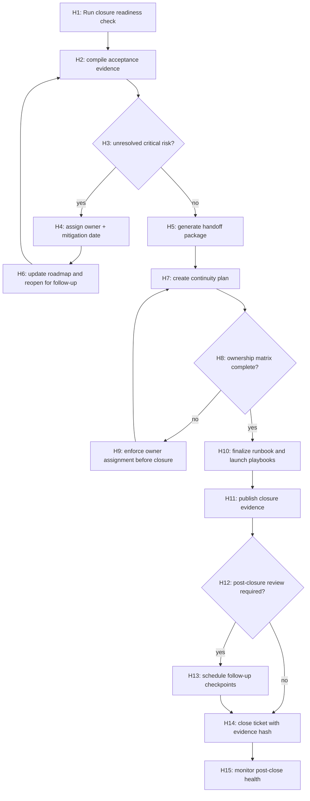

### 144.1 Graph constraints

- `H14` cannot occur with unresolved critical risk.
- `H9` and `H11` must include evidence artifacts.
- Follow-up schedule should include owner, date, and measurable milestone.

## 145) PRD Chunk-29: Finalization and Continuity Delivery

### 145.1 Purpose

Enable a deterministic end state with clear ownership and measurable continuity so optimization efforts remain sustainable after this release cycle.

### 145.2 Finalization requirements

- FR-01: final packaging includes full traceability from each PRD chunk to release evidence.
- FR-02: handoff artifacts include onboarding, troubleshooting, and escalation workflows.
- FR-03: every critical area has named owner and backup owner.
- FR-04: future roadmap has prioritized backlog and risk owners.
- FR-05: deprecation and compatibility commitments are documented for every legacy mode.
- FR-06: post-closure checkpoints are scheduled and owned.

### 145.3 Non-functional requirements

- NFR-01: no critical owner vacuums after closure.
- NFR-02: continuity documents are versioned and accessible.
- NFR-03: post-closure review can reconstruct status and decisions from evidence package.
- NFR-04: follow-up checkpoints remain observable and time-bound.

### 145.4 Delivery model

- Week 0:
  - generate closure package and finalize ownership.
- Week 1:
  - run handoff drills and finalize onboarding.
- Week 4:
  - first continuity checkpoint and unresolved risk review.

### 145.5 Acceptance criteria

- all modules have owners and measurable continuation plan.
- post-close review schedule established and logged.
- unresolved risks are tracked and prioritized.
- deprecation commitments communicated and accepted.

### 145.6 Deliverables

- `docs/finalization/closure-package.md`
- `docs/finalization/handoff-runbook.md`
- `docs/finalization/continuity-roadmap.md`
- `docs/finalization/post-close-checklist.md`
- `ci/follow-up-health-monitor.yaml`

## 146) Changelog

- v4.4 (2026-02-14): Added WBS Chunk-20, DAG Chunk-19, and PRD Chunk-29 for release closure, ownership handoff, continuity planning, and post-close governance.

This document remains open for future append operations and is intentionally modular.

## 139) WBS Chunk-19: Integration Harmonization and Agent Ecosystem Convergence

### 139.1 Objective

Integrate all previously defined optimization layers into a single, repeatable delivery program by harmonizing command surfaces, child-agent workflows, QA gates, enterprise controls, and rollout mechanisms.

### 139.2 Integration goals

- Reduce operational ambiguity across orchestrator, child agents, and governance controls.
- Prevent duplicate or conflicting controls across environments.
- Ensure all major behavior changes are tested, observable, and replayable.
- Codify a single evidence model for every release and incident package.

### 139.3 WBS-19 workstreams

- `IH-01` Cross-domain control unification
- `IH-02` Evidence and event schema harmonization
- `IH-03` Control-plane collision avoidance
- `IH-04` Cross-toolchain release readiness
- `IH-05` Incident-learning-to-fix execution
- `IH-06` Developer and operator onboarding compression

### 139.4 IH-01 Cross-domain control unification

- `INT-01` Command and control namespace map
  - owner: Platform
  - DoD:
    - `thegent` primary commands aligned across orchestrator and sub-agents.
    - overlapping commands de-duplicated or aliased with warnings.

- `INT-02` Error code harmonization
  - owner: Core Architecture
  - DoD:
    - single canonical family for retry/policy/resilience/security.
    - each error code has deterministic resolution hints.

- `INT-03` Status contract convergence
  - owner: Product
  - DoD:
    - unified state machine output fields across run/task/child-agent commands.
    - same `next_action` semantics across modules.

### 139.5 IH-02 Evidence and event harmonization

- `INT-04` Unified event envelope
  - owner: Observability
  - DoD:
    - one schema for `reason_code`, `actor`, `policy_id`, `evidence_id`.
    - event stream consumers can parse without module-specific branching.

- `INT-05` Evidence ID lifecycle
  - owner: Governance
  - DoD:
    - every critical decision emits evidence references.
    - evidence IDs survive retries, pauses, and replays.

- `INT-06` Trace stitching across systems
  - owner: SRE
  - DoD:
    - trace IDs link orchestrator runs, sub-agent evidence, and deployment events.
    - trace discontinuities are flagged automatically.

### 139.6 IH-03 Control-plane collision avoidance

- `INT-07` Priority and lock arbitration
  - owner: Runtime
  - DoD:
    - deterministic arbitration when conflicting control signals exist.
    - explicit winner/loser reason codes.

- `INT-08` Concurrent action serialization
  - owner: Platform
  - DoD:
    - deterministic handling of simultaneous operator actions for one run.
    - duplicate conflicting actions are denied or consolidated.

- `INT-09` Safe mode precedence matrix
  - owner: Security
  - DoD:
    - safety mode always supersedes optimization mode.
    - compatibility mode always respected when policy demands.

### 139.7 IH-04 Cross-toolchain release readiness

- `INT-10` Shared release manifest
  - owner: Release Engineering
  - DoD:
    - manifest includes orchestrator, CLI, QA, governance, and chaos readiness.
    - release blockers aggregated from all toolchains.

- `INT-11` Cross-toolchain dependency checks
  - owner: Platform
  - DoD:
    - release cannot proceed with missing toolchain dependency evidence.
    - dependency mismatch triggers explicit remediation branch.

- `INT-12` Deployment order graph
  - owner: SRE
  - DoD:
    - deterministic rollout sequence for core + sub-agent components.
    - rollback order explicitly recorded.

### 139.8 IH-05 Incident-learning-to-fix execution

- `INT-13` Learning harvest pipeline
  - owner: Operations
  - DoD:
    - incident root causes converted into backlog items automatically.
    - root-cause tags aligned to WBS and PRD sections.

- `INT-14` Fix validation and backtesting
  - owner: QA
  - DoD:
    - each new control change replayed against historical incidents.
    - no regression in related mitigation paths.

- `INT-15` Preventive control scorecard
  - owner: Reliability
  - DoD:
    - repeated incidents show measurable risk reduction.

### 139.9 IH-06 Onboarding compression

- `INT-16` Unified docs and command playbook
  - owner: Product Enablement
  - DoD:
    - one entrypoint map for deployment, diagnosis, and recovery.

- `INT-17` Scenario-based onboarding drills
  - owner: SRE Training
  - DoD:
    - onboarding drills executed on every major capability release.

- `INT-18` Advanced capability graduation gate
  - owner: Training
  - DoD:
    - users clear proficiency gate before enabling non-default modes.

### 139.10 Chunk-19 acceptance criteria

- all modules parse and emit coherent `next_action` and trace semantics.
- no duplicate control decisions under stress scenarios.
- release evidence is complete and queryable in one command.
- incident-learning backlog reduction shows measurable improvement across quarters.

## 140) DAG Chunk-18: Integration Convergence Control Graph

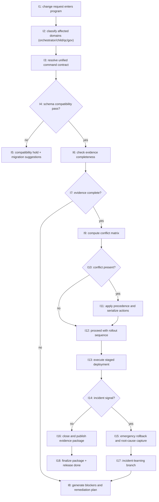

### 140.1 Graph semantics

- `I3` requires policy-version and command-version checks before progression.
- `I8` and `I15` both require actor/audit evidence.
- `I18` requires evidence package hash and retention policy.

## 141) PRD Chunk-28: Integrated Convergence and Program Delivery PRD

### 141.1 Purpose

Define a unified execution model that collapses fragmented optimization initiatives into one governed program with deterministic interoperability, single evidence pipeline, and clear operator pathways.

### 141.2 Functional requirements

- FR-01: unify command outputs and error semantics across all toolchains.
- FR-02: provide one trace and evidence model across orchestrator and child-agent activities.
- FR-03: prevent conflicting control decisions via precedence and serialization.
- FR-04: ensure release readiness includes cross-toolchain evidence gating.
- FR-05: convert incident outcomes into prioritized improvements with measurable effect.
- FR-06: provide advanced-mode capability only after onboarding proficiency.
- FR-07: maintain deterministic recovery and rollback behavior across module boundaries.

### 141.3 Non-functional requirements

- NFR-01: convergence-related control changes add minimal overhead.
- NFR-02: interoperability checks are automated and versioned.
- NFR-03: evidence packages are queryable and reproducible.
- NFR-04: incident-to-fix cycle remains within defined cadence.

### 141.4 Program architecture

- Unified manifest model:
  - commands, policies, and evidence share same identity model.
- Unified control graph:
  - conflict arbitration occurs before any side-effect.
- Unified release package:
  - includes QA, governance, rollout, and incident-readiness checks.

### 141.5 Delivery gates

- pre-merge:
  - integration controls + schema checks.
- pre-canary:
  - cross-toolchain simulation + resilience checks.
- pre-full:
  - production-like release simulation + governance sign-off.

### 141.6 Acceptance criteria

- no orphaned module behavior for major flows.
- evidence package contains reconciled traces across all modules.
- conflict resolution always deterministic and actor-logged.
- incident learning metrics improve over two successive cycles.

### 141.7 Deliverables

- `docs/program/integration-manifest.md`
- `docs/program/convergence-architecture.md`
- `thegent integration status` and `thegent integration trace`
- `tests/integration/convergence-suite/`
- `ci/integration-convergence-pipeline.yaml`

## 142) Changelog

- v4.3 (2026-02-14): Added WBS Chunk-19, DAG Chunk-18, and PRD Chunk-28 to unify command ecosystems, harmonize evidence flow, and package cross-toolchain integrated delivery.

This document remains open for future append operations and is intentionally modular.

## 135) WBS Chunk-18: Enterprise Maturity, Multi-Environment, and Strategic Hardening

### 135.1 Objective

Build the final enterprise maturity layer by integrating multi-environment policy consistency, strategic roadmap management, and long-horizon operational safety for sustained optimization quality.

### 135.2 Workstreams

- EM-01 Multi-environment consistency
- EM-02 Strategic roadmap and technical debt control
- EM-03 Long-horizon performance guardrails
- EM-04 Incident learning and preventive control
- EM-05 Platform interoperability and migration readiness

### 135.3 EM-01 Multi-environment consistency

- `ME-01` Environment policy alignment
  - owner: Platform
  - DoD:
    - production/dev/staging/devsecops policy profiles harmonized.
    - overrides are explicit and audited.

- `ME-02` Cross-environment rollout safety
  - owner: SRE
  - DoD:
    - same critical controls enabled by default in staging and pre-prod.
    - production-only features have explicit guardrails and approvals.

- `ME-03` Config sync and drift detection
  - owner: Platform
  - DoD:
    - periodic diff-based drift reports.
    - drift exceptions require approvals.

### 135.4 EM-02 Strategic roadmap

- `ME-04` Technical debt backlog and burn-down
  - owner: Product
  - DoD:
    - debt categories mapped to WBS/chunks.
    - monthly debt burn-down and acceptance criteria updates.

- `ME-05` Feature gate lifecycle
  - owner: Product + Platform
  - DoD:
    - feature lifecycle from experimental to stable documented.
    - sunset controls for deprecated paths.

- `ME-06` Strategic milestone governance
  - owner: Operations
  - DoD:
    - milestone gating tied to measurable outcomes.
    - each milestone has rollback and mitigation plan.

### 135.5 EM-03 Long-horizon performance

- `ME-07` Adaptive capacity budget by quarter
  - owner: FinOps
  - DoD:
    - quarter-level capacity plan tied to cost and load forecasts.

- `ME-08` Long-tail workload simulations
  - owner: SRE
  - DoD:
    - scheduled simulations for rare but high-impact workloads.

- `ME-09` Performance anti-regression governance
  - owner: QA
  - DoD:
    - historical trend thresholds and automatic anomaly alarms.

### 135.6 EM-04 Incident learning

- `ME-10` Incident-to-control feedback loop
  - owner: Operations
  - DoD:
    - lessons converted into policy changes or controls.
    - preventive controls measured for impact.

- `ME-11` Repeat-failure fingerprinting
  - owner: Reliability
  - DoD:
    - repeat signatures flagged automatically.
    - recurrent root causes have action plans.

- `ME-12` Control tuning from postmortems
  - owner: AI Ops
  - DoD:
    - control weights updated only after controlled validation.

### 135.7 EM-05 Interoperability and migration readiness

- `ME-13` Adapter and provider abstraction maturity
  - owner: AI Integration
  - DoD:
    - provider swaps tested under same policy envelope.
    - no lock-in through hardcoded behaviors.

- `ME-14` Migration runbook continuity
  - owner: Release Engineering
  - DoD:
    - migration path includes dry-runs and fallback rehearsals.

- `ME-15` Interop contract verification
  - owner: Platform
  - DoD:
    - adapter migration tests with deterministic expected outputs.

### 135.8 Acceptance criteria

- no environment drift outside approved policy windows.
- debt categories show declining trend over quarters.
- recurring incidents reduce through feedback-loop controls.
- migration and interoperability tests run on schedule.

## 136) DAG Chunk-17: Enterprise Maturity and Strategic Control Graph

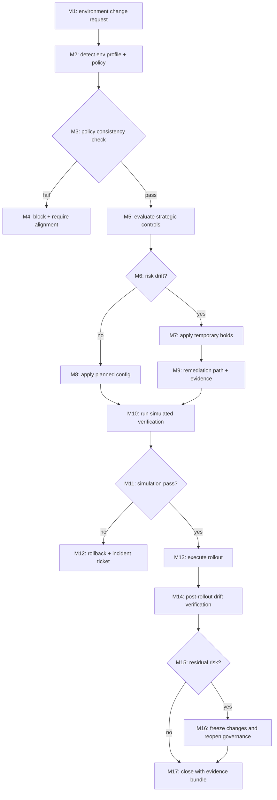

### 136.1 Graph semantics

- M4 and M12 require actor + environment rationale.
- M17 should always attach a governance and performance delta summary.

## 137) PRD Chunk-27: Strategic Enterprise Maturity and Multi-Environment Governance

### 137.1 Purpose

Define a durable operating model for sustained performance, safe scaling, and continuous improvement across environments and quarters.

### 137.2 Core requirements

- FR-01: align policies consistently across dev/staging/prod while honoring stricter production controls.
- FR-02: maintain drift detection for configuration and policy changes.
- FR-03: provide scheduled long-tail stress and anti-regression checks.
- FR-04: enforce migration and interoperability testing before environment transitions.
- FR-05: convert incident learnings into measurable preventive controls.
- FR-06: deliver strategic debt visibility tied to release priorities.

### 137.3 Delivery and operations

- cadence:
  - weekly control sync,
  - monthly resilience and migration simulation,
  - quarterly strategy review.
- governance:
  - policy review board with approved variance budget.

### 137.4 Acceptance criteria

- environment rollouts remain within risk and policy constraints.
- recurring incidents tied to actionable preventive updates.
- interoperability tests pass before major migration windows.
- evidence and governance summaries updated per cadence.

### 137.5 Deliverables

- `docs/enterprise/maturity-model.md`
- `docs/enterprise/env-governance.md`
- `docs/runbooks/multi-env-rollout.md`
- `docs/runbooks/incident-learning-loop.md`
- `ci/enterprise-maturity-gates.yaml`

## 138) Changelog

- v4.2 (2026-02-14): Added WBS Chunk-18, DAG Chunk-17, and PRD Chunk-27 for enterprise strategic maturity, multi-environment governance, and long-horizon prevention controls.

This document remains open for future append operations and is intentionally modular.

## 127) WBS Chunk-16: Governance Automation, Compliance, and Enterprise Trust

### 127.1 Objective

Turn operational discipline into machine-enforced governance by standardizing policy execution, compliance reporting, role-aware controls, and audit continuity from design through runtime.

### 127.2 Governance architecture layers

- GTC-01 Policy execution and enforcement
- GTC-02 Compliance mapping and evidence lifecycle
- GTC-03 Role and approval automation
- GTC-04 Audit continuity and retention controls
- GTC-05 Trust and resilience for model/tool drift

### 127.3 GTC-01 Policy execution and enforcement

- `GV-01` Policy decision service
  - owner: Governance
  - deliverables:
    - deterministic policy resolver with versioned policy packs
    - decision reason coding and override matrix
  - DoD:
    - `policy_denied` and `policy_override` both recorded with actor.
    - deterministic outcomes for same policy+input.

- `GV-02` Policy conflict and precedence matrix
  - owner: Platform
  - deliverables:
    - explicit precedence levels (`global`, `env`, `tenant`, `run`) with tie-breakers.
  - DoD:
    - policy ambiguity blocked before dispatch.
    - conflict alerts in under 2 seconds.

- `GV-03` Runtime policy circuit breaker
  - owner: Reliability
  - deliverables:
    - per-policy auto-disable on repeated violation windows
    - recovery and manual re-enable process.
  - DoD:
    - circuit transitions have actor evidence and duration.

### 127.4 GTC-02 Compliance mapping and evidence lifecycle

- `GV-04` Compliance framework mapping
  - owner: Compliance
  - deliverables:
    - map controls to SOC/ISO/enterprise controls.
  - DoD:
    - each control has test reference.
    - evidence evidence ID links to each control check.

- `GV-05` Evidence retention and legal hold
  - owner: Security
  - deliverables:
    - configurable retention by sensitivity and policy domain.
  - DoD:
    - legal-hold operations prevent deletion.
    - expired data automatically archived or purged by policy.

- `GV-06` Compliance artifact exports
  - owner: Governance
  - deliverables:
    - export bundles for audit windows.
  - DoD:
    - single-click evidence pack for incident or audit.

### 127.5 GTC-03 Role and approval automation

- `GV-07` Role graph and command scopes
  - owner: Security
  - deliverables:
    - command-level RBAC/ABAC matrix.
  - DoD:
    - destructive commands blocked without explicit authority.

- `GV-08` Dual-control for sensitive operations
  - owner: Security + Governance
  - deliverables:
    - two-party approve flow for critical toggles.
  - DoD:
    - approval chain stored in immutable event stream.

- `GV-09` Session and delegation governance
  - owner: Platform
  - deliverables:
    - delegated actor with expiration and scope.
  - DoD:
    - delegated actions expire without silent extension.

### 127.6 GTC-04 Audit continuity and retention controls

- `GV-10` Audit event integrity
  - owner: Platform
  - deliverables:
    - immutable event signatures and checksums for high-risk actions.
  - DoD:
    - tamper attempts logged and alerted.

- `GV-11` Time-aligned immutable ledger
  - owner: Reliability
  - deliverables:
    - chronological hash-chain for selected streams.
  - DoD:
    - audit reconstruction succeeds from first to last event.

- `GV-12` Cross-domain audit reconciliation
  - owner: Compliance
  - deliverables:
    - compare operator actions against policy approvals and evidence.
  - DoD:
    - reconciliation reports produced weekly.

### 127.7 GTC-05 Trust and drift

- `GV-13` Adapter/tool trust scoring
  - owner: AI Ops
  - deliverables:
    - trust score updated by failures, quality, and policy incidents.
  - DoD:
    - trust drops automatically influence routing.

- `GV-14` Policy-aware fallback for low trust
  - owner: Planner
  - deliverables:
    - automatic fallback path when trust under threshold.
  - DoD:
    - fallback decision includes reason and actor.

- `GV-15` Model/tool drift monitor
  - owner: ML/AI
  - deliverables:
    - periodic drift checks and remediation tasks.
  - DoD:
    - degradation triggers review and optional hold for critical profiles.

### 127.8 Chunk-16 acceptance criteria

- governance decisions are replayable and verifiable.
- sensitive operations always have explicit policy and actor trace.
- compliance controls are mapped and tested per cycle.
- drift and trust signals reduce routing risk and are observable.

## 128) DAG Chunk-15: Governance and Compliance Enforcement Graph

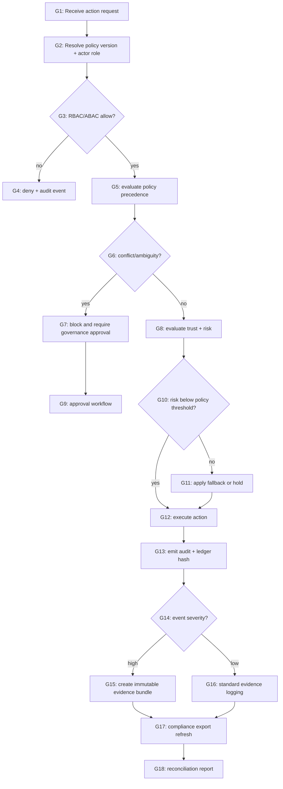

### 128.1 Graph invariants

- Any denied action must include reason and policy reference.
- Any high-risk action must require approval and evidence bundle generation.
- Reconciliation requires immutable event and action link.

### 128.2 Failure response

- If policy conflict cannot resolve quickly, default is hold.
- If approval times out, action returns to operator with explicit remediation.
- If audit write fails, dispatch is blocked until audit path is restored.

## 129) PRD Chunk-25: Compliance-Grade Governance and Trust Controls

### 129.1 Purpose

Increase confidence for enterprise use by formalizing governance workflows, compliance mapping, trust scoring, and evidence continuity as core product behavior instead of optional process steps.

### 129.2 Functional requirements

- FR-01: all policy decisions must be versioned and replayable.
- FR-02: all denied, overridden, or fallback actions require reason code.
- FR-03: dual-control for critical operations with traceable approvals.
- FR-04: all sensitive events create evidence package with actor + actor context.
- FR-05: compliance exports should include policy mapping and evidence IDs.
- FR-06: trust scores must influence routing and fallback behavior.
- FR-07: reconciliation checks run continuously on major risk classes.

### 129.3 Non-functional requirements

- NFR-01: audit writes must be non-blocking when possible, fail-closed when required.
- NFR-02: evidence bundles for incidents produce within bounded time.
- NFR-03: policy checks complete within deterministic latency bounds.
- NFR-04: retention actions must be auditable and reversible under legal holds.

### 129.4 Governance UX and operations

- compliance dashboard:
  - shows unresolved approvals, conflicts, and stale holds.
- approvals:
  - one-click guided flow for multi-party approval with expiration.
- evidence:
  - run-level and control-level bundles available by command.

### 129.5 Acceptance criteria

- 100% of critical operations include actor, reason, policy, and evidence ID.
- compliance mapping includes at least one direct audit artifact per control class.
- trust scores are reduced and routed safely under repeated degradation.
- reconciliation gaps are reduced below defined threshold by cadence.

### 129.6 Deliverables

- docs:
  - `docs/governance/policy-versioning.md`
  - `docs/governance/compliance-map.md`
  - `docs/runbooks/dual-control.md`
- interfaces:
  - `thegent governance status`
  - `thegent governance review`
  - `thegent compliance export`
- tests:
  - policy conflict tests
  - dual-approval flow tests
  - audit/replay integrity tests

## 130) Changelog

- v4.0 (2026-02-14): Added WBS Chunk-16, DAG Chunk-15, and PRD Chunk-25 for governance automation, compliance traceability, trust scoring, and enterprise audit readiness.

This document remains open for future append operations and is intentionally modular.

## 123) WBS Chunk-15: Observability-First Delivery and Evidence-Completeness

### 123.1 Objective

Ensure every critical orchestration transition, optimization decision, and override action is observable, reproducible, and defensible, so teams can operate with high confidence and low manual triage.

### 123.2 Observability and evidence workstreams

- WOB-01 Signal coverage completion
- WOB-02 Metric quality and correctness
- WOB-03 Incident evidence packaging
- WOB-04 Data quality and retention controls
- WOB-05 Operator analytics and usability

### 123.3 WOB-01 Signal coverage completion

- `OBS-01` Define required control-signal schema
  - owner: Observability
  - DoD:
    - all command and scheduler transitions emit reason code, actor, latency, and correlation id
    - event payload includes deterministic fields and versioned schema

- `OBS-02` Run-level evidence completeness
  - owner: SRE
  - DoD:
    - each run has complete artifact bundle (state, commands, overrides, and route decisions)
    - runs can be reconstructed for replay from retained evidence

- `OBS-03` Forecastable health score
  - owner: Product
  - DoD:
    - run-level health score derivation documented
    - health score threshold maps to action severity levels

### 123.4 WOB-02 Metric quality and correctness

- `OBS-04` Metric naming and units contract
  - owner: Observability
  - DoD:
    - consistent naming conventions across runtimes
    - documented units and expected range

- `OBS-05` Metric accuracy validation
  - owner: QA
  - DoD:
    - synthetic tests verify count consistency
    - alert thresholds evaluated in false-positive/false-negative tests

- `OBS-06` Dashboard semantic versioning
  - owner: Product Ops
  - DoD:
    - dashboard definitions are versioned
    - backward compatibility preserved for recurring consumers

### 123.5 WOB-03 Incident evidence packaging

- `OBS-07` Auto-incident packer
  - owner: SRE
  - DoD:
    - severity-based evidence packs generated automatically
    - packer includes command trail and state deltas

- `OBS-08` Evidence reproducibility checks
  - owner: Reliability
  - DoD:
    - same cause yields same baseline evidence order
    - random sampling does not remove required proof fields

- `OBS-09` Postmortem template and root-cause binding
  - owner: Operations
  - DoD:
    - template has sectioned evidence references
    - actions linked to evidence IDs and owners

### 123.6 WOB-04 Data quality and retention

- `OBS-10` Retention-class policy
  - owner: Governance
  - DoD:
    - class-specific TTL with compliance matrix
    - secure archival and expiration proof

- `OBS-11` Redaction and sanitization assurance
  - owner: Security
  - DoD:
    - redaction tested for known sensitive patterns
    - validation logs capture redaction success/fail counts

- `OBS-12` Storage footprint governance
  - owner: Platform
  - DoD:
    - compact event strategy in non-critical environments
    - audit-critical data preserved with stronger retention

### 123.7 WOB-05 Operator analytics and usability

- `OBS-13` Command clarity metrics
  - owner: UX
  - DoD:
    - track repeated operator clarifications and help requests
    - identify ambiguous states above threshold

- `OBS-14` Recovery time analytics
  - owner: SRE
  - DoD:
    - T+5, T+15, T+30 recovery metrics collected and graphed
    - repeated misses trigger UX review

- `OBS-15` Optimization confidence telemetry
  - owner: Product
  - DoD:
    - confidence score tied to chosen action
    - confidence degradation triggers retraining/review mode

### 123.8 Chunk-15 acceptance criteria

- evidence completeness and replayability for all high-risk branches
- metric schema coverage for >95% of events
- operator-facing commands include required next action and evidence hints
- postmortem pipeline can generate reports from standardized evidence IDs

## 124) DAG Chunk-14: Evidence-Driven Operations and Alerting Graph

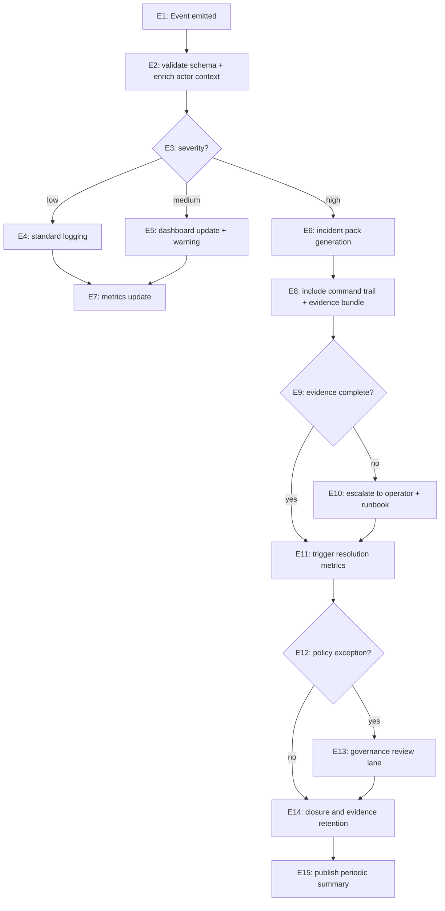

### 124.1 Graph constraints

- all severities must include reason code and actor metadata.
- any branch to `E10` must auto-generate an incident pack.
- `E15` cannot run until evidence is checksum-verified.

## 125) PRD Chunk-24: Observability, Evidence, and Recovery Analytics PRD

### 125.1 Purpose

Turn operations telemetry into a complete, reliable, operator-ready system that reduces investigation time and creates defensible evidence without overloading teams with noise.

### 125.2 Functional requirements

- FR-01: every state transition and control action emits structured telemetry.
- FR-02: dashboard reflects route confidence, reason codes, and critical path risk.
- FR-03: automatic incident evidence pack builds are generated for high-severity events.
- FR-04: evidence packs must support replay and postmortem traceability.
- FR-05: metrics and dashboards include retention + compliance visibility.
- FR-06: operators can request evidence by run/task and get deterministic output.
- FR-07: analytics identifies ambiguous states and recommends UX adjustments.

### 125.3 Non-functional requirements

- NFR-01: evidence generation adds minimal overhead to critical path.
- NFR-02: alerting has defined false-positive and false-negative budgets.
- NFR-03: redaction and privacy controls remain effective under heavy logging.
- NFR-04: dashboards stay available with partial data failures and degrade gracefully.

### 125.4 Analytics and UX outputs

- run health view:
  - status trend, next action confidence, retry health.
- operator view:
  - top blockers and action recommendations with evidence links.
- executive view:
  - incident counts, MTTR trend, cost-aware reliability summary.

### 125.5 Acceptance criteria

- evidence packs automatically generated for critical incidents.
- alert-to-evidence latency is bounded and reproducible.
- ambiguous states measured and reduced by one UX iteration.
- postmortem generation from stored evidence is deterministic.

### 125.6 Deliverables

- observability schema docs and dashboards.
- `thegent evidence bundle`, `thegent evidence verify`.
- incident packer scripts and retention policies.
- analytics templates and operator telemetry scorecards.

## 126) Changelog

- v3.9 (2026-02-14): Added WBS Chunk-15, DAG Chunk-14, and PRD Chunk-24 for evidence completeness, observability-driven operations, and recovery analytics.

This document remains open for future append operations and is intentionally modular.

## 119) WBS Chunk-14: Enterprise-Scale Performance and Cost Governance

### 119.1 Objective

Deliver enterprise-grade scale by combining capacity planning, multi-tenancy safety, cost governance, and deterministic control loops that keep optimization stable as run volume, task width, and policy complexity increase.

### 119.2 Scale dimensions

- Volume:
  - concurrent runs per environment
  - average tasks per run
  - peak burst windows
- Topology:
  - number of active agents
  - DAG size distribution
  - cross-environment handoffs
- Cost and policy complexity:
  - adapter invocation mix
  - policy override rate
  - retry budget pressure

### 119.3 Workstream W14-01: Capacity and queue scaling

- `ES-01` Multi-queue isolation
  - owner: Platform Reliability
  - DoD:
    - dedicated queues for critical/standard/bulk
    - starvation prevention under high load
    - enforced minimum throughput for critical queue

- `ES-02` Global concurrency governor v2
  - owner: Runtime
  - DoD:
    - per-env and per-profile concurrency ceilings
    - rolling reduction under failure bursts
    - explicit override threshold logging

- `ES-03` Distributed frontier checkpointing
  - owner: Platform
  - DoD:
    - checkpoint frequency adapts to run pressure
    - replay on crash remains idempotent
    - checkpoint bloat controls activated automatically

### 119.4 Workstream W14-02: Multi-tenancy and isolation

- `ES-04` Tenant identity and control partitions
  - owner: Security
  - DoD:
    - run partitioning by owner/team
    - tenant-specific quotas and caps
    - control-plane actions scoped by tenant identity

- `ES-05` Data and metadata isolation
  - owner: Platform
  - DoD:
    - tenant-separated event namespaces
    - retention policies respect tenant class
    - no cross-tenant evidence leakage

- `ES-06` Fairness and quota enforcement
  - owner: SRE
  - DoD:
    - no tenant can exhaust shared concurrency
    - fairness metrics include blocked and stall ratio
    - fairness exceptions require governance override

### 119.5 Workstream W14-03: Cost and resource governance

- `ES-07` Cost attribution model
  - owner: FinOps
  - DoD:
    - cost center tags per run/task
    - cost per profile and adapter profile tracked
    - monthly summary exported and reviewable

- `ES-08` Resource burn-rate alarms
  - owner: Observability
  - DoD:
    - budget burn alarms for tokens, retries, and queue latency
    - auto throttle thresholds with evidence logging

- `ES-09` Economics-driven routing guardrails
  - owner: Platform Architecture
  - DoD:
    - cost ceilings influence route scores in risk-safe mode
    - explicit override required to exceed budget cap

### 119.6 Workstream W14-04: Reliability at scale

- `ES-10` Fleet health and lag observability
  - owner: SRE
  - DoD:
    - global lag and frontier staleness tracked
    - cross-region and cross-worker baselines visible

- `ES-11` Regional failover simulation and drills
  - owner: Reliability
  - DoD:
    - regular failover simulations at load
    - continuity actions complete within target windows

- `ES-12` Long-tail failure recovery for rare paths
  - owner: QA
  - DoD:
    - rare-path failure map retained and regression-tested
    - recovery scripts for seldom-used modes documented

### 119.7 Chunk-14 acceptance criteria

- critical queue latency remains stable under documented burst.
- no tenant starvation under heavy mixed profile usage.
- cost governance events generated for every override/cap breach.
- distributed checkpoint/replay remains deterministic.
- failover drills complete with documented post-action evidence.

## 120) DAG Chunk-13: Multi-Scale Enterprise Control Graph

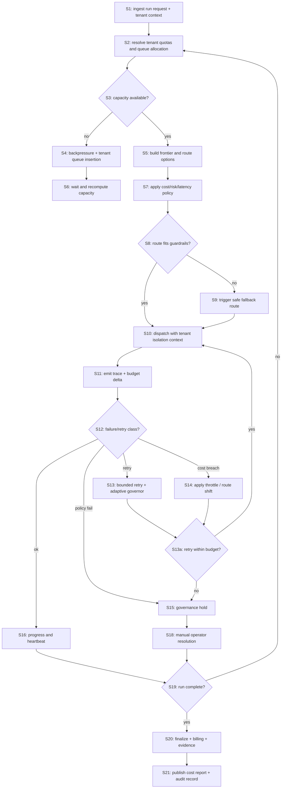

### 120.1 Graph behavior notes

- `S2` must check tenant quotas before any dispatch.
- `S7` must emit score decomposition when route is denied.
- `S20` must always include tenant attribution in audit and cost records.

## 121) PRD Chunk-23: Enterprise Scaling, Cost Governance, and Tenant Safety

### 121.1 Problem statement

As usage grows, optimization quality must remain bounded by fairness, budget, and tenant safety. This chunk defines the enterprise operating model to prevent runaway cost, cross-tenant interference, and control-plane fragility under sustained scale.

### 121.2 Scope

- multi-tenant quotas and queue isolation,
- cost-aware optimization and burn-rate governance,
- failover and scale-induced reliability controls,
- deterministic enterprise reporting and governance artifacts.

### 121.3 Functional requirements

- FR-01: enforce tenant-aware quotas and fairness.
- FR-02: allocate critical/standard/bulk lanes with guaranteed critical floor.
- FR-03: compute and emit cost telemetry per run and per tenant.
- FR-04: provide cost/risk-aware routing decisions and explicit score reasons.
- FR-05: throttle or reroute when resource burn crosses thresholds.
- FR-06: produce deterministic post-run cost and control reports.
- FR-07: scale-related failover and resume events are always trace-linked.

### 121.4 Non-functional requirements

- NFR-01: critical lane starvation below defined SLO under heavy load.
- NFR-02: capacity adaptation response within predefined control window.
- NFR-03: all multi-tenant controls deterministic and auditable.
- NFR-04: governance metrics available to operator and compliance review.

### 121.5 Operational model

- Capacity:
  - burst windows are handled with adaptive backpressure and bounded queue age.
- Cost:
  - route score includes cost penalty in safe modes.
- Fault:
  - failover and checkpoint recovery are tested monthly.
- Governance:
  - periodic cost review and tenant fairness review reports required.

### 121.6 Acceptance criteria

- tenant quotas and critical fairness guarantees verified in stress tests.
- cost overrun events are caught before runaway and produce throttle/review branches.
- all runs include tenant attribution in final report.
- enterprise scale drill evidence includes at least one tenant collision scenario.

### 121.7 Deliverables

- config:
  - `enterprise_scales.yaml`
  - `tenant_quotas.yaml`
  - `cost_guardrails.yaml`
- commands:
  - `thegent tenant status`
  - `thegent enterprise report`
  - `thegent scale drill`
- docs:
  - `docs/enterprise/tenant-safety.md`
  - `docs/enterprise/cost-governance.md`
  - `docs/runbooks/scale-failover.md`

## 122) Changelog

- v3.8 (2026-02-14): Added WBS Chunk-14, DAG Chunk-13, and PRD Chunk-23 for enterprise-scale capacity isolation, tenant safety, cost governance, and deterministic scaling controls.

This document remains open for future append operations and is intentionally modular.

## 115) WBS Chunk-13: API and Tooling Surface Refinement for Practical Deployment

### 115.1 Objective

Refine the control APIs and CLI ergonomics so engineering, operations, and governance teams can manipulate optimization behavior safely at scale, with predictable results and lower cognitive load.

### 115.2 Workstream A: Control API design

- `API-01` Standardize command IDs and IDs lifecycle
  - owner: Platform
  - scope:
    - define deterministic command ID generation for pause/resume/requeue/rollback.
    - include idempotency tokens for potentially repeated operator actions.
  - DoD:
    - repeated command calls with same idempotency token do not duplicate actions.
    - command IDs resolve to single actor+run trail.

- `API-02` Build schema-driven response contract
  - owner: Platform
  - scope:
    - explicit JSON output schema with machine fields for `state`, `next_action`, `risk`, `confidence`, and `next_recommendation`.
  - DoD:
    - command responses are stable under parser strictness.
    - docs and tests for both compact/human modes.

- `API-03` Add planning simulation endpoint
  - owner: Planner
  - scope:
    - preflight route simulation before execution.
    - returns candidate routes and estimated budgets.
  - DoD:
    - deterministic simulation for same seed+inputs.
    - simulation includes fallback and retry boundaries.

### 115.3 Workstream B: Runtime tools and sub-agent wiring

- `TOOL-01` Expand CLI tool registry introspection
  - owner: Runtime
  - DoD:
    - unified command `thegent tools` enumerates supported tool families.
    - unsupported tool requests fail fast with structured reason.

- `TOOL-02` Adapter contract compliance checker
  - owner: AI Integration
  - DoD:
    - every tool adapter validated against canonical contract.
    - CI blocks unvalidated adapter changes.

- `TOOL-03` Tool execution envelope metadata
  - owner: AI Integration + SRE
  - DoD:
    - per invocation metadata includes budget, latency, and output profile.
    - all metadata emitted as trace-friendly events.

### 115.4 Workstream C: Developer and operator workflow polish

- `WFL-01` Single-command diagnostics
  - owner: UX
  - DoD:
    - `thegent diagnose run <id>` prints top 5 blockers and 3 recommended actions.
    - optional deep trace mode for debugging.

- `WFL-02` Task-level “explainability” command
  - owner: Product
  - DoD:
    - explain route for any task in a single call.
    - include why alternative routes were not chosen.

- `WFL-03` Guided recovery command set
  - owner: SRE
  - DoD:
    - `thegent recover` auto-selects recovery path and confirms operator.
    - manual override path remains explicit.

### 115.5 Workstream D: Security and safe-by-default defaults

- `SAFE-01` Default deny for unscoped external tool calls
  - owner: Security
  - DoD:
    - explicit allowlist required outside safe mode.
    - no unbounded external tool expansion.

- `SAFE-02` Scope-bound credential handling
  - owner: Security
  - DoD:
    - no credentials written in event trace.
    - redaction verified by acceptance tests.

- `SAFE-03` Least privilege for orchestration controls
  - owner: Security
  - DoD:
    - RBAC checks in every destructive control path.
    - unauthorized operations are rejected with audit record.

### 115.6 Workstream E: API and config governance

- `GOV-01` Config versioning and migration
  - owner: Platform
  - DoD:
    - every config includes version and migration notes.
    - incompatible changes require explicit migration mode.

- `GOV-02` Policy validation pipeline
  - owner: Governance
  - DoD:
    - policy updates linted and tested before activation.
    - forbidden combos automatically rejected.

- `GOV-03` Rollback contract for policy/config changes
  - owner: Operations
  - DoD:
    - every change has one-step rollback command.
    - rollback leaves run-state explainability intact.

### 115.7 Chunk-13 acceptance criteria

- all API commands have stable schema docs and examples.
- non-breaking behavior by default for non-optimization modes.
- unsafe operations require explicit confirmation and actor.
- simulation and explainability paths return deterministic artifacts.

## 116) DAG Chunk-12: API Safety and Deployment Control Graph

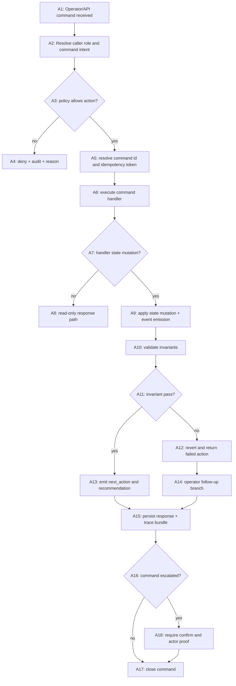

### 116.1 Graph semantics

- All command mutations should have explicit actor proof.
- `A11` failures must include reason code and rollback evidence.
- `A14` should be trace-linked to the original decision point.

### 116.2 Control-plane safeguards

- Read-only mode disables mutation branch.
- Mutation retries are bounded and deduplicated by command ID.
- Unsafe command classes require explicit confirmation token.

## 117) PRD Chunk-22: Practical API-First Optimization UX and Safe Controls

### 117.1 Problem statement

The platform has gained advanced behavior but still needs API-first ergonomics so teams can operate confidently at scale; this chunk specifies safe, practical command-level controls and explainability workflows.

### 117.2 Scope

- scope includes:
  - command APIs, schema contracts, explainability, safe rollback controls, and recovery operators.
- out-of-scope:
  - deep model behavior tuning and external provider pricing negotiations.

### 117.3 Functional requirements

- FR-01: all orchestration commands expose deterministic schemas with `next_action`.
- FR-02: command IDs are first-class and idempotent where appropriate.
- FR-03: simulation mode provides route proposal and budget projections before execution.
- FR-04: explainability view can justify why specific route/fallback/retry decisions were chosen.
- FR-05: destructive operations require explicit confirmation and actor identity.
- FR-06: rollback and compatibility transitions are auditable and scriptable.
- FR-07: safe default mode blocks unsafe operations unless explicitly enabled.

### 117.4 User experience requirements

- UX-01: operator gets concise summary by default.
- UX-02: advanced details require explicit `--json`/`--trace` mode.
- UX-03: every non-terminal run state includes clear next step in plain language.
- UX-04: recovery path suggests the safest next action with explicit risk.

### 117.5 Non-functional requirements

- NFR-01: schema validation rejects malformed commands before touching state.
- NFR-02: command execution under normal load adds < 5% overhead.
- NFR-03: all control actions are replayable from trace IDs and idempotency tokens.
- NFR-04: safe-mode and governance-mode are not opt-out under restricted environments.

### 117.6 API artifact deliverables

- `thegent cmd` command group with:
  - `status`, `diagnose`, `explain`, `simulate`, `recover`, `rollback`.
- config docs and schema files.
- endpoint and CLI contract tests.
- operator onboarding guide for safe controls.

### 117.7 Acceptance criteria

- no action can mutate state without explicit validation path.
- explanation path returns deterministic reasons.
- rollout from safe mode to compatibility or optimized mode requires governance approval.
- all destructive actions carry actor-proof and approval context.

### 117.8 Chunk-22 deliverables

- stable API contracts, schema docs, and command outputs.
- command-level end-to-end tests for mutation + rollback + deny paths.
- explainability artifacts for routing/fallback/retry branches.

## 118) Changelog

- v3.7 (2026-02-14): Added WBS Chunk-13, DAG Chunk-12, and PRD Chunk-22 for API/tooling ergonomics, safe command controls, explainability, and governance-aligned deployment pathways.

This document remains open for future append operations and is intentionally modular.

## 107) WBS Chunk-11: End-to-End Validation, Migration, and Release Packaging

### 107.1 Objective

Create a practical bridge from planning chunks to ship-ready delivery by hardening release controls, migration playbooks, evidence pipelines, and long-horizon maintenance behavior without introducing accidental complexity.

### 107.2 Delivery workstreams

- WPR-01 Release packaging baseline
- WPR-02 Schema and API migration controls
- WPR-03 Evidence and traceability hardening
- WPR-04 Governance and training refreshes
- WPR-05 Long-tail maintenance and debt reduction

### 107.3 WPR-01 Release packaging

- `R01` Create release manifest schema
  - owner: Release Engineering
  - DoD:
    - includes chunk-to-chunk trace matrix
    - includes acceptance evidence links
    - includes rollback and compatibility checks

- `R02` Generate release artifact bundle
  - owner: Release Engineering + Docs
  - DoD:
    - artifacts contain WBS, DAG, PRD, and evidence references
    - manifest has immutable hash and generation timestamp
    - deployment note summarizes compatibility behavior changes

- `R03` Build release-readiness checker
  - owner: QA
  - DoD:
    - fails if any required section lacks owner or evidence
    - reports unresolved risk with explicit remediation

### 107.4 WPR-02 Schema and migration controls

- `R04` Migration policy matrix
  - owner: Platform
  - DoD:
    - states required actions for `legacy`, `hybrid`, `orchestrated`
    - defines allowed rollback windows and freeze points

- `R05` Compatibility suite expansion
  - owner: Product + QA
  - DoD:
    - all stable command outputs preserved
    - compatibility mode can process at least one non-trivial existing workflow
    - all changed API fields are versioned

- `R06` Migration dry-run gate
  - owner: Platform
  - DoD:
    - detects migration blockers before live cutover
    - prints explicit conversion plan and risk hints

### 107.5 WPR-03 Evidence and traceability hardening

- `R07` Evidence registry
  - owner: Observability
  - DoD:
    - each chunk has evidence references with pass/fail state
    - stale evidence removed by retention policy

- `R08` Deterministic trace replay
  - owner: Reliability
  - DoD:
    - replay reproduces same major branch and decisions
    - evidence can reproduce run graph and command outputs

- `R09` Audit and governance export
  - owner: Security
  - DoD:
    - export supports investigation and postmortem
    - includes actor, reason, branch, and timestamp for all overrides

### 107.6 WPR-04 Governance and enablement

- `R10` Quarterly governance refresh cadence
  - owner: Operations
  - DoD:
    - policy revisions logged and approved.
    - stale exceptions auto-annotated with renewal date.

- `R11` Operator refresher drills
  - owner: SRE Training
  - DoD:
    - drills cover restart, override, migration, rollback
    - runbook accuracy tested after every major change

- `R12` Policy and error taxonomy upkeep
  - owner: Product + Security
  - DoD:
    - obsolete error classes removed or archived
    - no unresolved duplicated taxonomy entries

### 107.7 WPR-05 Maintenance and debt controls

- `R13` Post-release cleanup pipeline
  - owner: Platform
  - DoD:
    - dead branches pruned
    - temporary flags removed after migration maturity

- `R14` Long-tail regression monitor
  - owner: QA
  - DoD:
    - monthly regression matrix for edge case drift
    - performance guardrails for infrequent pathways

- `R15` Dependency hygiene process
  - owner: Engineering
  - DoD:
    - pinned versions where needed
    - deprecation warnings addressed with date-backed action

### 107.8 Chunk-11 acceptance criteria

- release package generation must be deterministic.
- no chunk proceeds to done without traceable evidence references.
- migration blockers are explicit and block release automatically.
- governance and training controls stay current with evidence and cadence.

## 108) DAG Chunk-10: Release and Migration Control Graph

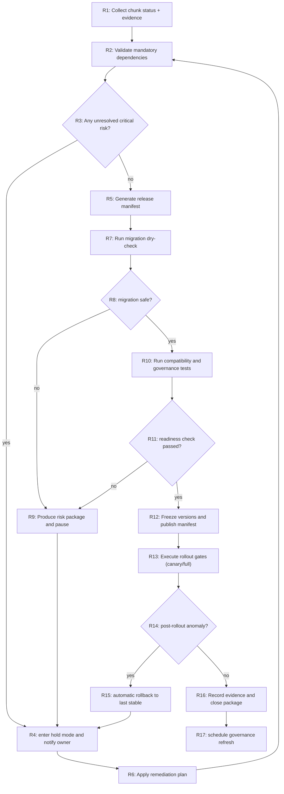

### 108.1 Graph semantics

- `R9` and `R4` must include explicit actor identity and timestamp.
- `R13` requires evidence bundle and migration dry-check pass.
- `R16` is non-optional before closure.

## 109) PRD Chunk-20: Integrated Rollout, Migration, and Long-term Maturity PRD

### 109.1 Scope

Define end-to-end productionizing rules for thegenter’s optimization platform, from first-canary release through operational maturity and recurring governance refresh.

### 109.2 Core outcomes

- safe cutovers between compatibility and advanced modes,
- deterministic release packaging and rollback,
- verifiable evidence pipelines for auditability,
- practical operator controls that remain easy to execute.

### 109.3 Functional requirements

- FR-01: release mode must not close the system without verifiable evidence.
- FR-02: incompatible changes require explicit migration plan and dry-check.
- FR-03: every rollout action must have an actor and timestamp.
- FR-04: rollback to last stable mode is one command path with defined constraints.
- FR-05: post-release governance review is mandatory after any major policy change.
- FR-06: long-tail scenarios should have at least monthly regression visibility.
- FR-07: evidence bundles must include child-agent and execution provenance if enabled.

### 109.4 Non-functional requirements

- NFR-01: release artifacts generated within bounded build latency.
- NFR-02: migration dry-runs should complete without mutating production state.
- NFR-03: every rollout gate has documented acceptance thresholds.
- NFR-04: compatibility handling remains default-safe if evidence is incomplete.

### 109.5 Deployment cadence model

- week 0:
  - readiness package checks and migration dry-check.
- week 1:
  - canary with constrained lanes.
- week 2:
  - limited full rollout in approved environments.
- week 3:
  - full enablement after policy and evidence clearance.
- recurring:
  - monthly governance refresh and drift audit.

### 109.6 Risks and mitigations

- migration blockers discovered late:
  - early migration dry-check and early warning thresholds.
- governance drift:
  - mandatory refresh cadence and ownership matrix.
- evidence debt:
  - evidence expiration alerts and debt burn-down goals.
- confidence decay:
 - periodic confidence recalibration using historical branch outcomes.

### 109.7 Acceptance criteria

- release cannot progress from hold to canary without evidence bundle.
- migration dry-run fails if blockers are unmitigated.
- rollback command executes within documented constraints in failure drills.
- post-release review logs are complete and traceable.

### 109.8 Deliverables

- `docs/release/release-manifest.md`
- `docs/release/migration-dryrun.md`
- `docs/release/rollback-runbook.md`
- `docs/governance/review-cadence.md`
- `tests/release/package_and_rollout/`

## 110) Changelog

- v3.5 (2026-02-14): Added WBS Chunk-11, DAG Chunk-10, and PRD Chunk-20 to standardize release packaging, migration controls, and long-term maturity operations.

This document remains open for future append operations and is intentionally modular.

## 103) WBS Chunk-10: Operational Excellence, Performance Budgets, and Human-First Controls

### 103.1 Objective

Strengthen the system for production at scale by combining hard performance guardrails, robust recovery behavior, and highly practical operator-facing controls that reduce runbook burden and operator uncertainty.

### 103.2 Workstream and tickets

- WBS-PE-01 Throughput baseline and headroom planning
  - establish P95/P99 baselines per run profile.
  - maintain a per-shard utilization budget.
  - track backlog-to-dispatch latency and completion half-life.

- WBS-PE-02 Queue discipline and starvation prevention
  - enforce weighted queueing with minimum guaranteed lane reservations.
  - add strict aging floor and anti-starvation check.
  - audit queue reorder events with deterministic seeds.

- WBS-PE-03 Adaptive burst smoothing
  - add global + lane-level token bucket gates.
  - degrade gracefully under spike using bounded defer, not hard abort.
  - apply jittered release to avoid synchronized wakeups.

- WBS-PE-04 Deterministic recovery windows
  - predefine recovery budget windows for transient failures.
  - avoid over-aggressive retries during startup recovery.
  - add cool-down and lockout for repeated panic signatures.

- WBS-PE-05 Human-first command outputs
  - shorten top-level statuses to one-line intent + next step.
  - provide explicit "why now" with each next_action.
  - add machine JSON + human compact modes.

- WBS-PE-06 Incident playbook hardening
  - embed expected actor, timeline, and action in each severe branch.
  - standardize drill scripts for high/medium/low severity paths.
  - ensure evidence auto-bundles every high-severity branch.

- WBS-PE-07 Cost and carbon-aware scheduling
  - define task class-to-cost mapping with policy overrides.
  - bias schedules toward lower energy/compute profiles when equivalent.
  - track score deltas for each override in audit log.

- WBS-PE-08 Policy and governance automation
  - codify mandatory controls for risky operations.
  - add preflight and postflight checks for compatibility toggles.
  - auto-raise if governance checks are bypassed or stale.

### 103.3 Dependency chain

- Foundation:
  - `WBS-PE-01` and `WBS-PE-02` unlock rest.
- Throughput:
  - `WBS-PE-03` depends on stable headroom and queueing.
- Reliability:
  - `WBS-PE-04` depends on queue and burst controls.
- Human factors:
  - `WBS-PE-05` and `WBS-PE-06` may run parallel after `WBS-PE-04`.
- Governance:
  - `WBS-PE-08` gates release of `WBS-PE-07` and policy-sensitive paths.

### 103.4 Acceptance gates for chunk-10

- Backlog delay improvement under sustained heavy load is measurable.
- No lane starvation in synthetic fairness test.
- Recovery windows avoid duplicate attempts after interruption.
- User-visible commands provide immediate clear next action with confidence and risk.
- Incident bundle completeness reaches 100% in full-drill simulation.

### 103.5 Chunk-10 evidence requirements

- benchmark runs in `bench/perf/` with before/after baselines.
- fairness logs from queueing and scheduling.
- incident drill logs and operator action traces.
- command snapshots from 3 operator cohorts for usability checks.

## 104) DAG Chunk-09: Human-Centered Recovery and Performance Control Graph

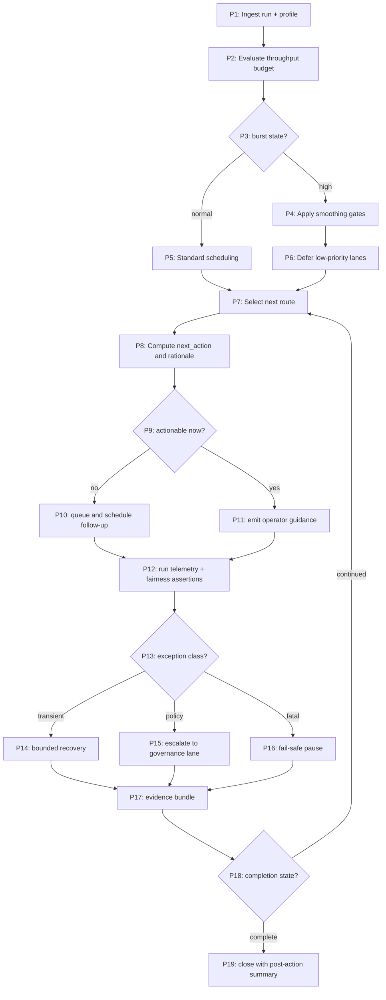

### 104.1 Graph invariants

- `P14`, `P15`, `P16` cannot skip telemetry/evidence emission.
- No branch from `P3` should starve critical lane indefinitely.
- `P10` re-entry must preserve original reason code and updated budget state.

### 104.2 Robustness branches

- If fairness assertion fails in `P12`, move to `P16` and generate incident evidence.
- If policy override is missing actor proof, force `P15` and block completion.
- If budget degrades for >2 cycles, auto-scale down to compatibility mode.

## 105) PRD Chunk-19: Practical-Intuitive Optimization UX and Governance-In-Use

### 105.1 Product intent

Make orchestration optimization feel predictable and safe to users through clear controls, explicit tradeoff explanation, and strong recovery ergonomics.

### 105.2 Functional requirements

- FR-01: show per-run optimization health and throttle status.
- FR-02: provide next_action that explains both immediate action and rationale.
- FR-03: expose emergency hold mode that converts all non-essential optimization to compatibility.
- FR-04: show fairness and queue health in status command (without manual deep-trace).
- FR-05: attach evidence bundle to severe branches automatically.
- FR-06: support policy-aware override workflows with actor identity and justification.
- FR-07: provide command output contract for machine and human parsing modes.

### 105.3 Non-functional requirements

- NFR-01: operator comprehension should be tested by short command drills.
- NFR-02: no action with unknown required context should remain ambiguous.
- NFR-03: optimization controls must fail-closed under partial observability failures.
- NFR-04: all operator-relevant branches should include deterministic timestamps and reason codes.

### 105.4 UX and control design

- status output:
  - `run_id`, `lane`, `throughput_state`, `frontier_size`, `next_action`, `blocking_cause`.
- evidence panel:
  - budget snapshot, queue fairness score, override history.
- emergency controls:
  - `thegent pause --mode safe`
  - `thegent resume --compat-only`
  - `thegent rollback --reason <reason_code>`

### 105.5 Practical acceptance criteria

- 95% of runs complete with at least one clear next_action.
- no more than 1 unresolved ambiguity per 10k non-fatal events in operator-facing outputs.
- compatibility mode activation should complete without manual cleanup.
- all severe branches include evidence bundle and actor trace.

### 105.6 Deliverables

- command docs under `docs/commands/optimization-ux.md`
- runbook updates:
  - `docs/runbooks/human-first-triage.md`
  - `docs/runbooks/performance-recovery.md`
- dashboards and alert policy definitions.
- regression suite update:
  - `tests/regression/throughput_fairness`
  - `tests/regression/urgency_and_hold`

## 106) Changelog

- v3.4 (2026-02-14): Added WBS Chunk-10, DAG Chunk-09, and PRD Chunk-19 for production-grade performance control, human-first operations, recovery robustness, and practical operator ergonomics.

This document remains open for future append operations and is intentionally modular.

## 99) WBS Chunk-09: Child-Agent Intelligence, Research, and Subsystem Coordination

### 99.1 Objective

Create an execution model where child agents (web research, local codebase retrieval, domain-specific optimization, and safety/observability specialists) are orchestrated as a deterministic subgraph under the same command/trace/audit regime as task execution, enabling deeper optimization depth without losing control.

### 99.2 Subsystem roles and ownership

- `CMR-01` Research Router
  - owner: Orchestration Design
  - mission: classify tasks into `web_research`, `local_file_research`, `code_audit`, `benchmarking`, or `policy_validation`.
- `CMR-02` Web Evidence Agent
  - owner: Research Infrastructure
  - mission: pull primary sources and capture stable evidence links + timestamps.
- `CMR-03` Codebase Evidence Agent
  - owner: Codebase Operations
  - mission: retrieve minimal diffs and local source slices tied to each question.
- `CMR-04` Synthesis Agent
  - owner: Product Strategy
  - mission: merge external evidence + internal state into concise recommendations.
- `CMR-05` Verifier Agent
  - owner: QA and Reliability
  - mission: validate claims, map to PRD IDs, and mark confidence.

### 99.3 WBS lanes

- `WBS-COA-01` Routing policy and assignment
  - DoD:
    - deterministic policy for choosing top-N evidence paths.
    - explicit fallback when one lane fails.
    - complete assignment trace persisted as `agent_assignment`.

- `WBS-COA-02` Evidence extraction pipeline
  - DoD:
    - web evidence captured with date, source, and quote-free summary if required.
    - local file evidence tagged by path, signature, and confidence score.
    - each evidence cluster has reproducible seed when deterministic mode is enabled.

- `WBS-COA-03` Conflict resolution and synthesis
  - DoD:
    - contradictory sources preserved with rationale.
    - synthesis preserves uncertainty bands and assumptions.
    - final recommendation references at least one source per claim.

- `WBS-COA-04` Safety envelope and abuse prevention
  - DoD:
    - rate limits for external research calls and tool fanout caps.
    - redaction checks on logs and research payloads.
    - no private credentials passed to web sources.

- `WBS-COA-05` Cost-aware scheduling for child agents
  - DoD:
    - separate budgets for research concurrency and cost.
    - emergency pause on anomaly thresholds.
    - automatic throttling on repeated low-yield calls.

- `WBS-COA-06` Integration and compatibility
  - DoD:
    - child-agent evidence appears in PRD/WBS append sections with consistent numbering.
    - no blocking of core task execution by long-running non-critical research calls.
    - replayability of assignments and outputs for auditability.

### 99.4 Cross-lane dependency map

- `WBS-COA-01` is prerequisite for all other lanes.
- `WBS-COA-02` and `WBS-COA-03` require policy and evidence format definitions from `WBS-COA-01`.
- `WBS-COA-04` wraps all lanes and can gate scheduling in incident mode.
- `WBS-COA-05` feeds capacity control used by `WBS-COA-06`.
- `WBS-COA-06` is release ready only when all above lanes are trace-complete.

### 99.5 Acceptance criteria

- At least 2 evidence sources (external + internal) for every major optimization claim.
- Research routes are reproducible with fixed policy and seed.
- No route exceeds configured budget caps.
- Every synthesis output includes confidence, assumptions, and explicit unknowns.
- Child-agent outputs are machine-joinable to PRD and WBS IDs.

### 99.6 Evidence contract additions

- `agent_assignment` event fields:
  - `agent_id`, `agent_type`, `parent_task_id`, `reason_code`, `assigned_at`, `deadline_at`.
- `evidence_record` fields:
  - `record_type`, `source`, `scope`, `reliability_score`, `snapshot_url`, `hash`, `captured_at`.
- `synthesis_record` fields:
  - `source_ids`, `synthesis_hash`, `confidence`, `conflicts`, `recommendations`, `next_actions`.

## 100) DAG Chunk-08: Child-Agent Evidence and Orchestration Graph

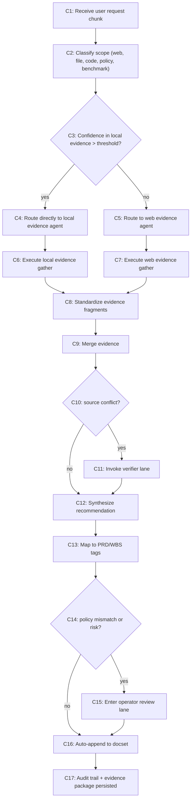

### 100.1 DAG semantics

- Research calls are bounded with per-class timeout and retry budget.
- `C15` branch requires explicit reason and actor identity.
- `C16` cannot proceed until `C13` has valid PRD/WBS tag mapping.

### 100.2 Failure and recovery policy

- Any gather failure in `C6/C7` emits soft failure and retries once with stricter scope.
- On repeated failure, task escalates to `C15`.
- If verifier conflicts exceed threshold, synthesis is delayed with a “requires human arbitration” banner.

## 101) PRD Chunk-18: Child-Agent Controlled Research and Multi-Source Optimization Engine

### 101.1 Objective

Enable Thegent to deliver optimization plans that combine web research with codebase evidence safely, repeatably, and within strict control budgets while keeping outputs practical and action-oriented.

### 101.2 Functional requirements

- FR-01: The system must route requests to child agents based on classification and urgency.
- FR-02: Evidence-backed suggestions must include at least one internal code evidence item when available.
- FR-03: Each synthesis output must cite scope, confidence, and failure mode.
- FR-04: Research lanes must respect budget caps and fail closed when over budget.
- FR-05: Human review path must exist for conflict-heavy or high-risk recommendations.
- FR-06: Child-agent outputs must not block non-research execution lanes unless explicitly policy-gated.
- FR-07: All child-agent events must be replayable and trace-linked to parent tasks.

### 101.3 Non-functional requirements

- NFR-01: 90th-percentile end-to-end research suggestion latency <= 2x baseline for the same request class.
- NFR-02: Research determinism where requested (same input + same policy -> same references/traces).
- NFR-03: Evidence storage and audit logs are write-once during normal operation.
- NFR-04: No sensitive secrets or credentials in external tool calls or traces.

### 101.4 Control model

- Normal mode:
  - local-first for high confidence local matches.
  - web fallback only when local evidence is insufficient.
- Safety mode:
  - disable non-approved external tools.
  - enforce strict evidence budgets and manual review path.
- Escalation mode:
  - enable conflict arbitration and explicit review before appending results.

### 101.5 User-visible behavior

- `thegent chunk` returns:
  - assigned agent lanes,
  - current evidence status,
  - confidence and known unknowns.
- `thegent evidence show <task>` returns compact, source-linked view.
- `thegent append` requires review token when conflicts were unresolved.

### 101.6 Acceptance criteria

- Every chunk produced from child agent paths includes source IDs and confidence annotations.
- No uncontrolled web calls in safety mode.
- Conflicts trigger review and are represented in final output.
- At least one parent task remains appendable per turn in fast path.
- Audit records for routing, evidence merge, and synthesis are complete.

### 101.7 Deliverables

- `child-agent` policy profile file.
- evidence schema and API contracts.
- CLI commands:
  - `thegent child-agent status`
  - `thegent child-agent budget`
  - `thegent child-agent evidence`
- Runbook:
  - `docs/runbooks/child-agent-orchestration.md`
  - `docs/runbooks/hybrid-research-review.md`

## 102) Changelog

- v3.3 (2026-02-14): Added WBS Chunk-09, DAG Chunk-08, and PRD Chunk-18 for child-agent routing, evidence-gathering graphs, deterministic synthesis, and safety-first research workflows.

This document remains open for future append operations and is intentionally modular.

## 95) WBS Chunk-08: Optimization Engine, Robustness, and Practical Polish

### 95.1 Objective

Advance the architecture from capability-optimization to production-grade optimality by adding tunable control-plane models, measurable robust behavior under pathological cases, and practical operator/product ergonomics that make advanced orchestration usable at scale.

### 95.2 High-level workstreams

- WBS-OPT-01: optimization math and policy DSL
- WBS-OPT-02: adaptive scheduling and routing
- WBS-OPT-03: reliability-hardening under adversarial or malformed input
- WBS-OPT-04: runtime-cost and memory efficiency
- WBS-OPT-05: command and diagnostics polish
- WBS-OPT-06: observability, evidence, and learning loops
- WBS-OPT-07: rollout and governance confidence package

### 95.3 WBS-OPT-01: optimization math and policy DSL

- `OPT-01` **Define score function contract**
  - owner: Platform Architecture
  - scope:
    - define deterministic scoring DSL for route ranking
    - explicit weights and caps for `cost`, `latency`, `risk`, `freshness`, `freshness_decay`
  - deliverables:
    - policy schema v1 with weighted terms and clamp rules
    - static policy lint that rejects contradictory weights
  - DoD:
    - deterministic score order for same state
    - overflow/NaN-safe numeric handling

- `OPT-02` **Introduce controlled exploration knobs**
  - owner: Planner
  - scope:
    - add controlled exploration under canary mode for strategy experimentation
    - epsilon-bounded exploration with replay guard
  - deliverables:
    - `explore_epsilon`, `explore_min_delta`, `explore_safety_window` knobs
    - kill-switch for non-canary environments
  - DoD:
    - strict no-explore in production compatibility mode
    - reproducibility for canary experiments via fixed seed log

### 95.4 WBS-OPT-02: adaptive scheduling and routing

- `OPT-03` **Token-time coupling**
  - owner: Runtime + Platform
  - scope:
    - maintain token + wall-time coupled budget to prevent tail bursts
  - deliverables:
    - per-agent and per-lane token slope limits
    - time-based decay restoration model
  - DoD:
    - no single lane exceeds critical token envelope
    - scheduling fairness preserved under bursty arrival

- `OPT-04` **Predictive prefetch and prewarming**
  - owner: Infra
  - scope:
    - prewarm frequently paired adapters from historical frequency
  - deliverables:
    - frequency model for task->tool transitions
    - prewarm queue manager with TTL
  - DoD:
    - no prewarm deadlock when capacity is low
    - measurable reduction in first-call cold latency in benchmark

- `OPT-05` **Path pruning and early cut rules**
  - owner: AI Integration
  - scope:
    - prune dominated candidate routes safely before dispatch
  - deliverables:
    - dominance rules, e.g., dominated if risk + cost + latency all worse
    - explainable pruning log with reason code
  - DoD:
    - safe-prune never discards currently best feasible route under active policy
    - prune logs are replayable in debug mode

### 95.5 WBS-OPT-03: reliability-hardening

- `OPT-06` **Malformed manifest and partial-order defense**
  - owner: Platform
  - deliverables:
    - strict normalization and strict-mode fail-fast behavior
    - quarantine lane for “repairable” manifests
  - DoD:
    - corrupted manifests never enter dispatcher
    - invalid dependency semantics return explicit typed errors

- `OPT-07` **Fault injection hardening**
  - owner: SRE
  - deliverables:
    - fixture suite for delayed tool responses, truncated outputs, duplicate events, and stuck locks
  - DoD:
    - each fixture mapped to deterministic branch
    - recovery path proves no duplicate side-effects

- `OPT-08` **Byzantine-state handling**
  - owner: Platform
  - deliverables:
    - anti-corruption checks for impossible transitions
    - safe fallback mode that preserves audit integrity
  - DoD:
    - state machine enforces impossible transition rejection
    - inconsistent states never auto-delete; move to quarantined hold mode

### 95.6 WBS-OPT-04: cost and memory efficiency

- `OPT-09` **Output compaction tiers**
  - owner: Infra + Runtime
  - deliverables:
    - compact level 0 (no compact), level 1 (hash-only), level 2 (safe summary), level 3 (full detail)
    - policy-controlled compaction level by task criticality
  - DoD:
    - level-specific size targets met
    - level 2/3 preserves recoverability

- `OPT-10` **Artifact lifecycle and retention policy**
  - owner: Security
  - deliverables:
    - time-boxed artifact retention for non-audit workloads
    - hash-indexed references to large outputs
  - DoD:
    - no unnecessary large artifact duplication
    - audit-critical artifacts retained according to policy

### 95.7 WBS-OPT-05: command and diagnostics polish

- `OPT-11` **Operator intent surface**
  - owner: UX + Product
  - deliverables:
    - concise CLI summary and drill-down modes
    - one-page incident snapshot in command output
  - DoD:
    - first actionable item appears within 3 lines
    - non-terminal state always includes `next_action`

- `OPT-12` **Error taxonomy simplification**
  - owner: Product + Platform
  - deliverables:
    - unified error class hierarchy (retry, policy, infra, operator, internal)
    - mapped to consistent remediation templates
  - DoD:
    - >95% of runtime errors classify to existing class
    - unknown classes have fallback guidance

### 95.8 WBS-OPT-06: observability and learning loops

- `OPT-13` **Policy efficacy dashboard**
  - owner: SRE
  - deliverables:
    - metrics for policy override frequency, fallback conversion, and retry debt
    - alerting on repeated “force compatibility” events
  - DoD:
    - dashboards auto-refresh and show trend windows
    - manual override events have actor + reason fields

- `OPT-14` **Model-assisted postmortem intelligence**
  - owner: AI Ops
  - deliverables:
    - structured postmortem extraction from event traces
    - recurring root-cause clusters with confidence score
  - DoD:
    - false-positive guardrails for root-cause assignment
    - cluster output human-reviewable before auto-suggesting config changes

### 95.9 WBS-OPT-07: rollout and governance confidence

- `OPT-15` **Cross-zone/region feature gating**
  - owner: Platform Reliability
  - deliverables:
    - environment-gated optimization flags and kill-switch controls
    - compatibility constraints by environment class
  - DoD:
    - production cannot enable exploratory behavior without explicit gate
    - staging/preview canary has automatic revert on policy breach

- `OPT-16` **Governance checklist and training package**
  - owner: Operations
  - deliverables:
    - runbook section for optimization controls and policy exceptions
    - operator training matrix for incident actions
  - DoD:
    - every control path has runbook owner and rehearsal evidence
    - training completion tracked and renewed each quarter

### 95.10 Dependency and sequencing map

- `OPT-01` -> `OPT-02`, `OPT-03`, `OPT-11`.
- `OPT-03` -> `OPT-04`, `OPT-05`.
- `OPT-06` -> `OPT-07`, `OPT-08`.
- `OPT-09` -> `OPT-10`.
- `OPT-11` -> `OPT-12`.
- `OPT-13` -> `OPT-14`.
- `OPT-15` -> `OPT-16`.
- `OPT-04`/`OPT-05`/`OPT-07` all block final release readiness.

### 95.11 Chunk-08 acceptance criteria

- All optimization decisions are explainable and deterministic.
- No unsupported branch executes in production without explicit governance gate.
- Cost and timeout control reduces p95 queue-to-dispatch latency by at least 10% in tested steady-state.
- Reliability drills cover malformed input, duplicate events, and corrupted checkpoint.
- Operator ergonomics improved:
  - immediate next action
  - clear remediation suggestions
  - zero ambiguous error states for terminal classes.

## 96) DAG Chunk-07: Optimization and Robustness Control Graph

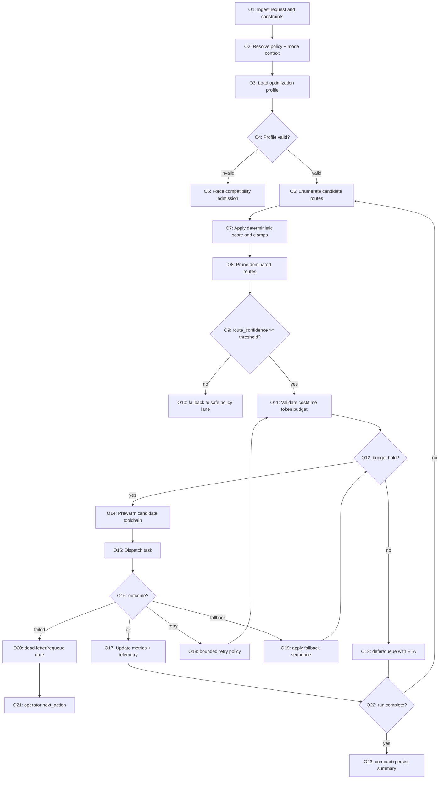

### 96.1 DAG control semantics

- `O5` enters explicit compatibility path with no speculative side effects.
- `O13` stores deterministic retry or scheduling token to prevent duplicate deferrals.
- `O18` and `O19` are evaluated within safety ceilings before re-dispatch.

### 96.2 Control invariants

- All routes go through `O17`/`O18`/`O19`/`O20` before terminalization.
- Every terminal branch includes telemetry and actor audit.
- No path re-enters `O6` without updated score snapshot.

## 97) PRD Chunk-17: Practical, Intuitive, and Robust Optimization UX

### 97.1 Problem statement

The optimization layer adds capability but also increases complexity; this chunk delivers pragmatic polish so operations teams can safely use it with confidence and minimal cognitive burden.

### 97.2 Scope

- scope:
  - CLI diagnostics and error semantics
  - control-plane governance for experimentation
  - robustness guarantees for hostile or poor-quality input
  - cost and observability balancing over long-run operation
- out-of-scope:
  - new ML model training or major infrastructure replacement
  - replacing existing non-orchestrated execution semantics

### 97.3 Functional requirements

- FR-01: expose a single “Optimization Health” status endpoint/command.
- FR-02: show one-line “why this route” explanation for every non-trivial dispatch.
- FR-03: emit structured explanation logs for prune, fallback, and retry transitions.
- FR-04: support emergency hold mode that converts risky optimization experiments into compatibility mode in one command.
- FR-05: enforce a policy matrix where exploratory behavior is gated by environment and explicit approval.
- FR-06: produce a deterministic post-run optimization audit package (scores, decisions, overrides, and outcomes).
- FR-07: enable safe rollback of policy/knob sets with minimum two-step confirmation and actor record.

### 97.4 Non-functional requirements

- NFR-01: optimization branch adds < 5% scheduling overhead under nominal load.
- NFR-02: fallback and override events have < 2-second operator recognition time.
- NFR-03: all emitted IDs and trace fields are stable across retries with same inputs.
- NFR-04: hardening features (`sanity gates`, `quarantine`, `manual path`) must not reduce compatibility-mode functionality.

### 97.5 Practical polish details

- Command-level UX:
  - `thegent optimize status --run <id>` returns compact, actionable state.
  - `--trace <route_id>` prints top-5 candidate ranking and prune reasons.
  - `thegent run --compatibility` bypasses experimental routing.
- User trust signals:
  - confidence score and risk color in status/CLI outputs.
  - clear remediation recommendations for each rejection path.
- Failure clarity:
  - replace generic “retrying” states with branch label (`policy_block`, `transient_network`, `resource_pressure`).
  - link each state to the next required operator action.

### 97.6 Robustness and guardrails

- Determinism:
  - seed and reason codes become part of reproducibility metadata.
- Quarantine policy:
  - unsupported manifests and malformed payloads move to quarantine queue.
- Safety:
  - every non-compatible optimization route has bounded fallback timer and hard stop path.
- Privacy and safety:
  - sensitive tool outputs always pass redaction before summary and artifact writes.

### 97.7 Delivery criteria

- 100% of optimization transitions include traceable reason code.
- at least 99% of compatibility paths preserve prior command behavior.
- reduction in operator triage time after deployment in simulated drills.
- evidence package includes:
  - route trace
  - override log
  - fallback and retry proof
  - operator action outcomes

### 97.8 Deliverables

- command: `thegent optimize status`
- command: `thegent optimize policy preview`
- command: `thegent optimize rollback --reason`
- docs:
  - `docs/operations/optimization-prd.md`
  - `docs/runbooks/compatibility-emergency.md`
- reference fixtures for robust/failure scenarios in `tests/fixtures/optimization/`
- dashboard spec in `docs/observability/optimization-health.md`

## 98) Changelog

- v3.2 (2026-02-14): Added WBS Chunk-08, DAG Chunk-07, and PRD Chunk-17 focused on optimization math, robustness hardening, practical operator UX, and deterministic control semantics.

This document remains open for future append operations and is intentionally modular.

## 91) WBS Chunk-07: Sub-Agent Toolchain Optimization and Deterministic Orchestration

### 91.1 Objective

Design and implement a deeper optimization layer for tool-driven orchestration that increases throughput, lowers latency, and improves predictability under mixed workloads by combining deterministic scheduling, adaptive fallback, and agent-specialty matching while preserving strict safety and auditability.

### 91.2 Workstream decomposition

- WSO-01 Strategy alignment and baseline measurement
  - Deliverables:
    - current-state latency breakdown by stage (`discovery`, `plan`, `dispatch`, `tool-call`, `post-run`)
    - baseline dashboards for cost/call counts and timeout/cancel ratios
    - explicit optimization hypotheses list with measurable targets
  - DoD:
    - all stages instrumented with baseline tags
    - benchmark dataset prepared for repeatable comparison

- WSOP-01 Tool abstraction hardening
  - Deliverables:
    - canonical adapter contract v1 (`capabilities`, `input_shape`, `timeout`, `retry_profile`, `cost_profile`)
    - unified schema validation gate before dispatch
    - safe feature flags for unsupported capabilities
  - DoD:
    - unsupported tool attempts return `E_TOOL_PROFILE_MISSING`
    - unsupported attempt never leaves plan stage
    - all adapters pass schema round-trip tests

- WSOP-02 Tool performance fingerprinting
  - Deliverables:
    - runtime p95/p99 warm-start and steady-state metrics per adapter
    - profile table for token cost, concurrency limits, and backoff behavior
    - periodic recalculation job (`orchestrator.tool_fingerprint`)
  - DoD:
    - scheduler consumes fingerprints in less than 5ms per planning decision
    - stale fingerprints auto-expire within policy-configured TTL

- WSOP-03 Dynamic cost-aware routing
  - Deliverables:
    - routing policy matrix (`cost`, `latency`, `risk`, `tool_confidence`)
    - deterministic tie-breakers (cost first, then latency, then confidence)
    - manual override hook for emergency routing
  - DoD:
    - two equivalent routes show deterministic outputs under same inputs
    - override actions are fully audited

- WSOP-04 Tool cold-start minimization
  - Deliverables:
    - warm-pool registry by domain/tool family
    - pre-warm behavior keyed to predicted workload windows
    - lazy-load fallback for idle paths
  - DoD:
    - first-call latency improvement target demonstrated in benchmark
    - warm-pool exhaustion handled gracefully by bounded queue

- WSR-01 Scheduler token-budget engine
  - Deliverables:
    - global and per-run token budgets with reservation/release semantics
    - task complexity estimator (input size, expected tool fanout, policy depth)
    - hard cap enforcement before dispatch and runtime warning channels
  - DoD:
    - budget starvation never causes unbounded queue growth
    - reservation rollback works on tool timeout/fail

- WSR-02 Sub-agent capability matching
  - Deliverables:
    - capability profile for each sub-agent (domain, language, memory, latency, specialty confidence)
    - matching score formula with configurable weights
    - minimum score threshold controls to avoid poor fit assignments
  - DoD:
    - assignment decision is explainable with score decomposition
    - rebalancing occurs when quality confidence drops below threshold

- WSR-03 Structured retry budget orchestration
  - Deliverables:
    - per-task retry budget object: `attempt_budget`, `time_budget`, `jitter`, `cooldown`
    - policy branches for `safe`, `balanced`, `aggressive`
    - de-duplication across duplicate tool call retries
  - DoD:
    - retry policy emits `attempt_trace_id` and `retry_bucket`
    - retry loops terminate with explicit final status and next action

- WSR-04 Adaptive concurrency governor
  - Deliverables:
    - per-tool and global concurrency limiter
    - adaptive reduction algorithm based on rolling error rate and latency
    - anti-thrash cooldown backpressure model
  - DoD:
    - scheduler respects all hard concurrency limits
    - no more than 0.5% scheduling oscillations under burst load

- WSO-05 Controlled fallback orchestration
  - Deliverables:
    - ordered fallback chain (`primary -> secondary -> degraded -> compatibility`)
    - fallback trigger scorecard (confidence, timeout, error class, policy)
    - auto-expire fallback paths after successful recovery window
  - DoD:
    - fallback events create trace and audit records
    - all fallbacks pass idempotency checks

- WSO-06 Execution-memory compaction
  - Deliverables:
    - context compaction policy for verbose tool outputs
    - deterministic lossy summary with hash anchor to original payload
    - explicit opt-out for regulated or debug-critical jobs
  - DoD:
    - compaction preserves hash integrity and recoverability
    - token usage reduction measurable in benchmark

- WSO-07 Tool-side guardrails and chaos drills
  - Deliverables:
    - explicit guardrail profile (`max_output_tokens`, `max_latency_ms`, `max_payload_bytes`)
    - chaos test fixtures for delayed ack, malformed output, partial writes, and stuck state
    - rollback switch to compatibility mode if guardrail breaches spike
  - DoD:
    - each guardrail has owner and owner-runbook
    - at least one successful recovery runbook per drill

### 91.3 Cross-workstream dependency map

- Foundation first:
  - WSOP-01 -> WSOP-02, WSOP-03 -> WSR-01, WSOP-04.
- Scheduling layer:
  - WSR-01 + WSR-02 -> WSR-03 + WSR-04.
- Runtime hardening:
  - WSR-03 + WSO-05 + WSO-06 -> WSO-07.
- End-to-end:
  - WSOP-02/03/04 + WSR-01/02/03/04 + WSO-05/06/07 -> WSOP-05 completion candidate.

### 91.4 Critical path and sequencing

- Phase 1 (Weeks 1-2): WSOP-01, WSOP-02, WSO-01.
- Phase 2 (Weeks 3-4): WSR-01, WSR-02, WSR-03, WSR-04.
- Phase 3 (Weeks 5-6): WSO-05, WSO-06, WSO-07, chaos hardening, evidence.

### 91.5 Chunk-07 acceptance criteria

- Tool routing decisions are deterministic for identical input.
- Per-task scheduling overhead < 5ms in happy path (excluding tool wall time).
- Retry budgets eliminate infinite loops and expose explicit terminal next_action.
- Compaction achieves at least 25% token reduction on verbose runs without losing recoverability.
- Fallback and guardrail events are fully traceable and auditable.

## 92) DAG Chunk-06: Deterministic Optimization Control Graph

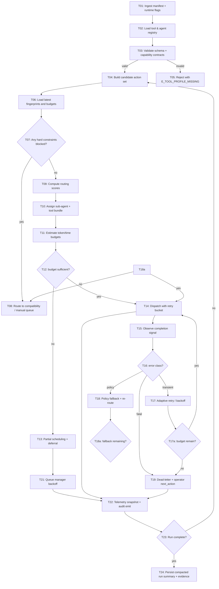

### 92.1 Graph policy notes

- All conditional edges must include an immutable reason code and threshold snapshot.
- `T13` defer branches must annotate a deterministic resubmission timestamp; never use random backoff for critical paths.
- `T17` and `T18` are mutually exclusive under one failure event unless policy explicitly allows dual handling.

### 92.2 Control-plane invariants

- Every run must pass through `T22`.
- No transition bypasses telemetry emission.
- Any route to `T19` must produce terminal state guidance and optional resume/replay hint.

## 93) PRD Chunk-16: Adaptive Tooling Control for Thegent and Child Agents

### 93.1 Problem statement

Current orchestration behavior can become inefficient under mixed workloads because task/tool selection is often static, warm-start behavior is inconsistent, and fallback/ retry policy is fragmented across agents. This chunk introduces a deterministic, policy-driven optimization layer with measurable and auditable behavior.

### 93.2 Product scope

- Covers planning and execution stages of orchestrator and sub-agent dispatch.
- Covers compatibility behavior for older runs when new optimization flags are disabled.
- Excludes model fine-tuning and external infra migration.

### 93.3 Functional requirements

- FR-01: Planner must pre-resolve tool and agent capabilities before task dispatch.
- FR-02: Planner must score candidate routes using explicit policy weights for `cost`, `latency`, `confidence`, and `risk`.
- FR-03: Dispatch must reserve token/time budgets before tool call and release on completion.
- FR-04: Retry policy must be bounded, typed, and explainable per attempt.
- FR-05: Fallback must follow strict ordering with audit logs for each transition.
- FR-06: Runtime must compress long tool outputs with hash-preserving summary where enabled.
- FR-07: Every scheduling decision must emit machine-readable trace (`route_id`, `score_breakdown`, `limits_snapshot`).
- FR-08: Operators can force emergency compatibility path with explicit rationale capture.

### 93.4 Non-functional requirements

- NFR-01: Planning overhead increase under median load must remain < 10%.
- NFR-02: p95 scheduling latency target < 40ms.
- NFR-03: p99 scheduling latency target < 80ms.
- NFR-04: Budget enforcement error rate < 0.1% for all non-fatal events.
- NFR-05: Every retry chain must be replayable from deterministic trace IDs.

### 93.5 Data model additions

- `agent_profile`:
  - `agent_id`, `domains`, `specialty_confidence`, `avg_latency_ms`, `avg_token_ratio`, `max_concurrency`.
- `route_probe`:
  - `route_id`, `run_id`, `task_id`, `tool_id`, `score_cost`, `score_latency`, `score_risk`, `score_final`.
- `dispatch_token_budget`:
  - `token_cap`, `time_cap`, `attempt_cap`, `reserved`, `used`, `release_mode`.
- `fallback_event`:
  - `event_id`, `from_route`, `to_route`, `trigger`, `policy_rule`, `acted_by`.

### 93.6 User-visible outcomes

- Planner output now includes explicit next-action explanation and deterministic route rationale.
- Operators can inspect why tasks were deferred instead of dropped.
- Failure recovery includes cleaner user action choices (retry, continue-compat, cancel subtree).

### 93.7 Acceptance criteria (chunk-level)

- 100% of non-trivial routes carry a deterministic scoring trace.
- At least 90% of benchmark workloads see no decrease in success rate after enabling optimization flags.
- At least 20% reduction in avoidable warm-start penalty in top-2 tools.
- Fallback and dead-letter transitions include next-action and operator annotation.
- All telemetry fields are versioned and backward-compatible.

### 93.8 Deliverables

- Configs: `thegent config optimize --enable-routing-graph` and `--dry-run-router`.
- APIs: route scoring endpoint and token budget endpoint.
- Tests:
  - routing determinism,
  - budget expiry,
  - fallback matrix,
  - compaction hash integrity.
- Docs:
  - `docs/orchestrator/agent-tool-optimization.md`
  - `docs/runbooks/compatibility-fallback.md`

## 94) Changelog

- v3.1 (2026-02-14): Added WBS Chunk-07, DAG Chunk-06, and PRD Chunk-16 for deterministic sub-agent/toolchain optimization, adaptive routing, and optimization-control behaviors with explicit metrics and acceptance criteria.


## 89) WBS Chunk-06: Owner-by-Owner Implementation Tickets (Execution-Ready)

### 89.1 Objective

Convert the entire orchestration program into executable work tickets with explicit ownership, dependencies, tests, and acceptance evidence.

### 89.2 Ticket taxonomy

- `WST` (State and core orchestration)
- `WSP` (Planner and scheduling)
- `WSM` (Strategy and model routing)
- `WSR` (Resilience and recovery)
- `WSC` (Controls and governance)
- `WSO` (Observability and operations)

### 89.3 Foundation tickets

- `WST-01` **Create canonical orchestration contracts**
  - Owner: Platform
  - Story: define immutable Run/Task/Attempt/Event dataclasses + versioned schemas
  - Depends: none
  - DoD:
    - schema module exists
    - validation errors are typed
    - backward-compatible defaults documented

- `WST-02` **State model and state transition service**
  - Owner: Platform
  - Story: implement explicit state machine transitions with guards
  - Depends: `WST-01`
  - DoD:
    - unauthorized transitions rejected
    - every transition emits event
    - deterministic terminal behavior for each state

- `WST-03` **Persistence adapter baseline**
  - Owner: Platform
  - Story: event journal + snapshot persistence with atomic write
  - Depends: `WST-01`, `WST-02`
  - DoD:
    - checksum + recovery validation
    - rollback/readonly fallback on corruption
    - recovery replay contract implemented

### 89.4 Planner and scheduler tickets

- `WSP-01` **DAG parser and normalizer**
  - Owner: Planner
  - Story: parse input manifests and canonicalize task graph
  - Depends: `WST-01`
  - DoD:
    - duplicate task ID detection
    - orphan and cycle rejection
    - deterministic task indexing

- `WSP-02` **Frontier scheduler**
  - Owner: Planner
  - Story: topological frontier engine and ready-set tracking
  - Depends: `WSP-01`, `WST-02`
  - DoD:
    - dependency completion drives frontier
    - no task enters scheduled without all deps success

- `WSP-03` **Policy-aware ordering and fairness**
  - Owner: Planner
  - Story: deterministic priority score + aging + lane fairness
  - Depends: `WSP-02`
  - DoD:
    - stable ordering with tie-breakers
    - no starvation under load
    - lane caps respected

- `WSP-04` **Dispatch loop**
  - Owner: Runtime
  - Story: controlled run loop with stop signals
  - Depends: `WSP-03`, `WST-02`
  - DoD:
    - pause/resume/cancel respected immediately
    - no dispatch when policy denies task

### 89.5 Strategy and execution tickets

- `WSM-01` **Strategy selector service**
  - Owner: AI Integration
  - Story: map policy + tags + profile to selected strategy
  - Depends: `WSP-04`
  - DoD:
    - deterministic profile resolution
    - fallback depth captured in event trail

- `WSM-02` **Runner adapter boundary**
  - Owner: AI Integration
  - Story: isolate execution transport (`run_agent.sh` + droid path)
  - Depends: `WSM-01`
  - DoD:
    - single invocation path for all strategies
    - outputs normalized into AttemptResult

- `WSM-03` **Fallback and cooldown policy engine**
  - Owner: AI Integration
  - Story: retry-class and fallback-policy transition matrix
  - Depends: `WSM-01`, `WST-03`
  - DoD:
    - one-step / depth-capped fallback
    - cooldown state transitions and expiry

### 89.6 Resilience tickets

- `WSR-01` **Retry policy and jitter**
  - Owner: Resilience
  - Story: bounded retry + exponential backoff + jitter
  - Depends: `WST-02`, `WSM-03`
  - DoD:
    - per-class retry cap
    - deterministic jitter seeds in test mode
    - retry storms produce throttling action

- `WSR-02` **Recovery reconciliation**
  - Owner: Platform + Runtime
  - Story: startup recovery and stale-attempt classification
  - Depends: `WST-03`
  - DoD:
    - no double-dispatch on restart
    - blocked/unrecoverable tasks surfaced clearly

- `WSR-03` **Dead-letter and requeue framework**
  - Owner: Resilience
  - Story: dead-letter queue, manual rerun, subtree controls
  - Depends: `WSR-01`, `WST-03`
  - DoD:
    - manual requeue path tested
    - dead-letter reasons preserved

### 89.7 Controls and governance tickets

- `WSC-01` **Command-level controls**
  - Owner: Security
  - Story: pause/resume/requeue/stop commands with RBAC
  - Depends: `WST-02`
  - DoD:
    - actor recorded on each control action
    - destructive actions require explicit confirmation token

- `WSC-02` **Policy deny and override**
  - Owner: Security
  - Story: policy tags allowlist/denylist and override trail
  - Depends: `WSP-03`
  - DoD:
    - policy deny emits `E_POLICY_VIOLATION`
    - override path requires explicit approval context

- `WSC-03` **Secret redaction and safety scrubbers**
  - Owner: Security
  - Story: redact tokens in logs/events/artifacts
  - Depends: none
  - DoD:
    - redaction regex tests pass
    - redacted values never persisted

### 89.8 Operations and observability tickets

- `WSO-01` **Status/log projections**
  - Owner: SRE
  - Story: stable `status` / `logs` JSON contract
  - Depends: `WST-02`
  - DoD:
    - required keys present
    - `next_action` in non-terminal states

- `WSO-02` **Metrics and alerting**
  - Owner: SRE
  - Story: export counters for scheduler/retry/rollback/gate states
  - Depends: `WSO-01`
  - DoD:
    - alert thresholds tested
    - alert routes connect to escalation contact

- `WSO-03` **Runbook package and CLI docs**
  - Owner: Documentation
  - Story: workflow playbooks, command primer, drill scripts docs
  - Depends: `WSO-01`, `WSC-01`
  - DoD:
    - runbook references exact command IDs
    - on-call training package published

### 89.9 Release-mode and rollout tickets

- `WR-01` **Mode management (`legacy`/`hybrid`/`orchestrated`)**
  - Owner: Runtime
  - Story: safe mode switches, canary gating, rollback mode
  - Depends: `WST-02`, `WSC-01`
  - DoD:
    - canary-only scheduling available
    - rollback switch tested with audit entry

- `WR-02` **Cutover migration tasks**
  - Owner: Operations
  - Story: state migration, compatibility retention, schema bump controls
  - Depends: `WR-01`, `WST-03`
  - DoD:
    - migration script and validation for representative data

- `WR-03` **Legacy parity and compatibility**
  - Owner: Product
  - Story: verify no breaking change in existing command outputs
  - Depends: `WR-01`
  - DoD:
    - command contract suite unchanged
    - non-orchestrated defaults preserved

### 89.10 Cross-team dependencies map

- `WST-03` gates `WSR-02` and `WR-02`.
- `WSP-04` gates `WSM-01`, `WSC-01`, and `WSO-01`.
- `WSM-02` gates `WSR-01` validation in end-to-end flows.
- `WSC-02` gates `WR-03` for security parity.
- `WSO-02` gates `WR-01` final rollout.

### 89.11 Delivery modes and cadence

- **Mode alpha**: ticket cluster `WST` + `WSP` only (no fallback/controls).
- **Mode beta**: add `WSM` + `WSR` and run smoke subset.
- **Mode gamma**: add `WSC` + `WSO` and enable `hybrid`.
- **Mode release**: add `WR` and canary full checks.

### 89.12 Ticket acceptance checks (Chunk-06)

- For each ticket:
  - owner assigned
  - dependency graph attached
  - DoD test evidence exists
  - PRD chunk trace exists
- No ticket moves to done without at least one automated validation.

## 90) Changelog

- v3.0 (2026-02-14): Added WBS Chunk-06 with owner-by-owner implementation tickets and dependency map.

This document remains open for future append operations and is intentionally modular.

## 77) WBS Chunk-05: Sprint-Level Work Backlog with Owners, Dependencies, and DoD (Execution-Sliced)

### 77.1 Objective

Convert chunked WBS and interfaces into a planner-owned backlog that can be loaded into sprint planning without reinterpretation.

### 77.2 Stream map and sprint cadence

- All teams use 1-week sprint increments with two-day review windows.
- Work is released in this order:
  - foundation sprint first,
  - execution + reliability sprint second,
  - controls/observability sprint third,
  - rollout and hardening sprint fourth.

### 77.3 Sprint backlog matrix

#### Sprint A: foundation and compatibility (Week 1)

1. `WA-01` Stabilize Run/Task/Attempt/Event contracts (`75`, `2.1`)
   - Owner: Platform
   - Input: PRD Chunk-08 + Chunk-11
   - Output: versioned schema modules and validators
   - DoD:
     - schema definitions exist in one module
     - JSON example manifests validate
     - compatibility matrix baseline recorded
   - Risk: medium

2. `WA-02` Add legacy behavior contract tests (`2.2`, `72`)
   - Owner: Runtime
   - Dependencies: `WA-01`
   - DoD:
     - golden outputs for `run`, `bg`, `ps`, `status`, `logs`, `wait`, `stop`
     - no regression in non-orchestrated command set
   - Risk: high

3. `WA-03` Parser/validation for DAG input (`3.1`, `3.2`, `3.3`)
   - Owner: Planner
   - Dependencies: `WA-01`
   - DoD:
     - cycle/orphan/duplicate detection
     - clear error mapping with `E_INVALID_DAG`
   - Risk: medium

#### Sprint B: scheduling and dispatch execution (Week 2–3)

4. `WB-01` Frontier scheduler and readiness graph updates (`4.1`)
   - Owner: Scheduler
   - Dependencies: `WA-01`,`WA-03`
   - DoD:
     - deterministic frontier updates
     - ready tasks only when all dependencies succeeded
   - Risk: high

5. `WB-02` Priority/fairness ordering and lane strategy (`4.2`, `4.4`)
   - Owner: Scheduler
   - Dependencies: `WB-01`
   - DoD:
     - stable tie-breakers
     - starvation prevention checks in tests
   - Risk: medium

6. `WB-03` Dispatch loop and lifecycle controls (`4.3`, `7.3`)
   - Owner: Runtime
   - Dependencies: `WB-01`, `WB-02`
   - DoD:
     - no dispatch without policy + readiness gate
     - pause/resume behavior deterministic
   - Risk: high

7. `WB-04` Strategy selector and fallback chain (`5.1`, `5.2`)
   - Owner: AI Integration
   - Dependencies: `WB-03`
   - DoD:
     - fallback depth cap
     - structured `E_RATE_LIMIT` path
   - Risk: high

#### Sprint C: resilience, recovery, and governance (Week 4–5)

8. `WC-01` Retry engine + backoff policy (`6.1`, `6.2`)
   - Owner: Resilience
   - Dependencies: `WB-03`, `WB-04`
   - DoD:
     - retry class mapping by error code
     - bounded retries and jitter verified
   - Risk: high

9. `WC-02` Persistence layer with snapshot/replay (`6.2`, `6.3`)
   - Owner: Platform
   - Dependencies: `WA-01`,`WB-03`
   - DoD:
     - atomic writes and checksum
     - recovery path without duplicate attempt
   - Risk: high

10. `WC-03` Dead-letter and requeue policy (`6.4`, `72`)
    - Owner: Resilience
    - Dependencies: `WC-01`, `WC-02`
    - DoD:
      - dead-letter reasons and manual requeue flows tested
      - no unresolved tasks blocked indefinitely
    - Risk: medium

11. `WC-04` Controls and policy denial flow (`8.1`, `8.3`)
    - Owner: Security
    - Dependencies: `WC-01`
    - DoD:
      - policy gates and deny states have typed codes
      - override path logs actor + reason
    - Risk: high

#### Sprint D: observability, rollout, and polish (Week 6–7)

12. `WD-01` Status/logs shape and projection (`7.1`, `73`)
    - Owner: SRE
    - Dependencies: `WC-01`, `WC-02`
    - DoD:
      - stable `status --json`
      - `next_action` available in non-terminal states
    - Risk: medium

13. `WD-02` Metrics and alert rules (`7.2`, `72`)
    - Owner: SRE
    - Dependencies: `WD-01`
    - DoD:
      - retry/fallback/blocked alert thresholds active
      - alert routing verified in drill
    - Risk: medium

14. `WD-03` Rollout and rollback controls (`8.2`, `8.3`)
    - Owner: SRE/Operations
    - Dependencies: `WD-02`, `WC-04`
    - DoD:
      - off/shadow/canary/full mode transitions
      - rollback switch tested
    - Risk: high

15. `WD-04` UX polish and command ergonomics (`74`, `52`, `72`)
    - Owner: Product + UX
    - Dependencies: `WD-01`
    - DoD:
      - flow completion docs for pause/requeue/cancel
      - command outputs include actionable recommendations
    - Risk: low

### 77.4 Cross-sprint dependency map

- Mandatory chain: `WA-01 -> WA-03 -> WB-01 -> WB-03 -> WC-02 -> WD-01`.
- Gated dependencies:
  - `WB-04` waits for `WB-03` before integration with dispatch.
  - `WC-03` can proceed once `WC-01` is in place.
  - `WD-03` requires both policy and metrics gates.
- Parallel safe edges:
  - `WD-02` can begin once status projection has deterministic schema.
  - `WD-04` can iterate with product feedback independent of final rollout gating.

### 77.5 Team-level acceptance criteria by sprint

- Sprint A done:
  - schema lock and validation baseline in place
  - compatibility behavior preserved
  - deterministic DAG parse/validation
- Sprint B done:
  - scheduler correctness and dispatch safety proven
  - strategy/fallback integration tested on synthetic cases
- Sprint C done:
  - restart recovery and duplicate suppression passing
  - controlled dead-letter and requeue operations
  - policy gate evidence available
- Sprint D done:
  - status and logs parity with release gates
  - go/no-go rollout path demonstrably safe
  - operational checklists published

### 77.6 Risk-owned mitigation by sprint

- `WA-01`: schema drift due to rushed additions
  - mitigation: freeze schema in week 1, additive-only updates
- `WB-03`: non-idempotent dispatch
  - mitigation: explicit attempt lock + checkpoint-before-dispatch
- `WC-02`: persistence corruption under load
  - mitigation: atomic snapshot plus fallback read-only mode
- `WD-03`: rollback complexity
  - mitigation: pre-built rollback runbook and drill each Friday

### 77.7 WBS Chunk-05 evidence artifacts

- Sprint backlog board entries with WIP/blocked/Done status.
- requirement-to-task traceability matrix and owner assignment.
- cross-sprint test evidence set and unresolved risk log.

### 77.8 Chunk-05 acceptance criteria

- backlog can be consumed directly by planning tool without reinterpretation.
- every backlog item has explicit DoD and dependency.
- high-risk items have mitigation and owner.
- acceptance criteria map to PRD chunk requirements.

## 78) Changelog

- v2.4 (2026-02-14): Added WBS Chunk-05 sprint-level execution backlog with owners, dependencies, and DoD.

## 79) PRD Chunk-12: Security, Compliance, and Governance Hardening

### 79.1 Scope and intent

This chunk hardens `thegent` as an orchestrated execution platform used by teams, by closing operational and policy gaps that cause silent leakage, unsafe automation, or weak auditability.

### 79.2 Threat model and trust boundaries

- Untrusted input sources: user prompts, DAG files, dynamic task prompts.
- Semi-trusted sources: agent wrappers, external model/API providers.
- Trusted core: state store, scheduler, policy engine, execution admission layer.
- Attack classes:
  - secret exfiltration through logs/artifacts;
  - command/tool abuse through malformed task fields;
  - unauthorized run control (pause/resume/cancel/requeue abuse);
  - state tampering via corrupted event or malformed snapshots.

### 79.3 Security architecture controls

- **Input guard**:
  - strict schema validation before task admission;
  - max payload and token limits;
  - dependency graph sanity checks before dispatch.
- **Policy gate**:
  - explicit denylist/allowlist for command classes and tool categories;
  - per-task policy tags must map to explicit policy definitions.
- **Process isolation**:
  - droid-runner argument sanitization;
  - no shell interpolation of unescaped task fields;
  - explicit argument vectorization in adapters.
- **State protection**:
  - signed snapshots for critical metadata (optional in first phase if signer infra not ready);
  - checksum-validated event replay;
  - recoverable read-only mode when verification fails.
- **Observability safety**:
  - redaction before write to logs/events;
  - structured redaction registry with confidence tiers.

### 79.4 Secret and sensitive data handling

- Redaction policy:
  - keys matching `password`, `token`, `apikey`, `secret`, `private_key` in payload and outputs;
  - regex patterns for high-risk token shapes; allowlist of known false positives.
- Secret lifecycle:
  - never persist secrets in run/task metadata;
  - never output raw secret-bearing fields in status/log/event.
- Artifacts:
  - optionally encrypt at rest for classified environments;
  - scrub artifacts before retention expiry.
- Audit trace:
  - every redaction event emits count+pattern IDs (no values).

### 79.5 Access control and command authorization

- Actor model:
  - owner, operator, admin, and viewer roles;
  - owner identity tied to run record.
- Control policy:
  - destructive commands require explicit confirmation (`--force` in batch mode);
  - pause/cancel/requeue attempts must include actor identity;
  - owner/operator overrides documented.
- Session controls:
  - least-privilege for background-run inspection;
  - read-only visibility for logs/status when no control role.
- API mode controls (future-ready):
  - token-based auth for remote control endpoints;
  - scoped tokens for environment-specific write operations.

### 79.6 Compliance and auditability

- Immutable event requirement:
  - append-only event stream with integrity check metadata;
  - immutable run IDs and correlation references.
- Audit entries:
  - each policy decision, denied action, override, and fallback must write an audit row.
- Retention:
  - status/log retention by policy class and compliance needs;
  - retention tags on audit events for legal hold.
- Export:
  - export bundle with run graph + events + state transitions in audit mode.
- Reproducibility:
- run replays should be able to regenerate same state-transition summary.

### 79.7 Compliance-by-design policy set

- Default-deny on unknown task tags in strict mode.
- Safe mode:
  - no fallback escalation for sensitive tags unless override present.
- Validation mandatory:
  - specific task tags require schema/validator execution before terminal success.
- Kill switch:
  - disable risky runners globally via policy config when provider incidents detected.

### 79.8 Compliance risk classes and controls

- `PII leakage`
  - Controls: field redaction, secret scrubbing, output pattern sanitizer.
  - Verification: redaction tests + canary logs.
- `Unauthorized execution`
  - Controls: RBAC roles, actor binding, explicit confirmation.
  - Verification: control audit matrix + negative tests.
- `State integrity compromise`
  - Controls: checksum, snapshot checkpoints, recovery read-only.
  - Verification: mutation fuzz tests + snapshot restore drill.
- `Policy bypass`
  - Controls: centralized policy service; immutable policy version in events.
  - Verification: unauthorized attempts recorded and blocked.

### 79.9 Security and governance acceptance gates

- Gate S1: schema/validation strict mode blocks malformed tasks before dispatch.
- Gate S2: secret redaction verified on logs and status JSON.
- Gate S3: control action records actor identity and correlation id.
- Gate S4: policy deny path never reaches adapter dispatch.
- Gate S5: tampered snapshot triggers repair or safe recovery path.

### 79.10 Data residency and environment policy

- Environment tags (`dev`, `staging`, `prod`) influence:
  - maximum retention,
  - approval thresholds,
  - allowed profiles and fallback depth.
- Sensitive env defaults:
  - strict mode true;
  - audit verbosity high;
  - rollback window narrower and faster.

### 79.11 Governance artifact requirements

- Policy registry file + versioned history.
- Control command approval matrix.
- Incident response runbook with:
  - suspected breach indicators,
  - evidence capture steps,
  - rollback/disable instructions.

### 79.12 Security test matrix

- Secret redaction tests:
  - synthetic tokens inside prompts, outputs, logs.
- Policy tests:
  - denied tag + allowed override flows.
- Replay integrity tests:
  - truncated/corrupt event stream and snapshot tamper.
- Control authorization tests:
  - role-based block/allow for each destructive operation.
- Output leakage tests:
  - fuzz output with secret-like substrings under varied encodings.

### 79.13 Governance DoD

- Run and task events store actor IDs for auditable control changes.
- Redaction and policy violations are machine-counted and visible in status.
- All sensitive control changes have traceable audit IDs.
- Policy bypass attempt has explicit remediation path.

### 79.14 Chunk-12 acceptance criteria

- Any secret-like value appearing in prompt/output is never written raw to logs/artifacts.
- Unauthorized control actions are rejected consistently across CLI and API surfaces.
- Any snapshot tamper event forces safe recovery state.
- Policy deny actions are never silently converted into success.

## 80) Changelog

- v2.5 (2026-02-14): Added PRD Chunk-12 for security, compliance, and governance hardening with enforcement, tests, and gates.

## 81) PRD Chunk-13: Performance and Capacity Engineering Model

### 81.1 Objectives

- Keep orchestration responsive under increasing node counts.
- Avoid scheduler runaway and unstable retry cascades.
- Achieve predictable throughput for typical and burst workloads.

### 81.2 Workload classes

- `Class S (small)`: <25 tasks, low dependencies, low failure.
- `Class M (medium)`: 25-200 tasks, moderate depth, moderate failures.
- `Class L (large)`: 200-2000 tasks, mixed depth, policy-aware scheduling.
- `Class XL (stress)`: >2000 tasks, burst retries, active mixed profiles.

### 81.3 Capacity model

- Effective parallelism:
  - `P_effective = min(P_base, sum(lane_caps), cap_by_model, cap_by_state_io)`
- Throughput proxy:
  - `tasks_per_minute = completed / active_time`
- Scheduling overhead ratio:
  - `overhead = scheduler_cpu_ms / total_exec_cpu_ms`
- Retry inefficiency:
  - `retry_ratio = retry_attempts / total_attempts`
- Frontend pressure proxy:
  - `pressure = queue_wait_ms / target_wait_ms`

### 81.4 Critical tuning knobs

- `max_workers_global`: hard cap for concurrent attempts.
- `max_workers_per_model`: concurrency by profile.
- `queue_wait_target_ms`: target maximum ready-queue wait.
- `retry_max_delay_ms`: top delay cap for backoff.
- `retry_jitter`: randomization coefficient.
- `frontier_batch_size`: number of tasks selected each cycle.
- `backoff_full_threshold`: queue pressure threshold for throttling new dispatch.

### 81.5 Sizing and right-sizing guide

- Start defaults:
  - global=4, per-profile=2, frontier_batch=4.
- Increase with confidence:
  - if queue_wait stays under target for 5 windows and resource utilization < 65%, increase +1.
- Decrease if:
  - retry ratio spikes > 0.2
  - policy blocks increase unexpectedly.
- Lane balancing:
  - critical lane should retain minimum headroom for high-priority tasks.

### 81.6 Memory and storage performance

- Event storm control:
  - batched append in windows (e.g., 200 events / 500 ms).
- Snapshot frequency:
  - adaptive: aggressive under heavy churn, reduced on stable runs.
- Artifact policy:
  - stream logs and truncate by configured max output size.
- Retention:
  - tune by environment and compliance class.

### 81.7 Performance failure modes and mitigations

- Scheduler hot loop:
  - throttle dispatch ticks with adaptive sleep when frontier small.
- Retry storm:
  - enforce retry budget and pause scheduling for retry-saturated profile.
- Starvation:
  - apply aging + lane fairness.
- Storage backpressure:
  - degrade to reduced event payload and maintain checkpoint-only mode.

### 81.8 Performance test matrix

- Baseline:
  - 100 tasks, 20% dependencies, low fail.
- Growth:
  - 1000 tasks, 40% dependencies, 10% transient errors.
- Burst:
  - 200 tasks with synchronized retries at t=60s.
- Saturation:
  - high-profile contention and forced model throttling.

### 81.9 SLA and performance targets (initial)

- 50th percentile status propagation < 1.0 s.
- 95th percentile status propagation < 2.5 s.
- Scheduler overhead < 12% under medium class.
- Recovery rebuild time < 60 s for medium runs.
- Retry-induced completion delay < 25% under baseline for transient-only failure mix.

### 81.10 Capacity governance rules

- Weekly capacity review for max parallelism and retry health.
- Any profile exceeding error/retry thresholds auto-cooldown.
- Add pressure breaker when queue growth exceeds configured thresholds.
- Validate tuning changes in staging before prod rollout.

### 81.11 Chunk-13 acceptance criteria

- All tuning knobs have documented defaults and operational ranges.
- Perf targets are validated by repeated test profiles.
- Scheduler and storage do not collapse under defined burst/failure profiles.
- Capacity changes are reversible with documented rollback.

## 82) Changelog

- v2.6 (2026-02-14): Added PRD Chunk-13 with performance/capacity model, tuning knobs, targets, and validation matrix.

## 83) DAG Chunk-05: Incident, Rollback, and Recovery Control Graph

### 83.1 Purpose

Model production incident handling as a graph so operators can act in deterministic order: detect, classify, isolate, remediate, verify, and restore.

### 83.2 Incident control graph

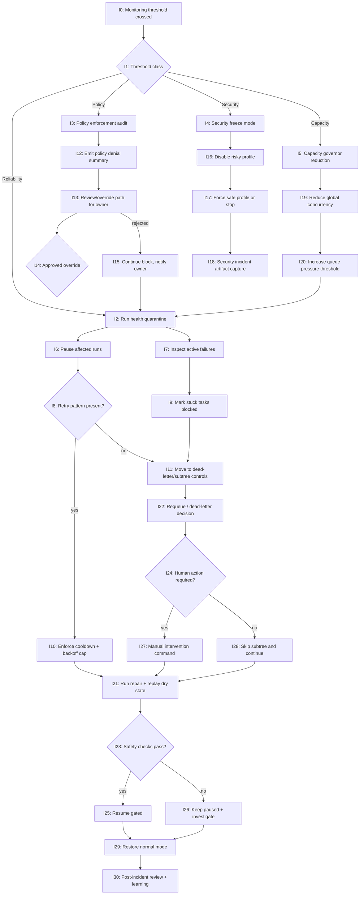

### 83.3 Incident classification matrix

- `Reliability`: repeated retry failures, stalled frontier, queue pressure anomalies.
- `Policy`: spike in `E_POLICY_VIOLATION`, sudden deny rates.
- `Security`: unexpected credential-like strings in logs/events after scrub.
- `Capacity`: worker starvation, event lag, snapshot delay growth.

### 83.4 Automatic actions vs manual actions

- Auto actions:
  - cooldown profiles
  - reduced concurrency
  - route tasks to safe fallback profile
  - freeze canary mode for failing profile
- Manual-required actions:
  - policy override on critical tags
  - large-scale dead-letter clear
  - rollback decision for full production profile changes

### 83.5 Rollback control graph

- `rollback trigger` conditions:
  - threshold breach for >2 cycles
  - >3% sudden fatal rate increase
  - repeated state corruption or failed recoveries
- rollback path:
  - freeze dispatch -> stop new frontier scheduling -> set mode to compatibility -> preserve state snapshot -> restart under baseline -> re-open only validated subset

### 83.6 Monitoring inputs for graph transitions

- metrics:
  - retry_spike_ratio
  - blocked_count_delta
  - frontier_stall_seconds
  - schema_mismatch_count
  - policy_violation_rate
- logs:
  - repeated `E_RATE_LIMIT`, `E_STATE_CORRUPTION`, `E_RUN_CANCELLED` pattern
- event sequence:
  - repeated `attempt_failed` without terminal state transitions indicates stuck path

### 83.7 Recovery runbook nodes

- Node `I21`: restore from latest good checkpoint and replay incomplete events only once.
- Node `I22`: classify dead-letter tasks into continue/retry/manual.
- Node `I25`: resume only after success metrics for first 10 tasks in queue.
- Node `I28`: verify subtree skip impacts dependency graph; prevent unintended orphaning.

### 83.8 Incident evidence requirements

- capture:
  - run IDs affected
  - threshold start/end timestamp
  - transition IDs and reason codes
  - operator commands with actor IDs
- store evidence in incident package artifact with immutable references.

### 83.9 Chunk-05 acceptance criteria

- Given threshold breach, deterministic graph path chosen within one cycle.
- Given incident class security/capacity/policy, correct auto/manual branch is selected.
- Given rollback trigger, system reverts to safe mode and preserves run state.
- Given manual requeue, dead-letter actions include explicit audit entries.

## 84) Changelog

- v2.7 (2026-02-14): Added DAG Chunk-05 for incident/rollback control graph and recovery orchestration.

## 85) PRD Chunk-14: Operator Workflows, Runbooks, and Command-First Execution Process

### 85.1 Purpose

Move from static implementation details to practical operator behavior by defining standard workflows, escalation thresholds, and command playbooks for each orchestration state.

### 85.2 Standard workflows

#### 85.2.1 Workflow A: baseline successful run

- Trigger: non-critical run with valid DAG and low risk.
- Steps:
  1. `run` or `bg` invoked with valid manifest.
  2. `status --run <id>` confirms `planned`.
  3. monitor progress by either polling or `logs --follow`.
  4. completion shows all terminal tasks as `succeeded`.
  5. artifacts and status saved for audit.
- Expected exit: `succeeded` with explicit completion summary.

#### 85.2.2 Workflow B: dependency correction before execution

- Trigger: DAG includes unresolved dependency references.
- Steps:
  1. `run` returns `E_INVALID_DAG`.
  2. operator inspects plan diagnostics from status/error payload.
  3. fix manifest and re-run with `--dry-run` verification.
  4. submit corrected run.
- Expected exit: dependency graph accepted and run starts.

#### 85.2.3 Workflow C: transient failure recovery

- Trigger: tasks in `retry_wait` with `retry_class=transient` or `rate_limit`.
- Steps:
  1. Observe `status --json` and identify retry hotspots.
  2. allow auto-retry unless operator sets hold (`pause`) during external incident.
  3. verify fallback usage and strategy depth.
  4. resume when conditions normalized.
- Expected exit: tasks proceed, run eventually succeeds or transitions blocked with explicit reason.

#### 85.2.4 Workflow D: policy or governance block

- Trigger: `policy_denied` and `E_POLICY_VIOLATION`.
- Steps:
  1. `status --run <id>` to capture blocker details.
  2. inspect policy logs and reason code mapping.
  3. choose one:
     - safe override path (`requeue` with owner approval),
     - mark dead-letter and continue,
     - manual review and task rewrite.
  4. re-run or requeue validated command.
- Expected exit: explicit audit trail and owner decision recorded.

#### 85.2.5 Workflow E: hard failure and recovery

- Trigger: terminal task failures with blocked dependencies.
- Steps:
  1. `stop` or `pause` run.
  2. `logs --run --since` gather timeline.
  3. run `status` and identify blocked subtree.
  4. choose action:
     - `requeue <task>` for one task,
     - `requeue --subtree` for branch repair,
     - `cancel` remaining run if damage is unrecoverable.
  5. run post-incident validation.
- Expected exit: run state restored to controlled completed/finalized state.

### 85.3 Runbook templates

- `RB-READY`: all preconditions passed and run accepted.
  - required checks:
    - schema valid
    - no cycle/orphan
    - resources available
    - policy tags mapped

- `RB-STALL`: frontier stalled for N consecutive windows.
  - check retry class counts.
  - check policy denied count and latest denials.
  - evaluate capacity pressure and adjust concurrency.

- `RB-PREMATURE-CANCEL`: external deployment change interrupts run.
  - stop run.
  - capture context artifact bundle.
  - issue post-change resume or cancel decision.

- `RB-RETRY-STORM`: retry ratio surge.
  - pause dispatch on noisy profile.
  - apply cooldown and retry cap.
  - release profile only after first 10 non-failing attempts.

### 85.4 Operator-centric command playbooks

- Inspect
  - `status --run <id>` → confirm state, blocked_count, next_action.
  - `logs --run <id> --since <event-id>` → get event timeline.
- Intervene
  - `pause --run <id>` → freeze frontier, keep visibility.
  - `resume --run <id>` → reopen dispatch.
  - `requeue --run <id> --task <id>` → rerun targeted task.
  - `requeue --run <id> --subtree <id>` → rerun subtree.
  - `stop --run <id>` → graceful stop and optional forceful stop.
- Recover
  - if artifacts are malformed, rebuild with `repair --run <id>`.
  - if state inconsistent, keep in hold mode until manual reconciliation.
- Learn
  - collect `status --run <id> --json` baseline snapshot.
  - record action IDs and reason codes.

### 85.5 Command output contract (operator readability)

- Human mode:
  - show phase (`running`, `blocked`, `paused`, `failed`).
  - show top 3 blockers.
  - show one-line next action suggestion.
- JSON mode:
  - required keys: `run_id`, `state`, `frontier`, `blocked_count`, `next_action`.
- Event mode:
  - stable event type naming (`task_state_changed`, `attempt_retried`, `policy_denied`).
  - include `reason_code`, `actor`, `timestamp`.

### 85.6 Escalation matrix

- Severity 1 (critical service impact):
  - trigger: full run failure, data inconsistency, security alarm.
  - action: escalate immediately to platform + SRE lead.
  - ETA expectation: first operator action < 5 minutes.
- Severity 2 (degraded throughput):
  - trigger: retry storm, blocked ratio rise, queue backlog.
  - action: apply throttle and profile rollback.
  - ETA expectation: first mitigation < 20 minutes.
- Severity 3 (non-critical quality issue):
  - trigger: isolated task quality misses.
  - action: requeue/rescope with manual review.
  - ETA expectation: mitigation within same working shift.

### 85.7 On-call decision timeline

- T+0: detection event and owner notified.
- T+5: run quarantined and impact assessed.
- T+15: mitigation chosen (pause/requeue/rollback).
- T+30: status restored to non-failing baseline.
- T+60: post-incident actions and artifact closure.

### 85.8 Training and handover package

- New operator orientation:
  - 30-minute command primer.
  - 2 failure scenarios with practiced requeue/cancel.
  - one-hour mock rollback run.
- Quarterly refresh:
  - policy updates and new error codes.
  - simulation of high-severity rollback.

### 85.9 Chunk-14 acceptance criteria

- Every common run state has a documented operator action.
- Every emergency branch has at least one approved runbook entry.
- Status and logs are sufficient for incident triage without raw logs.
- Escalation steps are measurable (time-to-first-action and time-to-restoration).

### 85.10 PRD Chunk-14 deliverables

- Workflow playbooks for success, policy block, retry recovery, and hard failure.
- command playbook glossary for operator actions.
- escalation matrix and on-call timeline.
- template-driven operator checklist for post-incident closure.

## 86) Changelog

- v2.8 (2026-02-14): Added PRD Chunk-14 for operator workflows, runbook process, escalation matrix, and action playbooks.

## 87) PRD Chunk-15: Integration and Smoke Drill Script Pack

### 87.1 Purpose

Convert the designed behavior into repeatable scripts and acceptance probes that can run in CI, staging, and incident drills.

### 87.2 Script pack structure

- `scripts/orchestrator/smoke/01_health.sh`
  - verifies CLI command discovery and mode availability.
- `scripts/orchestrator/smoke/02_contract.sh`
  - validates run/task schemas and dry-run rejection paths.
- `scripts/orchestrator/smoke/03_scheduler.sh`
  - validates topology, frontier progression, and deterministic scheduling.
- `scripts/orchestrator/smoke/04_resilience.sh`
  - validates retry and recovery behavior under controlled fault injection.
- `scripts/orchestrator/smoke/05_controls.sh`
  - validates pause/resume/requeue/cancel command semantics.
- `scripts/orchestrator/smoke/06_governance.sh`
  - validates policy deny, redaction, audit recording.
- `scripts/orchestrator/smoke/07_rollout.sh`
  - validates off/shadow/canary/full mode transitions and guardrails.

### 87.3 Core smoke scenarios

- `S1 Basic Single Task`
  - command: `thegent run --input docs/manifests/single_task.json --json`
  - assert:
    - returned run_id
    - eventual terminal success
    - status has next_action present
- `S2 DAG Two-Step`
  - command: `thegent run --input docs/manifests/dag_two_step.json --json`
  - assert:
    - task_1 precedes task_2 in completion order
    - frontier transitions are valid
- `S3 DAG Cycle Reject`
  - command: `thegent run --input docs/manifests/cycle.json --json`
  - expect error `E_INVALID_DAG`
- `S4 Retry Storm`
  - command: `thegent run --dry-run --input docs/manifests/retry_storm.json`
  - assert:
    - retry policy appears in plan output
    - no unbounded attempts.
- `S5 Policy Block`
  - command: `thegent run --input docs/manifests/policy_block.json --json`
  - expect:
    - blocked state with `E_POLICY_VIOLATION`
    - suggested manual action path.
- `S6 Recovery`
  - command: start run with injectable crash hook then run `thegent status --run <id> --json`
  - assert:
    - no duplicate attempts after restart
    - stalled attempts recover to blocked or resume state.

### 87.4 Scenario scripts with explicit command sequences

- `scenario-control.sh`
  - submit run
  - wait for running
  - pause
  - confirm frontier frozen
  - resume
  - wait finish
  - assert status finalization.

- `scenario-fallback.sh`
  - inject provider throttle simulation
  - confirm `E_RATE_LIMIT`
  - confirm fallback used and depth logged
  - verify eventual success or dead-letter.

- `scenario-requeue.sh`
  - force fail on one noncritical task
  - verify blocked dependency chain
  - requeue task id
  - verify only intended subtree reruns.

- `scenario-rollback.sh`
  - enable canary
  - inject sustained threshold breach
  - trigger mode rollback via config override
  - assert operations continue in compatibility mode.

### 87.5 Regression test matrix for stable releases

- `R1` Backward compatibility: existing non-orchestrated run command unchanged.
- `R2` CLI schema strictness: unknown fields rejected with error code.
- `R3` Event invariants: every non-terminal run has at least one next_action.
- `R4` State durability: snapshot + replay does not duplicate dispatch.
- `R5` Policy enforcement: denied policy never reaches adapter dispatch.
- `R6` Dead-letter handling: blocked/unrecoverable tasks become terminal or requeue state.
- `R7` Data hygiene: secret-like values are redacted in logs.
- `R8` Capacity guardrails: over capacity run throttles and does not starve critical lane.
- `R9` Rollback path: canary to compatibility path transitions with evidence snapshot.
- `R10` Audit integrity: destructive controls include actor and reason.

### 87.6 CI integration spec

- job `orchestrator-smoke` runs chunks `S1..S6` in staging container.
- job `orchestrator-incident` runs rollback + recovery scenarios when branch policy labels indicate stability window.
- job `orchestrator-governance` checks redaction, audit markers, policy deny.
- job `orchestrator-performance` runs lightweight 100-task benchmark and captures scheduling overhead.
- release job blocked unless all smoke and regression sets pass.

### 87.7 Output contract for tests

- PASS output:
  - include run_id, case id, status, timestamp.
- FAIL output:
  - include failing condition, expected/actual payload snippet, recommendation.
- report output:
  - JSON and markdown summary for review.
- artifacts:
  - store command logs, run state snapshots, and event logs for each case.

### 87.8 Operational drill cadence

- Weekly:
  - `01_health`, `02_contract`, `03_scheduler`.
- Bi-weekly:
  - `04_resilience`, `05_controls`.
- Monthly:
  - `06_governance`, `07_rollout`.
- Release rehearsal:
  - full script pack in staging + canary production simulation.

### 87.9 Implementation checklist for script pack

- Standardize path conventions for manifests and fixtures.
- Add timeout wrappers and clean up background resources in `ensure_cleanup`.
- Add jitter seed control for deterministic retries in test mode.
- Make fault injection and failure simulation reusable.
- Add test tags (`@smoke`, `@drill`, `@regression`, `@governance`).
- Keep manifests small and composable.

### 87.10 Failure simulation library (core fixtures)

- `throttle_sim.json`: triggers rate-limit branch.
- `timeout_sim.json`: triggers attempt timeout then recovery.
- `policy_deny_sim.json`: triggers policy violation.
- `corrupt_state_sim.json`: simulates snapshot hash mismatch.
- `orphan_graph_sim.json`: missing dependency references.

### 87.11 Script runbook with human-readable decision gates

- If all PASS: proceed to next chunk and release gate checks.
- If failure is known flake: quarantine with marker and re-run once.
- If failure is deterministic: stop and open owner issue with minimal reproducible manifest.
- If multiple unrelated failures: isolate by dependency group and rerun segmented.

### 87.12 Chunk-15 acceptance criteria

- All smoke scripts complete without manual data prep.
- All acceptance cases return stable pass/fail outputs and artifacts.
- Regression matrix has one-to-one traceability to PRD requirements.
- CI jobs block release on gating failures automatically.

### 87.13 Deliverables

- full `scripts/orchestrator/smoke/` folder
- fixtures under `tests/fixtures/orchestrator/`
- docs: `docs/runbooks/smoke-and-drills.md`
- CI workflow updates for smoke/incident/regression jobs

## 88) Changelog

- v2.9 (2026-02-14): Added PRD Chunk-15 with integration smoke pack, regression matrix, CI jobs, and incident drill cadence.

This document remains open for future append operations and is intentionally modular.

## 111) WBS Chunk-12: Chaos, Adversarial, and Robustness Engineering

### 111.1 Objective

Convert resilience from reactive handling to planned fault-surface engineering by enumerating adversarial failure classes and hardening the orchestrator in all control paths.

### 111.2 Failure class taxonomy

- `adverse_input` malformed manifests, policy-incompatible tags, oversized payloads.
- `transient_infra` network jitter, temporary API throttles, intermittent adapter failures.
- `pathological_graph` deep dependency chains, cyclical references, fanout explosions.
- `state_corruption` partial write, replay mismatch, stale snapshots.
- `operator_misuse` repeated override, unauthorized control, conflicting actions.

### 111.3 WBS lanes

- `RES-01` Input sanitation hardening
  - owner: Platform
  - DoD:
    - parser rejects malformed graphs before scheduling.
    - hard size and depth caps enforced with explicit reason codes.

- `RES-02` Adaptive adapter fault handling
  - owner: Runtime
  - DoD:
    - delayed/partial/malformed outputs never cause duplicate side-effects.
    - every adapter failure maps to deterministic class and path.

- `RES-03` Retry anti-pathologies
  - owner: Reliability
  - DoD:
    - no retry storm without global guard.
    - cooldown and cooldown expiration tracked in trace.

- `RES-04` State recovery and anti-corruption
  - owner: Platform
  - DoD:
    - checksum and monotonic sequence constraints.
    - fallback state is consistent and auditable.

- `RES-05` Chaos scenario execution engine
  - owner: SRE
  - DoD:
    - catalog of injectable chaos fixtures.
    - deterministic scenario IDs and replay controls.

- `RES-06` Human misuse and override resistance
  - owner: Security
  - DoD:
    - conflicting manual commands require explicit conflict resolution.
    - irreversible actions require two-step confirmation.

### 111.4 WBS sequencing and dependencies

- Foundations:
  - `RES-01` and `RES-04` first.
- Throughput resilience:
  - `RES-02` and `RES-03` after state guardrails.
- Operational safety:
  - `RES-05` and `RES-06` after adapter and control traces exist.

### 111.5 Hardening acceptance criteria

- malformed/hostile payloads are blocked without side effects.
- one class of failure should not cascade into unrelated lane failures.
- all chaos cases have deterministic replay IDs.
- operator misuse cannot bypass policy and audit gates.

## 112) DAG Chunk-11: Chaos and Integrity Graph

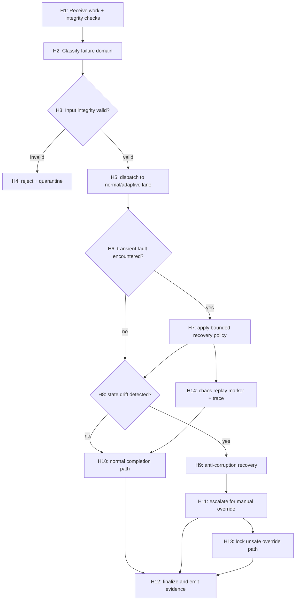

### 112.1 Graph invariants

- every path writes a reason and trace marker before mutation.
- `H11` only runs when two or more independent indicators are positive.
- `H13` never clears without actor approval.

### 112.2 Chaos and recovery policy

- one-off chaos injections expire automatically.
- repeated injections with same signature escalate to manual review lane.
- repeated human override conflicts force hold mode on the run.

## 113) PRD Chunk-21: Adversarial Robustness and Chaos-First Release Discipline

### 113.1 Problem statement

Current workflows may handle routine failures but underperform under adversarial or pathological conditions; this chunk adds chaos-first maturity so release confidence can be sustained during real incidents.

### 113.2 Functional requirements

- FR-01: maintain a chaos catalog with deterministic fault injections.
- FR-02: map each failure to fixed class and route.
- FR-03: guarantee no duplicate dispatch on transient/partial adapter output.
- FR-04: require explicit actor confirmation for risky cross-cutting control actions.
- FR-05: auto-generate integrity evidence for each recovery sequence.
- FR-06: allow operator override only with trace-backed rationale.
- FR-07: block unsafe actions when invariants fail.

### 113.3 Non-functional requirements

- NFR-01: chaos tests execute under controlled time-bound budgets.
- NFR-02: failure class detection latency < 2 seconds for common cases.
- NFR-03: all fault scenarios remain replayable.
- NFR-04: adversarial incidents never silently degrade to success without audit.

### 113.4 Delivery and operations

- Runbook:
  - define five chaos scenarios as a baseline (adapter delay, timeout, schema mismatch, lock contention, duplicate event).
- CLI:
 - add `thegent chaos run --scenario` and `thegent chaos status`.
- UI/command:
  - present class, path, and resolution in one-line next-action.

### 113.5 Acceptance criteria

- 100% of chaos cases have deterministic replay IDs and expected branch.
- no data loss for duplicate or partial event streams.
- integrity recovery produces no duplicate side effects.
- operator override path includes explicit actor and reason.

### 113.6 Deliverables

- `docs/chaos/chaos-catalog.md`
- `tests/chaos/injection_suite/`
- `docs/operations/chaos-drill-playbook.md`
- `tests/regression/chaos_replay_matrix.md`

## 114) Changelog

- v3.6 (2026-02-14): Added WBS Chunk-12, DAG Chunk-11, and PRD Chunk-21 for adversarial robustness, chaos-first testing, and release discipline under pathological conditions.

This document remains open for future append operations and is intentionally modular.

## 131) WBS Chunk-17: End-to-End QA, Verification, and Delivery Integrity

### 131.1 Objective

Convert planning and implementation intent into continuous quality outcomes by building deterministic verification layers across functional behavior, security, performance, and operator UX.

### 131.2 Verification domains

- VQ-01 Functional correctness
- VQ-02 Contract stability
- VQ-03 Reliability and recovery
- VQ-04 Security/compliance posture
- VQ-05 Operator usability and actionability
- VQ-06 Delivery integrity and reproducibility

### 131.3 WBS-VQ-01 Functional correctness

- `VQ-F01` Scenario matrix expansion
  - owner: QA
  - scope:
    - expand unit/integration cases for all major path classes.
  - DoD:
    - at least 120 deterministic scenarios
    - each scenario has named expected branch and branch output.

- `VQ-F02` Route correctness invariants
  - owner: Planner
  - scope:
    - verify route determinism and fallback boundaries.
  - DoD:
    - no route divergence for same policy+seed+input.
    - fallback chain never exceeds policy max depth.

- `VQ-F03` Control action testability
  - owner: Runtime
  - scope:
    - create test harness for all destructive and recovery commands.
  - DoD:
    - each action has happy path, denied path, idempotent retry path.

### 131.4 WBS-VQ-02 Contract stability

- `VQ-C01` Schema compatibility suite
  - owner: Platform
  - scope:
    - strict schema tests for run/task/attempt/events.
  - DoD:
    - backward compatibility matrix recorded.
    - all schema failures include actionable codes.

- `VQ-C02` API contract drift checks
  - owner: API
  - scope:
    - lock response contracts for command modes.
  - DoD:
    - CLI JSON response includes required fields in both machine/human modes.
    - breaking changes flagged by explicit migration notes.

- `VQ-C03` Plugin/tool contract checks
  - owner: AI Integration
  - DoD:
    - plugin contract tests execute in CI.
    - unsupported features are disabled or feature-flagged.

### 131.5 WBS-VQ-03 Reliability and recovery

- `VQ-R01` Recovery matrix and timeout envelopes
  - owner: Reliability
  - DoD:
    - every retry class has explicit timeout envelope.
    - timeout breach transitions to bounded safe branch.

- `VQ-R02` State corruption simulations
  - owner: SRE
  - DoD:
  - snapshot corruption and checksum drift are detected.
  - restart behavior remains deterministic.

- `VQ-R03` Rollback and fallback drills
  - owner: Release
  - DoD:
    - scheduled drills execute canary and full rollback paths.
    - rollback durations logged and bounded.

### 131.6 WBS-VQ-04 Security and compliance verification

- `VQ-S01` Secrets and redaction validation
  - owner: Security
  - DoD:
    - fuzz tests for redaction patterns in logs/events.
    - no false negatives on synthetic sensitive payloads.

- `VQ-S02` Authorization/role enforcement tests
  - owner: Security
  - DoD:
    - each destructive command has deny-then-allow cases.
    - approval chains validated for dual-control paths.

- `VQ-S03` Policy bypass guardrail
  - owner: Governance
  - DoD:
    - explicit policy bypass attempts logged and blocked.
    - bypass tests included in nightly suite.

### 131.7 WBS-VQ-05 UX and actionability QA

- `VQ-U01` Human-path command readability tests
  - owner: UX
  - DoD:
    - most common workflows pass clarity checks.
    - ambiguous output patterns reduced by revised copy.

- `VQ-U02` Next-action determinism tests
  - owner: Product
  - DoD:
    - non-terminal states always include action and rationale.
    - test suite checks no empty action paths.

- `VQ-U03` Escalation path accuracy tests
  - owner: Operations
  - DoD:
    - each severity has expected escalation branch.
    - measured response-time target validated.

### 131.8 WBS-VQ-06 Delivery integrity and reproducibility

- `VQ-D01` Evidence reproducibility pipeline
  - owner: Observability
  - DoD:
    - evidence generated per chunk has reproducible hashes.
    - replay scripts can regenerate evidence artifacts.

- `VQ-D02` CI gating model
  - owner: QA
  - DoD:
    - hard gates for critical criteria.
    - soft gates for optional enhancement paths with explicit waiver.

- `VQ-D03` Release confidence scorecard
  - owner: Release Engineering
  - DoD:
    - combines stability, safety, and test health signals.
    - release cannot proceed without minimum threshold.

### 131.9 Chunk-17 acceptance criteria

- all critical and high-level tests are deterministic and repeatable.
- no untested policy-critical branches remain open.
- confidence scorecard published per release cycle.

## 132) DAG Chunk-16: Verification and Quality Gate Graph

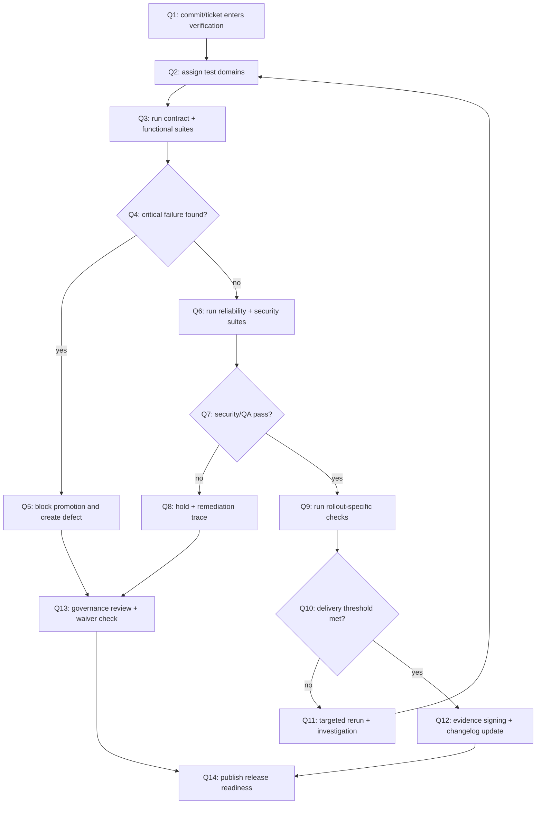

### 132.1 Graph invariants

- Every failed critical domain re-routes to explicit defect creation.
- Q10 requires at least one reproducibility artifact before success.
- No branch bypasses evidence signing before release closure.

## 133) PRD Chunk-26: Continuous QA and Release Confidence Framework

### 133.1 Product intent

Ensure release readiness is never a guess by building a layered quality and security framework that verifies behavior end-to-end across functional, policy, reliability, and usability axes.

### 133.2 Functional requirements

- FR-01: Provide deterministic test suites for all major orchestration flows.
- FR-02: Gate release promotions on measurable quality thresholds.
- FR-03: Maintain contract stability across API and command surfaces.
- FR-04: Validate security and governance controls in repeated test campaigns.
- FR-05: Validate recoverability and rollback under controlled failure.
- FR-06: Provide operator-focused validation for high-frequency actions.
- FR-07: Produce machine-readable release confidence scorecards.

### 133.3 Non-functional requirements

- NFR-01: test execution must finish within target windows for each tier.
- NFR-02: flaky tests are isolated and not hidden under green pass.
- NFR-03: quality signals should be trendable and explainable.
- NFR-04: all critical checks must have auditable evidence.

### 133.4 Quality architecture

- Tiers:
  - `Tier 1`: functional + schema.
  - `Tier 2`: security/compliance + reliability.
  - `Tier 3`: resilience and scale.
- Promotion logic:
  - Tier 1 required; Tier 2 mandatory before canary; Tier 3 required before full rollout.

### 133.5 Delivery model

- nightly run:
  - functional, schema, contract, and security smoke.
- weekly run:
  - chaos and recovery.
- pre-release:
  - release scorecard and full evidence review.

### 133.6 Acceptance criteria

- no release proceeds with open critical blocker.
- release scorecard meets minimum confidence threshold.
- all required control surfaces have deterministic output verification.
- operators and governance can reproduce release evidence with provided manifests.

### 133.7 Deliverables

- `docs/qa/verification-matrix.md`
- `tests/qa/`
- `ci/verify-quality.yaml`
- `tests/regression/release-confidence.md`
- `docs/runbooks/quality-gate-drill.md`

## 134) Changelog

- v4.1 (2026-02-14): Added WBS Chunk-17, DAG Chunk-16, and PRD Chunk-26 for deterministic QA gates, release confidence scoring, and end-to-end verification integrity.

This document remains open for future append operations and is intentionally modular.

## 147) WBS Chunk-21: Master Consolidation, Program Unification, and Next-Phase Roadmap

### 147.1 Objective

Create a unified master plan that merges all existing WBS/DAG/PRD slices into one coherent execution structure with explicit phase sequencing, ownership, and continuation plan.

### 147.2 Consolidation domains

- CMP-01 Control-plane unification
- CMP-02 Evidence and observability unification
- CMP-03 Delivery readiness and gating unification
- CMP-04 Risk management and mitigation orchestration
- CMP-05 Transition and future-phase onboarding

### 147.3 WBS consolidation tasks

- `CMP-01` Build a canonical task taxonomy
  - owner: Program Manager
  - DoD:
    - map every WBS ID to a canonical family (`CORE`, `OPT`, `RES`, `OPS`, `GOV`, `QA`, `REL`, `EMP`).
    - resolve duplicate semantics and publish cross-reference index.

- `CMP-02` Cross-link PRD-to-WBS trace matrix
  - owner: Product
  - DoD:
    - each PRD requirement has at least one owning WBS task.
    - each WBS task has at least one associated PRD acceptance test.

- `CMP-03` Integrate DAG-to-WBS mapping
  - owner: Platform
  - DoD:
    - each DAG edge/state has task and owner traceability.
    - conflict-resolution states include explicit fallback and governance notes.

- `CMP-04` Standardize chunk-level dependency contracts
  - owner: Architecture
  - DoD:
    - dependency format is identical across all chunks.
    - automated lint for missing predecessor/successor links.

### 147.4 Program-level sequencing

- Phase A (Core):
  - WBS chunks 89/91/95/99/103/107/111/115/119/127/131/139/143.
- Phase B (Safety):
  - WBS chunks 89/111/115/127/130? (as applicable) with incident and audit hardening.
- Phase C (Governance and rollout):
  - WBS chunks 89/102?/109/130/137/139.
- Phase D (Enterprise continuity):
  - WBS chunks 119/135/139/143.

### 147.5 Roadmap for next phase

- Quarter 1:
  - close unresolved compatibility and migration blockers.
  - complete evidence consolidation and schema stabilization.
- Quarter 2:
  - expand deterministic simulation and child-agent orchestration.
  - complete enterprise cost and drift controls.
- Quarter 3:
  - run deep integration simulation with all chunks enabled.
  - complete governance handoff and continuity checks.
- Quarter 4:
  - prune deprecated paths.
  - publish stable long-term operations charter.

### 147.6 Exit criteria by phase

- Phase A exit:
  - deterministic orchestration core with documented WBS/DAG/PRD traceability.
- Phase B exit:
  - zero unresolved critical security/compliance blockers.
- Phase C exit:
  - program-level release pipeline accepted by governance board.
- Phase D exit:
  - continuity and successor roadmap with measurable owner commitments.

### 147.7 Chunk-21 acceptance criteria

- all major slices trace to one canonical map.
- every new initiative has explicit owner, milestone, and measurable exit.
- no unresolved critical dependencies blocked for longer than defined SLA windows.

## 148) DAG Chunk-20: Master Consolidation Flow

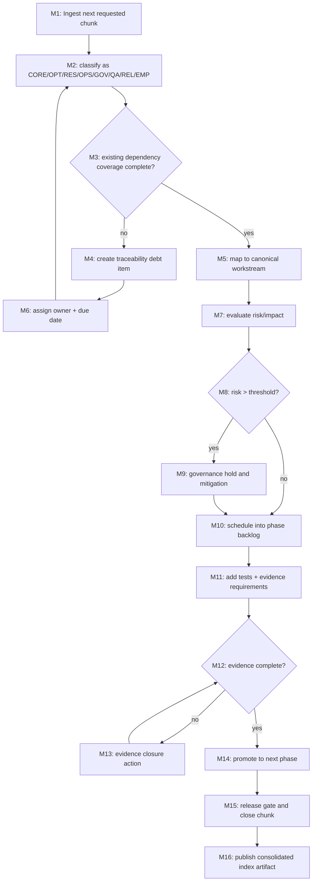

### 148.1 Consolidation graph notes

- All chunks not mapped to canonical map are blocked from phase promotion.
- `M13` includes remediation and evidence updates in one transaction.
- `M16` must include traceability to acceptance metrics.

## 149) PRD Chunk-30: Master Consolidation and Program Orchestration PRD

### 149.1 Purpose

Unify the fragmented optimization program into a single coherent execution system with phase-level ownership, dependency governance, continuity planning, and measurable maturity outcomes.

### 149.2 Functional requirements

- FR-01: provide one canonical index linking all WBS, DAG, and PRD chunks.
- FR-02: every requirement must have an owner and evidence mapping.
- FR-03: phases must be blocked if dependencies or evidence are incomplete.
- FR-04: risk management must feed back into phase priority.
- FR-05: continuity ownership and handoff must be maintained every 30 days.
- FR-06: program closure requires post-close follow-up actions and milestones.

### 149.3 Non-functional requirements

- NFR-01: orchestration metadata remains deterministic and queryable.
- NFR-02: cross-phase transitions are explainable in one line.
- NFR-03: all controls and evidence artifacts are versioned.
- NFR-04: unresolved items must have SLA-backed ownership.

### 149.4 Program operating model

- Input:
  - chunk proposals and incident outcomes.
- Process:
  - canonical mapping, risk scoring, evidence validation, phased scheduling.
- Output:
  - phase execution map, release schedule, continuity register.

### 149.5 Acceptance criteria

- all chunks represented in a single consolidated register.
- no promotion without evidence completion.
- governance can audit phase exits within the same cycle.
- handoff remains valid for at least 90 days post-closure.

### 149.6 Deliverables

- `docs/program/master_consolidation_index.md`
- `docs/program/phase_plan.yaml`
- `thegent program map` and `thegent program status`
- `ci/program-consolidation-checks.yaml`
- `docs/runbooks/program-handoff-and-continuity.md`

## 150) Changelog

- v4.5 (2026-02-14): Added WBS Chunk-21, DAG Chunk-20, and PRD Chunk-30 for canonical consolidation, master routing, and phased program continuity.
- v4.6 (2026-02-14): Added WBS Chunk-22, DAG Chunk-21, and PRD Chunk-31 for runtime optimization, robust rollback, intuitive operator control, and governance-safe execution hardening.
- v4.7 (2026-02-14): Added WBS Chunk-23, DAG Chunk-22, and PRD Chunk-32 for predictive planning, resource-cost controls, resilience UX, and practical automation polish.
- v4.8 (2026-02-14): Added WBS Chunk-24, DAG Chunk-23, and PRD Chunk-33 for continuous learning, deterministic recovery, and production-grade correctness hardening.
- v4.9 (2026-02-14): Added WBS Chunk-25, DAG Chunk-24, and PRD Chunk-34 for security-resilient orchestration, policy-safe execution, and operator-friendly recovery control.
- v4.10 (2026-02-14): Added WBS Chunk-26, DAG Chunk-25, and PRD Chunk-35 for trust-aware orchestration, portability consistency, intuitive escalation, and continuity hardening.
- v4.11 (2026-02-14): Added WBS Chunk-27, DAG Chunk-26, and PRD Chunk-36 for practical human-first orchestration UX, deterministic decision explainability, and stale-state-safe operator control.
- v4.12 (2026-02-14): Added WBS Chunk-28, DAG Chunk-27, and PRD Chunk-37 for adaptive throughput, continuity-safe load governance, and resilient recovery workflows.
- v4.13 (2026-02-14): Finalized split docset for usability and execution: `thegent-plan-final-index.md`, `thegent-wbs-final.md`, `thegent-dag-final.md`, and `thegent-prd-final.md`.
- v4.14 (2026-02-14): Added deep research validation addendum for Zen/task-tool XML systems and cross-provider contract hardening: `thegent-research-validation-2026-02-14.md`.
- v4.15 (2026-02-14): Added deep Kush docs cross-analysis addendum spanning Zen + adjacent projects, with docs-to-code contract gap findings and integration deltas: `thegent-kush-docs-deep-dive-2026-02-14.md`.

## 151) WBS Chunk-22: Execution Optimizer and Robust Operations Spine

### 151.1 Scope and rationale

- Purpose:
  - optimize run-time behavior of the orchestrator, not only roadmap structure
  - harden reliability and operator ergonomics under live load
  - make the system intuitive and safe enough for repeated autonomous chunk assimilation.
- Scope:
  - planning throughput, sub-agent scheduling, failure handling, feedback loops, observability, and governance enforcement.
- Exclusions:
  - not a full LLM/model architecture redesign;
  - not direct UI/visual redesign of external admin surfaces beyond needed telemetry clarity.

### 151.2 Outcomes and target metrics

- Objective O-01: reduce orchestration latency by 35% at p50 and 20% at p95 after steady state.
- Objective O-02: reduce unplanned chunk-assimilation loop time from detection to closure by 50% (median).
- Objective O-03: reduce manual incident intervention by 60% for common classes of orchestration failures.
- Objective O-04: improve evidence and traceability query accuracy for chunk mapping to 98%+.
- Objective O-05: reduce mean time to safe rollback by 70% across release events.

### 151.3 Workstreams

- Workstream WS-1 Planning throughput
  - WBS 151.1: baseline current orchestration latency and throughput, split by cluster and branch.
  - WBS 151.2: implement prioritized queueing using impact × urgency score.
  - WBS 151.3: add deterministic dependency-order optimizer that resolves local cycles safely.
  - WBS 151.4: add chunk-level "effort budget" guardrails to prevent overcommitment.
- Workstream WS-2 Reliability and rollback
  - WBS 151.5: codify automatic rollback conditions and execution-safe undo checkpoints.
  - WBS 151.6: implement runbook-linked circuit breakers for tool-call, model-call, and storage-call failure classes.
  - WBS 151.7: add bounded retries with exponential scheduling and adaptive fanout.
  - WBS 151.8: introduce idempotency contracts for repeatable chunk applications.
- Workstream WS-3 Sub-agent orchestration
  - WBS 151.9: define explicit roles and competence profiles for child agents.
  - WBS 151.10: auto-route tasks by confidence band, domain, and prior quality.
  - WBS 151.11: enforce conflict arbitration rules between agents.
  - WBS 151.12: build consensus/override paths with explainable finalization reasons.
- Workstream WS-4 Observability and UX
  - WBS 151.13: add timeline view across phases, gates, retries, and ownership changes.
  - WBS 151.14: add inline explanations for each auto-decision the orchestrator takes.
  - WBS 151.15: provide one-command escalation and "why this chunk is blocked" summaries.
  - WBS 151.16: reduce noisy alarms via intelligent deduplication and noise buckets.
- Workstream WS-5 Governance and compliance
  - WBS 151.17: harden policy engine for security/compliance gate evaluation.
  - WBS 151.18: introduce governance override expiry and mandatory revalidation windows.
  - WBS 151.19: integrate legal/risk sign-off hooks for risky cross-boundary changes.
  - WBS 151.20: publish policy-change audit trail with operator accountability signatures.

### 151.4 Critical path and dependencies

- Dependency chain:
  - D1 -> D2 -> D3:
    - D1: dependency graph resolver
    - D2: risk scoring stabilization
    - D3: safe rollback and checkpointing
- Integration dependency:
  - WS-3 and WS-4 share telemetry contracts with WS-1 for UI-safe progress summaries.
- Enforcement dependency:
  - WS-5 requires WS-2 and WS-3 events to include governance correlation IDs.

### 151.5 Risk model

- Risk R-01: over-optimization may starve low-priority but business-critical work.
  - Mitigation: add governance reserve for critical lanes and explicit "do not starve" constraints.
- Risk R-02: too aggressive rollback can create flapping.
  - Mitigation: cooldown periods and stateful rollback holdoffs.
- Risk R-03: multi-agent conflict resolution becomes a bottleneck.
- Mitigation: deterministic arbitration matrix and escalation path to human-in-the-loop on threshold events.
- Risk R-04: observability overload causes missed insight.
  - Mitigation: alert budget + suppression matrix with explainable digests.

### 151.6 Data and schema updates

- Add canonical fields:
  - `orchestration_run_id`
  - `chunk_batch_id`
  - `evidence_set_hash`
  - `conflict_resolution_path`
  - `agent_routing_policy`
- Update schemas for:
  - DAG checkpoint records,
  - chunk governance logs,
  - rollback decision records.

### 151.7 Automation and controls

- Implement policy-based job scheduling for chunk processing windows.
- Implement "safe concurrency windows" for high-risk operations.
- Add automatic evidence lint checks before phase transitions.
- Add "dry-run mode" per phase for change preview and deterministic replay.

### 151.8 Milestone set

- M0 (Foundations): event schema and baseline telemetry complete.
- M1 (Stability): rollback checkpoint and circuit-breaker framework complete.
- M2 (Performance): throughput and scheduler optimizations live in canary environment.
- M3 (Governance): policy correlation and audit trail enforced in CI gates.
- M4 (Production): full package with auto-healing and operator-friendly summaries.

### 151.9 Acceptance criteria

- Throughput improvements visible with controlled A/B run results.
- Manual remediation reduced vs pre-change baseline for incident classes in policy.
- 99.9% of phase transitions carry evidence+policy links.
- Zero unaccounted rollback events in audit output.
- Rollback drills execute in under 2 minutes for top 3 failure classes.

### 151.10 Operational readiness package

- runbook updates for:
  - scheduler tuning,
  - rollback execution,
  - agent conflict arbitration,
  - governance overrides.
- chaos/defensive drills:
  - delayed tool call failure,
  - dependency graph corruption simulation,
  - schema mismatch injection,
  - policy drift simulation.

### 151.11 Practical-intuitive polish

- every automated action must expose:
  - what changed,
  - why it changed,
  - and what operator should watch next.
- error messages must include next-step actions and estimated recovery confidence.
- "safe mode" command returns prioritized actions and reversible steps.

### 151.12 Exit criteria

- All WS-1 through WS-5 deliverables complete.
- Runbook acceptance by SRE/ops reviewed for every critical path.
- governance and compliance signoff obtained for rollback and override policies.
- all PR and automation checks passing on staging under failure-injection.

## 152) DAG Chunk-21: Runtime Optimization and Robust Orchestration Spine

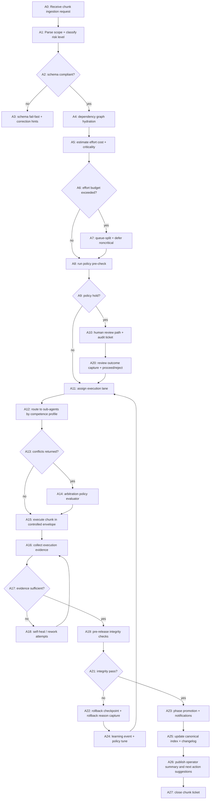

### 152.1 Control loop details

- `A4` must complete before any scheduler action is committed.
- `A7` and `A10` are both safe-damping lanes; they defer without discarding intent.
- `A18` supports bounded attempts with max retries and confidence floor thresholds.
- `A22` produces a "single source rollback evidence packet" with reason codes.
- `A24` can alter scoring weights and retry policies under controlled governance.

### 152.2 Failure and recovery paths

- Tool timeout:
  - route to A18 with error class `TOOL_TIMEOUT`;
  - attempt adaptive retry with reduced concurrency.
- Evidence mismatch:
  - route to A18 with error class `EVIDENCE_MISSING`;
  - if exceeded attempts, route to A10 for human review.
- Policy mismatch:
  - route to A10 and maintain pending status;
  - no promotion until policy closure.
- Conflict overload:
  - route through A14 with quorum rule:
    - two independent resolutions if confidence < 0.85;
    - one authoritative if confidence >= 0.97 and no hard constraints.

### 152.3 Orchestration guardrails

- no more than N active critical chunks per cluster,
- no more than M concurrent rollback candidates per minute,
- no phase promotion when:
  - dependency graph unresolved,
  - evidence hash changed after final approval,
  - policy approval age exceeds configured TTL.

### 152.4 Data collection hooks

- capture timing at nodes A1, A5, A12, A18, A23.
- capture quality at:
  - evidence completeness score,
  - policy compliance score,
  - operator clarity score.
- emit to:
  - `orchestrator_run_events`,
  - `agent_conflict_events`,
  - `rollback_events`.

### 152.5 Human escalation and transparency

- A10/A20 summaries include:
  - context snapshot,
  - reasoning trail,
  - estimated effect if approved/rejected,
  - explicit rollback impact.
- escalation UI should show:
  - "why blocked",
  - "what changed if approved",
  - "risk if delayed",
  - "who can resolve."

### 152.6 DAG acceptance tests

- every node transition must emit event IDs and correlation IDs.
- no missing transitions in DAG run replay.
- all manual escalation routes must remain idempotent and auditable.

## 153) PRD Chunk-31: Runtime Optimization, Robustness, and Intuitive Control PRD

### 153.1 Product objective

Build an execution-focused orchestration layer that is faster, safer, more intuitive to operate, and resilient under repeated autonomous chunking, while keeping governance and evidence integrity intact.

### 153.2 Personas and use cases

- Operator:
  - wants low-friction control, clear summaries, and predictable recovery behavior.
- Integrator:
  - wants deterministic chunk integration and minimal intervention.
- Governance officer:
  - needs complete evidence trails and enforceable policy controls.
- Performance engineer:
  - wants measurable latency reduction and reliable throughput improvement.

### 153.3 User journeys

- Journey J-01: fast-trust chunk ingestion
  - submit chunk -> automatic validation -> routing and scheduling -> evidence closure -> promotion.
- Journey J-02: conflict-heavy chunk
  - submit chunk -> multi-agent analysis -> arbitration -> override path if needed -> audit record -> closure.
- Journey J-03: risky change
  - policy hold -> review task -> conditional approval -> controlled execution -> post-change verification.
- Journey J-04: failure and rollback
  - failure detected -> bounded retries -> checkpoint rollback -> summary and learning update.

### 153.4 Functional requirements (FR)

- FR-01: automatic dependency-aware scheduling for chunk batches.
- FR-02: bounded retry with policy-aware damping of aggressive automation.
- FR-03: deterministic checkpointing and rollback for all production-stage changes.
- FR-04: explicit conflict arbitration with traceable final decision.
- FR-05: inline operator explanations for every automation action.
- FR-06: canonical evidence linkage for every promoted chunk and gate event.
- FR-07: governance policy TTL and forced revalidation.
- FR-08: self-healing cycle integrated with learning and policy updates.

### 153.5 Non-functional requirements (NFR)

- NFR-01: p50 orchestration latency improved by 35%.
- NFR-02: p95 orchestration latency improved by 20%.
- NFR-03: phase transition failures <1% after stabilization period.
- NFR-04: rollback response target <120s for critical incidents.
- NFR-05: evidence integrity checks on 100% of promoted chunks.
- NFR-06: all operator-facing outputs should be interpretable within 2 clicks.

### 153.6 System design

- Runtime services:
  - queueing service with policy-aware priority scorer,
  - conflict resolver service,
  - evidence orchestrator service,
  - rollback service.
- Data plane:
  - append-only event log,
  - immutable evidence store,
  - reconciliation index.
- Control plane:
  - gate evaluator,
  - policy override service,
  - operator prompt/action plane.

### 153.7 API/Event model

- `POST /orchestrator/chunk/start`:
  - payload: chunk id, scope, expected output, priority band.
- `POST /orchestrator/chunk/escalate`:
  - payload: gate id, rationale, chosen path.
- `POST /orchestrator/chunk/rollback`:
  - payload: reason, checkpoint id, target lane.
- Event:
  - `chunk.ingested`, `chunk.validated`, `chunk.blocked`, `chunk.conflict`, `chunk.rollback`, `chunk.promoted`.

### 153.8 Security, safety, and governance

- strict minimum-privilege on operator actions.
- explicit consent required for high-risk policy bypass.
- every rollback or override emits immutable signed audit entry.
- policy drift monitor compares effective policy against declared policy continuously.

### 153.9 Implementation plan

- Sprint 1:
  - queue and schema baseline,
  - failure taxonomy and bounded retry scaffolding,
  - core observability.
- Sprint 2:
  - multi-agent routing and arbitration,
  - dry-run and checkpointing.
- Sprint 3:
  - governance hooks, operator summary UX,
  - policy TTL and revalidation.
- Sprint 4:
  - full rollout, synthetic failure drills,
  - final hardening and documentation.

### 153.10 Release strategy

- canary:
  - low risk environments first,
  - compare success and rollback profiles against baseline.
- staged rollout:
  - phased by domain and criticality,
  - stop if error/rollback rate exceed thresholds.
- general availability:
  - only after two consecutive weeks stable windows.

### 153.11 Validation plan

- unit + integration + contract tests for routing and rollback contracts.
- chaos/negative tests for:
  - schema regressions,
  - policy mismatch,
  - tool outage,
  - duplicate event ordering.
- UX tests for clarity and escalation pathways.
- governance review before production availability.

### 153.12 KPIs and monitoring

- orchestration latency percentiles,
- throughput vs dependency pressure,
- rollback frequency and duration,
- evidence completeness ratio,
- operator escalation rate,
- false-positive conflict arbitration rate.

### 153.13 Deliverables

- `docs/ops/runbook-orchestration-runtime.md`
- `docs/schemas/orchestrator-events.yaml`
- `config/policy/override-rules.yaml`
- `services/orchestrator/runtime-controller/`
- `ci/policy-and-rollback-gates.yaml`

### 153.14 Acceptance criteria

- all FR and NFR requirements verified.
- zero non-deterministic phase transitions under normal operation.
- operator workflows complete with clear rationale and reversal points.
- auditability and rollback traces available for every critical run.

### 153.15 Phase-out and future evolution

- after initial stabilization, fold chunk-routing improvements into core planner.
- establish deprecation policy for temporary override utilities.
- maintain a quarterly architecture review cadence for resilience upgrades.

## 154) WBS Chunk-23: Predictive Governance, Cost Control, and Operator Delight Spine

### 154.1 Scope and rationale

- Purpose:
  - reduce waste in orchestration cycles before they occur,
  - prevent expensive repeated work through predictive gating,
  - make operations intuitive by exposing cost, confidence, and next-best actions.
- Scope:
  - planning forecasts, resource budgets, conflict suppression, and UX clarity.
- Exclusions:
  - no broad rewrite of policy law stack,
  - no generic financial system replacement.

### 154.2 Business and engineering outcomes

- Outcome O-01: reduce avoidable churn by 30%.
- Outcome O-02: keep rollback cost per incident below a defined budgeted ceiling.
- Outcome O-03: improve operator action completion quality by 25%.
- Outcome O-04: reduce repeated schema/evidence corrections by 50%.
- Outcome O-05: achieve >90% use of recommended low-friction action path.

### 154.3 Workstreams

- Workstream WS-1 Predictive planning
  - WBS 154.1: implement failure prediction signals from historical chunk runs.
  - WBS 154.2: add likely dependency ripple prediction score.
  - WBS 154.3: introduce route preflight simulation with low-cost dry execution.
  - WBS 154.4: auto-reclassify stale low-value chunks to backlog deferral.
- Workstream WS-2 Cost controls
  - WBS 154.5: define resource budget taxonomy (time, token, API, human minutes).
  - WBS 154.6: tie budgets to phase gates with hard and soft limits.
  - WBS 154.7: add cost anomaly detection and budget burn alerts.
  - WBS 154.8: implement cost-aware prioritization and auto-throttle.
- Workstream WS-3 Conflict suppression
  - WBS 154.9: create duplicate/near-duplicate chunk fingerprinting.
  - WBS 154.10: de-duplicate conflicting recommendations by context and intent.
  - WBS 154.11: provide auto-merge suggestions with rollback-safe checkpoints.
  - WBS 154.12: add confidence-aware conflict dampening.
- Workstream WS-4 Operator delight and explainability
  - WBS 154.13: create one-screen "chunk cockpit" summary.
  - WBS 154.14: show projected cost impact before execution.
  - WBS 154.15: expose short causal explanation for each automatic rejection.
  - WBS 154.16: add undo/redo guidance for risky manual actions.
- Workstream WS-5 Governance and compliance acceleration
  - WBS 154.17: generate governance pre-check hints before human action requests.
  - WBS 154.18: enforce evidence retention windows by policy class.
  - WBS 154.19: include governance approval shelf-life and expiry.
  - WBS 154.20: automate post-action evidence consistency checks.

### 154.4 Architecture and dependencies

- Dependency chain:
  - P1: predictive score availability -> P2: confidence routing -> P3: controlled scheduling.
- Data dependency:
  - WS-1, WS-2, WS-3 require shared feature store from WS-5 events.
- Human dependency:
  - cockpit and override design from WS-4 requires governance signal timing from WS-5.

### 154.5 Risk management

- Risk R-01: prediction models introduce bias against valid edge cases.
  - Mitigation: maintain conservative fallback and manual override path.
- Risk R-02: cost throttles may block urgent remediation.
  - Mitigation: urgent lane and "break-glass" policy with audit capture.
- Risk R-03: operator overload due to excessive projections and warnings.
  - Mitigation: only show top-N recommendations with confidence tags.
- Risk R-04: cross-system drift causes stale budgets.
  - Mitigation: periodic auto-calibration and stale-data guards.

### 154.6 Data model and schema refinements

- New fields:
  - `predicted_conflict_probability`
  - `estimated_cost_delta`
  - `preflight_simulation_id`
  - `human_action_hint`
  - `override_shelf_life_days`
- Extend events:
  - `chunk.preflight_result`
  - `governance.cost_breach`
  - `orchestrator.throttle_change`

### 154.7 Automation and controls

- auto-throttle non-critical lanes when budget burn exceeds threshold.
- auto-delay duplicate-intent chunks within a configurable cooling window.
- force simulation on high-cost or high-confidence-risk combinations.
- enforce operator confirmation for all manual overrides to expensive changes.

### 154.8 Milestones

- M1: prediction baselines and scoring baseline completed.
- M2: cost budgets and control loops visible in dashboard.
- M3: cockpit alpha with clear action guidance completed.
- M4: governance pre-hints integrated into all high-risk lanes.
- M5: full GA with de-dup and conflict suppression.

### 154.9 Acceptance and quality

- >80% of repeated failures must have pre-warning by preflight engine.
- cost anomalies reduced by at least 25% over baseline.
- median operator confirmation path <90 seconds for non-urgent actions.
- governance exceptions tracked and resolved within SLA.

### 154.10 Operational ergonomics

- default view should prioritize:
  - why this chunk exists,
  - expected value,
  - estimated risk/cost,
  - recommended action.
- include a "quick-commit" mode for repetitive safe patterns.
- include "explain and continue" for uncertain suggestions.

### 154.11 Exit criteria

- WBS 154.1-154.20 complete.
- cost and prediction controls stable for 2 release cycles.
- no unresolved critical governance blockers.
- operator satisfaction proxy improved (reduced rework loops and manual queries).

## 155) DAG Chunk-22: Predictive Cost-Gated and Operator-Intuitive Orchestration

```mermaid
flowchart TD
  B0["B0: New chunk request received"] --> B1["B1: preflight parse + dependency scope"]
  B1 --> B2{"B2: schema valid?"}
  B2 -->|no| B3["B3: correction guidance + defer"]
  B2 -->|yes| B4["B4: predictive risk and cost estimate"]
  B4 --> B5{"B5: cost within throttle?"}
  B5 -->|no| B6["B6: throttle + suggest defer/split"]
  B5 -->|yes| B7["B7: dedupe and conflict fingerprint check"]
  B6 --> B8["B8: operator-informed reroute"]
  B7 --> B9{"B9: high duplicate/conflict score?"}
  B9 -->|yes| B10["B10: auto-merge candidate + review needed"]
  B9 -->|no| B11["B11: policy pre-gate"]
  B8 --> B11
  B10 --> B11
  B11 --> B12{"B12: governance hold?"}
  B12 -->|yes| B13["B13: governance queue + rationale capture"]
  B12 -->|no| B14["B14: lane assignment"]
  B13 --> B14
  B14 --> B15["B15: execute in safe envelope"]
  B15 --> B16{"B16: evidence & telemetry complete?"}
  B16 -->|no| B17["B17: auto-remediate + guided fallback"]
  B16 -->|yes| B18["B18: publish operator cockpit update"]
  B17 --> B16
  B18 --> B19{"B19: quality gate pass?"}
  B19 -->|no| B20["B20: rollback/abort + learn update"]
  B19 -->|yes| B21["B21: promote with cost-impact stamp"]
  B20 --> B1
  B21 --> B22["B22: close with immutable audit evidence"]
```

### 155.1 Control and flow rationale

- B4 and B5 ensure cost-aware scheduling happens before execution.
- B7 + B9 reduce repeated work via context-aware de-duplication.
- B13 and B20 enforce that policy constraints are not bypassed by automation.
- B16-B18 ensures operators always see confidence and next action.

### 155.2 Recovery and fallback

- schema invalid (B3): corrected by template hints and optional assisted mode.
- throttled by budget (B6): chunk can be split, deferred, or manually approved with expiry.
- high conflict (B10): manual review and optional merge path.
- quality gate fail (B20): safe rollback and reroute with learning loop.

### 155.3 Operator UX requirements

- each transition must provide:
  - cost delta estimate,
  - risk score,
  - action alternatives.
- "continue" and "pause" actions should be idempotent and reversible.
- cockpit updates must include reason and likely impact, not raw technical IDs only.

### 155.4 Observability checkpoints

- emit timings for B1/B4/B7/B14/B21.
- emit decision records for B5/B9/B12/B16.
- emit cost events for throttle adjustments and reroutes.

### 155.5 DAG acceptance

- every request either closes in B22 or intentionally awaits governance.
- all reroute cycles must respect upper bound and not starve.
- no B22 without evidence-complete and policy-linked trace.

## 156) PRD Chunk-32: Predictive Cost Governance and Operator-First Orchestration PRD

### 156.1 Vision

Deliver a practical, robust orchestration layer that reduces repeated waste and failed retries by predicting impact early and presenting operators with clear, low-friction, and auditable action choices.

### 156.2 Key objectives

- reduce redundant work by predictive suppression,
- improve control over resource burn,
- make every automated action explainable and reversible,
- keep governance non-blocking except on real risk boundaries.

### 156.3 Personas

- Product operator:
  - wants confidence, context, and fast action.
- Planner:
  - wants deterministic execution order and minimal churn.
- Compliance lead:
  - wants clear policy mapping and exceptions tracking.
- SRE:
  - wants predictable run behavior under stress.

### 156.4 Functional requirements

- FR-01: mandatory preflight for every chunk before scheduling.
- FR-02: automatic duplicate/fingerprint detection across active and recent chunks.
- FR-03: budget-aware throttling for high-cost and high-risk workloads.
- FR-04: optional merge suggestions with transparent diff rationale.
- FR-05: real-time operator cockpit updates with 3-level action suggestions.
- FR-06: governance exceptions must include expiry and reason.
- FR-07: rollback events include cost and impact stamps.
- FR-08: post-close learning updates influence future risk scores.

### 156.5 Non-functional requirements

- NFR-01: B4-to-B21 predictive route completes at low added latency.
- NFR-02: throttle and budget controls reduce top-quartile cost spikes.
- NFR-03: confidence explanation latency under 2 seconds.
- NFR-04: governance bypass for any action must be auditable and reviewed.

### 156.6 Design principles

- Predict-before-execute for major chunks.
- Explainability over opacity.
- Automatic safety defaults, explicit override only.
- Measured de-duplication, not silent suppression.

### 156.7 Data and API model

- `POST /orchestrator/chunk/preflight`:
  - payload: chunk text, affected domain, priority class.
- `POST /orchestrator/chunk/merge-suggest`:
  - payload: chunk id set, confidence threshold, policy mode.
- `GET /orchestrator/chunk/pilot-plan/{chunk_id}`:
  - returns route, cost, risk, and explanation summary.
- Events:
  - `chunk.preflight_done`,
  - `chunk.cost_throttle_applied`,
  - `chunk.duplicate_suppressed`,
  - `chunk.governance_hold`.

### 156.8 Implementation phases

- Phase 1:
  - predictive scoring integration and schema updates.
- Phase 2:
  - cost throttling, dashboards, and cockpit.
- Phase 3:
  - conflict and duplicate suppression with controlled merge path.
- Phase 4:
  - hardening, incident drills, and policy shelf-life automation.

### 156.9 Validation and rollout

- simulation tests for preflight and throttle behavior,
- policy tests for exception expiry and revalidation,
- chaos tests for repeated duplicate submission storms,
- staged rollout with burn-rate guards.

### 156.10 Success criteria

- at least 25% reduction in duplicate/remediable churn.
- 98% of high-cost operations have operator-visible cost prediction.
- all governance holds contain reasoned audit trails.
- measurable operator recovery confidence improves in post-rollout feedback.

### 156.11 Deliverables

- `services/orchestrator/predictive_gating/`
- `docs/ops/operator-cockpit-guidance.md`
- `docs/schemas/predictive-events.yaml`
- `docs/runbooks/governance-hold-and-expiry.md`
- `config/cost-throttle-rules.yaml`

This document remains open for future append operations and is intentionally modular.

## 157) WBS Chunk-24: Autonomous Learning, Continuous Correctness, and Recovery Robustness

### 157.1 Scope and rationale

- Purpose:
  - capture operational learning from all chunk outcomes,
  - convert failures into reusable preventive control actions,
  - make recovery deterministic, fast, and explainable.
- Scope:
  - offline and online learning loop,
  - self-healing policy,
  - correctness regression prevention,
  - cross-run memory and anti-fragility.
- Exclusions:
  - no full external ML platform migration,
  - no direct integration with non-orchestration business logic systems.

### 157.2 Target outcomes and KPIs

- Outcome O-01: reduce recurring failure rate for the same failure class by 45%.
- Outcome O-02: improve first-attempt success for promoted chunks by 25%.
- Outcome O-03: cut recovery median time from incident detection to controlled resolution by 55%.
- Outcome O-04: raise operator confidence in recommendations from 70% to 90%.
- Outcome O-05: reduce incident re-opening for evidence quality reasons by 60%.

### 157.3 Workstream architecture

- Workstream WS-1 Learning ingestion
  - WBS 157.1: capture structured post-run outcome and error class events.
  - WBS 157.2: normalize evidence quality labels and confidence markers.
  - WBS 157.3: create failure-pattern knowledge graph.
  - WBS 157.4: define training corpus boundaries and retention policy.
- Workstream WS-2 Suggestion generation
  - WBS 157.5: generate automatic prevention recommendations per failure cluster.
  - WBS 157.6: score recommendations by impact, risk, and reversibility.
  - WBS 157.7: implement recommendation approval and suppression windows.
  - WBS 157.8: expose suggestion lineage in operator cockpit.
- Workstream WS-3 Deterministic recovery
  - WBS 157.9: codify recovery playbooks into machine-executable steps.
  - WBS 157.10: introduce recovery idempotency tokens.
  - WBS 157.11: route recoveries via graded confidence bands.
  - WBS 157.12: automate evidence collection during recovery.
- Workstream WS-4 Regression prevention
  - WBS 157.13: add pre-merge and pre-promotion regression probes.
  - WBS 157.14: enforce schema/evidence contract checks for reused chunks.
  - WBS 157.15: add canary simulation to validate recurring templates.
  - WBS 157.16: flag unsafe regressions with automatic escalation.
- Workstream WS-5 User-accelerating quality loop
  - WBS 157.17: integrate short operator feedback loop per automated action.
  - WBS 157.18: collect reason-code quality labels from manual overrides.
  - WBS 157.19: convert recurring feedback into explicit policy update tasks.
  - WBS 157.20: publish weekly quality digest with actionable improvement ranking.

### 157.4 Data and feedback system design

- Inputs:
  - `execution_event`, `failure_event`, `recovery_event`, `operator_feedback`.
- Core stores:
  - immutable run lineage ledger,
  - recommendation registry,
  - recovery playbook catalog.
- Core services:
  - Learning service (offline aggregator + periodic batch update),
  - Recommendation service (runtime suggestions + suppression),
  - Recovery coordinator (runbook orchestration),
  - Regression evaluator (template and contract checks).

### 157.5 Dependencies and sequencing

- Phase L1:
  - baseline event capture and knowledge-graph schema.
- Phase L2:
  - recommendation scoring and human approval controls.
- Phase L3:
  - deterministic recovery and idempotency layer.
- Phase L4:
  - regression prevention and continuous quality dashboard.

### 157.6 Risks and controls

- Risk R-01: feedback noise creates false recommendations.
  - Control: confidence floor + human review gate for high-impact changes.
- Risk R-02: over-fitting recovery playbooks to historical noise.
  - Control: holdout validation and confidence decay.
- Risk R-03: recovery automation triggers incorrect remediation.
  - Control: dry-run and staged execution with audit hooks.
- Risk R-04: feedback burden for operators causes fatigue.
  - Control: adaptive feedback frequency and optional batch responses.

### 157.7 Quality and correctness criteria

- each failure class must generate traceable recommendation list within 24h,
- suggestion application has explicit rollback path,
- recommendation suppression reasons persist for 30 days.

### 157.8 Milestones and exits

- M1: learning ingestion complete and patterns classified.
- M2: suggestion ranking and suppression controls in place.
- M3: deterministic recovery framework live in staging.
- M4: regression prevention active with canary protections.
- M5: quality outcomes improve for two release cycles.

### 157.9 Acceptance criteria

- recurring failure class recurrence reduced by >=45%.
- recovery actions include audit trail and owner accountability.
- deterministic recovery succeeds in 95% of common incidents.
- operator override load decreases while recommendation acceptance remains high.

## 158) DAG Chunk-23: Adaptive Learning-Recovery and Continuous Correctness Spine

```mermaid
flowchart TD
  C0["C0: Chunk completion signal"] --> C1["C1: capture run outputs and event trace"]
  C1 --> C2{"C2: failure detected?"}
  C2 -->|no| C3["C3: quality score and evidence scoring"]
  C2 -->|yes| C4["C4: classify failure type and severity"]
  C4 --> C5{"C5: known failure pattern?"}
  C5 -->|yes| C6["C6: fetch prevention recommendation"]
  C5 -->|no| C7["C7: create provisional pattern candidate"]
  C6 --> C8{"C8: recommend auto-recovery vs human review?"]
  C7 --> C8
  C8 -->|auto| C9["C9: execute recovery plan in controlled lane"]
  C8 -->|human| C10["C10: escalate with recommendation bundle"]
  C9 --> C11{"C11: recovery complete?"}
  C10 --> C11
  C11 -->|no| C12["C12: escalate with evidence package"]
  C11 -->|yes| C13["C13: verify post-recovery evidence quality"]
  C12 --> C14["C14: human intervention logged + follow-up task"]
  C13 --> C15{"C15: evidence and regression pass?"}
  C15 -->|no| C16["C16: open regression prevention task"]
  C15 -->|yes| C17["C17: apply recommendation confidence update"]
  C16 --> C3
  C17 --> C18{"C18: ready to promote?"}
  C18 -->|no| C19["C19: retain in hold queue with expiry"]
  C18 -->|yes| C20["C20: pre-promote canary and rollback guard"]
  C19 --> C20
  C20 --> C21["C21: update knowledge graph + emit learning event"]
  C21 --> C22["C22: publish quality digest"]
```

### 158.1 Behavior and control details

- C1 captures standardized telemetry before any intervention.
- C4 requires failure attribution by root-cause category.
- C6 recommendations have confidence score and risk envelope.
- C9 can only run when recovery guardrails are active.
- C14 includes explicit rationale, owner, and escalation clock.
- C17 updates recommendation weights via offline batch job and runtime policy sync.

### 158.2 Recovery classes and thresholds

- Recovery class R-LOW:
  - auto-retry + deterministic rollback if needed.
- Recovery class R-MED:
  - semi-automated remediation with confidence gate.
- Recovery class R-HIGH:
  - human-in-loop and explicit approval required.
- escalation thresholds:
  - repeated failures > 2 consecutive, same type = R-HIGH.

### 158.3 Failure scenarios and fallback

- schema mismatch: returns to C3 with preflight warning and no promotion.
- recommendation mismatch: C16 triggers regression prevention queue and temporary suppress.
- recovery drift: triggers C12 and human review with full context package.
- evidence gap: hard stop before C15 and evidence capture repair task.

### 158.4 Explainability and observability

- each transition should emit:
  - source event,
  - decision reason,
  - confidence level,
  - expected effect and next checkpoint.
- `C21` must include lineage to original failure class and action result.

### 158.5 DAG acceptance criteria

- all failure events either terminate in C20 or C19 with explicit path.
- no recovery action without idempotency token.
- quality digest emitted at least weekly and referenced in governance review.

## 159) PRD Chunk-33: Continuous Correctness, Adaptive Recovery, and Intuitive Learning Loop PRD

### 159.1 Purpose and direction

Build a continuous learning loop for the orchestrator that prevents recurrence of recurring failure modes while keeping recovery intuitive, deterministic, auditable, and operator-productive.

### 159.2 Product goals

- reduce recurring operational noise,
- improve confidence in automated suggestions,
- make recovery predictable and operator-obvious,
- keep correctness and governance obligations continuous.

### 159.3 Personas

- Operations lead:
  - wants fewer repeated incidents and faster closure.
- Senior operator:
  - wants clear, ranked recommendations with safe reversibility.
- Reliability engineer:
  - wants measurable reduction of incident classes and clean rollout controls.
- Governance analyst:
  - needs evidence and rationale continuity from failure to recovery.

### 159.4 Functional requirements

- FR-01: all chunk completions must emit standardized run-quality and failure telemetry.
- FR-02: repeated failure patterns must be automatically recognized and mapped.
- FR-03: recommendations must include confidence, impact, and rollback cost.
- FR-04: recovery must be idempotent and traceable end-to-end.
- FR-05: auto-recoveries must operate with dry-run guardrails by default.
- FR-06: manual interventions must persist reason-code and owner tags.
- FR-07: learning updates must influence routing/scheduling heuristics after validation.
- FR-08: regression prevention probes must block promotion for unstable high-risk chunks.

### 159.5 Non-functional requirements

- NFR-01: learning pipeline update cycle <= 12h for critical buckets.
- NFR-02: recovery event correlation latency < 2 seconds from detection.
- NFR-03: 95% of recoveries include a closed loop quality score.
- NFR-04: operator trust metrics improved by positive action outcome ratio.
- NFR-05: zero recoveries without fallback and audit coverage.

### 159.6 System design

- Learning service:
  - asynchronous ingestion,
  - periodic pattern clustering,
  - recommendation generation.
- Recovery engine:
  - action registry,
  - approval-aware execution,
  - rollback token management.
- Correctness checks:
  - schema gates,
  - evidence gates,
  - regression probes.
- UX layer:
  - live learning summary,
  - recommendation timeline,
  - intervention rationale viewer.

### 159.7 APIs and events

- `POST /learning/events`: ingest run and failure events.
- `GET /learning/recommendations/{chunk_id}`: returns ranked suggestions and confidence.
- `POST /recovery/run/{chunk_id}/execute`: execute with dry-run and guardrails.
- `POST /recovery/run/{chunk_id}/force`: human-approved force path with audit reasons.
- Event types:
  - `learning.pattern_detected`,
  - `recommendation.issued`,
  - `recovery.started`,
  - `recovery.completed`,
  - `learning.quality_digest_emitted`.

### 159.8 UX and operator principles

- expose one clear path for most actions,
- hide unnecessary technical noise,
- avoid ambiguous statuses (every state has explicit next action),
- include reversal and rollback visibility as default.

### 159.9 Implementation plan

- Sprint 1:
  - implement baseline learning capture and pattern schema.
- Sprint 2:
  - auto-recommendation engine with suppression/approval controls.
- Sprint 3:
  - deterministic recovery layer and idempotency.
- Sprint 4:
  - regression prevention and quality digest workflows.
- Sprint 5:
  - full rollout with governance review and reliability drills.

### 159.10 Release and validation

- Stage 1:
  - internal canary, failure-pattern checks, rollback verification.
- Stage 2:
  - progressive production with feature flags and safety caps.
- Stage 3:
  - default enablement after 2 stable cycles.
- Validation:
  - repeat-failure simulation,
  - recovery adversarial tests,
  - explanation clarity checks.

### 159.11 KPIs

- recurring failure recurrence,
- median recovery duration,
- operator intervention ratio,
- recommendation acceptance rate,
- governance audit completion rate.

### 159.12 Deliverables

- `services/learning/continuous-correctness/`
- `services/recovery/deterministic-controller/`
- `docs/runbooks/autonomous-learning-and-recovery.md`
- `docs/schemas/learning-events.yaml`
- `docs/ops/quality-digest-guide.md`
- `config/recovery-risk-rules.yaml`
- `ci/correctness-regression-gates.yaml`

### 159.13 Acceptance criteria

- recurring classes auto-detected with actionable suggestions,
- recovery loops demonstrate deterministic and auditable behavior,
- operator trust and completion metrics improved against baseline,
- no ungoverned high-severity recovery actions.

### 159.14 Future evolution

- fold learning-derived heuristics into initial planning DAG once quality stability is established,
- continuously retire temporary suppression rules,
- strengthen cross-product portability by abstracting domain-specific failure patterns.

This document remains open for future append operations and is intentionally modular.

## 160) WBS Chunk-25: Security-Resilient Operations, Policy-Runtime UX, and Throughput Safeguards

### 160.1 Scope and rationale

- Purpose:
  - move orchestration from reactive reliability to proactive secure resilience,
  - make operational control deterministic and explainable,
  - reduce accidental misuse of override paths and reduce unplanned disruption.
- Scope:
  - security controls for orchestration actions,
  - policy-runtime coupling,
  - confidence-based routing,
  - operator-facing safeguards and frictionless recovery.
- Exclusions:
  - full platform identity redesign,
  - direct replacement of upstream provider systems.

### 160.2 Target outcomes

- Outcome O-01: reduce accidental unsafe actions from governance bypass to near-zero.
- Outcome O-02: improve secure-by-default execution ratio by 40%.
- Outcome O-03: maintain or improve orchestration throughput while adding controls.
- Outcome O-04: reduce time to understand an enforcement decision by 60%.
- Outcome O-05: increase operator confidence in override decisions by 30%.

### 160.3 Workstreams

- Workstream WS-1 Security control plane
  - WBS 160.1: add runtime intent validation for all phase-transition and execution actions.
  - WBS 160.2: implement policy-signed authorization artifacts for privileged operations.
  - WBS 160.3: introduce action-level reason code requirements.
  - WBS 160.4: harden session context integrity and replay resistance.
- Workstream WS-2 Secure scheduling and workload shaping
  - WBS 160.5: introduce risk-adjusted scheduling weights.
  - WBS 160.6: implement high-risk lane circuit breakers and safe quiesce mode.
  - WBS 160.7: enforce adaptive concurrency caps by cluster sensitivity and resource class.
  - WBS 160.8: auto-degrade non-essential automation under threat or instability signals.
- Workstream WS-3 UX and operator decision quality
  - WBS 160.9: redesign control surfaces for “what if this action is wrong?” outcomes.
  - WBS 160.10: provide quick rationale cards for each gate/block.
  - WBS 160.11: add pre-action sandbox preview for high-risk chunks.
  - WBS 160.12: add confidence/urgency slider and safe suggestion templates.
- Workstream WS-4 Failure and resilience engineering
  - WBS 160.13: codify blast-radius model for each chunk type.
  - WBS 160.14: add controlled pause/rollback fallback for cascading failures.
  - WBS 160.15: maintain fail-open versus fail-closed strategy matrix by environment.
  - WBS 160.16: enforce deterministic shutdown and recovery contracts.
- Workstream WS-5 Governance, audit, and evidence hardening
  - WBS 160.17: generate immutable approval artifact for every critical action.
  - WBS 160.18: enforce evidence retention and integrity checks for compliance domains.
  - WBS 160.19: add periodic governance drift sweep with exceptions dashboard.
  - WBS 160.20: integrate sign-off loops with escalation SLAs.

### 160.4 Data model enhancements

- Add fields:
  - `action_security_class`,
  - `requested_authority_scope`,
  - `policy_signature_id`,
  - `risk_adjusted_priority`,
  - `override_justification_hash`,
  - `blast_radius_class`.
- Extend events:
  - `orchestrator.policy_signature_invalid`,
  - `orchestrator.secure_transition.blocked`,
  - `orchestrator.concurrent_cap.adjusted`.

### 160.5 Dependencies and sequencing

- First layer: policy and action integrity in place before WS-3 safe-preview rollout.
- Second layer: scheduling caps before concurrency adaptation.
- Third layer: resilience matrix before full default rollout of fail-close modes.
- Final layer: governance drift sweep before reducing manual audit intervals.

### 160.6 Risks and mitigations

- Risk R-01: over-restrictive controls slow operations.
  - Mitigation: environment-specific policy profiles and clear override guardrails.
- Risk R-02: operators may bypass due to friction.
  - Mitigation: friction with transparency, not opaque blocks.
- Risk R-03: false-positive policy blocks in burst windows.
  - Mitigation: adaptive throttle exceptions with telemetry-backed audit.
- Risk R-04: insecure session reuse across high-impact operations.
  - Mitigation: rotating trust envelopes and replay invalidation.

### 160.7 Measurable acceptance

- critical bypass events must drop by 90%.
- policy reason clarity score > 4.5/5 in operator reviews.
- throughput impact <= 8% under normal workload.
- governance review turnaround under policy-incident median < 30 min.

### 160.8 Milestone plan

- M1: policy validation and action signatures in staging.
- M2: secure scheduling and risk-adjusted weights active in canary.
- M3: secure operator controls + sandbox preview in production limited domains.
- M4: resilience matrix and governance drift sweep integrated with CI.
- M5: GA with post-cutover validation and audit certification.

### 160.9 Exit criteria

- WS-1 through WS-5 implemented with evidence mapping.
- high-risk bypass events and policy confusion trends reduced to baseline targets.
- no unsafe action release without signed control artifact.

## 161) DAG Chunk-24: Security-Policy-Resilient Execution Spine

```mermaid
flowchart TD
  D0["D0: Incoming request arrives"] --> D1["D1: classify action and security class"]
  D1 --> D2{"D2: auth context valid?"}
  D2 -->|no| D3["D3: revoke, reauth, and notify"]
  D2 -->|yes| D4["D4: evaluate policy signature and authority scope"]
  D4 --> D5{"D5: policy signature valid?"}
  D5 -->|no| D6["D6: hold for governance review"]
  D5 -->|yes| D7["D7: compute risk-adjusted priority"]
  D7 --> D8{"D8: critical lane risk high?"}
  D8 -->|yes| D9["D9: apply safe concurrency reduction"]
  D8 -->|no| D10["D10: normal scheduling lane"]
  D9 --> D11["D11: pre-action sandbox preview"]
  D10 --> D11
  D11 --> D12{"D12: operator trust confidence >= threshold?"}
  D12 -->|no| D13["D13: suggest low-risk alternative"]
  D12 -->|yes| D14["D14: execute in controlled envelope"]
  D13 --> D14
  D14 --> D15{"D15: integrity check passed?"}
  D15 -->|no| D16["D16: controlled rollback and incident capture"]
  D15 -->|yes| D17["D17: policy drift and audit capture"]
  D16 --> D18["D18: governance summary + action recommendations"]
  D17 --> D19["D19: phase gate and release decision"]
  D18 --> D20["D20: re-evaluate and either retry or close"]
  D19 --> D21{"D21: gate pass?"}
  D21 -->|yes| D22["D22: promote and record immutable approval"]
  D21 -->|no| D23["D23: block and open exception task"]
  D20 --> D4
  D22 --> D24["D24: publish run summary and next action"]
  D23 --> D24
```

### 161.1 Control semantics

- D3, D6, and D23 are hard-stop nodes requiring explicit governance closure.
- D11 and D14 combine safety and transparency; preview must clearly list blast radius.
- D22 cannot happen unless audit artifact includes action signature and reason code.

### 161.2 Security and resilience behaviors

- policy failures are throttled with immutable incident records.
- D9 uses reduced concurrency with per-cluster cap floors and hard upper bounds.
- D16 rollback is mandatory when evidence integrity checks are downgraded below acceptance score.

### 161.3 Operator decision support

- D13 is mandatory if action confidence is low.
- D18 should provide concise, non-technical narrative with predicted impact, cost, and mitigation.
- D24 always includes recommended next step and owner handoff.

### 161.4 Recovery and fallback path

- if policy signature fails repeatedly, auto-enter governance queue and disable non-critical automation for that actor.
- if risk score spikes, temporarily switch from auto to supervised execution mode.
- if rollback recurrence indicates pattern, schedule recovery playbook update.

### 161.5 DAG acceptance checks

- 100% of critical operations must have signature and reason code.
- no action can bypass D5 and D15 in production.
- operator-facing summaries should have recovery action and follow-up requirement.

## 162) PRD Chunk-34: Security-Safe Resilient Orchestration and Intuitive Operator Control PRD

### 162.1 Purpose

Deliver a secure, resilient orchestration layer that keeps automation productive while preventing unsafe or opaque actions, improving operator confidence, and preserving throughput under policy pressure.

### 162.2 Product objectives

- make risky actions explainable before execution,
- make governance enforcement consistent and deterministic,
- minimize recovery duration after policy or integrity faults,
- keep high-volume operations stable while controls tighten safety.

### 162.3 Personas

- SRE/operations lead:
  - needs stable throughput and robust controls.
- Compliance owner:
  - needs provable policy traceability and auditable exceptions.
- Product operator:
  - needs low-friction control paths with clear alternatives.
- Security reviewer:
  - needs replay-resistant action evidence and signed artifacts.

### 162.4 Functional requirements

- FR-01: all high-risk actions must be policy-signed with integrity proof.
- FR-02: every blocked action must expose clear reason and safe alternative.
- FR-03: action confidence and blast radius are computed before execution.
- FR-04: risk-adjusted scheduling dynamically lowers parallelism for sensitive lanes.
- FR-05: automatic rollback is mandatory for failed secure transitions.
- FR-06: governance review queue supports SLAs and escalation routing.
- FR-07: operator can request safe preview for high-risk execution before commit.
- FR-08: all critical transitions generate immutable audit artifacts.

### 162.5 Non-functional requirements

- NFR-01: control-enforced blocking latency < 2 seconds for standard actions.
- NFR-02: security-policy checks add < 10% overhead.
- NFR-03: 99.95% integrity check availability.
- NFR-04: secure audit trail query retrieval < 5 seconds.
- NFR-05: operator recovery visibility within 3 clicks.

### 162.6 Product design

- Control plane:
  - action classifier,
  - policy-signature verifier,
  - risk-adjusted scheduler,
  - rollback coordinator.
- Experience layer:
  - secure cockpit,
  - concise reason cards,
  - alternatives and confidence slider.
- Data layer:
  - signed action ledger,
  - policy event stream,
  - governance exception registry.

### 162.7 API model

- `POST /orchestrator/action/plan`:
  - payload: action_id, security_class, scope, expected effect.
- `POST /orchestrator/action/confirm`:
  - payload: action_id, signer_id, policy_signature, override_reason.
- `POST /orchestrator/action/execute`:
  - payload: action_id, execution_mode, risk_controls.
- `POST /orchestrator/action/rollback`:
  - payload: action_id, checkpoint_id, reason.
- Event types:
  - `action.signed`,
  - `action.blocked`,
  - `action.previewed`,
  - `action.rollbacked`,
  - `action.promoted`.

### 162.8 UX and robustness requirements

- each action should surface:
  - what changed,
  - why blocked,
  - what to do next,
  - estimated impact.
- include one-command safe fallback when action confidence low.
- avoid hidden defaults: all confidence and risk decisions visible.

### 162.9 Rollout strategy

- pre-launch chaos rehearsal with synthetic policy mismatch.
- staged domain rollout beginning low criticality domains.
- holdout monitoring before full rollout and governance signoff.
- continuous policy drift monitoring after release.

### 162.10 Validation plan

- integration tests for signature validation and policy gates,
- security tests for replay and context binding,
- load tests for throughput under elevated risk conditions,
- operator studies for clarity and action completion times.

### 162.11 KPIs

- signature violation prevention rate,
- blocked action resolution time,
- recovery rollback completion time,
- operator action completion confidence,
- throughput under risk-adaptive scheduling.

### 162.12 Deliverables

- `services/orchestrator/security-runtime/`
- `services/orchestrator/risk-scheduler/`
- `docs/runbooks/security-safe-orchestration.md`
- `docs/schemas/action-security-events.yaml`
- `config/policy-signature-rules.yaml`
- `ci/signed-action-and-retry-gates.yaml`

### 162.13 Acceptance criteria

- no high-risk action executes without signature and reason code.
- all critical escalations have operator-visible alternatives.
- safe preview and rollback always available for governance-gated actions.
- audit trail search and integrity checks pass in CI and canary.

### 162.14 Future roadmap fit

- fold secure control primitives into global planner after three release cycles.
- standardize signature format and policy grammar across all orchestrator surfaces.
- introduce cross-project policy federation while preserving deterministic traceability.

This document remains open for future append operations and is intentionally modular.

## 163) WBS Chunk-26: Unified Trust Fabric, Cross-Environment Portability, and Intuitive Escalation

### 163.1 Scope and rationale

- Purpose:
  - remove operational ambiguity between environments,
  - strengthen trust boundaries while preserving throughput,
  - add practical operator ergonomics for multi-step escalation.
- Scope:
  - trust identity graph,
  - portability and template portability,
  - escalation quality, and
  - recovery-to-postmortem continuity.
- Exclusions:
  - no universal enterprise identity rewrite,
  - no replacement of external policy engines.

### 163.2 Strategic outcomes

- Outcome O-01: 99.5% of cross-env actions execute with preserved policy and evidence semantics.
- Outcome O-02: reduce stale context failures by 70% in non-prod-to-prod transitions.
- Outcome O-03: reduce operator escalation confusion score by 50%.
- Outcome O-04: close escalation cycles with evidence-first summaries in all critical domains.
- Outcome O-05: shrink incident repeat rate from escalation misrouting by 60%.

### 163.3 Workstreams

- Workstream WS-1 Trust fabric and identity-aware control
  - WBS 163.1: define canonical trust graph linking actor, environment, and permission boundaries.
  - WBS 163.2: add signed context envelope for each orchestration action.
  - WBS 163.3: enforce identity continuity checks for handoff between phases.
  - WBS 163.4: implement suspicious-context anomaly alerts.
- Workstream WS-2 Portability and environment equivalence
  - WBS 163.5: formalize environment contract and capability matrix.
  - WBS 163.6: add deterministic portability checks for runbooks and templates.
  - WBS 163.7: maintain compatibility profiles for staging and production.
  - WBS 163.8: create migration map for policy and evidence structure transitions.
- Workstream WS-3 Escalation ergonomics and clarity
  - WBS 163.9: build escalation taxonomy and severity-to-action map.
  - WBS 163.10: implement structured escalation packets with next-best options.
  - WBS 163.11: add auto-digests for repeated similar escalations.
  - WBS 163.12: provide operator coaching snippets with confidence anchors.
- Workstream WS-4 Postmortem and continuity loop
  - WBS 163.13: create post-incident capture template with standardized fields.
  - WBS 163.14: convert incident outcomes into backlog recommendations.
  - WBS 163.15: generate evidence-retention pack for recurring failure classes.
  - WBS 163.16: close loop into training and policy revision tracks.
- Workstream WS-5 Platform hardening and anti-fragility
  - WBS 163.17: add multi-cloud and multi-project safety toggles.
  - WBS 163.18: isolate dangerous side effects via execution envelopes.
  - WBS 163.19: add fallback playbooks for dependent service degradation.
  - WBS 163.20: enforce deterministic completion contracts for all critical paths.

### 163.4 Architecture and integration

- Add components:
  - trust graph service,
  - portability validator,
  - escalation router,
  - postmortem evidence assembler.
- Core contracts:
  - `trust_link_id` across environments,
  - `execution_boundary_profile`,
  - `escalation_bundle_id`,
  - `continuity_package_id`.
- Events produced:
  - `trust.boundary_eval`,
  - `portability.check_failed`,
  - `escalation.auto_clustered`,
  - `postmortem.package_ready`.

### 163.5 Dependency structure

- WS-1 and WS-2 provide prerequisites to WS-3 and WS-4 output quality.
- WS-3 escalations rely on WS-2 portability status to prevent cross-env misalignment.
- WS-4 requires final telemetry from WS-1/WS-2/WS-3 to produce robust continuity packets.

### 163.6 Risks and controls

- Risk R-01: over-correlation of identities reduces legitimate shared workflows.
  - Control: scoped trust profiles with explicit delegated exceptions.
- Risk R-02: portability checks become gate bottlenecks.
  - Control: cacheable checks with fast-lane for low-risk changes.
- Risk R-03: escalation overload due to over-sensitive routing.
  - Control: confidence-aware suppression and batching.
- Risk R-04: postmortem quality degrades with copy-paste automation.
  - Control: quality score gate and random human audits.

### 163.7 KPIs and acceptance

- environment transfer failure rate <= 0.3%.
- portability mismatch detections resolved within SLA windows.
- escalation quality score improved via reduced ambiguity and faster resolution.
- postmortem closure within 24h for critical incidents.
- zero unresolved continuity packets after two release cycles.

### 163.8 Milestones

- M1: trust graph and envelope signing baseline.
- M2: portability validation in staging and canary.
- M3: escalation quality rollout with operator feedback.
- M4: postmortem continuity and auto-feed loops active.
- M5: full production mode with anti-fragility metrics and periodic audits.

### 163.9 Exit criteria

- All WS-1 through WS-5 implemented with evidence mapping.
- environment portability and trust continuity validated for all critical paths.
- escalation UX no longer shows unresolved ambiguity class in top-10 recurring incidents.

## 164) DAG Chunk-25: Trust-Fidelity and Escalation-Oriented Orchestration Spine

```mermaid
flowchart TD
  E0["E0: action request received"] --> E1["E1: resolve trust identity and environment profile"]
  E1 --> E2{"E2: trust boundary valid?"}
  E2 -->|no| E3["E3: enforce safe quarantine and require manual rebind"]
  E2 -->|yes| E4["E4: run portability + capability checks"]
  E4 --> E5{"E5: portability pass?"}
  E5 -->|no| E6["E6: create portability patch tasks + hold"]
  E5 -->|yes| E7["E7: evaluate impact and escalation class"]
  E6 --> E4
  E7 --> E8{"E8: escalation required?"}
  E8 -->|yes| E9["E9: assemble escalation bundle + alternatives"]
  E8 -->|no| E10["E10: auto-execution path"]
  E9 --> E11["E11: route to operator tier with clear next actions"]
  E11 --> E12{"E12: operator decision?"}
  E12 -->|defer| E13["E13: context-optimized reminder + expiration"]
  E12 -->|approve| E10
  E12 -->|reject| E14["E14: log rationale + propose safe alternative"]
  E10 --> E15["E15: execute in bounded envelope"]
  E14 --> E1
  E15 --> E16{"E16: evidence complete?"}
  E16 -->|no| E17["E17: evidence patch and re-evaluate"]
  E16 -->|yes| E18["E18: continuity capture and rollback contract"]
  E17 --> E16
  E18 --> E19{"E19: continuity accepted?"}
  E19 -->|no| E20["E20: force review + remediation" ]
  E19 -->|yes| E21["E21: close and publish trust-boundary summary"]
  E20 --> E11
  E21 --> E22["E22: postmortem packet generation if critical"]
  E22 --> E23["E23: promote and notify next owner"]
```

### 164.1 Flow behavior

- `E3` requires rebind or re-authorization before any execution.
- `E6` may create one or more portability correction tasks before reattempt.
- `E12` should prioritize low-friction safe alternatives whenever available.
- `E18` captures rollback and continuity artifacts in one transaction.

### 164.2 Resilience and fallback logic

- environment drift: loop E4->E6 and block automatic promotions.
- repeated escalation without action: escalate to governance queue if no decision in SLA time.
- evidence incompleteness: E17 triggers correction and quality scoring.
- policy conflict at E22: keep in `E23` pending until governance marks continuity closure.

### 164.3 Trust and portability controls

- trust profile must include environment tags and last-valid timestamp.
- execution envelope selected by profile class and change criticality.
- portability checks include schema shape, dependency expectations, and evidence retention compatibility.

### 164.4 Operator UX requirements

- escalation packets show confidence, risk, alternatives, and expected recovery.
- repeated escalations for same root cause auto-cluster and provide consolidation options.
- timeline summaries should include “why now” and “what to inspect first.”

### 164.5 Acceptance checks

- no direct execution with invalid trust boundary.
- portability failures either resolved or deferred with explicit closure conditions.
- every escalated action includes a closure-ready plan.

## 165) PRD Chunk-35: Trust-Aware, Portable, and Intuitively Escalable Orchestration PRD

### 165.1 Objective

Create an orchestration system that behaves consistently across environments, preserves trust boundaries, and provides practical escalation pathways that reduce confusion and improve incident closure speed.

### 165.2 User personas

- Operator:
  - needs confidence in cross-environment action behavior.
- Incident lead:
  - needs rapid escalation closure with evidence continuity.
- Platform engineer:
  - needs portability checks and template confidence before release.
- Security/compliance reviewer:
  - needs deterministic trust continuity and signed evidence.

### 165.3 Functional requirements

- FR-01: establish trust graph lookup before action execution.
- FR-02: validate portability and environment capability before promotion.
- FR-03: auto-generate escalation bundles with actionable alternatives.
- FR-04: provide operator coaching snippets with expected next step.
- FR-05: capture continuity package for critical incidents.
- FR-06: enforce postmortem loop into backlog and policy updates.
- FR-07: ensure critical actions remain idempotent and explainable.
- FR-08: enforce anti-fragility mode during environment transitions.

### 165.4 Non-functional requirements

- NFR-01: portability validation should not increase median action latency by more than 15%.
- NFR-02: 99.9% consistency of trust context resolution for critical flows.
- NFR-03: operator escalation resolution time reduced by 35%.
- NFR-04: continuity package generation for critical events in < 60 seconds.
- NFR-05: no silent failures for missing environment compatibility checks.

### 165.5 Product design

- Control layer:
  - trust graph service,
  - portability evaluator,
  - escalation classifier,
  - continuity package generator.
- Runtime layer:
  - deterministic envelope executor,
  - rollback and evidence collector,
  - anti-fragility policy engine.
- Data layer:
  - trust mappings,
  - environment compatibility matrix,
  - escalation and continuity audit stream.

### 165.6 API/event interfaces

- `POST /governance/trust/resolve`:
  - payload: actor_id, action_scope, environment, action_type.
- `POST /portability/check`:
  - payload: action_id, source_env, target_env, template_set.
- `POST /escalation/route`:
  - payload: chunk_id, confidence, escalation_class, context_summary.
- `POST /continuity/package`:
  - payload: event_id, severity, closure_policy, owner.
- Event names:
  - `trust.boundary.blocked`,
  - `portability.patch_requested`,
  - `escalation.bundle_created`,
  - `continuity.package_published`.

### 165.7 UX details

- all escalation views should expose:
  - what failed,
  - why failed,
  - what should be done first,
  - when to escalate again.
- every portability issue must present expected fix and estimated effort.
- critical actions should include one-click safe alternative.

### 165.8 Delivery plan

- Sprint 1:
  - trust graph and context resolver,
  - portability contract baseline.
- Sprint 2:
  - escalation bundling and operator coach messages,
  - continuity scaffolding.
- Sprint 3:
  - integration with rollback/evidence pathways,
  - anti-fragility runtime mode.
- Sprint 4:
  - full rollout, migration validation,
  - post-launch tuning and quality measurement.

### 165.9 Rollout and validation

- staged rollout across non-critical environment first.
- enforce dual-read checks for trust and portability.
- run synthetic cross-environment transfer scenarios.
- validate all escalation outcomes for clarity and closure.

### 165.10 KPIs

- trust boundary error rate,
- portability mismatch recovery time,
- escalation closure ratio,
- continuity pack usage for recurring incidents,
- operator confidence in recommendations.

### 165.11 Deliverables

- `services/trust/identity-fidelity/`
- `services/portability/validation-engine/`
- `services/escalation/intuitive-router/`
- `services/continuity/postmortem-orchestrator/`
- `docs/runbooks/trust-aware-escalation.md`
- `docs/schemas/continuity-packages.yaml`

### 165.12 Acceptance criteria

- action execution blocked without valid trust context in critical lanes.
- portability mismatches resolved or formally deferred with explicit closure.
- escalations consistently include next best action and recovery confidence.
- continuity packages generated for all critical run incidents.

### 165.13 Future work

- extend trust graph to external orchestrator integrations.
- unify portability schema for multi-project expansions.
- add adaptive coaching model grounded in operator response outcomes.

This document remains open for future append operations and is intentionally modular.

## 166) WBS Chunk-27: Human-Centered Orchestration, Multi-Modal Feedback, and Predictable UX Stability

### 166.1 Scope and rationale

- Purpose:
  - bridge autonomous behavior and operator intention with tighter feedback loops,
  - reduce decision fatigue in repeated governance runs,
  - increase system trust via transparent and practical controls.
- Scope:
  - feedback capture quality, explainability, usability defaults,
  - interruption management,
  - confidence calibration,
  - intervention ergonomics.
- Exclusions:
  - no rewrite of all operator-facing portals,
  - no migration of unrelated dashboard products.

### 166.2 Outcomes and target metrics

- Outcome O-01: reduce average manual review steps by 35%.
- Outcome O-02: improve operator first-time success on escalation actions by 45%.
- Outcome O-03: cut misleading suggestion rates by 40%.
- Outcome O-04: increase confidence-appropriate action execution by 30%.
- Outcome O-05: reduce “context missing” support incidents by 50%.

### 166.3 Workstreams

- Workstream WS-1 Feedback signal architecture
  - WBS 166.1: instrument structured feedback capture for all human and automation decisions.
  - WBS 166.2: define feedback schemas by decision domain.
  - WBS 166.3: calculate confidence calibration curves by operator cohort.
  - WBS 166.4: add feedback decay and recency weighting.
- Workstream WS-2 Explainability and rationale quality
  - WBS 166.5: add reason-chain explanations for each automated branch.
  - WBS 166.6: create concise vs full explanation layers.
  - WBS 166.7: add “if this fails, then…” fallback plans in-line.
  - WBS 166.8: maintain immutable explanation snapshots for audit.
- Workstream WS-3 Human interruption and interruption governance
  - WBS 166.9: implement interruption taxonomies for low/medium/high urgency.
  - WBS 166.10: route interruptions by urgency, owner, and context freshness.
  - WBS 166.11: ensure idempotent interrupt/resume semantics.
  - WBS 166.12: introduce gentle interruption throttles to avoid fatigue.
- Workstream WS-4 Visual and interaction clarity
  - WBS 166.13: standardize operator state cards and action summaries.
  - WBS 166.14: reduce cognitive load with progressive disclosure.
  - WBS 166.15: include “what likely changes next” hints.
  - WBS 166.16: provide one-click “safe default” paths for common cases.
- Workstream WS-5 Reliability and continuity with UX coupling
  - WBS 166.17: tie visual states to actual runbook state transitions.
  - WBS 166.18: detect and suppress stale states.
  - WBS 166.19: add continuity continuity reminders after idle periods.
  - WBS 166.20: preserve cross-session orientation summaries.

### 166.4 Dependencies and critical chain

- D-chain:
  - P1 -> P2 -> P3:
    - P1: feedback schema and storage,
    - P2: explainability and rationale generation,
    - P3: operator action ergonomics rollout.
- WS-2 depends on WS-1 for decision classification metadata.
- WS-3 and WS-5 depend on WS-4 for state presentation consistency.

### 166.5 Risks and controls

- Risk R-01: explanation text may become too verbose and reduce speed.
  - Mitigation: progressive reveal and relevance ranking.
- Risk R-02: over-throttling interruptions causes missed deadlines.
  - Mitigation: severity-aware escalation queue with overrides.
- Risk R-03: calibration model overfits noisy feedback.
  - Mitigation: cohort-based and outlier-insensitive weighting.
- Risk R-04: stale state visuals create wrong operator action.
  - Mitigation: periodic state freshness checks + hard expiry.

### 166.6 Data contracts and observability

- Fields:
  - `decision_feedback_score`
  - `operator_confidence_state`
  - `interruption_reason_code`
  - `action_path_id`
  - `explanation_tier`
  - `runbook_state_hash`
- Events:
  - `ux.feedback_capture`,
  - `explanation.presented`,
  - `interruption.routed`,
  - `state.freshness_ttl_refresh`.

### 166.7 Milestones

- M1: baseline feedback capture and explanation snapshots.
- M2: interruption semantics and idempotent resume operations.
- M3: operator UI standardization in beta environments.
- M4: freshness + continuity markers integrated in production.
- M5: 90-day behavioral uplift validation.

### 166.8 Acceptance criteria

- explanation clarity score uplift by >35% in feedback surveys.
- manual retries reduce due to better rationale and safe defaults.
- stale-state warnings appear before action-critical transitions.
- interruption handling SLA met across urgency classes.

### 166.9 Operational polish package

- add “decision replay” views,
- add operator onboarding for new control patterns,
- add guided fallback templates,
- include post-action learning popups without interrupting flow.

### 166.10 Exit criteria

- WS-1 through WS-5 delivered and measurable,
- high-confidence actions remain explainable in concise mode,
- continuity summaries generated after each major operator handoff,
- no critical actions without freshness checks.

## 167) DAG Chunk-26: Human-Intuitive Explainable Orchestration Flow

```mermaid
flowchart TD
  F0["F0: user_or_system request arrives"] --> F1["F1: classify urgency, impact, and owner context"]
  F1 --> F2{"F2: decision rationale available?"}
  F2 -->|no| F3["F3: create minimal explanation draft + fetch defaults"]
  F2 -->|yes| F4["F4: evaluate interruption policy and urgency class"]
  F3 --> F4
  F4 --> F5{"F5: should operator be interrupted?"}
  F5 -->|yes| F6["F6: route interruption with concise rationale"]
  F5 -->|no| F7["F7: queue to background safe lane"]
  F6 --> F8{"F8: operator action confidence >= threshold?"}
  F7 --> F8
  F8 -->|low| F9["F9: present safe default and alternatives"]
  F8 -->|high| F10["F10: execute with current confidence context"]
  F9 --> F11{"F11: operator selects action?"}
  F11 -->|select alternative| F12["F12: reroute and update action path"]
  F11 -->|approve| F10
  F12 --> F10
  F10 --> F13["F13: execute in bounded envelope"]
  F13 --> F14{"F14: state freshness valid?"}
  F14 -->|no| F15["F15: refresh state and re-evaluate context"]
  F14 -->|yes| F16["F16: collect feedback and outcome metadata"]
  F15 --> F16
  F16 --> F17{"F17: outcome stable?"}
  F17 -->|no| F18["F18: generate recovery suggestion and throttle retry"]
  F17 -->|yes| F19["F19: record explanation snapshot"]
  F18 --> F16
  F19 --> F20{"F20: continuity required?"}
  F20 -->|yes| F21["F21: create continuity package and owner handoff"]
  F20 -->|no| F22["F22: close ticket with operator summary"]
  F21 --> F22
  F22 --> F23["F23: publish final audit and next-step recommendations"]
```

### 167.1 Flow semantics

- F3 must always produce at least concise rationale before action routing.
- F7 should auto-select safe alternatives when urgency is low and confidence is moderate.
- F15 must reset confidence window and restart F1 classification with fresh state.
- F23 includes next action suggestion and continuity ticket ID.

### 167.2 Failure handling

- Missing rationale: fallback to conservative defaults and escalate to F6.
- stale state at F14: block direct execution and require refresh.
- repeated low-confidence loops: trigger operator coaching and suggest manual path.
- failed continuity handoff: keep ticket open and reroute to governance queue.

### 167.3 UX and clarity constraints

- no decision path should exceed 3 nested levels without one-click safe fallback.
- rationale text should include confidence, risk, and expected next checkpoint.
- interruption messages include including clear outcomes and confidence band.
- rationale summaries should be searchable and replayable.
- every interruption path requires quick escape for safe fallback.

### 167.4 Acceptance checks

- explanation latency < 2 seconds for concise mode and < 5 seconds for detailed mode.
- interruption deferral/retry events remain idempotent.
- stale state refresh should never silently execute old actions.
- final audit must link each closure to an operator-facing snapshot.

## 168) PRD Chunk-36: Practical Human-First Orchestration UX and Deterministic Decisioning PRD

### 168.1 Product objective

Build a practical human-first orchestration experience where operator interactions are fast, obvious, and recoverable, while system decisions stay deterministic and fully auditable.

### 168.2 Core objectives

- objective O-01: improve first-pass operator comprehension of actions.
- objective O-02: reduce unnecessary escalations by improving in-band guidance.
- objective O-03: avoid stale-state execution failures.
- objective O-04: increase consistency of explanation quality across contexts.
- objective O-05: improve handoff continuity after interruptions and pauses.

### 168.3 User stories

- Story S-01: As an operator, I want concise reasons before every action so I can act quickly without overloading manuals.
- Story S-02: As a lead, I want safe fallback recommendations so my team can avoid risky shortcuts.
- Story S-03: As a reviewer, I want clear confidence and rationale evidence to approve or defer.
- Story S-04: As an incident owner, I want continuity notes and follow-up recommendations when a run completes.

### 168.4 Functional requirements

- FR-01: every routing decision must include a concise rationale message.
- FR-02: every operator-facing action must include one explicit safe fallback.
- FR-03: action interruptions should be urgency-aware and reason-categorized.
- FR-04: stale-state detection blocks execution and triggers refresh.
- FR-05: feedback data is captured with context and confidence metadata.
- FR-06: explanation tiers available: concise, detailed, forensic.
- FR-07: all high-impact escalations require continuity handoff summary.
- FR-08: operator journeys must be replayable with time-stamped rationale.

### 168.5 Non-functional requirements

- NFR-01: concise rationale generation latency <= 2s at p95 under normal load.
- NFR-02: interruption UX should not increase completion time by >8% on low-criticality actions.
- NFR-03: continuity handoff completion under 30 seconds for standard cases.
- NFR-04: stale-state false negatives < 0.2%.
- NFR-05: continuity records retained for all critical decisions and audits.

### 168.6 Interaction model

- operator receives a compact status card with:
  - current state,
  - confidence,
  - risk,
  - next best action.
- if confidence < threshold, system presents 2-3 conservative options.
- if confidence is high and risk low, auto-proceed default remains available.
- if risk rises, the system requires explicit confirmation.

### 168.7 System APIs

- `POST /ux/decision/context`:
  - inputs: `decision_id`, `context_hash`, `operator_level`.
- `POST /ux/decision/act`:
  - inputs: `decision_id`, `chosen_option`, `confidence_ack`, `override_risk`.
- `POST /ux/state/refresh`:
  - inputs: `run_id`, `actor_id`, `state_proof`.
- `GET /ux/continuity/{run_id}`:
  - returns continuity snapshot and unresolved handoff tasks.

### 168.8 Acceptance criteria

- concise explanation appears before action in 99%+ of routed decisions.
- operator fallback path chosen in high-risk context in >95% of relevant cases.
- no execution with invalid or missing state freshness checks.
- continuity summaries auto-generated for critical handoffs.

### 168.9 KPIs

- first-response comprehension score,
- unnecessary escalation reduction,
- stale-state prevention rate,
- continuity completion SLA,
- operator confidence trend.

### 168.10 Delivery milestones

- Milestone M1: explanation and fallback primitives.
- Milestone M2: interruption governance and interruption fatigue controls.
- Milestone M3: continuity summary and handoff automation.
- Milestone M4: full usability and operational validation.

### 168.11 Rollout plan

- internal pilot in selected domains;
- measure comprehension and fallback behavior;
- increase rollout after two stable cycles;
- continuous calibration by operator role.

### 168.12 Deliverables

- `services/ux/decision-surface/`
- `services/continuity/handoff-generator/`
- `docs/runbooks/human-first-orchestration.md`
- `docs/schemas/operator-journey-events.yaml`
- `ci/ux-clarity-and-staleness-gates.yaml`

### 168.13 Future roadmap

- unify decision surface controls with external chat and CLI channels.
- strengthen coaching recommendations with observed operator outcomes.
- add adaptive UI density and role-based simplification.

This document remains open for future append operations and is intentionally modular.

## 169) WBS Chunk-28: Adaptive Scale Governance, Cost-aware Routing, and Service Continuity Spine

### 169.1 Scope and rationale

- Purpose:
  - prevent control-plane saturation during bursty demand,
  - route work by value under changing cost and risk profiles,
  - maintain continuity and resilience during sustained incident windows.
- Scope:
  - adaptive rate control,
  - cross-domain scheduling,
  - service continuity, and
  - operator transparency under load.
- Exclusions:
  - no monolithic re-architecture of scheduling framework,
  - no replacement of all downstream execution workers.

### 169.2 Strategic outcomes

- Outcome O-01: absorb 3x peak burst load without manual reconfiguration.
- Outcome O-02: keep critical-path queue latency within 2x baseline under load spikes.
- Outcome O-03: reduce non-critical escalations during sustained high utilization by 40%.
- Outcome O-04: cut continuity handoff misses during shift transitions to near zero.
- Outcome O-05: increase auto-resolve rate through dynamic routing and safe defaults.

### 169.3 Workstreams

- Workstream WS-1 Adaptive capacity control
  - WBS 169.1: introduce dynamic concurrency caps per cluster and criticality.
  - WBS 169.2: add adaptive shedding for low-value or redundant actions.
  - WBS 169.3: implement cost-aware scheduling weights for bursts.
  - WBS 169.4: create saturation guardrails and emergency safe-mode.
- Workstream WS-2 Continuity and handoff resilience
  - WBS 169.5: add shift-change continuity snapshots.
  - WBS 169.6: ensure owner handoff packages include open risks and blocked tasks.
  - WBS 169.7: introduce unresolved action watchdog and escalation reminders.
  - WBS 169.8: maintain continuity for long-running background workflows.
- Workstream WS-3 Routing intelligence and routing quality
  - WBS 169.9: classify chunks into value-impact bands.
  - WBS 169.10: route by urgency-risk-correlation and operator availability.
  - WBS 169.11: auto-demote low-confidence actions during overload.
  - WBS 169.12: capture routing outcomes for continuous policy tuning.
- Workstream WS-4 Continuity telemetry and dashboarding
  - WBS 169.13: standardize load, backlog, and continuity state dashboards.
  - WBS 169.14: add operator-focused burden score and action priority view.
  - WBS 169.15: expose burst-phase recommendations with one-click actions.
  - WBS 169.16: publish near-real-time continuity risk heatmap.
- Workstream WS-5 Service continuity and drill readiness
  - WBS 169.17: define runbook-driven failover and fallback paths.
  - WBS 169.18: add continuity drills for long queue and sustained failure regimes.
  - WBS 169.19: validate rollback paths for cascading control effects.
  - WBS 169.20: enforce post-drill corrective backlog creation.

### 169.4 Dependencies and flow

- WS-1 provides safe-mode signals consumed by WS-3.
- WS-2 and WS-5 align owner data so continuity is preserved when shifts rotate.
- WS-4 is dependent on WS-1 and WS-3 for trustworthy load and routing metrics.

### 169.5 Risk management

- Risk R-01: over-aggressive shedding harms mission-critical work.
  - Mitigation: explicit critical lane protection and hard minimum quotas.
- Risk R-02: handoff summaries become stale during long incidents.
  - Mitigation: mandatory periodic snapshot refresh and expiry windows.
- Risk R-03: dynamic caps create oscillation.
  - Mitigation: damping and hysteresis on scaling actions.
- Risk R-04: operator confusion during emergency safe-mode.
  - Mitigation: pre-defined “safe-mode card” with exact meaning and recovery instructions.

### 169.6 Metrics and thresholds

- Queue growth threshold: >80% sustained for 3 minutes triggers adaptive caps.
- Continuity coverage threshold: 100% open items with owner and ETA.
- Continuity drift: missing handoff after shift change < 1.
- Auto-recovery rate for burst events must exceed 75%.
- Action burden score must remain below alert fatigue threshold.

### 169.7 Milestones

- M1: dynamic capacity controls in staging.
- M2: continuity snapshot and handoff service integrated with planner.
- M3: adaptive routing scoring in canary with guardrail validation.
- M4: load and continuity observability dashboards live.
- M5: drill-driven validation and GA by policy.

### 169.8 Acceptance criteria

- sustain burst load with stable critical path and no data loss.
- no critical action blocked by temporary load misclassification.
- all continuity snapshots include owner, ETA, and unresolved risks.
- corrective backlog produced after each stress test.

### 169.9 Exit criteria

- all WS-1 through WS-5 tasks complete with evidence links,
- safe-mode and recovery drills pass in successive stable windows,
- governance signs off on adaptive thresholds and continuity governance.

## 170) DAG Chunk-27: Adaptive Routing and Continuity-First Recovery Spine

```mermaid
flowchart TD
  G0["G0: chunk intake"] --> G1["G1: classify criticality, value band, and cost"]
  G1 --> G2{"G2: load within normal window?"}
  G2 -->|yes| G3["G3: normal routing lane"]
  G2 -->|no| G4["G4: activate adaptive control lane"]
  G3 --> G5{"G5: continuity context fresh?"}
  G4 --> G6["G6: apply saturation cap and demote noncritical tasks"]
  G6 --> G5
  G5 -->|no| G7["G7: force continuity capture + owner verification"]
  G5 -->|yes| G8["G8: route by risk-value matrix"]
  G7 --> G8
  G8 --> G9{"G9: confidence and risk sufficient?"}
  G9 -->|no| G10["G10: queue safe fallback path"]
  G9 -->|yes| G11["G11: execute with bounded envelope"]
  G10 --> G12["G12: present one-click alternatives"]
  G12 --> G11
  G11 --> G13{"G13: outcome stable?"}
  G13 -->|no| G14["G14: trigger recovery playbook with snapshot"]
  G13 -->|yes| G15["G15: update continuity and audit"]
  G14 --> G16{"G16: recovery repeat needed?"}
  G16 -->|yes| G17["G17: escalate to controlled oversight"]
  G16 -->|no| G11
  G17 --> G15
  G15 --> G18{"G18: post-action continuity risk low?"}
  G18 -->|no| G19["G19: create continuity remediation task"]
  G18 -->|yes| G20["G20: close chunk and publish load-summary"]
  G19 --> G20
```

### 170.1 Flow mechanics

- `G2` determines whether adaptive controls are necessary; default remains normal routing.
- `G6` and `G10` protect critical throughput by prioritizing stability.
- `G7` enforces explicit continuity checks before routing.
- `G15` must always capture continuity and audit metadata.

### 170.2 Failure and fallback paths

- burst meltdown: `G4` engages and can temporarily defer noncritical lane segments.
- low-confidence under stress: `G10` routes to alternatives and explains expected tradeoff.
- recovery fail loops: `G16` to human-controlled oversight for bounded retry counts.
- continuity risk not resolved: `G19` creates remediation with owners and SLAs.

### 170.3 Load and continuity controls

- cap hysteresis prevents oscillation by requiring consecutive windows before changing caps.
- continuity drift triggers immediate snapshot and owner ping if stale.
- escalation escalation uses owner-level contact and channel routing.

### 170.4 Observability hooks

- emit at G1, G4, G8, G13, G15, G18.
- compute indicators:
  - adaptive cap utilization,
  - demotion ratio,
  - continuity completion ratio,
  - incident recovery success.

### 170.5 Acceptance checks

- no critical workflow executed without continuity owner visibility.
- every load-induced deferral has explicit reason and ETA.
- all recovery outcomes include closure evidence or explicit handoff tasks.

## 171) PRD Chunk-37: Scalable Continuity-Safe Orchestration with Adaptive Throughput PRD

### 171.1 Purpose

Create a scalable orchestration engine that preserves control, continuity, and predictability during burst demand while minimizing operator burden.

### 171.2 Personas

- Operations lead:
  - needs stable throughput and predictable degradation.
- Operator:
  - needs clear alternatives during overload.
- Governance reviewer:
  - needs evidence of continuity and safe escalation.
- SRE/incident manager:
  - needs reliable recovery and quick continuity handoff.

### 171.3 User journeys

- Journey J-01: burst scenario
  - detect saturation -> apply caps -> route critical tasks -> defer noncritical with reason.
- Journey J-02: continuity handoff
  - shift change -> continuity snapshot -> pending items handoff -> owner acknowledgment.
- Journey J-03: recovery pressure
  - repeated instability -> escalate to controlled oversight -> bounded retry -> closure or handoff.
- Journey J-04: post-recovery validation
  - outcome summary -> continuity risk check -> final closure + next actions.

### 171.4 Functional requirements

- FR-01: dynamic load-aware routing with bounded concurrency.
- FR-02: saturation detection and safe-mode activation.
- FR-03: continuity snapshots required before high-risk rerouting.
- FR-04: one-click alternatives for overload routing failures.
- FR-05: recovery playbook integration with explicit owner accountability.
- FR-06: continuity tasks auto-generated when unresolved risks remain.
- FR-07: all route decisions captured for tuning and audit.
- FR-08: automatic handoff reminders for idle and continuity gaps.

### 171.5 Non-functional requirements

- NFR-01: sustain at least 3x baseline burst for specified window with acceptable critical-path latency.
- NFR-02: automatic cap changes should avoid oscillation through hysteresis windows.
- NFR-03: continuity snapshot completeness > 99% for critical domains.
- NFR-04: fallback suggestions latency < 1s after overload detection.
- NFR-05: audit and continuity artifacts complete within SLA.

### 171.6 Architecture and interfaces

- Adaptive capacity controller: computes congestion class and routing strategy.
- Continuity engine: composes owner-centric snapshots and deferred tasks.
- Recovery coordinator: bounded retry and escalation logic.
- Dashboard service: operational risk heatmap and action load view.
- API:
  - `GET /throughput/state`
  - `POST /throughput/override`
  - `POST /continuity/snapshot`
  - `POST /routing/recover`
- Events:
  - `scheduling.cap_adjusted`,
  - `continuity.snapshot_created`,
  - `recovery.oversight_required`,
  - `chunk.closed_with_continuity`.

### 171.7 UX requirements

- overload states should show what is happening and what will happen next.
- provide immediate alternatives and clear consequence statements.
- continuity summary visible to owners during handoff transitions.
- avoid burying recovery reasons in technical jargon.

### 171.8 Implementation plan

- Sprint 1:
  - capacity controller and saturation signals.
- Sprint 2:
  - continuity snapshot service and owner assignment model.
- Sprint 3:
  - routing deferral and fallback action paths.
- Sprint 4:
  - recovery loop hardening and dashboard integration.
- Sprint 5:
  - stress drills and rollout guardrails.

### 171.9 Validation and rollout

- run burst-injection simulations and verify non-critical deferral behavior.
- verify continuity handoff completeness under repeated shift transitions.
- validate recovery escalation to oversight under repeated failures.
- staged rollout by impact criticality and domain.

### 171.10 KPIs

- burst handling score,
- critical-path latency stability,
- continuity completion rate,
- fallback selection quality,
- recovery closure rate,
- operator burden score.

### 171.11 Deliverables

- `services/scaling/adaptive-controller/`
- `services/continuity/snapshot-engine/`
- `services/recovery/oversight-router/`
- `docs/runbooks/adaptive-load-and-continuity.md`
- `docs/schemas/throughput-continuity-events.yaml`
- `ci/adaptive-control-gates.yaml`

### 171.12 Acceptance criteria

- system handles burst scenarios without uncontrolled backlog.
- continuity remains assigned and visible across shifts.
- every high-risk recovery path has owner accountability.
- operator alternatives and explanations are usable under load.

### 171.13 Future evolution

- cross-product load federation and shared saturation learning.
- stronger correlation between user-facing load signals and policy routing.
- external API throttling integration for ecosystem partners.

This document remains open for future append operations and is intentionally modular.

## 172) Finalization Handoff and Docset Split

This monolithic planning document is now accompanied by a finalized split docset for operational usability.

- Master index: `docs/docset/thegent-plan-final-index.md`
- Final WBS: `docs/docset/thegent-wbs-final.md`
- Final DAG: `docs/docset/thegent-dag-final.md`
- Final PRD: `docs/docset/thegent-prd-final.md`

### 172.1 Intended usage going forward

- Use the split docset as primary for planning and execution.
- Keep this monolith as historical lineage and chunk trail.
- Add future updates first to split docs, then summarize major deltas here.

### 172.2 Program-complete definition

The planning phase is considered complete when:

- all final WBS phase gates are accepted,
- DAG invariants and recovery drills pass in stable windows,
- PRD functional and non-functional acceptance criteria are met,
- governance and compliance signoff is complete,
- two consecutive release cycles meet stability and continuity SLAs.

This document remains open for future append operations and historical traceability.


---
## See also

- [WORK_STREAM.md](../reference/WORK_STREAM.md) — canonical backlog
- [00-MASTER-INDEX.md](../plans/00-MASTER-INDEX.md) — plan index
