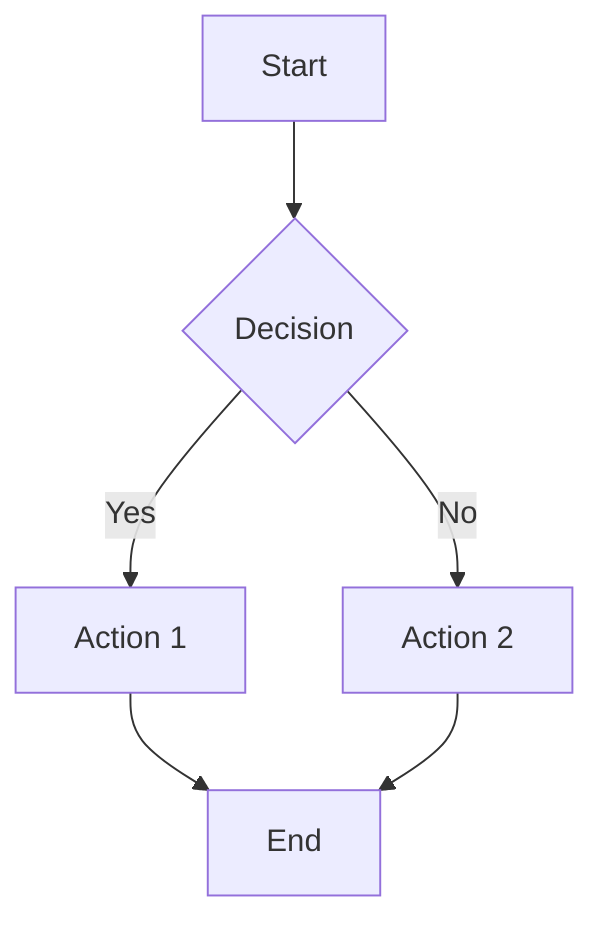
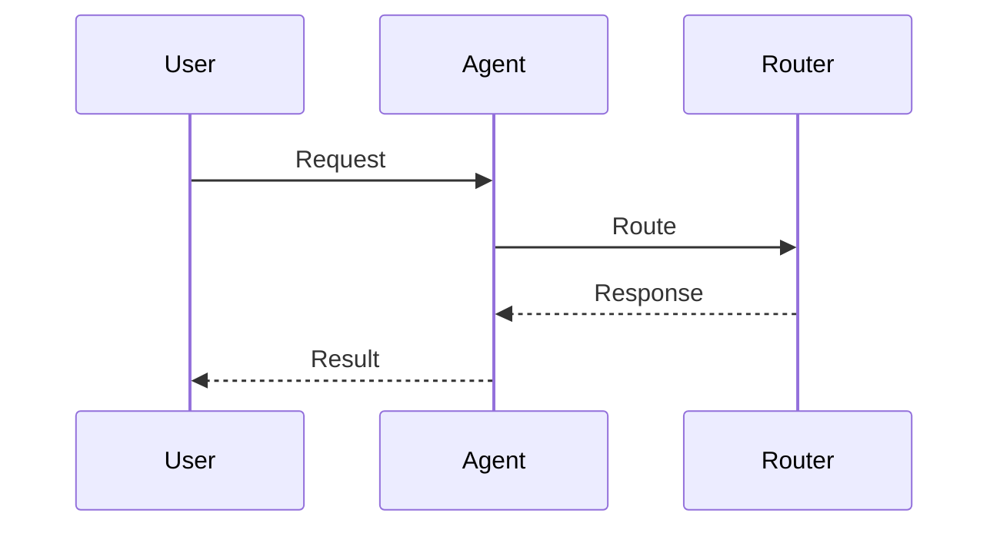
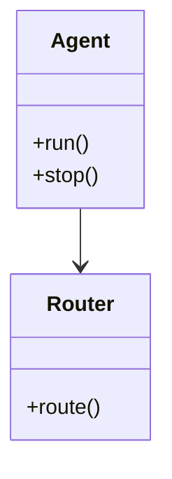
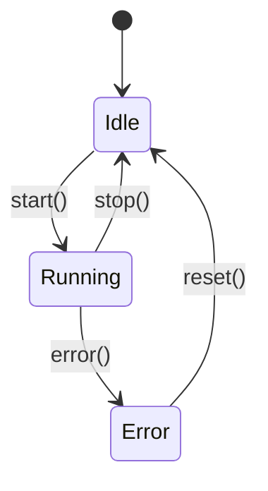
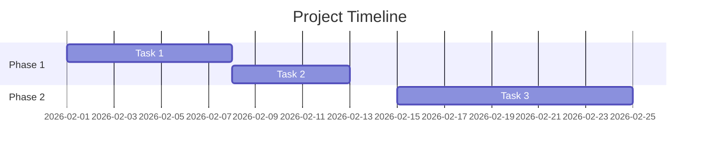
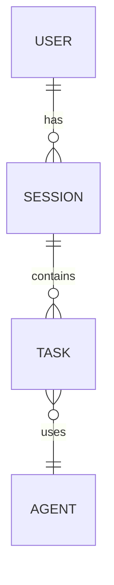
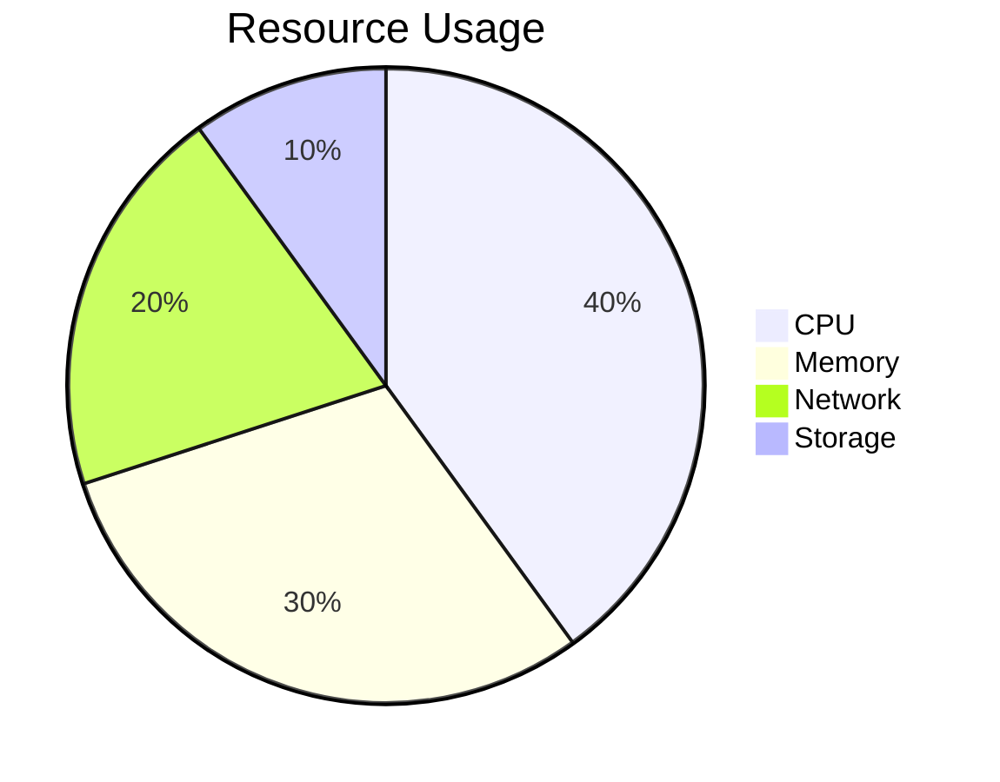

# Mermaid Diagram Examples

This page demonstrates various Mermaid diagram types available in VitePress.

---

## Flowchart

````markdown

````

---

## Sequence Diagram

````markdown

````

---

## Class Diagram

````markdown

````

---

## State Diagram

````markdown

````

---

## Gantt Chart

````markdown

````

---

## ER Diagram

````markdown

````

---

## Pie Chart

````markdown

````

---

**See Also**: [VITEPRESS_USAGE_GUIDE.md](../guides/VITEPRESS_USAGE_GUIDE.md)
