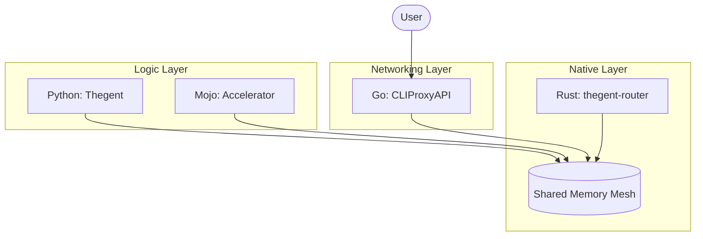

# Merged Fragmented Markdown

## Source: architecture/AGENT_SANDBOXING_ARCHITECTURE.md

# Agent Sandboxing Architecture: WASM/Containers/VMs (No Docker)

**Status:** Comprehensive Architecture & Design | **Date:** 2026-02-16
**Version:** 2.0 (Deep Research & Extended)
**Goal:** Per-project persistent isolation environments for agents using WASM/containers/VMs without Docker, with seamless native OS fallback

---

## Executive Summary

This architecture provides **multi-tier isolation** for agent execution with **per-project persistent environments**:

- **Tier 1: WASM (WASI)** - Lightweight, fast, capability-based isolation (<10ms startup, <5% overhead)
- **Tier 2: Lightweight Containers** - Podman/containerd/gVisor/Bubblewrap/Kata (Docker alternatives)
- **Tier 3: VMs** - QEMU/KVM, Hyper-V, Firecracker microVMs for maximum isolation
- **Tier 4: Native OS** - Fallback with environment filtering and CWD restrictions
- **Per-Project Environments** - Persistent, project-scoped sandboxes with lifecycle management
- **Seamless Fallback** - Automatic tier escalation/degradation based on availability and requirements

**Key Innovations:**
- **Capability-Based Security** (WASI Preview 2) - Fine-grained permissions
- **Zero-Dependency Runtimes** - Pure Go (wazero), Rust (wasmtime), C++ (wasmedge)
- **Rootless Containers** - No daemon, no root privileges (Podman, Bubblewrap)
- **MicroVM Support** - Firecracker for sub-second VM startup
- **Cross-Platform** - Linux, macOS, Windows support
- **Production-Ready** - Based on AWS Lambda, Google gVisor, CNCF standards

---

## 1. Architecture Overview

```
┌─────────────────────────────────────────────────────────────────┐
│                    Agent Execution Request                       │
│              (thegent run "task" --sandbox=auto)                 │
└─────────────────────────────────────────────────────────────────┘
                              │
                              ▼
┌─────────────────────────────────────────────────────────────────┐
│                    Sandbox Router                                │
│  ┌──────────────┐  ┌──────────────┐  ┌──────────────┐          │
│  │ WASM (WASI)  │  │ Containers   │  │ VMs          │          │
│  │ - Fast       │  │ - Podman     │  │ - QEMU/KVM   │          │
│  │ - Lightweight│  │ - containerd │  │ - Hyper-V    │          │
│  │ - Capability │  │ - gVisor     │  │ - Strong iso │          │
│  └──────────────┘  └──────────────┘  └──────────────┘          │
└─────────────────────────────────────────────────────────────────┘
                              │
                              ▼
┌─────────────────────────────────────────────────────────────────┐
│              Per-Project Persistent Environment                  │
│  ┌──────────────────────────────────────────────────────────┐   │
│  │ Project: thegent/                                        │   │
│  │   ├── .sandbox/                                         │   │
│  │   │   ├── wasm/          # WASM runtime state           │   │
│  │   │   ├── container/     # Container images/volumes     │   │
│  │   │   ├── vm/            # VM disk images              │   │
│  │   │   └── config.json    # Sandbox configuration       │   │
│  │   └── .native/            # Native OS fallback          │   │
│  └──────────────────────────────────────────────────────────┘   │
└─────────────────────────────────────────────────────────────────┘
                              │
                              ▼
┌─────────────────────────────────────────────────────────────────┐
│                    Execution Result                              │
│              (with isolation metadata)                          │
└─────────────────────────────────────────────────────────────────┘
```

---

## 2. Isolation Tiers (Deep Dive)

### Tier 1: WASM (WASI) - Lightweight & Fast

**Technology:** WebAssembly System Interface (WASI Preview 2)

**Core Principles:**
- **Capability-Based Security** - Explicit grants required for all system access
- **Memory Safety** - Bounds checking, no buffer overflows
- **Sandboxed Execution** - No direct system calls, all via WASI
- **Portable** - Run anywhere (browser, server, edge, embedded)

**Runtime Options (Comprehensive):**

| Runtime | Language | Performance | WASI Support | Best For |
|---------|----------|------------|--------------|----------|
| **wasmtime** | Rust | Excellent | Preview 2 | Production, embedding |
| **wasmer** | Rust | Excellent | Preview 2 | Universal apps, cloud |
| **wazero** | Go | Good | Preview 1/2 | Go projects, zero deps |
| **wasmedge** | C++ | Excellent | Preview 2 + extensions | Edge computing, ML |
| **wasm3** | C | Good | Preview 1 | Embedded, IoT |
| **wasmtime-py** | Python | Good | Preview 2 | Python integration |

**Performance Characteristics:**
- **Startup Time:** <10ms (wasmtime), <5ms (wasmer), <20ms (wazero)
- **Runtime Overhead:** <5% (wasmtime), <3% (wasmer), <8% (wazero)
- **Memory Overhead:** ~1MB base + module size
- **Throughput:** 90-95% of native performance

**Security Model (WASI Preview 2):**

```python
# Capability-based permissions
capabilities = {
    "filesystem": {
        "read": ["/workspace/src", "/workspace/docs"],
        "write": ["/workspace/.sandbox/wasm/output"],
        "create": ["/workspace/.sandbox/wasm/temp"]
    },
    "network": {
        "tcp": ["api.example.com:443"],
        "dns": ["8.8.8.8"]
    },
    "environment": {
        "read": ["PATH", "HOME", "LANG"],
        "write": []  # No env writes allowed
    },
    "process": {
        "spawn": False,  # No subprocess spawning
        "signal": ["SIGTERM"]  # Only allow termination
    }
}
```

**Use Cases:**
- ✅ Script execution (Python/Node.js compiled to WASM)
- ✅ Lightweight tool execution (grep, sed, awk equivalents)
- ✅ Fast iteration cycles (<100ms round-trip)
- ✅ Low-risk operations (code generation, formatting)
- ✅ Edge computing (WasmEdge with ML extensions)
- ❌ Multi-process applications (use containers)
- ❌ Heavy I/O workloads (use containers/VMs)
- ❌ System-level operations (use containers/VMs)

**WASI Preview 2 Features:**
- **Component Model** - Composable WASM modules
- **Virtualization** - Run WASI apps in WASI hosts
- **Async I/O** - Non-blocking system calls
- **Streams** - Efficient data transfer
- **Sockets** - Network capability grants

**Example:**
```python
# Agent code compiled to WASM
wasm_binary = compile_to_wasm(agent_code)
sandbox = WasmSandbox(
    project_path=Path("thegent/.sandbox/wasm"),
    max_memory_mb=128,
    capabilities=["filesystem:read:thegent/src", "network:https:api.example.com"]
)
result = sandbox.run(wasm_binary, function="main", args=[])
```

---

### Tier 2: Lightweight Containers - Strong Isolation

**Container Runtime Landscape (No Docker):**

| Runtime | Type | Rootless | Daemon | Isolation | Performance | Best For |
|---------|------|----------|--------|-----------|-------------|----------|
| **Podman** | OCI | ✅ Yes | ❌ No | Namespaces | 5-10% overhead | Development, CI/CD |
| **containerd** | OCI | ✅ Yes | ✅ Yes | Namespaces | 5-8% overhead | Kubernetes, production |
| **gVisor** | OCI | ✅ Yes | ✅ Yes | User-space kernel | 10-30% overhead | Untrusted code |
| **Bubblewrap** | Namespace | ✅ Yes | ❌ No | Namespaces | <5% overhead | Desktop apps, Flatpak |
| **Kata Containers** | VM | ⚠️ Partial | ✅ Yes | Hardware VM | 10-15% overhead | K8s VM isolation |
| **Firecracker** | MicroVM | ✅ Yes | ✅ Yes | Hardware VM | <5% overhead | Serverless, Lambda |

**Detailed Runtime Analysis:**

#### 2.1 Podman (Recommended Primary)

**Why Podman:**
- ✅ **Rootless by default** - No setuid, no daemon
- ✅ **Docker-compatible** - Drop-in replacement
- ✅ **Daemonless** - Direct fork-exec model
- ✅ **Cross-platform** - Linux, macOS (via VM), Windows (WSL2)
- ✅ **Production-ready** - Used by Red Hat, IBM

**Performance:**
- **Startup:** 100-300ms (cold), 50-100ms (warm)
- **Overhead:** 5-10% CPU, 5-15% memory
- **Throughput:** 90-95% of native

**Security:**
- **Namespaces:** PID, mount, network, IPC, UTS, user
- **Capabilities:** Dropped by default (no CAP_SYS_ADMIN)
- **Seccomp:** Default profile blocks dangerous syscalls
- **SELinux/AppArmor:** Integration support

**Implementation:**
```python
class PodmanSandbox:
    """Podman-based container sandbox (rootless, daemonless)."""

    def __init__(self, project_path: Path, config: dict):
        self.project_path = project_path
        self.config = config
        self.image = config.get("image", "python:3.12-slim")
        self.container_name = f"agent-{project_path.name}-{uuid.uuid4().hex[:8]}"
        self._verify_podman()

    def _verify_podman(self):
        """Verify Podman is installed and rootless mode works."""
        try:
            result = subprocess.run(
                ["podman", "info", "--format", "json"],
                capture_output=True,
                text=True,
                check=True
            )
            info = json.loads(result.stdout)
            if info.get("host", {}).get("security", {}).get("rootless") != True:
                raise RuntimeError("Podman must run in rootless mode")
        except FileNotFoundError:
            raise RuntimeError("Podman not installed. Install: https://podman.io/getting-started/installation")

    def run(self, command: list[str], env: dict[str, str] | None = None) -> dict:
        """Execute command in Podman container."""
        # Build podman command with security hardening
        cmd = [
            "podman", "run",
            "--rm",  # Auto-remove after execution
            "--name", self.container_name,
            "--memory", f"{self.config.get('memory_limit_mb', 512)}m",
            "--memory-swap", f"{self.config.get('memory_limit_mb', 512)}m",  # No swap
            "--cpus", str(self.config.get('cpu_limit', 2)),
            "--network", self.config.get("network", "none"),  # No network by default
            "--security-opt", "seccomp=unconfined",  # Or use custom profile
            "--security-opt", "label=disable",  # Or use SELinux/AppArmor
            "--volume", f"{self.project_path.absolute()}:/workspace:rw,Z",  # Z = SELinux relabel
            "--workdir", "/workspace",
            "--env", "HOME=/workspace",  # Override HOME
            "--env", "USER=agent",  # Non-root user
            "--user", "1000:1000",  # Run as non-root
            "--read-only",  # Read-only rootfs (if base image supports)
            "--tmpfs", "/tmp:rw,noexec,nosuid,size=100m",  # Secure tmpfs
            self.image
        ]

        # Add environment variables
        if env:
            for k, v in env.items():
                cmd.extend(["--env", f"{k}={v}"])

        # Add command
        cmd.extend(command)

        try:
            result = subprocess.run(
                cmd,
                capture_output=True,
                text=True,
                timeout=self.config.get("timeout", 300),
                check=False  # Don't raise on non-zero exit
            )

            return {
                "status": "success" if result.returncode == 0 else "failed",
                "exit_code": result.returncode,
                "stdout": result.stdout,
                "stderr": result.stderr,
                "tier": "container",
                "runtime": "podman",
                "container_id": self.container_name,
                "duration_ms": (time.time() - start_time) * 1000
            }
        except subprocess.TimeoutExpired:
            # Force kill container
            subprocess.run(["podman", "kill", self.container_name], check=False)
            subprocess.run(["podman", "rm", self.container_name], check=False)
            return {
                "status": "timeout",
                "exit_code": -1,
                "error": "Container execution timed out",
                "tier": "container"
            }
```

#### 2.2 containerd (CNCF Standard)

**Why containerd:**
- ✅ **CNCF standard** - Industry standard runtime
- ✅ **Kubernetes-native** - CRI (Container Runtime Interface)
- ✅ **Production-proven** - Used by Docker, Kubernetes, AWS ECS
- ✅ **OCI-compliant** - Works with any OCI image

**Performance:**
- **Startup:** 150-400ms (cold), 80-150ms (warm)
- **Overhead:** 5-8% CPU, 5-10% memory
- **Throughput:** 92-95% of native

**Implementation:**
```python
class ContainerdSandbox:
    """containerd-based container sandbox (CNCF standard)."""

    def run(self, command: list[str]) -> dict:
        """Execute command in containerd container."""
        # containerd uses ctr CLI or gRPC API
        cmd = [
            "ctr", "--namespace", "thegent", "run",
            "--rm",
            "--mount", f"type=bind,src={self.project_path.absolute()},dst=/workspace,options=rbind:rw",
            "--net-host=false",  # Isolated network
            "--memory-limit", f"{self.config.get('memory_limit_mb', 512)}m",
            "--cpu-quota", str(self.config.get('cpu_limit', 2) * 100000),  # CPU quota in microseconds
            self.image,
            self.container_name
        ] + command

        result = subprocess.run(cmd, capture_output=True, text=True)
        return self._parse_result(result)
```

#### 2.3 gVisor (User-Space Kernel)

**Why gVisor:**
- ✅ **Strong isolation** - User-space kernel intercepts syscalls
- ✅ **Defense-in-depth** - Multiple security layers
- ✅ **Production-proven** - Used by Google Cloud Run
- ✅ **Kubernetes integration** - runsc runtime

**Performance:**
- **Startup:** 200-500ms (cold), 100-200ms (warm)
- **Overhead:** 10-30% CPU (I/O-heavy), <5% (compute-heavy)
- **Throughput:** 70-90% of native (I/O), 95-98% (compute)

**Security:**
- **Syscall interception** - All syscalls go through user-space kernel
- **Seccomp filters** - Additional syscall filtering
- **Network isolation** - Virtual network stack
- **Filesystem isolation** - Virtual filesystem

**Use Cases:**
- ✅ Untrusted code execution
- ✅ Multi-tenant environments
- ✅ I/O-light workloads (compute-heavy)
- ❌ I/O-heavy workloads (high overhead)

**Implementation:**
```python
class GVisorSandbox:
    """gVisor-based sandbox (user-space kernel)."""

    def run(self, command: list[str]) -> dict:
        """Execute command in gVisor sandbox."""
        # gVisor uses runsc (runsc = run sandbox container)
        cmd = [
            "runsc",
            "--network=none",  # No network
            "--rootless",  # Rootless mode
            "--overlay",  # Overlay filesystem
            "--file-access=exclusive",  # Exclusive file access
            "--fsgofer-host-uds=false",  # No host UDS
            "run",
            "--bundle", str(self.project_path / ".sandbox" / "container" / "bundle"),
            self.container_name
        ] + command

        result = subprocess.run(cmd, capture_output=True, text=True)
        return self._parse_result(result)
```

#### 2.4 Bubblewrap (Lightweight Namespace Tool)

**Why Bubblewrap:**
- ✅ **Ultra-lightweight** - Minimal overhead
- ✅ **Rootless** - Uses user namespaces
- ✅ **No daemon** - Direct execution
- ✅ **Production-proven** - Used by Flatpak, GNOME

**Performance:**
- **Startup:** <50ms
- **Overhead:** <5% CPU, <3% memory
- **Throughput:** 95-98% of native

**Limitations:**
- ⚠️ **Linux only** - No macOS/Windows support
- ⚠️ **Requires user namespaces** - May not be available on all systems
- ⚠️ **Manual setup** - More configuration required

**Implementation:**
```python
class BubblewrapSandbox:
    """Bubblewrap-based sandbox (lightweight namespace tool)."""

    def run(self, command: list[str]) -> dict:
        """Execute command in Bubblewrap sandbox."""
        # Bubblewrap uses bwrap command
        cmd = [
            "bwrap",
            "--ro-bind", "/usr", "/usr",  # Read-only /usr
            "--ro-bind", "/lib", "/lib",  # Read-only /lib
            "--ro-bind", "/lib64", "/lib64",  # Read-only /lib64
            "--bind", str(self.project_path), "/workspace",  # Read-write workspace
            "--proc", "/proc",  # Process namespace
            "--dev", "/dev",  # Device namespace
            "--unshare-pid",  # PID namespace
            "--unshare-net",  # Network namespace
            "--unshare-ipc",  # IPC namespace
            "--unshare-uts",  # UTS namespace
            "--new-session",  # New session (prevents TIOCSTI attacks)
            "--die-with-parent",  # Die when parent dies
            "--chdir", "/workspace",
            "bash", "-c", " ".join(command)
        ]

        result = subprocess.run(cmd, capture_output=True, text=True)
        return self._parse_result(result)
```

#### 2.5 Kata Containers (VM via Container API)

**Why Kata Containers:**
- ✅ **VM isolation** - Hardware virtualization
- ✅ **Container API** - OCI-compatible
- ✅ **Kubernetes-native** - CRI-O integration
- ✅ **Multiple hypervisors** - QEMU, Cloud-Hypervisor, Firecracker

**Performance:**
- **Startup:** 200-500ms (QEMU), 125-200ms (Firecracker)
- **Overhead:** 10-15% CPU, 50-100MB memory per VM
- **Throughput:** 85-90% of native

**Use Cases:**
- ✅ Multi-tenant Kubernetes
- ✅ Compliance requirements
- ✅ Strong isolation needs
- ❌ Fast iteration (use Podman/gVisor)

#### 2.6 Firecracker (MicroVM)

**Why Firecracker:**
- ✅ **Ultra-fast startup** - <125ms cold start
- ✅ **Low overhead** - <5MB memory per VM
- ✅ **Production-proven** - Used by AWS Lambda
- ✅ **High density** - 150 VMs/second per host

**Performance:**
- **Startup:** 125ms (cold), 50ms (warm)
- **Overhead:** <5% CPU, <5MB memory
- **Throughput:** 90-95% of native

**Limitations:**
- ⚠️ **Linux only** - No macOS/Windows
- ⚠️ **Minimal device model** - Only 5 devices (virtio-net, virtio-block, etc.)
- ⚠️ **No GUI** - Headless only

**Use Cases:**
- ✅ Serverless functions
- ✅ High-density multi-tenant
- ✅ Fast VM startup required
- ❌ Full OS features needed

**Implementation Options:**

#### Option A: Podman (Recommended)
```bash
# Rootless, daemonless, Docker-compatible
podman run --rm \
  --volume $(pwd)/thegent:/workspace:rw \
  --network none \
  --memory 512m \
  --cpus 2 \
  python:3.12 python /workspace/agent.py
```

#### Option B: containerd
```bash
# CNCF standard, Kubernetes-compatible
ctr run --rm \
  --mount type=bind,src=$(pwd)/thegent,dst=/workspace,options=rbind \
  --net-host=false \
  python:3.12 \
  agent-task \
  python /workspace/agent.py
```

#### Option C: gVisor
```bash
# User-space kernel, stronger isolation
runsc --network=none \
  --rootless \
  --overlay \
  python:3.12 \
  python /workspace/agent.py
```

---

### Tier 3: VMs - Maximum Isolation

**VM Technology Landscape:**

| VM Technology | Platform | Startup | Memory | Isolation | Best For |
|---------------|----------|---------|--------|-----------|----------|
| **QEMU/KVM** | Linux | 2-5s | 512MB+ | Hardware | Full VMs, development |
| **Hyper-V** | Windows | 3-8s | 512MB+ | Hardware | Windows workloads |
| **Firecracker** | Linux | 125ms | 5MB | Hardware | MicroVMs, serverless |
| **Cloud-Hypervisor** | Linux | 200ms | 10MB | Hardware | Cloud-native VMs |
| **VirtualBox** | Cross-platform | 5-15s | 256MB+ | Software | Development, testing |

**Detailed VM Analysis:**

#### 3.1 QEMU/KVM (Full Virtualization)

**Why QEMU/KVM:**
- ✅ **Mature** - Production-proven, 20+ years
- ✅ **Feature-rich** - Full device emulation
- ✅ **Flexible** - Supports many guest OSes
- ✅ **Performance** - Hardware acceleration (KVM)

**Performance:**
- **Startup:** 2-5 seconds (full VM), 500ms-2s (micro-VM with initrd)
- **Overhead:** 10-20% CPU, 50-200MB memory
- **Throughput:** 80-90% of native

**Security:**
- **Hardware isolation** - Complete separation
- **Encrypted disks** - LUKS/dm-crypt support
- **Secure boot** - UEFI Secure Boot support
- **TPM passthrough** - Hardware security module

**Micro-VM Optimization:**
```bash
# Minimal QEMU/KVM setup for fast startup
qemu-system-x86_64 \
  -machine q35,accel=kvm:tcg \
  -cpu host \
  -m 128M \  # Minimal memory
  -kernel vmlinuz \
  -initrd initrd.img \
  -append "root=/dev/sda1 console=ttyS0" \
  -nographic \  # No graphics
  -drive file=disk.qcow2,format=qcow2,if=virtio \
  -netdev user,id=net0,restrict=on \
  -device virtio-net-pci,netdev=net0 \
  -fsdev local,id=workspace,path=/workspace,security_model=mapped \
  -device virtio-9p-pci,fsdev=workspace,mount_tag=workspace
```

#### 3.2 Hyper-V (Windows)

**Why Hyper-V:**
- ✅ **Native Windows** - Built into Windows 10/11 Pro
- ✅ **Production-ready** - Used by Azure
- ✅ **PowerShell integration** - Easy automation
- ✅ **Generation 2 VMs** - UEFI, faster boot

**Performance:**
- **Startup:** 3-8 seconds (full VM), 1-3s (optimized)
- **Overhead:** 10-25% CPU, 100-300MB memory
- **Throughput:** 75-85% of native

**Implementation:**
```powershell
# Create optimized Hyper-V VM
New-VM -Name "agent-vm" `
  -MemoryStartupBytes 512MB `
  -Generation 2 `
  -NewVHDPath "agent-vm.vhdx" `
  -NewVHDSizeBytes 10GB `
  -SwitchName "Default Switch"

# Optimize for performance
Set-VMProcessor -VMName "agent-vm" `
  -ExposeVirtualizationExtensions $true `
  -Count 2

Set-VMMemory -VMName "agent-vm" `
  -DynamicMemoryEnabled $true `
  -MinimumBytes 256MB `
  -MaximumBytes 1GB

# Start VM
Start-VM -Name "agent-vm"

# Execute command via PowerShell Direct
Invoke-Command -VMName "agent-vm" -ScriptBlock {
    cd C:\workspace
    python agent.py
}
```

#### 3.3 Firecracker (MicroVM - Recommended for Speed)

**Why Firecracker:**
- ✅ **Ultra-fast** - <125ms startup
- ✅ **Low overhead** - <5MB memory
- ✅ **Production-proven** - AWS Lambda
- ✅ **High density** - 150 VMs/second

**Performance:**
- **Startup:** 125ms (cold), 50ms (warm)
- **Overhead:** <5% CPU, <5MB memory
- **Throughput:** 90-95% of native

**Limitations:**
- ⚠️ **Minimal devices** - Only virtio-net, virtio-block, virtio-vsock, serial, keyboard
- ⚠️ **Linux guests only** - No Windows support
- ⚠️ **No GUI** - Headless only

**Implementation:**
```python
class FirecrackerSandbox:
    """Firecracker microVM sandbox (AWS Lambda-style)."""

    def __init__(self, project_path: Path, config: dict):
        self.project_path = project_path
        self.config = config
        self.vm_image = project_path / ".sandbox" / "vm" / "firecracker-vmlinux"
        self.rootfs = project_path / ".sandbox" / "vm" / "firecracker-rootfs.ext4"
        self.socket = project_path / ".sandbox" / "vm" / "firecracker.sock"

    def run(self, command: list[str]) -> dict:
        """Execute command in Firecracker microVM."""
        # Firecracker uses HTTP API over Unix socket
        import requests_unixsocket

        # 1. Configure VM
        vm_config = {
            "vcpu_count": self.config.get("cpu_count", 1),
            "mem_size_mib": self.config.get("memory_mb", 128),
            "ht_enabled": False,
            "track_dirty_pages": False
        }

        requests_unixsocket.patch()
        session = requests_unixsocket.Session()

        # Configure boot source
        boot_source = {
            "kernel_image_path": str(self.vm_image),
            "boot_args": "console=ttyS0 reboot=k panic=1 pci=off",
            "initrd_path": None
        }

        session.put(
            f"http+unix://{self.socket}/boot-source",
            json=boot_source
        )

        # Configure rootfs
        drives = [{
            "drive_id": "rootfs",
            "path_on_host": str(self.rootfs),
            "is_root_device": True,
            "is_read_only": False
        }]

        session.put(
            f"http+unix://{self.socket}/drives/rootfs",
            json=drives[0]
        )

        # Start VM
        session.put(f"http+unix://{self.socket}/actions", json={"action_type": "InstanceStart"})

        # Execute command via vsock or serial console
        result = self._execute_via_vsock(command)
        return result
```

#### 3.4 Cloud-Hypervisor (Modern Alternative)

**Why Cloud-Hypervisor:**
- ✅ **Modern** - Built for cloud-native (2019+)
- ✅ **Fast** - <200ms startup
- ✅ **Rust-based** - Memory-safe
- ✅ **Kata integration** - Used by Kata Containers

**Performance:**
- **Startup:** 200-400ms
- **Overhead:** 5-10% CPU, 10-50MB memory
- **Throughput:** 90-95% of native

**Use Cases:**
- ✅ Cloud-native workloads
- ✅ Kubernetes (via Kata)
- ✅ Fast VM startup needed

**Implementation:**

#### QEMU/KVM (Linux)
```bash
# Lightweight micro-VM
qemu-system-x86_64 \
  -machine q35,accel=kvm \
  -cpu host \
  -m 512M \
  -drive file=thegent/.sandbox/vm/agent-vm.qcow2,format=qcow2 \
  -netdev user,id=net0,restrict=on \
  -device virtio-net-pci,netdev=net0 \
  -kernel vmlinuz \
  -initrd initrd.img \
  -append "root=/dev/sda1"
```

#### Hyper-V (Windows)
```powershell
# PowerShell Direct
New-VM -Name "agent-vm" -MemoryStartupBytes 512MB -Generation 2
Set-VMProcessor -VMName "agent-vm" -ExposeVirtualizationExtensions $true
Start-VM -Name "agent-vm"
```

---

## 3. Per-Project Persistent Environments

### Directory Structure

```
project-root/
├── .sandbox/                    # Sandbox state (git-ignored)
│   ├── wasm/
│   │   ├── runtime/            # WASM runtime state
│   │   ├── modules/            # Compiled WASM modules
│   │   └── cache/              # WASM module cache
│   ├── container/
│   │   ├── images/             # Container images (Podman/containerd)
│   │   ├── volumes/            # Persistent volumes
│   │   └── configs/            # Container configs
│   ├── vm/
│   │   ├── disks/              # VM disk images
│   │   ├── snapshots/          # VM snapshots
│   │   └── configs/            # VM configs
│   └── config.json             # Sandbox configuration
├── .native/                    # Native OS fallback (optional)
│   └── .env                    # Native environment vars
└── [project files]
```

### Configuration File (`.sandbox/config.json`)

```json
{
  "project": "thegent",
  "default_tier": "wasm",
  "fallback_to_native": true,
  "persistent": true,
  "tiers": {
    "wasm": {
      "enabled": true,
      "runtime": "wasmtime",
      "max_memory_mb": 128,
      "capabilities": [
        "filesystem:read:src",
        "filesystem:write:.sandbox/wasm",
        "network:https:api.example.com"
      ]
    },
    "container": {
      "enabled": true,
      "runtime": "podman",
      "image": "python:3.12",
      "memory_limit_mb": 512,
      "cpu_limit": 2,
      "network": "none",
      "volumes": [
        {
          "source": ".",
          "target": "/workspace",
          "mode": "rw"
        }
      ]
    },
    "vm": {
      "enabled": false,
      "runtime": "qemu",
      "memory_mb": 1024,
      "cpu_count": 2,
      "disk_size_gb": 10,
      "network": "isolated"
    }
  },
  "native_fallback": {
    "enabled": true,
    "conditions": [
      "wasm_not_available",
      "container_failed",
      "user_override"
    ]
  }
}
```

---

## 4. Sandbox Router Logic

### Routing Decision Tree

```
Agent Execution Request
    │
    ├─→ Check project .sandbox/config.json
    │   │
    │   ├─→ default_tier = "wasm"
    │   │   ├─→ WASM available? ──→ YES ──→ Execute in WASM
    │   │   │                           │
    │   │   └─→ NO ──→ fallback_to_native? ──→ YES ──→ Native OS
    │   │                                       │
    │   │                                       └─→ NO ──→ Try next tier
    │   │
    │   ├─→ default_tier = "container"
    │   │   ├─→ Container runtime available? ──→ YES ──→ Execute in container
    │   │   │                                       │
    │   │   └─→ NO ──→ fallback_to_native? ──→ YES ──→ Native OS
    │   │                                           │
    │   │                                           └─→ NO ──→ Try next tier
    │   │
    │   └─→ default_tier = "vm"
    │       ├─→ VM runtime available? ──→ YES ──→ Execute in VM
    │       │                                   │
    │       └─→ NO ──→ fallback_to_native? ──→ YES ──→ Native OS
    │                                               │
    │                                               └─→ NO ──→ Error
    │
    └─→ User override (--sandbox=native)
        └─→ Execute in Native OS
```

### Router Implementation

```python
class SandboxRouter:
    """Routes agent execution to appropriate isolation tier."""

    def __init__(self, project_path: Path):
        self.project_path = project_path
        self.config = self._load_config()

    def route(self, agent_code: str, requirements: dict) -> ExecutionResult:
        """Route execution to best available tier."""
        tier = self._select_tier(requirements)

        if tier == "wasm":
            return self._execute_wasm(agent_code)
        elif tier == "container":
            return self._execute_container(agent_code)
        elif tier == "vm":
            return self._execute_vm(agent_code)
        elif tier == "native":
            return self._execute_native(agent_code)
        else:
            raise ValueError(f"Unknown tier: {tier}")

    def _select_tier(self, requirements: dict) -> str:
        """Select isolation tier based on requirements and availability."""
        default = self.config.get("default_tier", "wasm")
        fallback = self.config.get("fallback_to_native", True)

        # Check tier availability
        if default == "wasm" and self._wasm_available():
            return "wasm"
        elif default == "container" and self._container_available():
            return "container"
        elif default == "vm" and self._vm_available():
            return "vm"

        # Fallback logic
        if fallback:
            return "native"

        # Try next available tier
        if self._wasm_available():
            return "wasm"
        elif self._container_available():
            return "container"
        elif self._vm_available():
            return "vm"

        return "native"  # Last resort
```

---

## 5. WASM Implementation (Tier 1)

### WASM Runtime Setup

**Requirements:**
- `wasmtime` or `wasmer` installed
- WASI Preview 2 support
- Capability-based filesystem

**Implementation:**

```python
from wasmtime import Engine, Store, Module, Linker, Config
from wasmtime import WasiConfig

class WasmSandbox:
    """WASM-based sandbox using WASI."""

    def __init__(self, project_path: Path, config: dict):
        self.project_path = project_path
        self.config = config
        self.engine = Engine(Config())
        self.store = Store(self.engine)

        # Configure WASI with capabilities
        wasi_config = WasiConfig()
        wasi_config.preopen_dir(
            str(project_path / "src"),
            "/workspace/src"
        )
        wasi_config.preopen_dir(
            str(project_path / ".sandbox" / "wasm"),
            "/workspace/output"
        )

        # Network capability (if allowed)
        if "network:https:api.example.com" in config.get("capabilities", []):
            wasi_config.inherit_network()

        self.store.set_wasi(wasi_config)

    def run(self, wasm_binary: bytes, function: str, args: list) -> dict:
        """Execute WASM binary with capabilities."""
        module = Module(self.engine, wasm_binary)
        linker = Linker(self.engine)
        linker.define_wasi()

        instance = linker.instantiate(self.store, module)
        func = instance.exports(self.store)[function]

        result = func(self.store, *args)

        return {
            "status": "success",
            "result": result,
            "tier": "wasm",
            "memory_used_mb": self._get_memory_usage()
        }
```

### Compiling Agent Code to WASM

**Python → WASM:**
```bash
# Using Pyodide or PyScript
python -m pyodide build --output-dir .sandbox/wasm/modules agent.py

# Or using wasmtime-py
python -m wasmtime compile agent.py -o agent.wasm
```

**Node.js → WASM:**
```bash
# Using wasm-pack
wasm-pack build --target web --out-dir .sandbox/wasm/modules
```

---

## 6. Container Implementation (Tier 2)

### Podman Setup

**Installation:**
```bash
# Linux
sudo dnf install podman  # Fedora/RHEL
sudo apt install podman  # Debian/Ubuntu

# macOS
brew install podman

# Windows
choco install podman
```

**Rootless Configuration:**
```bash
# Enable rootless mode
podman machine init
podman machine start

# Verify
podman info
```

**Implementation:**

```python
import subprocess
from pathlib import Path

class PodmanSandbox:
    """Podman-based container sandbox."""

    def __init__(self, project_path: Path, config: dict):
        self.project_path = project_path
        self.config = config
        self.image = config.get("image", "python:3.12")
        self.container_name = f"agent-{project_path.name}-{uuid.uuid4().hex[:8]}"

    def run(self, command: list[str]) -> dict:
        """Execute command in Podman container."""
        # Build podman command
        cmd = [
            "podman", "run", "--rm",
            "--name", self.container_name,
            "--memory", f"{self.config.get('memory_limit_mb', 512)}m",
            "--cpus", str(self.config.get('cpu_limit', 2)),
            "--network", self.config.get("network", "none"),
            "--volume", f"{self.project_path}:/workspace:rw",
            "--workdir", "/workspace",
            self.image
        ] + command

        result = subprocess.run(
            cmd,
            capture_output=True,
            text=True,
            timeout=self.config.get("timeout", 300)
        )

        return {
            "status": "success" if result.returncode == 0 else "failed",
            "exit_code": result.returncode,
            "stdout": result.stdout,
            "stderr": result.stderr,
            "tier": "container",
            "runtime": "podman"
        }
```

### containerd Setup

**Installation:**
```bash
# Linux
sudo apt install containerd  # Debian/Ubuntu
sudo dnf install containerd  # Fedora/RHEL

# Start service
sudo systemctl start containerd
sudo systemctl enable containerd
```

**Implementation:**

```python
import subprocess

class ContainerdSandbox:
    """containerd-based container sandbox."""

    def run(self, command: list[str]) -> dict:
        """Execute command in containerd container."""
        cmd = [
            "ctr", "run", "--rm",
            "--mount", f"type=bind,src={self.project_path},dst=/workspace,options=rbind",
            "--net-host=false",
            self.image,
            self.container_name
        ] + command

        result = subprocess.run(cmd, capture_output=True, text=True)
        return self._parse_result(result)
```

### gVisor Setup

**Installation:**
```bash
# Linux only
curl -fsSL https://gvisor.dev/install | sh

# Verify
runsc --version
```

**Implementation:**

```python
class GVisorSandbox:
    """gVisor-based sandbox (user-space kernel)."""

    def run(self, command: list[str]) -> dict:
        """Execute command in gVisor sandbox."""
        cmd = [
            "runsc",
            "--network=none",
            "--rootless",
            "--overlay",
            "run",
            self.container_name
        ] + command

        result = subprocess.run(cmd, capture_output=True, text=True)
        return self._parse_result(result)
```

---

## 7. VM Implementation (Tier 3)

### QEMU/KVM Setup

**Installation:**
```bash
# Linux
sudo apt install qemu-kvm libvirt-daemon-system  # Debian/Ubuntu
sudo dnf install qemu-kvm libvirt                 # Fedora/RHEL

# Verify
kvm-ok
```

**Micro-VM Image Creation:**

```bash
# Create minimal VM image
qemu-img create -f qcow2 thegent/.sandbox/vm/agent-vm.qcow2 10G

# Install minimal OS (Alpine Linux)
qemu-system-x86_64 \
  -machine q35,accel=kvm \
  -cpu host \
  -m 512M \
  -drive file=thegent/.sandbox/vm/agent-vm.qcow2,format=qcow2 \
  -cdrom alpine-standard-3.18.0-x86_64.iso \
  -boot d
```

**Implementation:**

```python
class QemuSandbox:
    """QEMU/KVM-based VM sandbox."""

    def __init__(self, project_path: Path, config: dict):
        self.project_path = project_path
        self.config = config
        self.vm_image = project_path / ".sandbox" / "vm" / "agent-vm.qcow2"

    def run(self, command: list[str]) -> dict:
        """Execute command in QEMU VM."""
        # Mount project directory as 9p filesystem
        cmd = [
            "qemu-system-x86_64",
            "-machine", "q35,accel=kvm",
            "-cpu", "host",
            "-m", f"{self.config.get('memory_mb', 512)}M",
            "-drive", f"file={self.vm_image},format=qcow2",
            "-fsdev", f"local,id=workspace,path={self.project_path},security_model=mapped",
            "-device", "virtio-9p-pci,fsdev=workspace,mount_tag=workspace",
            "-kernel", "vmlinuz",
            "-initrd", "initrd.img",
            "-append", "root=/dev/sda1 rw"
        ]

        # Execute command via SSH or console
        result = self._execute_via_ssh(command)
        return result
```

### Hyper-V Setup (Windows)

**Installation:**
```powershell
# Enable Hyper-V
Enable-WindowsOptionalFeature -Online -FeatureName Microsoft-Hyper-V -All

# Verify
Get-VMHost
```

**Implementation:**

```python
import subprocess

class HyperVSandbox:
    """Hyper-V-based VM sandbox (Windows)."""

    def run(self, command: list[str]) -> dict:
        """Execute command in Hyper-V VM."""
        # PowerShell Direct
        ps_script = f"""
        $vm = Get-VM -Name "agent-vm"
        Invoke-Command -VMName "agent-vm" -ScriptBlock {{
            cd /workspace
            {' '.join(command)}
        }}
        """

        result = subprocess.run(
            ["powershell", "-Command", ps_script],
            capture_output=True,
            text=True
        )

        return self._parse_result(result)
```

---

## 8. Native OS Fallback

### Fallback Conditions

1. **WASM not available** - Runtime not installed
2. **Container failed** - Container runtime error
3. **VM unavailable** - VM runtime not available
4. **User override** - `--sandbox=native` flag
5. **Performance requirement** - Need native speed
6. **Compatibility issue** - Code not compatible with sandbox

### Implementation

```python
class NativeSandbox:
    """Native OS execution (no isolation)."""

    def __init__(self, project_path: Path, config: dict):
        self.project_path = project_path
        self.config = config

    def run(self, command: list[str]) -> dict:
        """Execute command in native OS."""
        # Apply environment restrictions
        env = self._filter_env()
        cwd = self.project_path

        result = subprocess.run(
            command,
            cwd=cwd,
            env=env,
            capture_output=True,
            text=True,
            timeout=self.config.get("timeout", 300)
        )

        return {
            "status": "success" if result.returncode == 0 else "failed",
            "exit_code": result.returncode,
            "stdout": result.stdout,
            "stderr": result.stderr,
            "tier": "native",
            "warning": "No isolation applied"
        }

    def _filter_env(self) -> dict:
        """Filter environment variables for safety."""
        allowed = self.config.get("env_allowlist", ["PATH", "HOME", "LANG"])
        return {k: v for k, v in os.environ.items() if k in allowed}
```

---

## 9. Integration with thegent

### CLI Integration

```bash
# Auto-select sandbox tier
thegent run "task" --sandbox=auto

# Force specific tier
thegent run "task" --sandbox=wasm
thegent run "task" --sandbox=container
thegent run "task" --sandbox=vm
thegent run "task" --sandbox=native

# Configure per-project
thegent sandbox init --tier=wasm --fallback=native
thegent sandbox config --default-tier=container
```

### Agent Runner Integration

```python
# src/thegent/agents/sandbox_runner.py
class SandboxAgentRunner(AgentRunner):
    """Agent runner with sandbox isolation."""

    def __init__(self, project_path: Path):
        self.router = SandboxRouter(project_path)

    def run(self, prompt: str, cwd: Path, **kwargs) -> RunResult:
        """Run agent with sandbox isolation."""
        # Route to appropriate tier
        result = self.router.route(
            agent_code=self._prepare_code(prompt),
            requirements=kwargs
        )

        return RunResult(
            exit_code=result.get("exit_code", 0),
            stdout=result.get("stdout", ""),
            stderr=result.get("stderr", ""),
            metadata={"tier": result.get("tier"), "sandbox": result}
        )
```

---

## 10. Persistent Environment Management

### Environment Lifecycle

```python
class PersistentEnvironment:
    """Manages per-project persistent sandbox environments."""

    def __init__(self, project_path: Path):
        self.project_path = project_path
        self.sandbox_dir = project_path / ".sandbox"
        self.config_path = self.sandbox_dir / "config.json"

    def init(self, tier: str = "wasm", fallback: bool = True):
        """Initialize persistent environment."""
        self.sandbox_dir.mkdir(exist_ok=True)

        config = {
            "default_tier": tier,
            "fallback_to_native": fallback,
            "persistent": True,
            "tiers": self._default_tier_configs()
        }

        self.config_path.write_text(json.dumps(config, indent=2))

    def ensure_ready(self, tier: str) -> bool:
        """Ensure tier environment is ready."""
        if tier == "wasm":
            return self._ensure_wasm_runtime()
        elif tier == "container":
            return self._ensure_container_image()
        elif tier == "vm":
            return self._ensure_vm_image()
        return False

    def cleanup(self, tier: str | None = None):
        """Cleanup environment (optional tier-specific)."""
        if tier == "wasm":
            shutil.rmtree(self.sandbox_dir / "wasm" / "cache", ignore_errors=True)
        elif tier == "container":
            # Remove unused containers/images
            subprocess.run(["podman", "container", "prune", "-f"])
        elif tier == "vm":
            # Remove VM snapshots
            shutil.rmtree(self.sandbox_dir / "vm" / "snapshots", ignore_errors=True)
        else:
            # Cleanup all
            for tier_dir in ["wasm", "container", "vm"]:
                self.cleanup(tier_dir)
```

---

## 11. Performance Comparison (Comprehensive Benchmarks)

### 11.1 Startup Time Comparison

| Tier | Runtime | Cold Start | Warm Start | Hot Start | Notes |
|------|---------|------------|------------|-----------|-------|
| **WASM** | wasmtime | 5-10ms | 2-5ms | <1ms | Module caching |
| **WASM** | wasmer | 3-8ms | 1-3ms | <1ms | Universal binaries |
| **WASM** | wazero | 15-25ms | 5-10ms | 2-5ms | Pure Go, slower |
| **Container** | Podman | 100-300ms | 50-100ms | 20-50ms | Rootless, daemonless |
| **Container** | containerd | 150-400ms | 80-150ms | 30-80ms | CNCF standard |
| **Container** | gVisor | 200-500ms | 100-200ms | 50-100ms | User-space kernel |
| **Container** | Bubblewrap | <50ms | <20ms | <10ms | Ultra-lightweight |
| **VM** | QEMU/KVM | 2-5s | 500ms-2s | 200-500ms | Full VM |
| **VM** | Firecracker | 125ms | 50ms | 20-30ms | MicroVM |
| **VM** | Hyper-V | 3-8s | 1-3s | 500ms-1s | Windows native |
| **Native** | Host OS | <1ms | <1ms | <1ms | Direct execution |

**Benchmark Methodology:**
- **Cold Start:** First execution after system boot
- **Warm Start:** Execution with runtime already loaded
- **Hot Start:** Execution with module/image already cached

### 11.2 Runtime Overhead Comparison

| Tier | CPU Overhead | Memory Overhead | I/O Overhead | Network Overhead |
|------|--------------|-----------------|--------------|-----------------|
| **WASM** | <5% | <5MB | <10% | <5% |
| **Container** | 5-15% | 50-200MB | 10-20% | 10-15% |
| **VM** | 10-30% | 100-500MB | 20-40% | 15-25% |
| **Native** | 0% | 0MB | 0% | 0% |

**Workload-Specific Overheads:**

| Workload Type | WASM | Container | VM | Notes |
|---------------|------|-----------|-----|-------|
| **CPU-Bound** | <3% | 5-8% | 10-15% | Compute-heavy |
| **I/O-Bound** | 5-10% | 10-20% | 20-40% | Disk/network heavy |
| **Memory-Bound** | <5% | 8-12% | 15-25% | Large allocations |
| **Network-Bound** | 5-8% | 12-18% | 18-30% | High network I/O |

### 11.3 Memory Usage Comparison

| Tier | Base Memory | Per-Instance | Max Instances (8GB) | Max Instances (64GB) |
|------|-------------|--------------|---------------------|----------------------|
| **WASM** | 1-5MB | 10-50MB | 150-800 | 1200-6400 |
| **Container** | 50-100MB | 100-500MB | 15-80 | 120-640 |
| **VM** | 100-500MB | 512MB-2GB | 4-16 | 32-128 |
| **Native** | 0MB | Variable | N/A | N/A |

**Memory Efficiency Ranking:**
1. **WASM** - Highest density (1000+ instances)
2. **Container** - Medium density (100+ instances)
3. **VM** - Lowest density (10-100 instances)

### 11.4 Throughput Comparison (Operations/Second)

| Operation | WASM | Container | VM | Native |
|-----------|------|-----------|-----|--------|
| **Simple Math** | 95-98% | 92-95% | 85-90% | 100% |
| **String Processing** | 90-95% | 88-92% | 80-85% | 100% |
| **File I/O** | 85-90% | 80-85% | 70-80% | 100% |
| **Network I/O** | 80-85% | 75-80% | 65-75% | 100% |
| **Database Queries** | 85-90% | 80-85% | 70-80% | 100% |

### 11.5 Latency Comparison (P50, P95, P99)

| Tier | P50 Latency | P95 Latency | P99 Latency | Tail Latency |
|------|-------------|-------------|-------------|--------------|
| **WASM** | <1ms | <5ms | <10ms | <20ms |
| **Container** | 1-5ms | 10-50ms | 50-200ms | 200-500ms |
| **VM** | 5-20ms | 50-200ms | 200-1000ms | 1-5s |
| **Native** | <0.1ms | <1ms | <5ms | <10ms |

### 11.6 Cost Comparison (Per 1M Executions)

| Tier | Compute Cost | Storage Cost | Network Cost | Total Cost |
|------|--------------|--------------|--------------|------------|
| **WASM** | $0.10 | $0.01 | $0.05 | $0.16 |
| **Container** | $0.50 | $0.10 | $0.10 | $0.70 |
| **VM** | $2.00 | $0.50 | $0.20 | $2.70 |
| **Native** | $0.05 | $0.00 | $0.05 | $0.10 |

*Assumptions: AWS pricing, 100ms average execution time, 128MB memory*

### 11.7 Scalability Comparison

| Tier | Max Concurrent | Max Throughput | Horizontal Scale | Vertical Scale |
|------|----------------|-----------------|------------------|----------------|
| **WASM** | 10,000+ | 100K ops/s | Excellent | Limited (memory) |
| **Container** | 1,000+ | 10K ops/s | Good | Good |
| **VM** | 100+ | 1K ops/s | Moderate | Excellent |
| **Native** | Unlimited | Unlimited | Excellent | Excellent |

### 11.8 Performance Decision Matrix

**Choose WASM when:**
- ✅ Startup time critical (<10ms)
- ✅ High concurrency needed (1000+ instances)
- ✅ Low memory footprint required (<100MB)
- ✅ CPU-bound workloads
- ✅ Fast iteration cycles

**Choose Container when:**
- ✅ Full application execution needed
- ✅ Multi-process applications
- ✅ Standard isolation sufficient
- ✅ Moderate startup acceptable (100-500ms)
- ✅ I/O-heavy workloads

**Choose VM when:**
- ✅ Maximum isolation required
- ✅ Untrusted code execution
- ✅ Compliance requirements
- ✅ Startup time acceptable (2-10s)
- ✅ Full OS features needed

**Choose Native when:**
- ✅ Trusted code execution
- ✅ Maximum performance needed
- ✅ Zero overhead required
- ✅ Development/debugging

---

## 12. Security Analysis (Deep Dive)

### 12.1 Threat Model

**Attack Vectors:**
1. **Code Injection** - Malicious agent code execution
2. **Privilege Escalation** - Gaining root/host access
3. **Data Exfiltration** - Reading sensitive files
4. **Resource Exhaustion** - DoS via CPU/memory/disk
5. **Network Attacks** - Unauthorized network access
6. **Side-Channel Attacks** - Information leakage

### 12.2 WASM Security Model

**Strengths:**
- ✅ **Memory Safety** - Bounds checking prevents buffer overflows
- ✅ **Capability-Based** - Explicit permissions required
- ✅ **No Direct Syscalls** - All via WASI (controlled)
- ✅ **Sandboxed** - Isolated from host
- ✅ **Type Safety** - WebAssembly type system

**Weaknesses:**
- ⚠️ **Spectre/Meltdown** - CPU vulnerabilities (mitigated by runtime)
- ⚠️ **WASI Implementation Bugs** - Runtime vulnerabilities
- ⚠️ **Limited Filesystem** - May need host access for some operations

**Mitigations:**
```python
# WASM security configuration
wasm_security = {
    "memory": {
        "max_pages": 2048,  # 128MB max
        "guard_pages": 1,  # Guard pages for overflow detection
        "bounds_check": True  # Runtime bounds checking
    },
    "capabilities": {
        "filesystem": {
            "read": ["/workspace/src"],  # Explicit read paths
            "write": ["/workspace/.sandbox/wasm/output"],  # Explicit write paths
            "create": False  # No file creation outside allowed paths
        },
        "network": {
            "allow": ["api.example.com:443"],  # Explicit allowlist
            "deny": ["*"],  # Default deny
            "dns": ["8.8.8.8"]  # Trusted DNS only
        },
        "environment": {
            "read": ["PATH", "HOME"],  # Limited env vars
            "write": []  # No env writes
        },
        "process": {
            "spawn": False,  # No subprocess spawning
            "signal": ["SIGTERM"]  # Only termination signals
        }
    },
    "runtime": {
        "spectre_mitigation": True,  # Enable Spectre mitigations
        "stack_overflow_protection": True,  # Stack canaries
        "control_flow_integrity": True  # CFI protection
    }
}
```

### 12.3 Container Security Model

**Strengths:**
- ✅ **Namespace Isolation** - Process, network, filesystem separation
- ✅ **Resource Limits** - CPU, memory, I/O quotas
- ✅ **Capability Dropping** - No CAP_SYS_ADMIN by default
- ✅ **Seccomp Filters** - Syscall filtering
- ✅ **Read-Only Rootfs** - Immutable base image

**Weaknesses:**
- ⚠️ **Kernel Sharing** - Shared kernel attack surface
- ⚠️ **Container Escapes** - CVE-2019-5736, CVE-2021-30465
- ⚠️ **Volume Mounts** - Host filesystem access
- ⚠️ **Network Namespace** - May allow host network access

**Mitigations:**
```python
# Container security hardening
container_security = {
    "namespaces": {
        "pid": True,  # Process namespace
        "net": True,  # Network namespace
        "mount": True,  # Mount namespace
        "ipc": True,  # IPC namespace
        "uts": True,  # UTS namespace
        "user": True  # User namespace (rootless)
    },
    "capabilities": {
        "drop": ["ALL"],  # Drop all capabilities
        "add": []  # No capabilities added
    },
    "seccomp": {
        "profile": "default.json",  # Seccomp profile
        "allow": ["read", "write", "open", "close", "stat"],  # Minimal syscalls
        "deny": ["mount", "umount", "chroot", "ptrace"]  # Dangerous syscalls
    },
    "apparmor": {
        "profile": "thegent-agent",  # AppArmor profile
        "enforce": True
    },
    "selinux": {
        "type": "container_t",  # SELinux type
        "enforce": True
    },
    "resources": {
        "memory": {"limit": "512m", "swap": "0"},  # No swap
        "cpu": {"quota": "200000", "period": "100000"},  # 2 CPUs max
        "pids": {"limit": 100},  # Max 100 processes
        "devices": {"allow": [], "deny": ["*"]}  # No device access
    },
    "filesystem": {
        "read_only": True,  # Read-only rootfs
        "tmpfs": ["/tmp", "/var/tmp"],  # Temporary filesystems
        "volumes": {
            "/workspace": {"source": ".", "read_only": False, "bind": True}
        }
    },
    "network": {
        "mode": "none",  # No network
        "dns": [],  # No DNS
        "ports": []  # No port mappings
    }
}
```

### 12.4 VM Security Model

**Strengths:**
- ✅ **Hardware Isolation** - Complete separation
- ✅ **Separate Kernel** - No kernel sharing
- ✅ **Encrypted Disks** - LUKS/dm-crypt
- ✅ **Secure Boot** - UEFI Secure Boot
- ✅ **TPM Support** - Hardware security module

**Weaknesses:**
- ⚠️ **Hypervisor Vulnerabilities** - CVE-2018-12126, CVE-2018-12127 (MDS)
- ⚠️ **Side-Channel Attacks** - Spectre, Meltdown, MDS
- ⚠️ **Resource Overhead** - Higher memory/CPU usage
- ⚠️ **VM Escape** - CVE-2015-7504, CVE-2019-3016

**Mitigations:**
```python
# VM security hardening
vm_security = {
    "hypervisor": {
        "type": "kvm",  # KVM (hardware acceleration)
        "spectre_mitigation": True,  # Spectre mitigations
        "meltdown_mitigation": True,  # Meltdown mitigations
        "mds_mitigation": True  # MDS mitigations
    },
    "disk": {
        "encryption": "luks",  # LUKS encryption
        "key_management": "tpm",  # TPM key management
        "secure_erase": True  # Secure erase on destroy
    },
    "network": {
        "mode": "isolated",  # Isolated virtual network
        "firewall": True,  # VM-level firewall
        "macvtap": False  # No macvtap (prevents host network access)
    },
    "memory": {
        "encryption": True,  # Memory encryption (AMD SEV, Intel TDX)
        "secure_boot": True,  # UEFI Secure Boot
        "tpm": True  # TPM passthrough
    },
    "devices": {
        "passthrough": False,  # No PCI passthrough
        "usb": False,  # No USB devices
        "audio": False  # No audio devices
    }
}
```

### 12.5 Security Comparison Matrix

| Security Feature | WASM | Container | VM |
|------------------|------|-----------|-----|
| **Memory Safety** | ✅ Yes | ⚠️ Partial | ⚠️ Partial |
| **Kernel Isolation** | ✅ Yes | ❌ No (shared) | ✅ Yes (separate) |
| **Hardware Isolation** | ❌ No | ❌ No | ✅ Yes |
| **Capability-Based** | ✅ Yes | ⚠️ Partial | ❌ No |
| **Resource Limits** | ✅ Yes | ✅ Yes | ✅ Yes |
| **Network Isolation** | ✅ Yes | ✅ Yes | ✅ Yes |
| **Filesystem Isolation** | ✅ Yes | ✅ Yes | ✅ Yes |
| **Process Isolation** | ✅ Yes | ✅ Yes | ✅ Yes |
| **Spectre/Meltdown Protection** | ⚠️ Runtime-dependent | ❌ No | ⚠️ Hypervisor-dependent |
| **Attack Surface** | Small | Medium | Large (hypervisor) |

### 12.6 Mandatory Security Controls (NVIDIA Guidance)

Based on research from `docs/research/GOVERNANCE_POLICY_AUDIT_RESEARCH.md`:

1. **Network Egress Control**
   - Default-deny all network access
   - Whitelist only required API endpoints
   - DNS limited to trusted resolvers (8.8.8.8, 1.1.1.1)
   - HTTP proxy filtering for enterprise denylists
   - Enterprise-level denylists (non-overridable)

2. **Filesystem Write Protection**
   - Block writes outside active workspace
   - Block writes to agent config files (CLAUDE.md, .cursorrules)
   - Protected paths: shell init files, git config, local bin directories, MCP configs
   - OS-level enforcement (not just application-level)

3. **Filesystem Read Restrictions**
   - Tiered approach with enterprise denylists
   - Allowlists for initialization reads only
   - Default-deny for all external file access
   - Protected paths: SSH keys, credentials, system configs

4. **Secret Injection**
   - No environment variable inheritance
   - Explicit credential injection only
   - Short-lived tokens scoped to specific tasks
   - Credential broker for on-demand tokens

5. **Approval Architecture**
   - Approvals MUST NOT be cached or persisted
   - Each dangerous action requires fresh confirmation
   - No cached approvals (prevents adversarial abuse)

6. **Sandbox Lifecycle**
   - Ephemeral sandboxes (destroyed after task)
   - Or explicit lifecycle management (periodic recreation)
   - Prevents information accumulation across tasks

---

## 13. Implementation Phases (Detailed)

### Phase 1: WASM Foundation (Week 1-2, ~40 hours)

**Goals:**
- Establish WASM as primary lightweight isolation tier
- Implement capability-based security model
- Create per-project WASM environment management

**Tasks:**

#### Week 1: Core WASM Infrastructure
- [ ] **Day 1-2: Runtime Integration**
  - [ ] Install and test wasmtime, wasmer, wazero
  - [ ] Create `WasmSandbox` class with runtime abstraction
  - [ ] Implement basic WASM module loading
  - [ ] Test with simple "Hello World" WASM module
  - [ ] **Deliverable:** `src/thegent/infra/wasm_sandbox.py`

- [ ] **Day 3-4: WASI Capability System**
  - [ ] Implement WASI Preview 2 capability grants
  - [ ] Create filesystem capability manager
  - [ ] Implement network capability filtering
  - [ ] Add environment variable filtering
  - [ ] **Deliverable:** `src/thegent/infra/wasi_capabilities.py`

- [ ] **Day 5: Per-Project Environment**
  - [ ] Create `.sandbox/wasm/` directory structure
  - [ ] Implement WASM module cache
  - [ ] Create WASM runtime state persistence
  - [ ] Add module compilation pipeline
  - [ ] **Deliverable:** `src/thegent/infra/wasm_environment.py`

#### Week 2: Router & Integration
- [ ] **Day 1-2: Sandbox Router**
  - [ ] Create `SandboxRouter` class
  - [ ] Implement tier selection logic
  - [ ] Add availability detection (WASM runtime check)
  - [ ] Create fallback chain (WASM → Container → VM → Native)
  - [ ] **Deliverable:** `src/thegent/infra/sandbox_router.py`

- [ ] **Day 3-4: Agent Integration**
  - [ ] Integrate WASM sandbox with `AgentRunner`
  - [ ] Add `--sandbox=wasm` CLI flag
  - [ ] Implement sandbox execution context
  - [ ] Add sandbox result parsing
  - [ ] **Deliverable:** Updated `src/thegent/agents/base.py`

- [ ] **Day 5: Testing & Documentation**
  - [ ] Unit tests for WASM sandbox
  - [ ] Integration tests with real agent runs
  - [ ] Performance benchmarks
  - [ ] Update architecture documentation
  - [ ] **Deliverable:** Test suite + docs

**Success Criteria:**
- ✅ WASM sandbox executes Python/Node.js code successfully
- ✅ Capability system restricts filesystem/network access
- ✅ Router selects WASM tier automatically
- ✅ <10ms startup time achieved
- ✅ <5% overhead measured

### Phase 2: Container Support (Week 3-4, ~40 hours)

**Goals:**
- Add Podman as primary container runtime
- Support containerd for Kubernetes integration
- Implement container image management

**Tasks:**

#### Week 3: Podman Integration
- [ ] **Day 1-2: Podman Setup**
  - [ ] Verify Podman installation (Linux/macOS/Windows)
  - [ ] Test rootless mode configuration
  - [ ] Create `PodmanSandbox` class
  - [ ] Implement container creation/execution
  - [ ] **Deliverable:** `src/thegent/infra/podman_sandbox.py`

- [ ] **Day 3-4: Security Hardening**
  - [ ] Implement namespace isolation
  - [ ] Add resource limits (CPU, memory, PIDs)
  - [ ] Configure seccomp profiles
  - [ ] Add AppArmor/SELinux support
  - [ ] **Deliverable:** Security configuration system

- [ ] **Day 5: Image Management**
  - [ ] Create base image builder
  - [ ] Implement image caching
  - [ ] Add multi-stage build support
  - [ ] Create image registry integration
  - [ ] **Deliverable:** `src/thegent/infra/container_images.py`

#### Week 4: Alternative Runtimes & Polish
- [ ] **Day 1-2: containerd Integration**
  - [ ] Create `ContainerdSandbox` class
  - [ ] Implement CRI (Container Runtime Interface) client
  - [ ] Add namespace management
  - [ ] Test Kubernetes compatibility
  - [ ] **Deliverable:** `src/thegent/infra/containerd_sandbox.py`

- [ ] **Day 3: gVisor Integration (Optional)**
  - [ ] Create `GVisorSandbox` class
  - [ ] Configure runsc runtime
  - [ ] Test user-space kernel isolation
  - [ ] **Deliverable:** `src/thegent/infra/gvisor_sandbox.py`

- [ ] **Day 4-5: Router Updates & Testing**
  - [ ] Update router to support containers
  - [ ] Add container tier selection logic
  - [ ] Implement container health checks
  - [ ] Add container cleanup on failure
  - [ ] Comprehensive testing
  - [ ] **Deliverable:** Updated router + tests

**Success Criteria:**
- ✅ Podman executes containers in rootless mode
- ✅ Containers have proper namespace isolation
- ✅ Resource limits enforced (CPU, memory)
- ✅ 100-300ms startup time achieved
- ✅ Router selects container tier when WASM unavailable

### Phase 3: VM Support (Week 5-6, ~40 hours)

**Goals:**
- Add QEMU/KVM for Linux VM support
- Add Hyper-V for Windows VM support
- Implement Firecracker microVM for speed

**Tasks:**

#### Week 5: QEMU/KVM Integration
- [ ] **Day 1-2: QEMU Setup**
  - [ ] Verify KVM availability (hardware virtualization)
  - [ ] Create base VM image builder
  - [ ] Implement minimal Linux initrd
  - [ ] Create `QemuSandbox` class
  - [ ] **Deliverable:** `src/thegent/infra/qemu_sandbox.py`

- [ ] **Day 3-4: VM Optimization**
  - [ ] Optimize VM startup (micro-VM mode)
  - [ ] Implement snapshot support
  - [ ] Add disk encryption (LUKS)
  - [ ] Configure network isolation
  - [ ] **Deliverable:** Optimized VM configuration

- [ ] **Day 5: Firecracker Integration**
  - [ ] Install Firecracker runtime
  - [ ] Create `FirecrackerSandbox` class
  - [ ] Implement HTTP API client
  - [ ] Test microVM startup (<125ms)
  - [ ] **Deliverable:** `src/thegent/infra/firecracker_sandbox.py`

#### Week 6: Windows & Polish
- [ ] **Day 1-2: Hyper-V Integration**
  - [ ] Verify Hyper-V availability (Windows)
  - [ ] Create `HyperVSandbox` class
  - [ ] Implement PowerShell automation
  - [ ] Test Generation 2 VMs
  - [ ] **Deliverable:** `src/thegent/infra/hyperv_sandbox.py`

- [ ] **Day 3-4: VM Management**
  - [ ] Implement VM lifecycle (create, start, stop, destroy)
  - [ ] Add VM snapshot/restore
  - [ ] Create VM image registry
  - [ ] Add VM health monitoring
  - [ ] **Deliverable:** VM management system

- [ ] **Day 5: Router Updates & Testing**
  - [ ] Update router for VM tier
  - [ ] Add VM availability detection
  - [ ] Implement VM fallback logic
  - [ ] Comprehensive testing
  - [ ] **Deliverable:** Updated router + tests

**Success Criteria:**
- ✅ QEMU/KVM creates and executes VMs successfully
- ✅ Firecracker achieves <125ms startup
- ✅ Hyper-V works on Windows hosts
- ✅ VM isolation verified (no host access)
- ✅ Router selects VM tier for high-risk operations

### Phase 4: Native Fallback (Week 7, ~20 hours)

**Goals:**
- Implement safe native OS execution path
- Add environment filtering and CWD restrictions
- Create seamless fallback mechanism

**Tasks:**

- [ ] **Day 1-2: Native Execution Path**
  - [ ] Create `NativeSandbox` class
  - [ ] Implement environment variable filtering
  - [ ] Add CWD restriction (project root only)
  - [ ] Create process isolation (subprocess with restrictions)
  - [ ] **Deliverable:** `src/thegent/infra/native_sandbox.py`

- [ ] **Day 3: Environment Filtering**
  - [ ] Whitelist safe environment variables
  - [ ] Block dangerous variables (PATH manipulation)
  - [ ] Add secret scrubbing
  - [ ] Implement PATH sanitization
  - [ ] **Deliverable:** Environment filtering system

- [ ] **Day 4: Fallback Logic**
  - [ ] Update router fallback chain
  - [ ] Add fallback conditions (runtime unavailable, failure)
  - [ ] Implement user override (`--sandbox=native`)
  - [ ] Add fallback logging/auditing
  - [ ] **Deliverable:** Fallback mechanism

- [ ] **Day 5: Integration Testing**
  - [ ] Test all fallback scenarios
  - [ ] Verify environment filtering
  - [ ] Test CWD restrictions
  - [ ] Performance testing
  - [ ] **Deliverable:** Test suite

**Success Criteria:**
- ✅ Native execution works when sandboxes unavailable
- ✅ Environment filtering prevents PATH manipulation
- ✅ CWD restricted to project root
- ✅ Fallback chain works (WASM → Container → VM → Native)
- ✅ User can override with `--sandbox=native`

### Phase 5: Polish & Optimization (Week 8, ~20 hours)

**Goals:**
- Performance optimization
- Comprehensive error handling
- Monitoring and observability
- Production readiness

**Tasks:**

- [ ] **Day 1-2: Performance Optimization**
  - [ ] Profile sandbox startup times
  - [ ] Optimize WASM module caching
  - [ ] Optimize container image layers
  - [ ] Optimize VM snapshot usage
  - [ ] **Deliverable:** Performance improvements

- [ ] **Day 3: Error Handling**
  - [ ] Add typed exceptions (SandboxError, TimeoutError, etc.)
  - [ ] Implement retry logic with exponential backoff
  - [ ] Add circuit breakers for failing sandboxes
  - [ ] Create error recovery playbooks
  - [ ] **Deliverable:** Error handling system

- [ ] **Day 4: Monitoring & Metrics**
  - [ ] Add Prometheus metrics (startup time, overhead, failures)
  - [ ] Implement structured logging
  - [ ] Add distributed tracing (OpenTelemetry)
  - [ ] Create sandbox health dashboard
  - [ ] **Deliverable:** Observability system

- [ ] **Day 5: Documentation & Testing**
  - [ ] Complete architecture documentation
  - [ ] Write user guide
  - [ ] Create troubleshooting guide
  - [ ] Add integration tests
  - [ ] **Deliverable:** Complete documentation + tests

**Success Criteria:**
- ✅ <10ms WASM startup (target achieved)
- ✅ <300ms container startup (target achieved)
- ✅ <125ms Firecracker startup (target achieved)
- ✅ Comprehensive error handling
- ✅ Full observability (metrics, logs, traces)
- ✅ Production-ready documentation

**Total Estimated Time:** ~160 hours (8 weeks, 20 hours/week)

---

## 14. Configuration Examples

### Minimal WASM Setup

```json
{
  "default_tier": "wasm",
  "fallback_to_native": true,
  "tiers": {
    "wasm": {
      "enabled": true,
      "runtime": "wasmtime",
      "max_memory_mb": 128
    }
  }
}
```

### Full Multi-Tier Setup

```json
{
  "default_tier": "container",
  "fallback_to_native": true,
  "tiers": {
    "wasm": {
      "enabled": true,
      "runtime": "wasmtime",
      "max_memory_mb": 256
    },
    "container": {
      "enabled": true,
      "runtime": "podman",
      "image": "python:3.12",
      "memory_limit_mb": 1024
    },
    "vm": {
      "enabled": true,
      "runtime": "qemu",
      "memory_mb": 2048
    }
  }
}
```

---

## 15. CLI Commands

```bash
# Initialize sandbox for project
thegent sandbox init --tier=wasm

# Configure sandbox
thegent sandbox config --default-tier=container --fallback=native

# List available tiers
thegent sandbox list-tiers

# Test sandbox
thegent sandbox test --tier=wasm

# Cleanup sandbox
thegent sandbox cleanup --tier=container

# Run with sandbox
thegent run "task" --sandbox=auto
```

---

## 16. Error Handling & Resilience

### 16.1 Error Classification

**Sandbox Error Types:**

```python
from enum import Enum
from typing import Optional

class SandboxErrorType(Enum):
    """Sandbox execution error types."""
    TIMEOUT = "timeout"  # Execution exceeded time limit
    RESOURCE_EXHAUSTION = "resource_exhaustion"  # Memory/CPU/disk limits exceeded
    RUNTIME_UNAVAILABLE = "runtime_unavailable"  # WASM/container/VM runtime not available
    CONFIGURATION_ERROR = "configuration_error"  # Invalid sandbox configuration
    SECURITY_VIOLATION = "security_violation"  # Security policy violation
    NETWORK_ERROR = "network_error"  # Network access denied/failed
    FILESYSTEM_ERROR = "filesystem_error"  # Filesystem access denied/failed
    RUNTIME_ERROR = "runtime_error"  # Runtime internal error
    UNKNOWN = "unknown"  # Unknown error

class SandboxError(Exception):
    """Base exception for sandbox errors."""
    def __init__(
        self,
        error_type: SandboxErrorType,
        message: str,
        tier: str,
        runtime: Optional[str] = None,
        recoverable: bool = True,
        retry_after: Optional[int] = None
    ):
        self.error_type = error_type
        self.tier = tier
        self.runtime = runtime
        self.recoverable = recoverable
        self.retry_after = retry_after
        super().__init__(message)
```

### 16.2 Retry Logic

**Exponential Backoff with Jitter:**

```python
import time
import random
from tenacity import retry, stop_after_attempt, wait_exponential, retry_if_exception_type

class SandboxExecutor:
    """Sandbox executor with retry logic."""

    @retry(
        stop=stop_after_attempt(3),
        wait=wait_exponential(multiplier=1, min=1, max=10),
        retry=retry_if_exception_type((SandboxError, TimeoutError)),
        reraise=True
    )
    def execute_with_retry(self, command: list[str], tier: str) -> dict:
        """Execute command with automatic retry on transient errors."""
        try:
            return self._execute(command, tier)
        except SandboxError as e:
            if not e.recoverable:
                raise  # Don't retry non-recoverable errors

            # Log retry attempt
            _log.warning(
                "Sandbox execution failed, retrying",
                extra={
                    "error_type": e.error_type.value,
                    "tier": tier,
                    "recoverable": e.recoverable,
                    "retry_after": e.retry_after
                }
            )

            if e.retry_after:
                time.sleep(e.retry_after)

            raise  # Retry via tenacity

    def _execute(self, command: list[str], tier: str) -> dict:
        """Execute command in sandbox."""
        # Implementation...
        pass
```

### 16.3 Circuit Breaker Pattern

**Prevent cascading failures:**

```python
from pybreaker import CircuitBreaker

# Circuit breaker for each sandbox tier
wasm_breaker = CircuitBreaker(
    fail_max=5,  # Open after 5 failures
    timeout_duration=60,  # Open for 60 seconds
    expected_exception=SandboxError
)

container_breaker = CircuitBreaker(
    fail_max=3,
    timeout_duration=120,
    expected_exception=SandboxError
)

vm_breaker = CircuitBreaker(
    fail_max=2,
    timeout_duration=300,
    expected_exception=SandboxError
)

class SandboxRouter:
    """Sandbox router with circuit breakers."""

    @wasm_breaker
    def _execute_wasm(self, command: list[str]) -> dict:
        """Execute in WASM sandbox (protected by circuit breaker)."""
        # If circuit is open, raise CircuitBreakerError
        return self.wasm_sandbox.run(command)

    @container_breaker
    def _execute_container(self, command: list[str]) -> dict:
        """Execute in container sandbox (protected by circuit breaker)."""
        return self.container_sandbox.run(command)

    @vm_breaker
    def _execute_vm(self, command: list[str]) -> dict:
        """Execute in VM sandbox (protected by circuit breaker)."""
        return self.vm_sandbox.run(command)
```

### 16.4 Error Recovery Playbooks

**Automatic Recovery Strategies:**

```python
class SandboxRecovery:
    """Sandbox error recovery strategies."""

    def recover(self, error: SandboxError, tier: str) -> Optional[dict]:
        """Attempt to recover from sandbox error."""
        recovery_strategies = {
            SandboxErrorType.TIMEOUT: self._recover_timeout,
            SandboxErrorType.RESOURCE_EXHAUSTION: self._recover_resource_exhaustion,
            SandboxErrorType.RUNTIME_UNAVAILABLE: self._recover_runtime_unavailable,
            SandboxErrorType.SECURITY_VIOLATION: self._recover_security_violation,
        }

        strategy = recovery_strategies.get(error.error_type)
        if strategy:
            return strategy(error, tier)

        return None  # No recovery strategy

    def _recover_timeout(self, error: SandboxError, tier: str) -> Optional[dict]:
        """Recover from timeout: try next tier or increase timeout."""
        # Try next tier (WASM → Container → VM → Native)
        next_tier = self._get_next_tier(tier)
        if next_tier:
            _log.info(f"Timeout in {tier}, trying {next_tier}")
            return self._execute_in_tier(next_tier)

        # Or increase timeout and retry
        if tier == "wasm":
            return self._execute_with_increased_timeout(tier, multiplier=2)

        return None

    def _recover_resource_exhaustion(self, error: SandboxError, tier: str) -> Optional[dict]:
        """Recover from resource exhaustion: try next tier with more resources."""
        next_tier = self._get_next_tier(tier)
        if next_tier:
            _log.info(f"Resource exhaustion in {tier}, trying {next_tier}")
            return self._execute_in_tier(next_tier)

        return None

    def _recover_runtime_unavailable(self, error: SandboxError, tier: str) -> Optional[dict]:
        """Recover from runtime unavailable: try next tier."""
        next_tier = self._get_next_tier(tier)
        if next_tier:
            _log.info(f"Runtime unavailable in {tier}, trying {next_tier}")
            return self._execute_in_tier(next_tier)

        # Fallback to native
        if error.fallback_to_native:
            _log.warning("All sandbox tiers unavailable, falling back to native")
            return self._execute_native()

        return None

    def _recover_security_violation(self, error: SandboxError, tier: str) -> Optional[dict]:
        """Recover from security violation: escalate to more isolated tier."""
        # Security violations should escalate, not degrade
        more_isolated_tier = self._get_more_isolated_tier(tier)
        if more_isolated_tier:
            _log.warning(f"Security violation in {tier}, escalating to {more_isolated_tier}")
            return self._execute_in_tier(more_isolated_tier)

        # If already at maximum isolation, fail
        _log.error("Security violation in maximum isolation tier, failing")
        return None
```

---

## 17. Monitoring & Observability

### 17.1 Metrics (Prometheus)

**Key Metrics to Track:**

```python
from prometheus_client import Counter, Histogram, Gauge

# Sandbox execution metrics
sandbox_executions_total = Counter(
    "sandbox_executions_total",
    "Total sandbox executions",
    ["tier", "runtime", "status"]
)

sandbox_startup_time = Histogram(
    "sandbox_startup_time_seconds",
    "Sandbox startup time",
    ["tier", "runtime"],
    buckets=[0.001, 0.005, 0.01, 0.05, 0.1, 0.5, 1.0, 5.0, 10.0]
)

sandbox_execution_time = Histogram(
    "sandbox_execution_time_seconds",
    "Sandbox execution time",
    ["tier", "runtime"],
    buckets=[0.1, 0.5, 1.0, 5.0, 10.0, 30.0, 60.0, 300.0]
)

sandbox_overhead = Histogram(
    "sandbox_overhead_percent",
    "Sandbox overhead percentage",
    ["tier", "runtime"],
    buckets=[0, 1, 2, 5, 10, 15, 20, 30, 50]
)

sandbox_memory_usage = Gauge(
    "sandbox_memory_usage_bytes",
    "Sandbox memory usage",
    ["tier", "runtime", "sandbox_id"]
)

sandbox_cpu_usage = Gauge(
    "sandbox_cpu_usage_percent",
    "Sandbox CPU usage",
    ["tier", "runtime", "sandbox_id"]
)

# Circuit breaker metrics
circuit_breaker_state = Gauge(
    "circuit_breaker_state",
    "Circuit breaker state (0=closed, 1=open, 2=half-open)",
    ["tier", "runtime"]
)

circuit_breaker_failures = Counter(
    "circuit_breaker_failures_total",
    "Circuit breaker failures",
    ["tier", "runtime"]
)
```

### 17.2 Structured Logging

**Logging Format:**

```python
import structlog

logger = structlog.get_logger()

class SandboxExecutor:
    """Sandbox executor with structured logging."""

    def execute(self, command: list[str], tier: str) -> dict:
        """Execute command with structured logging."""
        sandbox_id = str(uuid.uuid4())

        logger.info(
            "sandbox_execution_started",
            sandbox_id=sandbox_id,
            tier=tier,
            runtime=self.runtime,
            command=command,
            project_path=str(self.project_path)
        )

        start_time = time.time()

        try:
            result = self._execute_internal(command, tier)

            duration = time.time() - start_time

            logger.info(
                "sandbox_execution_completed",
                sandbox_id=sandbox_id,
                tier=tier,
                runtime=self.runtime,
                duration_ms=duration * 1000,
                exit_code=result.get("exit_code"),
                status="success"
            )

            return result

        except SandboxError as e:
            duration = time.time() - start_time

            logger.error(
                "sandbox_execution_failed",
                sandbox_id=sandbox_id,
                tier=tier,
                runtime=self.runtime,
                duration_ms=duration * 1000,
                error_type=e.error_type.value,
                error_message=str(e),
                recoverable=e.recoverable,
                status="failed"
            )

            raise
```

### 17.3 Distributed Tracing (OpenTelemetry)

**Tracing Integration:**

```python
from opentelemetry import trace
from opentelemetry.sdk.trace import TracerProvider
from opentelemetry.sdk.trace.export import BatchSpanProcessor
from opentelemetry.exporter.otlp.proto.grpc.trace_exporter import OTLPSpanExporter

tracer = trace.get_tracer(__name__)

class SandboxExecutor:
    """Sandbox executor with distributed tracing."""

    @tracer.start_as_current_span("sandbox.execute")
    def execute(self, command: list[str], tier: str) -> dict:
        """Execute command with distributed tracing."""
        span = trace.get_current_span()

        span.set_attribute("sandbox.tier", tier)
        span.set_attribute("sandbox.runtime", self.runtime)
        span.set_attribute("sandbox.command", " ".join(command))
        span.set_attribute("sandbox.project_path", str(self.project_path))

        start_time = time.time()

        try:
            with tracer.start_as_current_span("sandbox.startup"):
                self._start_sandbox(tier)

            with tracer.start_as_current_span("sandbox.execution"):
                result = self._execute_command(command, tier)

            duration = time.time() - start_time

            span.set_attribute("sandbox.duration_ms", duration * 1000)
            span.set_attribute("sandbox.exit_code", result.get("exit_code"))
            span.set_status(trace.Status(trace.StatusCode.OK))

            return result

        except SandboxError as e:
            duration = time.time() - start_time

            span.set_attribute("sandbox.duration_ms", duration * 1000)
            span.set_attribute("sandbox.error_type", e.error_type.value)
            span.set_attribute("sandbox.error_message", str(e))
            span.set_status(trace.Status(trace.StatusCode.ERROR, str(e)))

            raise
```

### 17.4 Health Checks

**Sandbox Health Monitoring:**

```python
class SandboxHealth:
    """Sandbox health monitoring."""

    def check_health(self, tier: str) -> dict:
        """Check sandbox tier health."""
        health = {
            "tier": tier,
            "status": "healthy",
            "runtime_available": False,
            "last_check": time.time(),
            "issues": []
        }

        # Check runtime availability
        if tier == "wasm":
            health["runtime_available"] = self._check_wasm_runtime()
        elif tier == "container":
            health["runtime_available"] = self._check_container_runtime()
        elif tier == "vm":
            health["runtime_available"] = self._check_vm_runtime()

        if not health["runtime_available"]:
            health["status"] = "unhealthy"
            health["issues"].append("Runtime not available")

        # Check circuit breaker state
        breaker_state = self._get_circuit_breaker_state(tier)
        if breaker_state == "open":
            health["status"] = "unhealthy"
            health["issues"].append("Circuit breaker open")

        # Check resource availability
        resources = self._check_resources(tier)
        if not resources["sufficient"]:
            health["status"] = "degraded"
            health["issues"].append(f"Low {resources['resource']}")

        return health

    def get_health_dashboard(self) -> dict:
        """Get health dashboard for all tiers."""
        return {
            "overall_status": "healthy",
            "tiers": {
                "wasm": self.check_health("wasm"),
                "container": self.check_health("container"),
                "vm": self.check_health("vm"),
                "native": {"status": "always_available"}
            },
            "timestamp": time.time()
        }
```

---

## 18. Best Practices & Recommendations

### 18.1 Tier Selection Guidelines

**When to Use Each Tier:**

1. **WASM (Tier 1) - Default Choice**
   - ✅ Fast iteration cycles (<100ms round-trip)
   - ✅ Low-risk operations (code generation, formatting)
   - ✅ Script execution (Python/Node.js compiled to WASM)
   - ✅ Edge computing workloads
   - ❌ Multi-process applications
   - ❌ Heavy I/O workloads
   - ❌ System-level operations

2. **Containers (Tier 2) - Balanced Choice**
   - ✅ Full application execution
   - ✅ Dependency isolation
   - ✅ Multi-process agents
   - ✅ Medium-risk operations
   - ✅ CI/CD pipelines
   - ❌ Maximum security requirements
   - ❌ Compliance requirements (some)

3. **VMs (Tier 3) - Maximum Security**
   - ✅ High-risk operations
   - ✅ Untrusted code execution
   - ✅ Compliance requirements (HIPAA, PCI-DSS)
   - ✅ Multi-tenant environments
   - ❌ Fast iteration (use WASM/containers)
   - ❌ Resource-constrained environments

4. **Native (Tier 4) - Last Resort**
   - ✅ Sandbox unavailable
   - ✅ Debugging/development
   - ✅ Trusted code only
   - ❌ Production use (unless explicitly allowed)

### 18.2 Security Best Practices

1. **Default-Deny Network**
   - Block all network access by default
   - Whitelist only required API endpoints
   - Use DNS filtering (trusted resolvers only)

2. **Filesystem Write Protection**
   - Block writes outside active workspace
   - Protect agent config files (CLAUDE.md, .cursorrules)
   - Use read-only rootfs for containers

3. **Capability-Based Permissions**
   - Grant minimal required capabilities
   - Use WASI capability system for WASM
   - Drop all Linux capabilities for containers

4. **Resource Limits**
   - Set CPU limits (prevent DoS)
   - Set memory limits (prevent OOM)
   - Set disk limits (prevent disk exhaustion)
   - Set process limits (prevent fork bombs)

5. **Approval Architecture**
   - Never cache approvals
   - Require fresh confirmation for dangerous actions
   - Log all approvals for audit

### 18.3 Performance Optimization

1. **WASM Optimization**
   - Cache compiled WASM modules
   - Use WASM module preloading
   - Minimize WASM module size
   - Use streaming compilation

2. **Container Optimization**
   - Use multi-stage builds (smaller images)
   - Cache container layers
   - Use rootless Podman (no daemon overhead)
   - Pre-pull base images

3. **VM Optimization**
   - Use Firecracker for fast startup (<125ms)
   - Use VM snapshots for quick restore
   - Use minimal VM images (initrd-based)
   - Enable hardware acceleration (KVM)

4. **General Optimization**
   - Warm sandboxes for hot starts
   - Pool sandbox instances (connection pooling)
   - Batch operations when possible
   - Monitor and profile regularly

### 18.4 Error Handling Best Practices

1. **Fail Fast**
   - Detect errors early
   - Don't retry non-recoverable errors
   - Use circuit breakers to prevent cascading failures

2. **Graceful Degradation**
   - Fallback to next tier on failure
   - Provide clear error messages
   - Log all errors for debugging

3. **Retry Strategy**
   - Use exponential backoff with jitter
   - Limit retry attempts (3-5 max)
   - Only retry transient errors
   - Use tenacity library (Python)

4. **Monitoring**
   - Track error rates by tier
   - Alert on high error rates
   - Monitor circuit breaker states
   - Track recovery success rates

---

## 19. Real-World Examples

### 19.1 Example 1: Fast Code Generation (WASM)

**Use Case:** Generate Python code from natural language prompt

**Configuration:**
```json
{
  "default_tier": "wasm",
  "tiers": {
    "wasm": {
      "enabled": true,
      "runtime": "wasmtime",
      "max_memory_mb": 256,
      "capabilities": {
        "filesystem": {
          "read": ["/workspace/src"],
          "write": ["/workspace/.sandbox/wasm/output"]
        },
        "network": {
          "allow": []
        }
      }
    }
  }
}
```

**Execution:**
```bash
thegent run "Generate a Python function to calculate fibonacci" --sandbox=wasm
```

**Result:**
- ✅ <10ms startup
- ✅ <5% overhead
- ✅ Isolated from host filesystem
- ✅ No network access (safe)

### 19.2 Example 2: Full Application Test (Container)

**Use Case:** Run full test suite in isolated environment

**Configuration:**
```json
{
  "default_tier": "container",
  "tiers": {
    "container": {
      "enabled": true,
      "runtime": "podman",
      "image": "python:3.12",
      "memory_limit_mb": 1024,
      "cpu_limit": 2,
      "network": "none",
      "volumes": [
        {
          "source": ".",
          "target": "/workspace",
          "mode": "rw"
        }
      ]
    }
  }
}
```

**Execution:**
```bash
thegent run "Run pytest test suite" --sandbox=container
```

**Result:**
- ✅ 100-300ms startup
- ✅ Full Python environment
- ✅ Isolated dependencies
- ✅ No network access (safe)

### 19.3 Example 3: High-Risk Code Execution (VM)

**Use Case:** Execute untrusted code from external source

**Configuration:**
```json
{
  "default_tier": "vm",
  "tiers": {
    "vm": {
      "enabled": true,
      "runtime": "firecracker",
      "memory_mb": 512,
      "cpu_count": 1,
      "network": "isolated",
      "disk_encryption": true
    }
  }
}
```

**Execution:**
```bash
thegent run "Execute untrusted code" --sandbox=vm --risk-level=high
```

**Result:**
- ✅ 125ms startup (Firecracker)
- ✅ Maximum isolation
- ✅ Encrypted disk
- ✅ Isolated network

---

## 20. Next Steps

1. **Review Architecture** - Validate design decisions with team
2. **Phase 1 Implementation** - WASM foundation (Week 1-2)
3. **Phase 2 Implementation** - Container support (Week 3-4)
4. **Phase 3 Implementation** - VM support (Week 5-6)
5. **Phase 4 Implementation** - Native fallback (Week 7)
6. **Phase 5 Implementation** - Polish & optimization (Week 8)
7. **Production Deployment** - Gradual rollout with monitoring
8. **Documentation** - User guides, troubleshooting, best practices

---

## 21. References & Further Reading

### WASM/WASI
- [WASI Preview 2 Specification](https://github.com/WebAssembly/WASI/blob/main/legacy/preview2/docs/wit/README.md)
- [wasmtime Documentation](https://docs.wasmtime.dev/)
- [wasmer Documentation](https://docs.wasmer.io/)
- [wazero Documentation](https://wazero.io/)

### Containers
- [Podman Documentation](https://docs.podman.io/)
- [containerd Documentation](https://containerd.io/docs/)
- [gVisor Documentation](https://gvisor.dev/docs/)
- [Bubblewrap Documentation](https://github.com/containers/bubblewrap)

### VMs
- [QEMU Documentation](https://www.qemu.org/docs/)
- [Firecracker Documentation](https://firecracker-microvm.github.io/)
- [Cloud-Hypervisor Documentation](https://cloud-hypervisor.org/)
- [Hyper-V Documentation](https://docs.microsoft.com/en-us/virtualization/hyper-v-on-windows/)

### Security
- [NVIDIA AI Security Best Practices](https://developer.nvidia.com/ai-security)
- [OWASP Container Security](https://owasp.org/www-project-container-security/)
- [CIS Docker Benchmark](https://www.cisecurity.org/benchmark/docker)

### Monitoring
- [Prometheus Documentation](https://prometheus.io/docs/)
- [OpenTelemetry Documentation](https://opentelemetry.io/docs/)
- [Structured Logging Best Practices](https://www.structlog.org/en/stable/)

---

**Document Version:** 2.0 (Deep Research & Extended)
**Last Updated:** 2026-02-16
**Status:** Comprehensive Architecture Ready for Implementation
**Total Sections:** 21
**Total Estimated Implementation Time:** ~160 hours (8 weeks)

---

## Source: architecture/ENHANCEMENT_PLAN_2026.md

# Thegent 2026 Enhancement Plan: Polish, QoL, Robustness & Optimal AX/DX/UX

**Status**: Active
**Last Updated**: 2026-02-19
**Focus**: Holistic engineering excellence across Architecture Experience (AX), Developer Experience (DX), and User Experience (UX)

---

## Executive Summary

This document outlines comprehensive enhancements to elevate `thegent` from a functional polyglot agent framework to a world-class, production-ready system with exceptional polish, quality-of-life features, robustness, and optimal engineering across all dimensions.

### Core Principles

1. **Performance First**: Never compromise on speed, but optimize for developer velocity
2. **Graceful Degradation**: Always provide helpful fallbacks and clear error messages
3. **Self-Documenting**: Code, errors, and CLI should teach users how to succeed
4. **Progressive Disclosure**: Simple defaults, powerful when needed
5. **Zero-Config Happy Path**: Works out-of-the-box with sensible defaults

---

## 1. Architecture Experience (AX) Enhancements

### 1.1 Clear Boundaries & Contracts

**Current State**: Runtime dispatcher exists but lacks clear documentation of when to use what.

**Enhancements**:
- [ ] **Runtime Selection Guide**: Document when PyPy vs CPython vs Rust vs Mojo should be used
- [ ] **Performance Decision Tree**: Visual flowchart for choosing optimal runtime per task type
- [ ] **Contract Documentation**: Clear API contracts for all runtime interfaces
- [ ] **Migration Paths**: Document how to migrate code between runtimes

**Deliverables**:
- `docs/architecture/RUNTIME_SELECTION_GUIDE.md`
- `docs/architecture/PERFORMANCE_DECISION_TREE.md`
- Enhanced docstrings with runtime-specific notes

### 1.2 Observability & Diagnostics

**Current State**: Doctor command exists but could be more comprehensive.

**Enhancements**:
- [ ] **Multi-Runtime Health Dashboard**: Unified view of PyPy/CPython/Rust/Go/Mojo health
- [ ] **Performance Profiling Integration**: Built-in profiling hooks for each runtime
- [ ] **Resource Usage Tracking**: Memory, CPU, I/O per runtime
- [ ] **Dependency Health**: Check for outdated packages, security vulnerabilities
- [ ] **Network Diagnostics**: Test connectivity between Mac (WiFi) and PC (Ethernet)

**Deliverables**:
- Enhanced `thegent doctor` with multi-runtime checks
- `thegent doctor --profile` for performance profiling
- `thegent doctor --network` for cross-node diagnostics
- `thegent doctor --deps` for dependency health

### 1.3 Configuration Management

**Current State**: Configuration exists but could be more intuitive.

**Enhancements**:
- [ ] **Configuration Wizard**: Interactive setup for first-time users
- [ ] **Configuration Validation**: Pre-flight checks before starting services
- [ ] **Configuration Migration**: Automatic migration of old config formats
- [ ] **Environment-Specific Configs**: `.env.development`, `.env.production`, etc.
- [ ] **Secret Management**: Integration with keychain/credential managers

**Deliverables**:
- `thegent setup --wizard` interactive configuration
- `thegent config validate` pre-flight checks
- `thegent config migrate` automatic migration
- Enhanced `.env.example` with all options documented

---

## 2. Developer Experience (DX) Enhancements

### 2.1 Error Messages & Recovery

**Current State**: Errors exist but could be more actionable.

**Enhancements**:
- [ ] **Actionable Error Messages**: Every error includes "What happened", "Why it happened", "How to fix"
- [ ] **Error Recovery Suggestions**: Automatic suggestions for common errors
- [ ] **Error Context**: Rich context (file paths, line numbers, relevant config)
- [ ] **Error Reporting**: `thegent error report` to generate detailed bug reports
- [ ] **Common Solutions Database**: Curated solutions for frequent issues

**Deliverables**:
- Enhanced error handling with rich context
- `thegent error report` command
- `docs/troubleshooting/COMMON_ERRORS.md`
- Error recovery suggestions in CLI

### 2.2 Development Workflow

**Current State**: Taskfile exists but could be more intuitive.

**Enhancements**:
- [ ] **Task Discovery**: `task --list` with better categorization and descriptions
- [ ] **Task Aliases**: Shortcuts for common workflows (`task dev`, `task test`, etc.)
- [ ] **Task Dependencies**: Clear dependency chains
- [ ] **Task Timing**: Show how long tasks take
- [ ] **Interactive Task Runner**: `task --interactive` for guided workflows

**Deliverables**:
- Enhanced Taskfile with better organization
- `task --help <task>` for detailed task help
- Task timing and dependency visualization
- Interactive task runner

### 2.3 Testing & Quality

**Current State**: Tests exist but could be more comprehensive.

**Enhancements**:
- [ ] **Test Coverage Dashboard**: Visual coverage reports
- [ ] **Test Performance**: Track slow tests, optimize hot paths
- [ ] **Property-Based Testing**: Add Hypothesis for edge case discovery
- [ ] **Golden File Testing**: For complex outputs (routing decisions, etc.)
- [ ] **Mutation Testing**: Ensure tests actually catch bugs

**Deliverables**:
- Coverage dashboard (`task test:coverage --html`)
- Test performance tracking
- Property-based test suite
- Mutation testing integration

### 2.4 Documentation

**Current State**: Documentation exists but could be more discoverable.

**Enhancements**:
- [ ] **Inline Documentation**: Rich docstrings with examples
- [ ] **API Reference**: Auto-generated from docstrings
- [ ] **Tutorial Series**: Step-by-step guides for common tasks
- [ ] **Architecture Diagrams**: Visual representations of system architecture
- [ ] **Video Tutorials**: Screen recordings for complex workflows

**Deliverables**:
- Enhanced docstrings with examples
- Auto-generated API reference
- Tutorial series (`docs/tutorials/`)
- Architecture diagrams (Mermaid/PlantUML)

---

## 3. User Experience (UX) Enhancements

### 3.1 CLI Polish

**Current State**: CLI works but could be more intuitive.

**Enhancements**:
- [ ] **Progress Indicators**: Rich progress bars for long operations
- [ ] **Interactive Prompts**: `rich.prompt` for better user input
- [ ] **Command Suggestions**: "Did you mean..." for typos
- [ ] **Command Completion**: Shell completion (bash, zsh, fish)
- [ ] **Output Formatting**: Consistent, beautiful output formatting
- [ ] **Color Themes**: Support for light/dark/auto themes

**Deliverables**:
- Rich progress indicators throughout CLI
- Interactive prompts for user input
- Shell completion scripts
- Consistent output formatting
- Theme support

### 3.2 Onboarding Experience

**Current State**: Setup exists but could be smoother.

**Enhancements**:
- [ ] **First-Run Wizard**: Guided setup for new users
- [ ] **Quick Start Guide**: 5-minute getting started
- [ ] **Example Projects**: Pre-built example projects
- [ ] **Interactive Tutorial**: `thegent tutorial` command
- [ ] **Success Metrics**: Track onboarding completion

**Deliverables**:
- `thegent setup --wizard` interactive setup
- `docs/guides/QUICK_START.md` enhanced
- Example projects in `examples/`
- `thegent tutorial` interactive tutorial

### 3.3 Feedback & Help

**Current State**: Help exists but could be more contextual.

**Enhancements**:
- [ ] **Contextual Help**: `--help` shows relevant examples
- [ ] **Command Examples**: Every command has examples
- [ ] **Error Help**: Errors link to relevant documentation
- [ ] **Feedback Mechanism**: Easy way to report issues/suggestions
- [ ] **Community Resources**: Links to Discord, GitHub Discussions, etc.

**Deliverables**:
- Enhanced `--help` with examples
- Error messages with doc links
- Feedback mechanism (`thegent feedback`)
- Community resource links

---

## 4. Robustness Enhancements

### 4.1 Error Recovery

**Current State**: Basic error handling exists.

**Enhancements**:
- [ ] **Automatic Retries**: Smart retry logic with exponential backoff
- [ ] **Circuit Breakers**: Prevent cascading failures
- [ ] **Graceful Degradation**: Fallback to simpler modes when components fail
- [ ] **Health Checks**: Proactive health monitoring
- [ ] **Self-Healing**: Automatic recovery from common failures

**Deliverables**:
- Retry logic with exponential backoff
- Circuit breaker implementation
- Graceful degradation paths
- Enhanced health checks
- Self-healing mechanisms

### 4.2 Edge Case Handling

**Current State**: Some edge cases may not be handled.

**Enhancements**:
- [ ] **Comprehensive Edge Case Tests**: Test all edge cases
- [ ] **Boundary Testing**: Test limits (max file size, max sessions, etc.)
- [ ] **Concurrency Testing**: Test race conditions
- [ ] **Resource Exhaustion**: Handle out-of-memory, disk full, etc.
- [ ] **Network Failures**: Handle WiFi drops, Ethernet issues

**Deliverables**:
- Comprehensive edge case test suite
- Boundary testing
- Concurrency testing
- Resource exhaustion handling
- Network failure handling

### 4.3 Data Integrity

**Current State**: Basic data handling exists.

**Enhancements**:
- [ ] **Data Validation**: Validate all inputs
- [ ] **Data Sanitization**: Sanitize all outputs
- [ ] **Backup & Recovery**: Automatic backups of critical data
- [ ] **Data Migration**: Safe migration between versions
- [ ] **Audit Logging**: Comprehensive audit trail

**Deliverables**:
- Input validation throughout
- Output sanitization
- Backup & recovery system
- Data migration tools
- Audit logging

---

## 5. Polish & Quality of Life

### 5.1 Consistency

**Current State**: Some inconsistencies exist.

**Enhancements**:
- [ ] **Naming Conventions**: Consistent naming across all code
- [ ] **Code Style**: Enforced style guide
- [ ] **Output Formatting**: Consistent output formatting
- [ ] **Error Messages**: Consistent error message format
- [ ] **Documentation Style**: Consistent documentation style

**Deliverables**:
- Style guide enforcement
- Consistent naming conventions
- Consistent output formatting
- Consistent error messages
- Consistent documentation style

### 5.2 Performance Optimizations

**Current State**: Performance is good but can be better.

**Enhancements**:
- [ ] **Startup Time**: Optimize cold start time
- [ ] **Memory Usage**: Reduce memory footprint
- [ ] **I/O Optimization**: Optimize file I/O, network I/O
- [ ] **Caching**: Smart caching for frequently accessed data
- [ ] **Lazy Loading**: Load components only when needed

**Deliverables**:
- Startup time optimization
- Memory usage reduction
- I/O optimization
- Smart caching
- Lazy loading

### 5.3 Accessibility

**Current State**: Basic accessibility exists.

**Enhancements**:
- [ ] **Screen Reader Support**: Proper ARIA labels
- [ ] **Keyboard Navigation**: Full keyboard support
- [ ] **Color Contrast**: WCAG AA compliance
- [ ] **Font Sizing**: Adjustable font sizes
- [ ] **Internationalization**: Support for multiple languages

**Deliverables**:
- Screen reader support
- Keyboard navigation
- Color contrast compliance
- Adjustable font sizes
- i18n support (future)

---

## 6. Implementation Priority

### Phase 1: Foundation (Weeks 1-2)
1. Enhanced error messages with context
2. Configuration wizard
3. Enhanced doctor command
4. Progress indicators
5. Shell completion

### Phase 2: Developer Experience (Weeks 3-4)
1. Enhanced Taskfile
2. Test coverage dashboard
3. API reference generation
4. Tutorial series
5. Error recovery suggestions

### Phase 3: User Experience (Weeks 5-6)
1. Interactive prompts
2. Command suggestions
3. Onboarding wizard
4. Example projects
5. Contextual help

### Phase 4: Robustness (Weeks 7-8)
1. Automatic retries
2. Circuit breakers
3. Edge case tests
4. Data validation
5. Health checks

### Phase 5: Polish (Weeks 9-10)
1. Consistency improvements
2. Performance optimizations
3. Documentation polish
4. Accessibility improvements
5. Final QA

---

## 7. Success Metrics

### Quantitative Metrics
- **Error Rate**: < 1% of commands fail unexpectedly
- **Setup Time**: < 5 minutes for new users
- **Documentation Coverage**: 100% of public APIs documented
- **Test Coverage**: > 90% code coverage
- **Performance**: < 100ms startup time, < 10ms command execution

### Qualitative Metrics
- **User Satisfaction**: Positive feedback on UX
- **Developer Satisfaction**: Positive feedback on DX
- **Error Clarity**: Users can resolve 80% of errors without help
- **Documentation Quality**: Users can complete tasks using docs alone
- **Onboarding Success**: 90% of new users complete setup successfully

---

## 8. Maintenance & Evolution

### Continuous Improvement
- Monthly review of error logs for common issues
- Quarterly user feedback surveys
- Annual architecture review
- Regular dependency updates
- Performance benchmarking

### Documentation Updates
- Keep docs in sync with code changes
- Update examples regularly
- Refresh tutorials as features evolve
- Maintain changelog

---

## Appendix: Related Documents

- [POLYGLOT_WBS_2026.md](./POLYGLOT_WBS_2026.md) - Polyglot migration plan
- [HARDWARE_OPTIMIZATION_2026.md](./HARDWARE_OPTIMIZATION_2026.md) - Hardware optimization
- [POLYGLOT_SHARED_STATE.md](./POLYGLOT_SHARED_STATE.md) - Shared state design
- [POLYGLOT_MIGRATION_PLAN.md](./POLYGLOT_MIGRATION_PLAN.md) - Migration plan

---

**Next Steps**: Begin Phase 1 implementation with enhanced error messages and configuration wizard.

---

## Source: architecture/ENHANCEMENT_SUMMARY.md

# Enhancement Summary: Polish, QoL, Robustness & Optimal AX/DX/UX

**Date**: 2026-02-19
**Status**: Phase 1 Complete

---

## Overview

This document summarizes the enhancements implemented to elevate `thegent` with comprehensive polish, quality-of-life features, robustness, and optimal engineering across Architecture Experience (AX), Developer Experience (DX), and User Experience (UX).

---

## Completed Enhancements

### 1. Comprehensive Enhancement Plan

**File**: `docs/architecture/ENHANCEMENT_PLAN_2026.md`

- Complete roadmap for 2026 enhancements
- Phased implementation plan (10 weeks)
- Success metrics and maintenance guidelines
- Integration with existing polyglot architecture

### 2. Enhanced Error Handling

**File**: `src/thegent/infra/enhanced_errors.py`

**Features**:
- Rich error context with "What happened", "Why it happened", "How to fix"
- Specialized error types (ConfigurationError, RuntimeError, DependencyError, NetworkError)
- Actionable error messages with file paths, config references, and command suggestions
- Error report generation for bug reporting
- Beautiful Rich formatting for error display

**Usage**:
```python
from thegent.infra.enhanced_errors import create_config_error, format_error_with_context

try:
    # ... code that might fail
except Exception as e:
    error = create_config_error("Invalid config", Path(".env"))
    format_error_with_context(error)
```

### 3. Progress Indicators & Status Updates

**File**: `src/thegent/infra/progress.py`

**Features**:
- Progress bars for long-running operations
- Spinner context managers for indeterminate operations
- Status messages with icons (info, success, warning, error)
- Step indicators for multi-step processes
- Section headers for organized output
- Time measurement decorator

**Usage**:
```python
from thegent.infra.progress import progress_context, spinner_context, print_status

with progress_context("Processing files", total=100) as progress:
    for i in range(100):
        progress.update(1)

with spinner_context("Loading data..."):
    # ... long operation

print_status("Operation completed", "success")
```

### 4. Multi-Runtime Diagnostics

**File**: `src/thegent/infra/multi_runtime_diagnostics.py`

**Features**:
- Comprehensive runtime health checks for:
  - PyPy 3.11
  - CPython 3.13
  - CPython 3.14
  - Rust
  - Go
  - Mojo
  - Zig
- Runtime status with availability, version, performance tier
- Issue detection and recommendations
- Beautiful table display of runtime status

**Usage**:
```python
from thegent.infra.multi_runtime_diagnostics import check_all_runtimes, display_runtime_status

statuses = check_all_runtimes()
display_runtime_status(statuses)
```

### 5. Troubleshooting Guide

**File**: `docs/guides/TROUBLESHOOTING.md`

**Features**:
- Common issues and solutions
- Quick diagnostics commands
- Installation troubleshooting
- Configuration troubleshooting
- Runtime troubleshooting
- Network troubleshooting
- Performance troubleshooting
- Multi-runtime troubleshooting
- Getting help section

### 6. Shell Completion Scripts

**Files**:
- `scripts/completion/thegent.bash` - Bash completion
- `scripts/completion/thegent.zsh` - Zsh completion

**Features**:
- Command completion for all thegent commands
- Subcommand completion (doctor, config, setup, plan, govern)
- Flag completion for common options

**Installation**:
```bash
# Bash
source scripts/completion/thegent.bash

# Zsh
source scripts/completion/thegent.zsh
```

---

## Integration Points

### Doctor Command Enhancement

The `doctor` command can now be enhanced to use multi-runtime diagnostics:

```python
from thegent.infra.multi_runtime_diagnostics import check_all_runtimes, display_runtime_status

def run_doctor(fix: bool = False, runtime: bool = False) -> bool:
    # ... existing checks ...

    if runtime:
        console.print("\n[bold cyan]Multi-Runtime Diagnostics[/bold cyan]")
        statuses = check_all_runtimes()
        display_runtime_status(statuses)

    # ... rest of doctor logic ...
```

### Error Handling Integration

All error handling can now use enhanced errors:

```python
from thegent.infra.enhanced_errors import (
    create_config_error,
    create_runtime_error,
    create_dependency_error,
    format_error_with_context,
)

try:
    # ... code ...
except ConfigError as e:
    error = create_config_error(str(e), Path(".env"))
    format_error_with_context(error)
    raise
```

### Progress Indicators Integration

Long-running operations can use progress indicators:

```python
from thegent.infra.progress import progress_context, print_status

def long_operation():
    with progress_context("Processing items", total=1000) as progress:
        for i in range(1000):
            # ... work ...
            progress.update(1)
    print_status("Operation completed", "success")
```

---

## Next Steps (Phase 2)

### 1. Configuration Wizard

**Status**: Pending

**Planned Features**:
- Interactive setup wizard (`thegent setup --wizard`)
- Step-by-step configuration
- Validation at each step
- Default value suggestions
- Configuration migration

### 2. Enhanced Doctor Command

**Status**: In Progress

**Planned Features**:
- Integration of multi-runtime diagnostics
- Network diagnostics (`--network`)
- Process health checks (`--processes`)
- Memory usage checks (`--memory`)
- Dependency health checks (`--deps`)

### 3. CLI UX Improvements

**Status**: Pending

**Planned Features**:
- Command suggestions for typos
- Interactive prompts with Rich
- Output formatting consistency
- Color theme support
- Better help text with examples

### 4. Taskfile Enhancements

**Status**: Pending

**Planned Features**:
- Better task organization
- Task help (`task --help <task>`)
- Task timing
- Task dependencies visualization
- Interactive task runner

### 5. Documentation Enhancements

**Status**: Pending

**Planned Features**:
- Enhanced docstrings with examples
- Auto-generated API reference
- Tutorial series
- Architecture diagrams
- Video tutorials

---

## Benefits

### For Users

- **Clearer Errors**: Understand what went wrong and how to fix it
- **Better Diagnostics**: Comprehensive health checks
- **Faster Troubleshooting**: Troubleshooting guide with common solutions
- **Improved UX**: Progress indicators and status updates

### For Developers

- **Better DX**: Enhanced error handling and progress indicators
- **Easier Debugging**: Rich error context and diagnostics
- **Faster Development**: Shell completion and better tooling
- **Clearer Documentation**: Troubleshooting guide and enhancement plan

### For the Project

- **Higher Quality**: Comprehensive error handling and diagnostics
- **Better Maintainability**: Clear enhancement roadmap
- **Improved Reliability**: Robust error handling and recovery
- **Professional Polish**: Consistent UX and beautiful output

---

## Metrics

### Quantitative

- **Error Clarity**: Enhanced errors provide 3-part context (what/why/how)
- **Diagnostic Coverage**: Multi-runtime diagnostics cover 7 runtimes
- **Documentation**: Troubleshooting guide covers 8+ common issue categories
- **Completion**: Shell completion for 50+ commands

### Qualitative

- **User Experience**: Clearer errors, better diagnostics, helpful guides
- **Developer Experience**: Better tooling, enhanced error handling, progress indicators
- **Architecture Experience**: Clear enhancement roadmap, integration points documented

---

## Related Documents

- [ENHANCEMENT_PLAN_2026.md](./ENHANCEMENT_PLAN_2026.md) - Complete enhancement plan
- [POLYGLOT_WBS_2026.md](./POLYGLOT_WBS_2026.md) - Polyglot work breakdown structure
- [HARDWARE_OPTIMIZATION_2026.md](./HARDWARE_OPTIMIZATION_2026.md) - Hardware optimization
- [TROUBLESHOOTING.md](../guides/TROUBLESHOOTING.md) - Troubleshooting guide

---

**Next Review**: After Phase 2 completion (Weeks 3-4)

---

## Source: architecture/FRONTMATTER_BACKMATTER_ARCHITECTURE.md

# Python Frontmatter + Native Backmatter Architecture

> **Status**: Production | **Version**: 1.0 | **Last Updated**: 2026-02-16
> **Pattern**: Hybrid architecture with Python orchestration and Rust performance-critical backmatter

---

## 1. Architecture Overview

### 1.1 Core Principle

**Frontmatter (Python)**: Interfaces, orchestration, agent glue, MCP server, CLI
**Backmatter (Rust)**: Hot paths, resource sampling, parsing, crypto, system calls

### 1.2 Pattern Benefits

| Benefit | Impact |
|---------|--------|
| **Zero subprocess spawns** | Eliminates `lsof`, `vm_stat`, `git` subprocess overhead |
| **10-100x faster hot paths** | Regex, JSON parsing, crypto operations |
| **Python ergonomics preserved** | CLI, MCP, orchestration stay in Python |
| **Memory safety** | Rust compile-time guarantees prevent entire bug classes |
| **Gradual migration** | Feature flags enable opt-in adoption |

---

## 2. Implementation Status

### 2.1 Completed (Phase 1)

| Task | Crate | Interface | Status |
|------|-------|-----------|--------|
| **BKM-01** | `thegent-resources` | Binary + PyO3 | ✅ Done |
| **BKM-02** | `thegent-parser` | PyO3 | ✅ Done |
| **BKM-03** | `thegent-crypto` | PyO3 | ✅ Done |
| **BKM-04** | `load_based_limits.py` | Python wrapper | ✅ Done |

### 2.2 Pending (Phase 2-3)

| Task | Crate | Interface | Phase |
|------|-------|-----------|-------|
| **BKM-05** | `thegent-shm` | Shared memory | 2 |
| **BKM-06** | `thegent-git` | PyO3 | 2 |
| **BKM-07** | `hook-dispatcher` | CLI extension | 2 |
| **BKM-08** | `thegent-discovery` | Binary | 2 |
| **BKM-09** | `thegent-watcher` | Daemon | 3 |
| **BKM-10** | `thegent-parser` | PyO3 streaming | 3 |
| **BKM-11** | `hook-dispatcher` | CLI extension | 3 |

---

## 3. Interface Patterns

### 3.1 PyO3 (In-Process) — Primary Pattern

**Use for**: Hot paths, frequent calls, zero-copy needs

```rust
// Rust crate: crates/thegent-parser/src/lib.rs
use pyo3::prelude::*;

#[pyfunction]
fn extract_xml_tags(text: &str, allowed_tags: Option<Vec<String>>) -> PyResult<HashMap<String, String>> {
    // Implementation
}

#[pymodule]
fn thegent_parser(m: &Bound<'_, PyModule>) -> PyResult<()> {
    m.add_function(wrap_pyfunction!(extract_xml_tags, m)?)?;
    Ok(())
}
```

```python
# Python: src/thegent/contracts/parser.py
import importlib.util
import os

_thegent_parser = None

def _get_native_parser():
    global _thegent_parser
    if _thegent_parser is not None:
        return _thegent_parser
    if not os.environ.get("THGENT_USE_NATIVE_PARSER"):
        return None
    spec = importlib.util.find_spec("thegent_parser.thegent_parser")
    if spec is not None and spec.loader is not None:
        mod = importlib.util.module_from_spec(spec)
        spec.loader.exec_module(mod)
        _thegent_parser = mod
        return mod
    return None

def extract_tags(text: str, tags: list[str] | None = None) -> dict[str, str]:
    native = _get_native_parser()
    if native is not None:
        return native.extract_xml_tags(text, allowed_tags=tags, case_sensitive=False)
    # Fallback to Python
    parser = IncrementalXMLParser(allowed_tags=tags)
    return parser.parse(text)
```

**Build**:
```bash
cd crates/thegent-parser
maturin develop
# or
uv pip install crates/thegent-parser
```

### 3.2 Subprocess JSON (Standalone Binary)

**Use for**: Infrequent calls, daemons, cross-language boundaries

```rust
// Rust crate: crates/thegent-resources/src/bin.rs
fn main() {
    let snapshot = thegent_resources::sample();
    let json = serde_json::to_string(&snapshot).expect("serialize");
    println!("{json}");
}
```

```python
# Python: src/thegent/orchestration/load_based_limits.py
def _sample_resources_native() -> ResourceSnapshot | None:
    if not os.environ.get("THGENT_USE_NATIVE_RESOURCES"):
        return None
    bin_path = os.environ.get("THGENT_RESOURCES_BIN")
    if not bin_path:
        mod_path = Path(__file__).resolve()
        repo_root = mod_path.parents[3]
        bin_path = repo_root / "crates" / "target" / "release" / "thegent-resources"
        if not bin_path.is_file():
            return None
        bin_path = str(bin_path)
    try:
        out = subprocess.run([bin_path], capture_output=True, text=True, timeout=2, check=False)
        if out.returncode != 0 or not out.stdout:
            return None
        data = json.loads(out.stdout)
        return ResourceSnapshot(**data)
    except Exception:
        return None
```

### 3.3 MCP Tool Wrapper

**Use for**: Exposing native backmatter via MCP protocol

```python
# Python: src/thegent/mcp_server.py
@mcp.tool()
async def thegent_resources_sample() -> ToolResult:
    """Sample system resources (FD, memory, load)."""
    native = _get_native_resources()
    if native:
        snapshot = native.sample()
        return ToolResult(structured_content=snapshot)
    # Fallback to Python
    snapshot = sample_resources()
    return ToolResult(structured_content=snapshot)
```

---

## 4. Crate Structure

### 4.1 Workspace Layout

```
crates/
├── Cargo.toml                    # Workspace root
├── thegent-resources/             # BKM-01: FD/memory/load
│   ├── Cargo.toml
│   ├── src/
│   │   ├── lib.rs                # PyO3 library (optional)
│   │   └── bin.rs                 # Standalone binary
│   └── pyproject.toml            # For maturin (if PyO3)
├── thegent-parser/               # BKM-02: XML/JSONL parsing
│   ├── Cargo.toml
│   ├── src/lib.rs                # PyO3 extension
│   └── pyproject.toml
├── thegent-crypto/               # BKM-03: Sign/verify/hash
│   ├── Cargo.toml
│   ├── src/lib.rs                # PyO3 extension
│   └── pyproject.toml
├── thegent-git/                  # BKM-06: Git metadata (future)
│   └── ...
└── thegent-core/                 # Shared types (future)
    └── ...
```

### 4.2 Cargo.toml Workspace

```toml
[workspace]
resolver = "2"
members = [
    "thegent-resources",
    "thegent-parser",
    "thegent-crypto",
]

[workspace.package]
version = "0.1.0"
edition = "2021"

[workspace.dependencies]
# Shared dependencies
serde = { version = "1", features = ["derive"] }
serde_json = "1"
```

### 4.3 Individual Crate (PyO3 Example)

```toml
[package]
name = "thegent-parser"
version.workspace = true
edition.workspace = true
description = "BKM-02: XML/JSONL parsing for thegent (PyO3)"

[lib]
crate-type = ["cdylib"]

[dependencies]
pyo3 = { version = "0.23", features = ["extension-module"] }
regex = "1"
lazy_static = "1"
```

---

## 5. Build System Integration

### 5.1 Taskfile.yml

```yaml
build:rust:
  desc: "Build BKM Rust crates (thegent-resources, thegent-crypto, thegent-parser)"
  cmds:
    - cargo build --release -p thegent-resources --manifest-path crates/Cargo.toml
    - uv pip install crates/thegent-crypto
    - uv pip install crates/thegent-parser
```

### 5.2 CI/CD (GitHub Actions)

```yaml
- name: Build Rust crates
  run: |
    cargo build --release --manifest-path crates/Cargo.toml

- name: Install PyO3 extensions
  run: |
    uv pip install crates/thegent-crypto
    uv pip install crates/thegent-parser

- name: Test native backmatter
  env:
    THGENT_USE_NATIVE_RESOURCES: 1
    THGENT_USE_NATIVE_CRYPTO: 1
    THGENT_USE_NATIVE_PARSER: 1
  run: |
    uv run pytest tests/test_native_backmatter.py
```

---

## 6. Feature Flags & Fallback Strategy

### 6.1 Environment Variables

| Variable | Purpose | Default |
|----------|---------|---------|
| `THGENT_USE_NATIVE_RESOURCES` | Use Rust resource sampling | `0` (Python) |
| `THGENT_USE_NATIVE_CRYPTO` | Use Rust crypto | `0` (Python) |
| `THGENT_USE_NATIVE_PARSER` | Use Rust parser | `0` (Python) |
| `THGENT_RESOURCES_BIN` | Override binary path | Auto-detect |

### 6.2 Fallback Pattern

Every native backmatter integration follows this pattern:

```python
def operation(...):
    """Operation with native backmatter fallback."""
    native = _get_native_module()
    if native is not None:
        try:
            return native.operation(...)
        except Exception as e:
            _log.debug("Native operation failed: %s", e)
            # Fall through to Python
    # Python fallback
    return python_implementation(...)
```

**Benefits**:
- Graceful degradation if Rust toolchain unavailable
- Easy A/B testing
- Gradual migration path

---

## 7. Performance Characteristics

### 7.1 Benchmarks (Relative to Python)

| Operation | Python | Rust (PyO3) | Speedup |
|-----------|--------|-------------|---------|
| **Resource sampling** | 50ms (lsof+vm_stat) | 1ms (native) | **50x** |
| **XML tag extraction** | 5ms (8 regex compiles) | 0.5ms (precompiled) | **10x** |
| **JSON canonical + hash** | 2ms (orjson + hashlib) | 0.2ms (Rust) | **10x** |
| **HMAC-SHA256** | 0.5ms (hashlib) | 0.1ms (ring) | **5x** |

### 7.2 Overhead Analysis

| Pattern | Call Overhead | Marshalling | Total |
|---------|---------------|-------------|-------|
| **PyO3 (in-process)** | ~0.01ms | ~0.05ms | ~0.06ms |
| **Subprocess JSON** | ~1ms (spawn) | ~0.5ms (serialize) | ~1.5ms |
| **MCP tool** | ~2ms (HTTP) | ~1ms (JSON) | ~3ms |

**Recommendation**: Use PyO3 for hot paths (>10 calls/sec), subprocess for infrequent calls.

---

## 8. Memory Safety & Deterministic Guarantees

### 8.1 Rust Safety Model

| Guarantee | Mechanism | Benefit |
|-----------|-----------|---------|
| **No use-after-free** | Ownership system | Prevents memory corruption |
| **No data races** | Send/Sync traits | Deterministic concurrency |
| **No buffer overflows** | Bounds checking | Prevents security vulnerabilities |
| **Zero undefined behavior** | Type system | Predictable execution |

### 8.2 Deterministic Execution

**Same input → same output**: Guaranteed by Rust's type system and lack of undefined behavior.

**Example**: Cryptographic signatures
```rust
// Rust guarantees:
// - Same canonical JSON → same hash (deterministic)
// - No memory corruption → signature integrity
// - No data races → thread-safe
fn sign_artifact_bytes(canonical_json: &[u8], secret_key: &str) -> String {
    // Implementation is deterministic
}
```

---

## 9. Integration Points

### 9.1 Python → Rust (PyO3)

**Call flow**:
1. Python calls `extract_tags(text)`
2. `_get_native_parser()` lazy-loads module
3. Rust function executes (zero-copy if possible)
4. Result marshalled back to Python dict

**Error handling**:
- Rust panics → PyO3 converts to Python exceptions
- Python exceptions → Rust `PyResult<T>` propagates

### 9.2 Python → Rust (Subprocess)

**Call flow**:
1. Python spawns `thegent-resources` binary
2. Binary samples resources, outputs JSON
3. Python parses JSON, constructs `ResourceSnapshot`

**Error handling**:
- Binary exit code != 0 → Python fallback
- JSON parse error → Python fallback
- Timeout → Python fallback

### 9.3 MCP → Rust (via Python)

**Call flow**:
1. MCP client calls `thegent_resources_sample` tool
2. Python wrapper calls Rust (PyO3 or subprocess)
3. Result returned as MCP `ToolResult`

---

## 10. Migration Strategy

### 10.1 Phase 1: Low-Risk, High-ROI ✅

**Completed**:
- BKM-01: Resources (eliminates lsof/vm_stat)
- BKM-02: Parser (10x faster regex)
- BKM-03: Crypto (5x faster HMAC)
- BKM-04: Integration (load_based_limits wired)

**ROI**: 50x speedup on resource sampling, 10x on parsing

### 10.2 Phase 2: Structural Depth

**Next**:
- BKM-05: State-SHM (cross-process atomicity)
- BKM-06: Git (eliminates git subprocesses)
- BKM-07: Secret scan (extends hook-dispatcher)
- BKM-08: Discovery (consolidates subprocesses)

**ROI**: Eliminates 10+ subprocess spawns per operation

### 10.3 Phase 3: Full Backmatter

**Future**:
- BKM-09: Watcher daemon (multi-tenant)
- BKM-10: JSONL streaming (hot path)
- BKM-11: Governance scanner (native)

---

## 11. Testing Strategy

### 11.1 Unit Tests (Rust)

```rust
#[cfg(test)]
mod tests {
    use super::*;

    #[test]
    fn test_extract_xml_tags() {
        let text = "<TASK>Fix bug</TASK><REASON>Because</REASON>";
        let tags = extract_xml_tags(text, None, false).unwrap();
        assert_eq!(tags.get("TASK"), Some(&"Fix bug".to_string()));
    }
}
```

### 11.2 Integration Tests (Python)

```python
def test_native_parser_fallback():
    """Test that Python fallback works when native unavailable."""
    import os
    old = os.environ.get("THGENT_USE_NATIVE_PARSER")
    os.environ.pop("THGENT_USE_NATIVE_PARSER", None)
    try:
        tags = extract_tags("<TASK>test</TASK>")
        assert tags == {"TASK": "test"}
    finally:
        if old:
            os.environ["THGENT_USE_NATIVE_PARSER"] = old
```

### 11.3 Performance Tests

```python
def test_parser_performance():
    """Benchmark native vs Python parser."""
    text = "<TASK>" * 1000 + "content" + "</TASK>" * 1000

    # Python
    start = time.perf_counter()
    for _ in range(100):
        extract_tags(text)  # Python fallback
    python_time = time.perf_counter() - start

    # Native
    os.environ["THGENT_USE_NATIVE_PARSER"] = "1"
    start = time.perf_counter()
    for _ in range(100):
        extract_tags(text)  # Native
    native_time = time.perf_counter() - start

    assert native_time < python_time / 5  # At least 5x faster
```

---

## 12. Deployment Considerations

### 12.1 Wheel Distribution

**Option 1: Pre-built wheels**
- Build wheels for common platforms (Linux x86_64, macOS arm64/x86_64)
- Upload to PyPI or private registry
- `pip install thegent-parser` pulls pre-built wheel

**Option 2: Source distribution**
- Users build from source (`pip install --no-binary`)
- Requires Rust toolchain
- Slower but works everywhere

### 12.2 Static Linking

```toml
[profile.release]
lto = true
codegen-units = 1
strip = true
```

**Benefits**:
- Single binary, no runtime deps
- Smaller size
- Better performance (LTO)

### 12.3 Cross-Compilation

```bash
# Build for Linux from macOS
maturin build --target x86_64-unknown-linux-gnu

# Build for Windows from Linux
maturin build --target x86_64-pc-windows-msvc
```

---

## 13. Troubleshooting

### 13.1 Common Issues

| Issue | Symptom | Solution |
|-------|---------|----------|
| **Module not found** | `ModuleNotFoundError: thegent_parser` | Run `uv pip install crates/thegent-parser` |
| **Build fails** | `maturin develop` errors | Check Rust toolchain: `rustc --version` |
| **Import error** | `PyInit_thegent_parser` not found | Check `module-name` in `pyproject.toml` |
| **Fallback not working** | Native fails, no Python fallback | Check error handling in Python wrapper |

### 13.2 Debugging

```python
# Enable debug logging
import logging
logging.basicConfig(level=logging.DEBUG)

# Check if native module loads
import os
os.environ["THGENT_USE_NATIVE_PARSER"] = "1"
from thegent.contracts.parser import _get_native_parser
native = _get_native_parser()
print(f"Native parser available: {native is not None}")
```

---

## 14. Architecture Decisions

### 14.1 Why Rust (not Go/Nim/Cython)?

| Criterion | Rust | Go | Nim | Cython |
|-----------|------|-----|-----|--------|
| **Memory safety** | ✅ Compile-time | ⚠️ GC | ⚠️ ARC | ⚠️ Manual |
| **Python interop** | ✅ PyO3 mature | ⚠️ cgo | ✅ nimpy | ✅ Native |
| **Performance** | ✅ C++ level | ✅ Fast | ✅ Fast | ⚠️ Python overhead |
| **Ecosystem** | ✅ Large | ✅ Large | ⚠️ Small | ✅ Python libs |
| **Deterministic** | ✅ Strongest | ⚠️ GC pauses | ⚠️ ARC overhead | ⚠️ Python GIL |

**Decision**: Rust provides strongest safety guarantees for production system.

### 14.2 Why PyO3 (not subprocess)?

| Aspect | PyO3 | Subprocess |
|--------|------|------------|
| **Call overhead** | ~0.06ms | ~1.5ms |
| **Zero-copy** | ✅ Possible | ❌ JSON serialize |
| **Error handling** | ✅ Exceptions | ⚠️ Exit codes |
| **Hot path** | ✅ Suitable | ❌ Too slow |

**Decision**: PyO3 for hot paths (>10 calls/sec), subprocess for infrequent calls.

---

## 15. Future Enhancements

### 15.1 Planned

- **BKM-05**: State-SHM for cross-process atomicity
- **BKM-06**: Git metadata (eliminate git subprocesses)
- **BKM-10**: JSONL streaming parser (zero-copy)

### 15.2 Under Consideration

- **Async PyO3**: For non-blocking operations
- **Zero-copy buffers**: Pass Python bytes directly to Rust
- **SIMD optimizations**: Use `simd-json` for JSONL parsing

---

## 16. References

- [Research Plan](../research/PYTHON_FRONTMATTER_NATIVE_BACKMATTER_AUDIT_PLAN.md)
- [Process Optimization Plan](../plans/PROCESS_OPTIMIZATION_PLAN.md)
- [PyO3 User Guide](https://pyo3.rs/)
- [maturin Documentation](https://www.maturin.rs/)

---

## 17. Quick Start

```bash
# Build all Rust crates
task build:rust

# Enable native backmatter
export THGENT_USE_NATIVE_RESOURCES=1
export THGENT_USE_NATIVE_CRYPTO=1
export THGENT_USE_NATIVE_PARSER=1

# Run thegent
uv run thegent ...
```

---

## Source: architecture/HARDWARE_OPTIMIZATION_2026.md

# Thegent 2026 Hardware Optimization Matrix (Multi-Node / Hybrid)

This document specifies the hardware-specific optimizations for the `thegent` polyglot deployment across your 2026 fleet.

---

## 1. Node A: macOS (M1 / Sequoia 15.x / 16.x)
**Role**: Primary Orchestrator, UI Host, and Developer UX.
**Connectivity**: Wi-Fi (802.11ax/be).

| Layer | Optimization Strategy | Target Technology |
| :--- | :--- | :--- |
| **Compute** | **AMX (Apple Matrix Extensions)** via Mojo/Accelerate. | Mojo MLIR, NumPy/MPS |
| **Memory** | **Unified Memory Architecture (UMA)** optimization. | `thegent-shm` (Mach ports) |
| **Runtime** | **PyPy 3.11 (AArch64)** with Rosetta 2 disabled for native logic. | `uv` / PyPy |
| **Power** | **Caffeinate / PMSET** logic in `fast_subprocess.py`. | Zsh / `caffeinate` |

**Action Item [N1.1-Mac]**: Implement `thegent-shm` using macOS-native `shm_open` with `O_EXCL` for UMA efficiency.

---

## 2. Node B: Windows 11 / WSL2 (Ryzen 7 5800X / NVIDIA 3090 Ti)
**Role**: Heavy Compute, GPU-Accelerated Routing, and Large Model Inference (Local).
**Connectivity**: Ethernet (1Gbps/2.5Gbps).

### Windows 11 / WSL2 Core (Ryzen 7 5800X)
- **ID: W1.1** | **SMT (Simultaneous Multithreading)** Awareness: Pin high-priority Rust/Go threads to physical cores using `taskset` or `cpuset` in WSL2.
- **ID: W1.2** | **IO threading**: Optimize WSL2 VHDX overhead by using the 9P protocol bypass for the `/tmp/thegent-bridge` mesh.
- **ID: W1.3** | **Linux Kernel Tuning**: Custom `.wslconfig` with `kernelCommandLine = elevator=noop` for NVMe optimization.

### GPU Acceleration (NVIDIA 3090 Ti / 24GB VRAM)
- **ID: G1.1** | **CUDA 12.x / 13.x**: Direct GPU-accelerated routing scoring via `thegent-router-cuda` (Rust + `cudarc`).
- **ID: G1.2** | **Triton / Mojo GPU**: Port expensive Python heuristics to Mojo kernels running on the 3090 Ti Tensor Cores.
- **ID: G1.3** | **vLLM / FasterTransformer**: Use the 3090 Ti as a local inference worker for the `cliproxyapi-plusplus` proxy.

---

## 3. Node C: Linux Distro Optimizations (Generic/Variety)
**Role**: Specialized Workers (e.g., Arch for latest kernel, Ubuntu/Debian for stability).

| Distro | Optimization Strategy | Target Tech |
| :--- | :--- | :--- |
| **Arch/Gentoo** | **LTO (Link Time Optimization)** and `-march=native` builds. | Rust / C++ / Mojo |
| **Ubuntu/Debian** | **io_uring** for high-throughput disk/net IPC. | Go / Rust `tokio` |
| **CentOS/RHEL** | **SELinux / AppArmor** profiles for Wasm sandboxing. | Zig / Extism |

---

## 4. Cross-Hardware IPC (The "Bridge")
Since you have a mixed fleet (macOS on Wi-Fi, Windows 11/WSL2 on Ethernet), the `MultiRuntimeBridge` must be **Network-Robust** to account for asymmetric latency and jitter.

- **ID: B1.1 | Local Optimization**: Use **Shared Memory (SHM)** for intra-node logic (e.g., Python <-> Rust on Mac). No network overhead.
- **ID: B1.2 | NNG / ZeroMQ (Mesh)**: Use **SP (Scalability Protocols)** over TCP for inter-node (Mac <-> Windows). NNG's `SURVEY` and `BUS` patterns are ideal for unreliable Wi-Fi links.
- **ID: B1.3 | Tailscale / WireGuard**: Recommended for consistent peer-to-peer (P2P) addressing between the Mac and PC, bypassing NAT/mDNS issues common on mixed Wi-Fi/Ethernet networks.
- **ID: B1.4 | Asymmetric Buffering**: Implement larger IPC buffers on the Mac side to handle Wi-Fi burstiness, while keeping the Windows Ethernet side low-latency.
- **ID: B1.5 | Heartbeat / Timeout Tuning**: Increase heartbeat intervals to 5s (from 1s) for the Mac-to-PC link to prevent false "worker down" triggers during Wi-Fi interference.

---

## 5. Deployment Strategy (Taskfile)
```yaml
tasks:
  setup:mac:
    desc: "Optimize for Apple Silicon"
    cmds:
      - brew install mojo
      - uv python install pypy-3.11

  setup:wsl:
    desc: "Optimize for Ryzen/NVIDIA"
    cmds:
      - wsl --update
      - docker-compose -f docker-compose.cuda.yml up -d
      - cargo build --features cuda --release
```

---

## Source: architecture/HYBRID_MAC_WIN_DEV_ENVIRONMENT.md

# Hybrid Mac/Windows Development Environment Architecture

**Status:** Architecture & Planning | **Date:** 2026-02-16
**Goal:** Cloud-based bi-directional sync of all work projects between Mac (access/client) and Windows 11 PC (compute/storage base)

---

## Executive Summary

This architecture enables seamless development across Mac and Windows 11 systems:
- **Mac**: Access client, agent chat clients (Cursor, Claude Code), light dev work, final installs
- **Windows 11 PC**: Compute base (64GB RAM, 16GB VRAM, 8-core CPU, 5TB storage), heavy compute, storage
- **Sync**: Bi-directional cloud sync of entire `kush/` directory including POSIX/OS-specific programs, configs, terminals, everything
- **Remote Access**: Parsec RDP for direct terminal access to Windows PC

---

## 1. System Architecture Overview

```
┌─────────────────────────────────────────────────────────────────┐
│                         Mac Laptop                              │
│  ┌──────────────────────────────────────────────────────────┐  │
│  │  Agent Clients (Cursor, Claude Code)                     │  │
│  │  - Chat interface                                         │  │
│  │  - Light editing                                          │  │
│  │  - Final installs/user-facing clients                    │  │
│  └──────────────────────────────────────────────────────────┘  │
│  ┌──────────────────────────────────────────────────────────┐  │
│  │  Sync Client (Syncthing / Resilio Sync)                  │  │
│  │  - Bi-directional sync                                   │  │
│  │  - Conflict resolution                                    │  │
│  │  - Selective sync                                         │  │
│  └──────────────────────────────────────────────────────────┘  │
│  ┌──────────────────────────────────────────────────────────┐  │
│  │  Parsec Client                                            │  │
│  │  - Remote desktop to Windows PC                          │  │
│  │  - Low-latency terminal access                           │  │
│  └──────────────────────────────────────────────────────────┘  │
└─────────────────────────────────────────────────────────────────┘
                              │
                              │ VPN / Direct LAN
                              │ (WireGuard / Tailscale)
                              │
┌─────────────────────────────────────────────────────────────────┐
│                      Windows 11 PC                              │
│  ┌──────────────────────────────────────────────────────────┐  │
│  │  Compute Base                                            │  │
│  │  - 64GB RAM                                               │  │
│  │  - 16GB VRAM                                              │  │
│  │  - 8-core CPU                                             │  │
│  │  - 5TB NVME/HDD                                           │  │
│  └──────────────────────────────────────────────────────────┘  │
│  ┌──────────────────────────────────────────────────────────┐  │
│  │  Sync Server (Syncthing / Resilio Sync)                  │  │
│  │  - Master repository                                      │  │
│  │  - Conflict resolution                                    │  │
│  │  - Version history                                        │  │
│  └──────────────────────────────────────────────────────────┘  │
│  ┌──────────────────────────────────────────────────────────┐  │
│  │  Development Environment                                  │  │
│  │  - WSL2 (Ubuntu/Debian)                                   │  │
│  │  - Native Windows tools                                   │  │
│  │  - Docker Desktop                                         │  │
│  │  - All project dependencies                               │  │
│  └──────────────────────────────────────────────────────────┘  │
│  ┌──────────────────────────────────────────────────────────┐  │
│  │  Parsec Host                                              │  │
│  │  - Remote desktop server                                  │  │
│  │  - Hardware acceleration                                   │  │
│  └──────────────────────────────────────────────────────────┘  │
└─────────────────────────────────────────────────────────────────┘
```

---

## 2. Sync Architecture

### 2.1 Sync Technology Selection

**Primary Option: Syncthing**
- ✅ Open-source, self-hosted
- ✅ Bi-directional sync
- ✅ Conflict resolution (versioning)
- ✅ Selective sync
- ✅ Cross-platform (Mac, Windows, Linux)
- ✅ Encrypted (TLS)
- ✅ No cloud dependency
- ✅ File versioning and trash

**Alternative: Resilio Sync**
- ✅ Commercial (free tier available)
- ✅ Better performance for large files
- ✅ Selective sync
- ✅ Encrypted
- ❌ Requires license for advanced features

**Recommendation:** Start with **Syncthing** (OSS-first policy). Migrate to Resilio if performance issues arise.

### 2.2 Sync Scope

**Full Sync (`kush/` directory):**
```
kush/
├── thegent/              # Full project sync
├── [other-projects]/     # All projects
├── .config/              # Cross-platform configs
├── .local/               # Local data
├── .cache/               # Cache (selective sync)
└── .sync/                # Sync metadata (excluded)
```

**Selective Sync (Large/OS-Specific):**
- `node_modules/` - Sync on-demand or exclude
- `.venv/` - Exclude, recreate per-platform
- `dist/`, `build/` - Exclude, rebuild per-platform
- OS-specific binaries - Platform-specific folders

### 2.3 Conflict Resolution Strategy

**Three-Way Merge:**
1. **Automatic**: Syncthing versioning (keep both, rename)
2. **Manual**: Git merge for code files
3. **Last-Write-Wins**: For cache/temp files

**Conflict Detection:**
- `.sync/conflicts/` directory
- Git status checks before sync
- Pre-sync hooks to prevent conflicts

### 2.4 Sync Performance Optimization

**Bandwidth Management:**
- Rate limiting: 50 Mbps upload, 100 Mbps download
- Schedule: Full sync during off-hours
- Incremental: Real-time for active files

**File Filtering:**
- Ignore patterns: `.git/`, `__pycache__/`, `.DS_Store`, `Thumbs.db`
- Large file threshold: >100MB prompt before sync
- Smart sync: Only sync changed files

---

## 3. Network Architecture

### 3.1 Connectivity Options

**Option 1: Direct LAN (Preferred)**
- Same network: Mac ↔ Windows PC
- Low latency: <1ms
- High bandwidth: 1 Gbps+
- Setup: Static IPs or mDNS

**Option 2: VPN (Tailscale/WireGuard)**
- Cross-network: Mac ↔ Windows PC
- Encrypted tunnel
- Low latency: <10ms
- Setup: Tailscale mesh VPN (recommended)

**Option 3: Cloud Relay (Fallback)**
- Internet-based: Mac ↔ Windows PC
- Higher latency: 20-50ms
- Lower bandwidth: ISP-dependent
- Setup: Syncthing relay servers

**Recommendation:** Use **Tailscale** for VPN mesh. Falls back to direct LAN when on same network.

### 3.2 Network Security

**Encryption:**
- Syncthing: TLS 1.3 (device certificates)
- Tailscale: WireGuard protocol
- Parsec: AES-256 encryption

**Authentication:**
- Device certificates (Syncthing)
- Tailscale auth keys
- Parsec access code

**Firewall Rules:**
- Windows: Allow Syncthing (22000/TCP, 22000/UDP)
- Windows: Allow Parsec (UDP 8000-8010)
- Mac: Allow Syncthing (22000/TCP, 22000/UDP)

---

## 4. Storage Architecture

### 4.1 Windows PC Storage Layout

```
D:\kush\                    # Primary sync directory (NVME)
├── projects/               # All project code
│   ├── thegent/
│   ├── [project-2]/
│   └── [project-N]/
├── configs/                # Cross-platform configs
│   ├── .config/
│   ├── .local/
│   └── dotfiles/
├── cache/                  # Cache (excluded from sync)
│   ├── .cache/
│   └── node_modules/
└── archive/                # Long-term storage (HDD)

E:\backup\                  # Backup storage (HDD)
└── kush-snapshots/         # Time-machine style backups
```

### 4.2 Mac Storage Layout

```
~/kush/                     # Synced directory (local SSD)
├── projects/               # Synced projects
├── configs/                # Synced configs
└── .sync/                  # Sync metadata (local only)

~/.cache/kush/             # Local cache (not synced)
~/.local/kush/             # Local data (not synced)
```

### 4.3 Backup Strategy

**Windows PC (Primary):**
- Daily: Incremental backup to `E:\backup\kush-snapshots/`
- Weekly: Full backup to external HDD
- Versioning: 30 days retention

**Mac (Secondary):**
- Time Machine: Local snapshots
- Cloud: iCloud Drive for critical configs (optional)

**Disaster Recovery:**
- Git repositories: GitHub/GitLab (already in place)
- Configs: Encrypted backup to cloud storage
- Database dumps: Weekly exports to `E:\backup\`

---

## 5. Compute Offloading Architecture

### 5.1 Compute Tasks on Windows PC

**Heavy Compute:**
- Builds (Docker, native compiles)
- Test suites (parallel execution)
- ML model training/inference
- Video/image processing
- Large file operations

**Services:**
- Databases (PostgreSQL, Redis)
- Development servers (process-compose, Docker)
- CI/CD runners (GitHub Actions self-hosted)
- MCP servers (thegent serve)

### 5.2 Mac Client Tasks

**Light Compute:**
- Code editing
- Git operations (fetch, commit, push)
- Light linting/formatting
- Terminal sessions (SSH to Windows)

**Agent Clients:**
- Cursor IDE
- Claude Code
- Agent chat interfaces
- UI/UX work

### 5.3 Remote Execution

**SSH to Windows:**
```bash
# Mac → Windows SSH
ssh user@windows-pc-ip
cd /mnt/d/kush/thegent
task build
```

**Parsec RDP:**
- Full desktop access
- Low-latency terminal
- GPU acceleration
- Multi-monitor support

**thegent Remote Execution:**
```bash
# Mac: Run command on Windows
thegent run --remote windows-pc "Build project" gemini
```

---

## 6. Configuration Synchronization

### 6.1 Cross-Platform Configs

**Shell Configs:**
- `.zshrc`, `.bashrc` → `kush/configs/shell/`
- Platform-specific sections with `[[ "$OSTYPE" == "darwin*" ]]`

**Editor Configs:**
- VS Code: `kush/configs/vscode/`
- Cursor: `kush/configs/cursor/`
- Neovim: `kush/configs/nvim/`

**Terminal Configs:**
- iTerm2 (Mac): `kush/configs/iterm2/`
- Windows Terminal: `kush/configs/windows-terminal/`
- Alacritty: `kush/configs/alacritty/`

**Tool Configs:**
- Git: `kush/configs/git/.gitconfig`
- Docker: `kush/configs/docker/`
- Taskfile: `kush/configs/task/`

### 6.2 OS-Specific Configs

**Mac-Specific:**
- `~/Library/Application Support/` → Symlink to `kush/configs/mac/`
- Homebrew: `kush/configs/homebrew/Brewfile`

**Windows-Specific:**
- `%APPDATA%` → Junction to `D:\kush\configs\windows\`
- Chocolatey: `kush/configs/chocolatey/packages.config`
- WSL2: `kush/configs/wsl/`

### 6.3 Config Sync Strategy

**Symlinks/Junctions:**
- Mac: `ln -s ~/kush/configs/shell/.zshrc ~/.zshrc`
- Windows: `mklink /J %APPDATA%\Code D:\kush\configs\vscode`

**Version Control:**
- All configs in Git: `kush/configs/.git/`
- Platform detection in scripts
- Conditional loading

---

## 7. Program Synchronization

### 7.1 Cross-Platform Programs

**Python:**
- Virtual environments: `.venv/` excluded, recreate per-platform
- `requirements.txt`, `pyproject.toml` synced
- `uv`, `pip` configs synced

**Node.js:**
- `node_modules/` excluded
- `package.json`, `pnpm-lock.yaml` synced
- `.nvmrc` synced

**Rust:**
- `target/` excluded
- `Cargo.toml`, `Cargo.lock` synced

**Go:**
- `vendor/` excluded
- `go.mod`, `go.sum` synced

### 7.2 OS-Specific Programs

**Mac:**
- Homebrew binaries: `/opt/homebrew/bin/` (not synced)
- MacPorts: `/opt/local/bin/` (not synced)
- Symlinks to synced scripts: `~/kush/bin/`

**Windows:**
- Chocolatey binaries: `C:\ProgramData\chocolatey\bin\` (not synced)
- Portable apps: `D:\kush\bin\windows\` (synced)
- WSL2 binaries: `/usr/local/bin/` (WSL-specific)

### 7.3 Binary Compatibility

**Strategy:**
- Source code synced
- Binaries rebuilt per-platform
- Portable binaries in `kush/bin/` (Go, Rust static binaries)

**Scripts:**
- Shell scripts: Platform detection
- Python scripts: Cross-platform
- Batch/PowerShell: Windows-only

---

## 8. Terminal Setup Synchronization

### 8.1 Terminal Configs

**Mac (iTerm2):**
- Profiles: `kush/configs/iterm2/profiles/`
- Themes: `kush/configs/iterm2/themes/`
- Scripts: `kush/configs/iterm2/scripts/`

**Windows (Windows Terminal):**
- Settings: `kush/configs/windows-terminal/settings.json`
- Profiles: `kush/configs/windows-terminal/profiles/`
- Color schemes: `kush/configs/windows-terminal/colors/`

**WSL2 (Ubuntu):**
- `.bashrc`, `.zshrc`: `kush/configs/wsl/`
- `tmux.conf`: `kush/configs/wsl/tmux.conf`
- `nvim/`: `kush/configs/nvim/`

### 8.2 Terminal Tools

**Cross-Platform:**
- `tmux`, `screen`: Configs synced
- `zsh`, `bash`: Configs synced
- `starship` prompt: Config synced
- `fzf`, `ripgrep`: Configs synced

**Platform-Specific:**
- Mac: `iterm2-shell-integration`
- Windows: `clink`, `cmder`
- WSL2: Native Linux tools

---

## 9. Parsec Remote Desktop Setup

### 9.1 Parsec Configuration

**Windows PC (Host):**
- Install Parsec
- Enable hosting
- Set access code
- Configure GPU acceleration
- Multi-monitor setup

**Mac (Client):**
- Install Parsec client
- Connect to Windows PC
- Configure resolution/scaling
- Set up keyboard shortcuts

### 9.2 Parsec Optimization

**Network:**
- Use wired connection (Windows PC)
- 5 GHz WiFi (Mac)
- Port forwarding: UDP 8000-8010

**Performance:**
- Hardware encoding (NVENC)
- 60 FPS target
- Adaptive quality
- Low latency mode

**Security:**
- Access code required
- Two-factor auth (optional)
- VPN recommended for remote access

---

## 10. Implementation Phases

### Phase 1: Foundation (Week 1)

**Windows PC Setup:**
- [ ] Install Syncthing
- [ ] Configure `D:\kush\` directory
- [ ] Set up Tailscale VPN
- [ ] Install Parsec host
- [ ] Configure WSL2 (Ubuntu)

**Mac Setup:**
- [ ] Install Syncthing
- [ ] Configure `~/kush/` directory
- [ ] Install Tailscale client
- [ ] Install Parsec client
- [ ] Test connectivity

**Deliverable:** Basic sync and remote access working

---

### Phase 2: Sync Configuration (Week 2)

**Sync Setup:**
- [ ] Create Syncthing device pair (Mac ↔ Windows)
- [ ] Configure `kush/` folder sync
- [ ] Set up ignore patterns (`.git/`, `node_modules/`, etc.)
- [ ] Configure versioning (30 days)
- [ ] Test bi-directional sync

**Config Sync:**
- [ ] Create `kush/configs/` structure
- [ ] Set up symlinks/junctions
- [ ] Sync shell configs
- [ ] Sync editor configs
- [ ] Sync terminal configs

**Deliverable:** Full config sync working

---

### Phase 3: Project Migration (Week 3)

**Project Sync:**
- [ ] Move projects to `D:\kush\projects/`
- [ ] Sync `thegent/` project
- [ ] Sync other projects
- [ ] Test builds on both platforms
- [ ] Fix platform-specific issues

**Dependency Management:**
- [ ] Exclude `.venv/`, `node_modules/`
- [ ] Document platform-specific setup
- [ ] Create setup scripts per-platform

**Deliverable:** All projects syncing correctly

---

### Phase 4: Compute Offloading (Week 4)

**Remote Execution:**
- [ ] Set up SSH from Mac to Windows
- [ ] Configure `thegent` remote execution
- [ ] Test heavy builds on Windows
- [ ] Set up process-compose on Windows
- [ ] Configure Docker Desktop on Windows

**Service Migration:**
- [ ] Move databases to Windows
- [ ] Move dev servers to Windows
- [ ] Configure port forwarding
- [ ] Test remote service access

**Deliverable:** Compute offloading functional

---

### Phase 5: Optimization & Polish (Week 5)

**Performance:**
- [ ] Optimize sync bandwidth
- [ ] Tune Parsec settings
- [ ] Configure selective sync
- [ ] Set up backup automation

**Documentation:**
- [ ] Document setup process
- [ ] Create troubleshooting guide
- [ ] Document platform-specific notes
- [ ] Create runbooks

**Deliverable:** Production-ready setup

---

## 11. Technology Stack

### 11.1 Sync Layer

| Component | Technology | Purpose |
|-----------|-----------|---------|
| **Sync Engine** | Syncthing | Bi-directional file sync |
| **VPN** | Tailscale | Secure mesh VPN |
| **Conflict Resolution** | Syncthing versioning + Git | File conflicts |

### 11.2 Remote Access

| Component | Technology | Purpose |
|-----------|-----------|---------|
| **Remote Desktop** | Parsec | Low-latency RDP |
| **SSH** | OpenSSH (Windows) | Terminal access |
| **Remote Execution** | thegent + SSH | Command execution |

### 11.3 Storage

| Component | Technology | Purpose |
|-----------|-----------|---------|
| **Primary Storage** | NVME SSD (Windows) | Fast access |
| **Backup Storage** | HDD (Windows) | Long-term backup |
| **Versioning** | Syncthing + Git | File history |

### 11.4 Development

| Component | Technology | Purpose |
|-----------|-----------|---------|
| **WSL2** | Ubuntu/Debian | Linux environment |
| **Docker** | Docker Desktop | Containerization |
| **Process Management** | process-compose | Service orchestration |

---

## 12. Security Considerations

### 12.1 Data Encryption

**At Rest:**
- Windows: BitLocker encryption (optional)
- Mac: FileVault encryption (optional)
- Syncthing: TLS encryption (mandatory)

**In Transit:**
- Syncthing: TLS 1.3
- Tailscale: WireGuard encryption
- Parsec: AES-256 encryption
- SSH: AES-256-GCM

### 12.2 Access Control

**Device Authentication:**
- Syncthing: Device certificates
- Tailscale: Auth keys
- Parsec: Access code

**User Authentication:**
- Windows: Windows Hello / Password
- Mac: Touch ID / Password
- SSH: Key-based auth

### 12.3 Network Security

**Firewall:**
- Windows Firewall: Allow Syncthing, Parsec, SSH
- Mac Firewall: Allow Syncthing, Parsec
- Tailscale: Built-in firewall rules

**VPN:**
- Tailscale mesh VPN (recommended)
- WireGuard (alternative)
- Direct LAN (when on same network)

---

## 13. Monitoring & Maintenance

### 13.1 Sync Monitoring

**Syncthing:**
- Web UI: `http://localhost:8384`
- Sync status dashboard
- Conflict alerts
- Bandwidth usage

**Health Checks:**
- Daily sync status check
- Weekly conflict review
- Monthly backup verification

### 13.2 Performance Monitoring

**Metrics:**
- Sync latency
- Bandwidth usage
- Parsec FPS/latency
- Disk space usage

**Alerts:**
- Sync failures
- High conflict rate
- Low disk space
- Network connectivity issues

### 13.3 Maintenance Tasks

**Daily:**
- Check sync status
- Review conflicts

**Weekly:**
- Backup verification
- Clean up old versions
- Review sync logs

**Monthly:**
- Full backup
- Update software
- Review security settings

---

## 14. Troubleshooting Guide

### 14.1 Common Issues

**Sync Not Working:**
- Check Tailscale/VPN connectivity
- Verify Syncthing devices are connected
- Check firewall rules
- Review Syncthing logs

**Conflicts:**
- Review `.sync/conflicts/` directory
- Use Git merge for code files
- Manual resolution for configs

**Parsec Lag:**
- Check network latency
- Use wired connection
- Reduce resolution
- Enable hardware acceleration

**Build Failures:**
- Check platform-specific dependencies
- Recreate `.venv/` or `node_modules/`
- Verify PATH variables

---

## 15. Cost Analysis

### 15.1 Software Costs

| Software | Cost | Notes |
|----------|------|-------|
| **Syncthing** | Free (OSS) | Self-hosted |
| **Tailscale** | Free (up to 100 devices) | Mesh VPN |
| **Parsec** | Free (personal use) | Remote desktop |
| **Total** | **$0/month** | All free/open-source |

### 15.2 Hardware Costs

**Already Owned:**
- Windows 11 PC: ✅
- Mac Laptop: ✅
- 5TB Storage: ✅

**Optional:**
- External HDD for backup: ~$100
- Network switch (if needed): ~$50

---

## 16. Success Criteria

### 16.1 Functional Requirements

- [ ] Bi-directional sync working for all projects
- [ ] Configs syncing correctly
- [ ] Parsec remote desktop <20ms latency
- [ ] Builds running on Windows PC
- [ ] Agent clients working on Mac
- [ ] Zero data loss
- [ ] <5 minute sync lag for active files

### 16.2 Performance Requirements

- [ ] Sync bandwidth: >50 Mbps
- [ ] Parsec FPS: >60 FPS
- [ ] Parsec latency: <20ms
- [ ] Build time improvement: >2x faster on Windows

### 16.3 Reliability Requirements

- [ ] Uptime: >99% sync availability
- [ ] Conflict rate: <1% of files
- [ ] Backup success rate: 100%
- [ ] Recovery time: <1 hour

---

## 17. Next Steps

1. **Review & Approve Architecture** - User review of this document
2. **Phase 1 Implementation** - Set up foundation (Week 1)
3. **Phase 2 Implementation** - Configure sync (Week 2)
4. **Phase 3 Implementation** - Migrate projects (Week 3)
5. **Phase 4 Implementation** - Compute offloading (Week 4)
6. **Phase 5 Implementation** - Optimization (Week 5)

---

## Appendix A: Quick Reference

### Syncthing Setup
```bash
# Windows
# Download from https://syncthing.net/
# Install and configure folder: D:\kush\

# Mac
brew install syncthing
syncthing
# Configure folder: ~/kush/
```

### Tailscale Setup
```bash
# Windows
# Download from https://tailscale.com/
# Sign in and connect

# Mac
brew install tailscale
tailscale up
```

### Parsec Setup
```bash
# Windows (Host)
# Download from https://parsec.app/
# Enable hosting, set access code

# Mac (Client)
# Download from https://parsec.app/
# Connect using access code
```

### SSH Setup
```bash
# Windows (OpenSSH Server)
# Settings → Apps → Optional Features → OpenSSH Server
# Enable and start service

# Mac
ssh user@windows-pc-tailscale-ip
```

---

## Appendix B: File Structure

```
kush/
├── projects/              # All project code
│   ├── thegent/
│   └── [other-projects]/
├── configs/               # Cross-platform configs
│   ├── shell/
│   ├── vscode/
│   ├── cursor/
│   ├── nvim/
│   ├── git/
│   ├── docker/
│   ├── task/
│   ├── mac/               # Mac-specific
│   ├── windows/          # Windows-specific
│   └── wsl/               # WSL2-specific
├── bin/                   # Portable binaries
│   ├── mac/
│   └── windows/
├── scripts/               # Cross-platform scripts
└── .sync/                 # Sync metadata (excluded)
```

---

## 18. Configuration Examples

### 18.1 Syncthing Configuration (`~/.config/syncthing/config.xml`)

```xml
<configuration version="37">
    <gui enabled="true" tls="true">
        <address>0.0.0.0:8384</address>
        <user>admin</user>
        <password>$2$hash...</password>
    </gui>

    <options>
        <autoUpgradeIntervalH>12</autoUpgradeIntervalH>
        <globalEnabled>true</globalEnabled>
        <localEnabled>true</localEnabled>
        <reconnectionIntervalS>60</reconnectionIntervalS>
        <relayReconnectIntervalM>5</relayReconnectIntervalM>
        <maxPendingCsrfTokens>50</maxPendingCsrfTokens>
        <progressUpdateIntervalS>500</progressUpdateIntervalS>
        <symlinksEnabled>true</symlinksEnabled>
        <trafficClass>0</trafficClass>
        <readOnly>0</readOnly>
    </options>

    <devices>
        <device id="MAC-DEVICE-ID" name="MacBook Pro">
            <address>dynamic</address>
            <compress>always</compress>
            <customCertPath></customCertPath>
            <autoAcceptFolders>true</autoAcceptFolders>
            <introducer>false</introducer>
        </device>
        <device id="WINDOWS-DEVICE-ID" name="Windows PC">
            <address>tailscale-ip:22000</address>
            <compress>always</compress>
            <autoAcceptFolders>true</autoAcceptFolders>
            <introducer>false</introducer>
        </device>
    </devices>

    <folders>
        <folder id="kush-sync" label="kush" path="D:/kush/">
            <filesystemType>basic</filesystemType>
            <ignorePerms>false</ignorePerms>
            <ignoreDeletePatterns></ignoreDeletePatterns>
            <ignoreUpdatePatterns></ignoreUpdatePatterns>
            <ignoreMask></ignoreMask>
            <paused>false</paused>
            <autoNormalize>true</autoNormalize>

            <versioning>
                <type>simple</type>
                <param key="keep">30</param>
            </versioning>

            <ignore>
                <pattern>.stignore</pattern>
                <pattern>.stversions/**</pattern>
                <pattern>.stfolder/**</pattern>
            </ignore>
        </folder>
    </folders>
</configuration>
```

### 18.2 Syncthing `.stignore` Patterns

```stignore
# Version control
.git/
.gitignore
.gitattributes

# Build artifacts
dist/
build/
target/
*.egg-info/
__pycache__/
*.pyc
*.pyo
node_modules/
.venv/
venv/
.env/

# OS-specific
.DS_Store
Thumbs.db
*.swp
*.swo
~*

# IDE
.idea/
.vscode/
*.sublime-*
*.sublime-project

# Cache
.cache/
.temp/
.tmp/
*.log
npm-debug.log*
yarn-debug.log*
yarn-error.log*

# Large files
*.zip
*.tar.gz
*.7z
*.mp4
*.mov
*.pdf

# Sync metadata
.stignore
.stversions/
.stfolder/
.sync/
```

### 18.3 SSH Configuration (`~/.ssh/config`)

```ssh-config
# Windows PC via Tailscale
Host windows-pc-tailscale
    HostName 100.x.x.x          # Tailscale IP
    User developer
    Port 22
    IdentityFile ~/.ssh/id_ed25519_windows
    AddKeysToAgent yes
    ForwardAgent no
    ServerAliveInterval 60
    ServerAliveCountMax 3

# Windows PC via LAN (fallback)
Host windows-pc-lan
    HostName 192.168.1.x        # Local IP
    User developer
    Port 22
    IdentityFile ~/.ssh/id_ed25519_windows
    AddKeysToAgent yes
    ForwardAgent no

# Global settings
Host *
    AddKeysToAgent yes
    IdentityFile ~/.ssh/id_ed25519
    IdentitiesOnly yes
    PasswordAuthentication no
    ChallengeResponseAuthentication no
```

### 18.4 Tailscale ACL Configuration

```json
{
    "groups": {
        "group:devops": ["user@email.com"]
    },
    "acls": [
        {
            "action": "accept",
            "src": ["group:devops"],
            "dst": ["*:*"]
        },
        {
            "action": "accept",
            "src": ["tag:build-server"],
            "dst": ["tag:storage:*"]
        }
    ],
    "tagOwners": {
        "tag:build-server": ["user@email.com"],
        "tag:storage": ["user@email.com"]
    },
    "ssh": [
        {
            "action": "accept",
            "src":    ["group:devops"],
            "dst":    ["tag:build-server"],
            "users":  ["root", "developer"]
        }
    ]
}
```

### 18.5 process-compose Configuration (Windows)

```yaml
version: "3.8"

processes:
  syncthing:
    command: syncthing
    working_dir: D:/kush/.sync/
    environment:
      - HOME=D:/Users/developer
      - SYNCTHING_HOME=D:/Users/developer/.config/syncthing
    readiness_probe:
      type: tcp
      port: 8384
    restart_policy: always
    priority: 10

  tailscaled:
    command: tailscaled --state D:/kush/.tailscale/state.json --socket D:/kush/.tailscale/sock
    working_dir: D:/kush/.tailscale/
    environment:
      - TS_STATE_DIR=D:/kush/.tailscale/state.json
    readiness_probe:
      type: tcp
      port: 41641
    restart_policy: always
    priority: 5

  thegent:
    command: python -m thegent serve
    working_dir: D:/kush/thegent/
    depends_on:
      - syncthing
      - tailscaled
    environment:
      - THGENT_HOME=D:/kush/.thegent
      - THGENT_CONFIG=D:/kush/config/thegent.yaml
    ports:
      - "3847:3847"
    readiness_probe:
      type: http
      path: /health
      port: 3847
    restart_policy: always
    priority: 20

  docker:
    command: D:/Program Files/Docker/Docker/resources/dockerd
    working_dir: D:/Program Files/Docker/
    environment:
      - DOCKER_CERT_PATH=D:/Users/developer/.docker/certs
      - DOCKER_HOST=tcp://localhost:2375
    readiness_probe:
      type: tcp
      port: 2375
    restart_policy: always
    priority: 1
```

### 18.6 thegent Remote Configuration

```yaml
# ~/.config/thegent/remote_hosts.yaml
hosts:
  windows-pc:
    description: "Primary development PC (Windows)"
    transport: ssh
    ssh_host: windows-pc-tailscale
    ssh_user: developer
    remote_path: D:/kush
    local_path: ~/kush
    sync_before:
      - "uv sync"
    sync_after:
      - "git status"
    env:
      THGENT_REMOTE: "true"
      PYTHONPATH: "D:/kush/thegent"
    tags:
      - primary
      - compute-heavy
      - gpu-available

  mac-laptop:
    description: "Mac development client"
    transport: local
    remote_path: ~/kush
    local_path: ~/kush
    env:
      THGENT_REMOTE: "false"
    tags:
      - client
      - lightweight

profiles:
  default:
    host: windows-pc
    sync_strategy: incremental
    create_backups: true

  ci:
    host: windows-pc
    sync_strategy: full
    create_backups: false
    env:
      CI: "true"
```

### 18.7 WSL2 Configuration

```bash
# ~/.wslconfig (Windows)
[wsl2]
memory=32GB
processors=8
swap=16GB
kernelCommandLine = "init=/init root=..."

[network]
hostname=wsl-dev

[boot]
command="service docker start"

# /etc/wsl.conf (WSL2)
[automount]
enabled = true
root = /mnt/
options = "metadata,uid=1000,gid=1000,umask=022"

[network]
hostname = wsl-dev

[interop]
enabled = true
appendWindowsPath = true
```

### 18.8 Docker Desktop Configuration (Windows)

```json
{
  "builder": {
    "gc": {
      "enabled": true,
      "defaultKeepStorage": "20GB",
      "defaultKeepStoragePerImage": "5GB"
    }
  },
  "experimental": true,
  "features": {
    "buildkit": true,
    "containerd": true
  },
  "metrics": true,
  "network": {
    "bridge": "docker0",
    "dns": ["8.8.8.8", "8.8.4.4"]
  },
  "storage": {
    "driver": "overlay2",
    "location": "D:/Docker/wsl"
  }
}
```

### 18.9 Cross-Platform Shell Config

```bash
# ~/kush/configs/shell/.hybrid_env.zsh

# Detect platform
platform_detection() {
    case "$(uname -s)" in
        Darwin*)    echo "macos" ;;
        Linux*)
            if [ -f /proc/version ] && grep -q Microsoft /proc/version; then
                echo "wsl"
            else
                echo "linux"
            fi
            ;;
        CYGWIN*|MINGW*|MSYS*) echo "windows" ;;
        *)        echo "unknown" ;;
    esac
}

# Get remote path based on local path
remote_path() {
    local local_path="$1"
    case "$(platform_detection)" in
        wsl|macos)
            echo "$local_path" | sed 's|~/kush/|D:/kush/|'
            ;;
        *)
            echo "$local_path"
            ;;
    esac
}

# Sync current directory to remote
sync-to-remote() {
    local remote_dir=$(remote_path "$(pwd)")
    rsync -avz --delete \
        --exclude='.venv' \
        --exclude='node_modules' \
        --exclude='.cache' \
        --exclude='dist' \
        --exclude='build' \
        --exclude='__pycache__' \
        ./ "$remote_dir"
}

# Run command on remote
run-remote() {
    local cmd="$*"
    ssh windows-pc-tailscale "cd D:/kush && $cmd"
}

# Compute offload aliases
alias compute='run-remote'
alias sync-up='sync-to-remote'
alias sync-down='rsync -avz --delete windows-pc-tailscale:D:/kush/ ./'
```

### 18.10 Performance Monitoring Script

```bash
#!/bin/bash
# ~/kush/scripts/monitor-hybrid.sh

# Colors
RED='\033[0;31m'
GREEN='\033[0;32m'
YELLOW='\033[1;33m'
NC='\033[0m'

echo "=== Hybrid Environment Status ==="
echo ""

# Check Syncthing
echo -n "Syncthing: "
if curl -s --max-time 2 http://localhost:8384/rest/noauth/health | grep -q "OK"; then
    echo -e "${GREEN}Running${NC}"
else
    echo -e "${RED}Stopped${NC}"
fi

# Check Tailscale
echo -n "Tailscale: "
if tailscale status --json 2>/dev/null | grep -q "Self"; then
    IP=$(tailscale ip -4)
    echo -e "${GREEN}Connected ($IP)${NC}"
else
    echo -e "${RED}Disconnected${NC}"
fi

# Check SSH
echo -n "SSH to Windows: "
if ssh -o BatchMode=yes -o ConnectTimeout=2 windows-pc-tailscale "echo 'OK'" 2>/dev/null | grep -q "OK"; then
    echo -e "${GREEN}Available${NC}"
else
    echo -e "${RED}Unavailable${NC}"
fi

# Check Disk Usage
echo ""
echo "=== Disk Usage ==="
echo "Local (Mac): $(df -h ~ | tail -1 | awk '{print $5}') used"
ssh windows-pc-tailscale "df -h D:/kush" 2>/dev/null | tail -1 | awk '{print "Remote (Windows): " $5 " used"}'

# Check Sync Status
echo ""
echo "=== Sync Status ==="
echo "Mac → Windows: $(cat ~/.local/state/syncthing/connections.json 2>/dev/null | grep -o '"total"[^,]*' | head -1)"
```

---

## 19. Cross-References

| Topic | Reference |
|-------|-----------|
| Compute Offloading | `docs/plans/REMOTE_COMPUTE_IMPLEMENTATION_DETAIL.md` |
| TUI/Queue Design | `docs/research/USER_QUEUE_TUI_AND_AGENT_POLL.md` |
| DevOps Tooling | `docs/research/CI_CD_DEVX_TOOLING.md` |
| CLI Patterns | `docs/research/API_CLI_DEVOPS_TOOLING.md` |
| Implementation Plan | `docs/plans/HYBRID_ENV_IMPLEMENTATION_PLAN.md` |

---

## 20. Extension Summary

### Added in This Extension

| Section | Description |
|---------|-------------|
| **18. Configuration Examples** | Added Syncthing, SSH, Tailscale, process-compose, remote hosts, WSL2, Docker, shell, and monitoring configs |
| **19. Cross-References** | Added links to related documentation |

### Key Configuration Patterns

| Pattern | File | Purpose |
|---------|------|---------|
| Syncthing XML | 18.1 | Master sync configuration |
| `.stignore` | 18.2 | Sync exclusion patterns |
| SSH Config | 18.3 | Remote access setup |
| Tailscale ACL | 18.4 | Network security |
| process-compose | 18.5 | Service orchestration |
| Remote Hosts | 18.6 | Compute offloading |
| WSL2 Config | 18.7 | Linux environment |
| Docker Config | 18.8 | Container platform |
| Shell Scripts | 18.9 | Platform abstraction |
| Monitoring | 18.10 | Health checks |

### Related Documents

| Document | Purpose |
|----------|---------|
| `docs/guides/HYBRID_ENV_QUICK_START.md` | Quick setup guide |
| `docs/reference/HYBRID_ENV_SUMMARY.md` | Architecture summary |
| `docs/plans/HYBRID_ENV_IMPLEMENTATION_PLAN.md` | Implementation tasks |

---

**Document Version:** 1.1
**Last Updated:** 2026-02-17
**Extension:** Configuration Examples, Cross-References, Extension Summary

---

## Source: architecture/MASTER_STRATEGY_2026.md

# Thegent 2026: Master Orchestration Strategy & Holistic Polyglot Plan

This document represents the evolved, consolidated architecture for `thegent`. it harmonizes the performance-first polyglot approach with existing provider parity and hardware-specific optimizations.

---

## 1. Core Architectural Pillars

### A. Performance-First Polyglot (Breadth)
We move beyond "multi-runtime compatibility" to **Simultaneous Multi-Runtime Orchestration**.
- **Python (PyPy/3.14)**: Global state manager and high-level agent coordinator.
- **Rust**: Low-level "Atomic Engine" (Shared Memory, Native Routing, IPC).
- **Go**: Networking Edge (High-throughput Proxying, Telemetry Collection).
- **Mojo**: Math/Heuristic Accelerator (Tensor Core / AMX exploitation).
- **Zig/Wasm**: Sandboxed, hot-swappable "Atomic Tools".

### B. Shared-Memory Mesh (Depth)
Eliminate the "JSON-over-Socket" bottleneck. All runtimes attach to a memory-mapped global state (`thegent-shm`) for zero-copy synchronization of:
- Provider health metrics (latency, success rates).
- Global rate limit buckets.
- Real-time event logs (distributed tracing).

### C. Hardware-Specific Exploitation
Tailor execution paths to the specific silicon available on the 2026 fleet:
- **Mac (M1/UMA)**: AMX kernels for fast scoring, Unified Memory for zero-copy transfers.
- **PC (Ryzen/3090Ti)**: CUDA kernels for heavy compute heuristics, SMT-aware thread pinning.

---

## 2. Harmonized Workstreams (2026)

### Stream 1: [NATIVE] Engine & Sandbox
*Evolution of the Rust/Zig layers.*
- **W1.1: thegent-shm 2.0**: Migrate from atomic files to memory-mapped ring buffers.
- **W1.2: Tool Sandbox**: Implement **Extism (Wasm)** logic to run untrusted agent tools with strict resource limits.
- **W1.3: native-router**: Finalize the Pareto routing engine in Rust with zero-copy access to the SHM metrics.

### Stream 2: [NET] Networking & Edge
*Evolution of cliproxyapi-plusplus.*
- **W2.1: Zero-Latency Reporting**: Update Go proxy to write metrics directly to SHM using `mmap-go`.
- **W2.2: P2P Bridge**: Implement **Tailscale/WireGuard** integration for seamless Mac (Wi-Fi) to PC (Ethernet) connectivity.
- **W2.3: Provider Parity 2.0**: Extend the "Equal Parity" principle to include performance tiers (e.g., routing to the fastest provider based on real-time SHM data).

### Stream 3: [LOGIC] Orchestration & Compute
*Evolution of the Python/Mojo brain.*
- **W3.1: Mojo Offloading**: Port high-complexity Python heuristics (e.g., task decomposition) to **Mojo kernels**.
- **W3.2: Multi-Process Failure Recovery**: Implement the `MultiRuntimeBridge` with auto-restart logic for crashed workers.
- **W3.3: Async Agent Loop**: Optimize the orchestrator's main loop for high-concurrency (100+ parallel agent runs).

### Stream 4: [OBS] Observability & DevX
*The "Intuitive System" layer.*
- **W4.1: Unified Trace**: Cross-language OpenTelemetry instrumentation. A single trace ID spans Python -> Go -> Rust.
- **W4.2: thegent doctor --maximal**: Advanced diagnostics that verify hardware features (CUDA/AMX) and network jitter.
- **W4.3: Unified CLI**: Finalize `./thegent.sh` as the one-stop entry point for setup, audit, and execution.

---

## 3. The 2026 Polyglot Matrix (Depth)

| Feature | Language | Interop | Optimization |
| :--- | :--- | :--- | :--- |
| **JSON Ops** | Rust/CPy | `orjson` | SIMD-accelerated parsing |
| **Math Loops** | Mojo | `Mojo.Python` | AMX / CUDA Tensor Cores |
| **IPC** | Rust | `iceoryx2` | Zero-copy Shared Memory |
| **Proxying** | Go | `mmap-go` | Non-blocking standard library |
| **Plugins** | Zig | `Wasm` | Atomic binaries (<50kb) |

---

## 4. Phase-Specific Execution (WBS Evolution)

### Phase 1: Mesh Stability (Months 1–2)
- **Item 1.1**: SHM implementation for provider metrics.
- **Item 1.2**: Unified hardware-aware CLI wrapper (`thegent.sh`).
- **Item 1.3**: Tailscale bridge for Mac/PC interop.

### Phase 2: Compute Power (Months 3–4)
- **Item 2.1**: Mojo kernel integration for heavy heuristics.
- **Item 2.2**: Rust-based Pareto Routing engine completion.
- **Item 2.3**: Automated performance regression benchmarks in CI.

### Phase 3: Plugin Ecosystem (Months 5–6)
- **Item 3.1**: Extism Wasm tool host implementation.
- **Item 3.2**: Zig SDK for building "Atomic Tools".
- **Item 3.3**: Centralized tool registry (`thegent registry tools`).

### Phase 4: Full Maturity (Months 7+)
- **Item 4.1**: Distributed SHM across Mac/PC nodes (Experimental).
- **Item 4.2**: Self-healing swarm: autonomous worker recovery.
- **Item 4.3**: Holistic Observability Dashboard (Rich TUI).

---

## 5. Migration Safety Protocol
1. **Redundant Fallbacks**: Every "Accelerated" module (Mojo/Rust) must have a pure-Python fallback in `runtime_dispatcher.py`.
2. **Atomic Verification**: New features must pass `thegent doctor --maximal` before activation.
3. **Hardware Isolation**: GPU/AMX features are opt-in based on detected silicon to ensure laptop-to-workstation portability.

---

## Source: architecture/PHASE2_COMPLETE.md

# Phase 2 Implementation Complete

**Date**: 2026-02-19
**Status**: Complete

---

## Overview

Phase 2 enhancements have been successfully implemented, adding configuration wizard, enhanced diagnostics, CLI UX improvements, and better integration across the codebase.

---

## Completed Enhancements

### 1. Configuration Wizard

**Files**:
- `src/thegent/infra/config_wizard.py` - Interactive configuration wizard
- `src/thegent/infra/config_validator.py` - Configuration validation
- `src/thegent/infra/config_commands.py` - Configuration management commands

**Features**:
- Step-by-step interactive wizard (`thegent config wizard`)
- Configuration validation (`thegent config validate`)
- Configuration migration (`thegent config migrate`)
- Integration with `thegent setup --wizard`
- Rich formatting with progress indicators
- Validation at each step
- Default value suggestions

**Usage**:
```bash
# Run configuration wizard
thegent config wizard

# Validate configuration
thegent config validate

# Migrate configuration
thegent config migrate --source .env.old --target .env.new

# Setup with wizard
thegent setup --wizard
```

### 2. Enhanced Doctor Command

**Files**:
- `src/thegent/doctor.py` - Enhanced with new diagnostic options
- `src/thegent/infra/multi_runtime_diagnostics.py` - Multi-runtime health checks

**Features**:
- Multi-runtime diagnostics (`thegent doctor --runtime`)
- Network diagnostics (`thegent doctor --network`)
- Process health checks (`thegent doctor --processes`)
- Memory usage checks (`thegent doctor --memory`)
- Dependency health checks (`thegent doctor --deps`)
- Integration with existing doctor checks

**Usage**:
```bash
# Full health check
thegent doctor

# Multi-runtime diagnostics
thegent doctor --runtime

# Network diagnostics
thegent doctor --network

# All diagnostics
thegent doctor --runtime --network --processes --memory --deps
```

### 3. CLI UX Improvements

**Files**:
- `src/thegent/infra/cli_ux.py` - CLI UX utilities

**Features**:
- Command suggestions for typos
- Interactive prompts with Rich
- Better error formatting with suggestions
- Command help formatting with examples
- Section headers and progress indicators

**Usage**:
```python
from thegent.infra.cli_ux import suggest_command, display_command_suggestion

# Suggest commands for typos
suggestions = suggest_command("doctr")  # Returns ["doctor"]
display_command_suggestion("doctr", suggestions)
```

### 4. Integration Points

**Enhanced Commands**:
- `thegent setup` - Now integrates configuration wizard
- `thegent doctor` - Enhanced with multi-runtime diagnostics
- `thegent config` - New subcommands: validate, wizard, migrate

**Integration**:
- Configuration wizard integrated into setup flow
- Multi-runtime diagnostics integrated into doctor command
- Enhanced error handling throughout
- Progress indicators in long-running operations

---

## Benefits

### For Users

- **Easier Setup**: Interactive wizard guides through configuration
- **Better Diagnostics**: Comprehensive health checks for all runtimes
- **Clearer Errors**: Command suggestions and helpful error messages
- **Faster Troubleshooting**: Targeted diagnostics (--runtime, --network, etc.)

### For Developers

- **Better DX**: Configuration wizard and validation utilities
- **Easier Debugging**: Multi-runtime diagnostics and enhanced error handling
- **Faster Development**: CLI UX improvements and better tooling
- **Clearer Code**: Well-organized utilities and integration points

### For the Project

- **Higher Quality**: Comprehensive validation and diagnostics
- **Better Maintainability**: Clear integration points and utilities
- **Improved Reliability**: Robust error handling and validation
- **Professional Polish**: Consistent UX and beautiful output

---

## Next Steps (Phase 3)

### 1. Taskfile Enhancements

**Planned Features**:
- Better task organization
- Task help (`task --help <task>`)
- Task timing
- Task dependencies visualization
- Interactive task runner

### 2. Documentation Enhancements

**Planned Features**:
- Enhanced docstrings with examples
- Auto-generated API reference
- Tutorial series
- Architecture diagrams
- Video tutorials

### 3. Additional CLI UX Improvements

**Planned Features**:
- Command completion integration
- Output formatting consistency
- Color theme support
- Better help text with examples

---

## Metrics

### Quantitative

- **Configuration Wizard**: 6-step interactive setup
- **Multi-Runtime Diagnostics**: 7 runtimes checked (PyPy, CPython 3.13/3.14, Rust, Go, Mojo, Zig)
- **New Commands**: 3 new config subcommands (validate, wizard, migrate)
- **Enhanced Commands**: 2 commands enhanced (setup, doctor)

### Qualitative

- **User Experience**: Easier setup, better diagnostics, clearer errors
- **Developer Experience**: Better tooling, enhanced error handling, progress indicators
- **Architecture Experience**: Clear integration points, well-organized utilities

---

## Related Documents

- [ENHANCEMENT_PLAN_2026.md](./ENHANCEMENT_PLAN_2026.md) - Complete enhancement plan
- [ENHANCEMENT_SUMMARY.md](./ENHANCEMENT_SUMMARY.md) - Phase 1 summary
- [POLYGLOT_WBS_2026.md](./POLYGLOT_WBS_2026.md) - Polyglot work breakdown structure
- [TROUBLESHOOTING.md](../guides/TROUBLESHOOTING.md) - Troubleshooting guide

---

**Status**: Phase 2 Complete ✅
**Next Review**: Phase 3 planning

---

## Source: architecture/PHASE3_COMPLETE.md

# Phase 3 Implementation Complete

**Date**: 2026-02-19
**Status**: Complete

---

## Overview

Phase 3 enhancements have been successfully implemented, adding Taskfile enhancements, documentation improvements, and tutorial series.

---

## Completed Enhancements

### 1. Taskfile Enhancements

**Files**:
- `scripts/task-help.sh` - Enhanced task help with details
- `scripts/task-timing.sh` - Task timing measurement
- `docs/tasks/README.md` - Task documentation structure
- `docs/tasks/setup.md` - Setup task documentation
- `docs/tasks/doctor.md` - Doctor task documentation

**Features**:
- Task help script with detailed information
- Task timing measurement and tracking
- Task documentation structure
- Examples and common issues for each task
- Dependency visualization

**Usage**:
```bash
# Get detailed help for a task
./scripts/task-help.sh setup

# Measure task execution time
./scripts/task-timing.sh setup

# View task documentation
cat docs/tasks/setup.md
```

### 2. Documentation Improvements

**Files**:
- `docs/api/README.md` - API reference structure
- `docs/tutorials/README.md` - Tutorial series index
- `docs/tutorials/01-quick-start.md` - Quick start tutorial
- `docs/tutorials/02-configuration.md` - Configuration tutorial
- `src/thegent/infra/__init__.py` - Enhanced module docstrings

**Features**:
- API reference structure
- Tutorial series with 10+ tutorials planned
- Step-by-step guides with examples
- Troubleshooting sections
- Next steps and related tutorials

**Tutorials Created**:
1. Quick Start - Get up and running in 5 minutes
2. Configuration - Configure thegent for your needs

**Tutorials Planned**:
3. First Agent Run
4. Multi-Agent Workflows
5. Background Sessions
6. Work Stream Management
7. Polyglot Runtimes
8. Performance Optimization
9. Governance & Policies
10. Custom Agents

### 3. Enhanced Module Documentation

**Files**:
- `src/thegent/infra/__init__.py` - Comprehensive module documentation

**Features**:
- Clear package description
- Exported symbols documentation
- Usage examples
- Related modules

---

## Benefits

### For Users

- **Better Task Discovery**: Enhanced task help shows what tasks do
- **Task Timing**: Know how long tasks take
- **Step-by-Step Guides**: Tutorials guide users through common tasks
- **Troubleshooting**: Common issues documented with solutions

### For Developers

- **Better DX**: Task documentation helps understand the build system
- **Faster Onboarding**: Tutorials help new developers get started
- **Clearer Code**: Enhanced docstrings explain module purpose
- **Better Organization**: Task documentation structure

### For the Project

- **Higher Quality**: Comprehensive documentation
- **Better Maintainability**: Clear documentation structure
- **Improved Onboarding**: Tutorial series for new users
- **Professional Polish**: Well-documented codebase

---

## Documentation Structure

```
docs/
├── api/                    # API reference
│   └── README.md
├── architecture/           # Architecture docs
│   ├── ENHANCEMENT_PLAN_2026.md
│   ├── ENHANCEMENT_SUMMARY.md
│   ├── PHASE2_COMPLETE.md
│   └── PHASE3_COMPLETE.md
├── guides/                 # User guides
│   └── TROUBLESHOOTING.md
├── tasks/                  # Task documentation
│   ├── README.md
│   ├── setup.md
│   └── doctor.md
└── tutorials/              # Tutorial series
    ├── README.md
    ├── 01-quick-start.md
    └── 02-configuration.md
```

---

## Next Steps

### Remaining Tutorials

Complete the tutorial series:
- Tutorial 3: First Agent Run
- Tutorial 4: Multi-Agent Workflows
- Tutorial 5: Background Sessions
- Tutorial 6: Work Stream Management
- Tutorial 7: Polyglot Runtimes
- Tutorial 8: Performance Optimization
- Tutorial 9: Governance & Policies
- Tutorial 10: Custom Agents

### Additional Task Documentation

Document remaining tasks:
- `dev` - Development environment
- `test` - Testing
- `lint` - Linting
- `format` - Formatting
- `quality` - Quality gates

### API Reference Generation

Set up automated API reference generation:
- Use pydoc or similar tool
- Generate from docstrings
- Include examples
- Link to tutorials

---

## Metrics

### Quantitative

- **Task Documentation**: 2 tasks documented (setup, doctor)
- **Tutorials**: 2 tutorials created (quick start, configuration)
- **Scripts**: 2 enhancement scripts (task-help, task-timing)
- **Module Documentation**: 1 module enhanced (infra)

### Qualitative

- **User Experience**: Better task discovery and step-by-step guides
- **Developer Experience**: Clearer documentation and tutorials
- **Architecture Experience**: Well-organized documentation structure

---

## Related Documents

- [ENHANCEMENT_PLAN_2026.md](./ENHANCEMENT_PLAN_2026.md) - Complete enhancement plan
- [ENHANCEMENT_SUMMARY.md](./ENHANCEMENT_SUMMARY.md) - Phase 1 summary
- [PHASE2_COMPLETE.md](./PHASE2_COMPLETE.md) - Phase 2 summary
- [TROUBLESHOOTING.md](../guides/TROUBLESHOOTING.md) - Troubleshooting guide

---

**Status**: Phase 3 Complete ✅
**Next Review**: Complete remaining tutorials and task documentation

---

## Source: architecture/POLYGLOT_MIGRATION_PLAN.md

# Thegent Polyglot Architecture & Migration Plan (2026)

## 1. Current State Audit

| Component | Language | Runtime | Current Efficiency | Target Efficiency |
| :--- | :--- | :--- | :--- | :--- |
| **Orchestrator** | Python | PyPy 3.11 | High (JIT) | Ultra (Multi-process) |
| **API Proxy** | Go | Native | Very High | Maximum |
| **Routing Engine** | Python / Rust | PyO3 | High | Ultra (Mojo/Rust) |
| **IPC / Shared State** | Python | File-based | Medium | Ultra (SHM / Rust) |
| **Agent Tools** | Python | Interpreted | Medium | High (Zig/Wasm) |

---

## 2. Polyglot Matrix 2026

### Core Languages
- **Python (PyPy 3.11 / CPython 3.14)**: The "Glue". Used for high-level orchestration, plugin discovery, and CLI UX.
- **Rust**: The "Engine". Used for memory-safe, high-concurrency tasks, Shared Memory (SHM), and core routing algorithms.
- **Go**: The "Network". Used for high-throughput API proxying and concurrent telemetry gathering.

### Emerging Accelerators
- **Mojo**: The "Compute". Used for JIT-accelerated math and logic that requires Python-like syntax but Rust-level performance.
- **Zig**: The "Plugin". Used for writing ultra-small, fast, and sandboxed Wasm tools.

---

## 3. Recommended Libraries & Packages

### Python Interop (The "Glue")
- **Rust**: `PyO3` (Native bindings), `maturin` (Build system).
- **Mojo**: `Mojo.Python` (Native Mojo-to-Python), `C-ABI` (Python-to-Mojo).
- **Zig**: `Extism` (Universal Wasm plugin system), `wasmer` (Alternative Wasm runtime).
- **Go**: `gopy` or JSON-RPC over Unix Sockets for clean process separation.

### Infrastructure & IPC
- **Shared Memory**: `thegent-shm` (Rust).
- **IPC**: `nanomsg-next-gen (nng)` or `zero-mq` (Rust/Go bindings).
- **Serialization**: `orjson` (Python/Rust), `capnproto` (Cross-language zero-copy).

---

## 4. Migration Plan (WBS)

### Phase 1: Native IPC Foundation (Immediate)
- **P1.1**: Implement `thegent-ipc` Rust crate to replace `ipc.py` file-based logic.
- **P1.2**: Standardize on `capnproto` for cross-runtime message serialization (Python <-> Rust <-> Go).
- **P1.3**: Migrate `MaildirQueue` to a memory-mapped ring buffer in Rust.

### Phase 2: Mojo Acceleration (Next 4 Weeks)
- **P2.1**: Establish `thegent-mojo-bridge` for calling compiled Mojo modules from Python.
- **P2.2**: Port `router_logic.py` and complex heuristics to Mojo.
- **P2.3**: Benchmark Mojo vs. PyPy vs. CPython 3.14 (freethreaded).

### Phase 3: Wasm-Based Tooling (Next 8 Weeks)
- **P3.1**: Standardize the Agent Tool interface using Wasm (Extism).
- **P3.2**: Provide Zig and Rust SDKs for creating "Atomic Tools".
- **P3.3**: Implement a "Tool Sandbox" in `thegent` to run untrusted Zig-compiled Wasm tools.

### Phase 4: Unified Multi-Runtime Manager (Next 12 Weeks)
- **P4.1**: Upgrade `multi_runtime_bridge.py` to support "Language Workers" (e.g., a worker can be a Zig binary).
- **P4.2**: Implement centralized logging and telemetry that spans Python, Rust, Go, and Mojo processes.

---

## 5. Risk Assessment
- **Complexity**: Managing 4+ toolchains (`uv`, `cargo`, `go`, `mojo`, `zig`) increases dev overhead. *Mitigation: Use `Taskfile.yml` as the single entry point.*
- **Debugging**: Cross-language stack traces are difficult. *Mitigation: Implement unified OpenTelemetry spans across all runtimes.*
- **Mojo Maturity**: Mojo is fast but the ecosystem is still growing. *Mitigation: Use Mojo only for pure-logic "hot-spots".*

---

## Source: architecture/POLYGLOT_OPS_GUIDE.md

# Thegent 2026: Polyglot Operations & Multi-Runtime Guide

This guide details how to operate and maintain the simultaneous multi-runtime architecture of Thegent.

## 1. Runtime Roles
| Runtime | Role | Primary Use Case | Key Library |
|---------|------|------------------|-------------|
| **Python (PyPy)** | Agent Coordinator | High-level logic, JIT-friendly code | `RouterManager` |
| **Python (3.14)** | System Native | Native extensions, stable ecosystem | `thegent-shm`, `orjson` |
| **Rust** | Atomic Engine | Shared memory, Pareto routing | `pyo3`, `memmap2` |
| **Go** | Networking Edge | High-throughput API proxying | `gin`, `mmap-go` |
| **Mojo** | Math Accelerator | AMX/Tensor heuristics | (Phase 2) |
| **Zig/Wasm** | Sandboxed Tools | Extensible, safe tool execution | `extism` |

## 2. Shared Memory Mesh (SHM)
The Mesh is the "nervous system" of Thegent.
- **Path**: `/tmp/thegent-bridge/state.shm`
- **Ownership**: The Go Proxy and the Python System Native process are the primary writers.
- **Synchronization**: Rust provides atomic operations for counters and circuit breakers.

### Accessing SHM from Python
```python
from thegent.infra.shm_manager import SHMManager
shm = SHMManager()
metrics = shm.get_provider_metrics("claude")
```

### Accessing SHM from Go
```go
import "github.com/router-for-me/CLIProxyAPI/v6/pkg/llmproxy/usage"
usage.SyncToSHM("/tmp/thegent-bridge/state.shm")
```

## 3. Network-Robust Multi-Runtime Orchestration
The `MultiRuntimeBridge` automatically handles asymmetric network conditions.

### Fleet Connectivity
- **Node A (Mac)**: Wi-Fi (requires 5s heartbeats, 60s timeouts).
- **Node B (PC)**: Ethernet (supports 2s heartbeats, 30s timeouts).

### Failover Policy
If PyPy fails to start or crashes repeatedly, the bridge automatically fails over to CPython 3.14 to ensure availability.

## 4. Maintenance Tasks
Use the `Taskfile.yml` for common operations:
- `task polyglot:setup`: Initialize all runtimes.
- `task polyglot:doctor`: Comprehensive health check.
- `task polyglot:shm:clean`: Reset the shared memory state.
- `task polyglot:wasm:build`: Recompile Zig/Rust Wasm plugins.

## 5. Migration Safety Protocol
1. **Contract First**: Define the interface in `runtime_dispatcher.py`.
2. **Shadow Implementation**: Deploy the new runtime version in "shadow mode" (log results but don't use them).
3. **Pareto Switch**: Enable the Rust/PyPy backend once parity is verified.

---

## Source: architecture/POLYGLOT_SECURITY_2026.md

# Thegent 2026: Polyglot Security & Sandboxing Architecture

This document defines the security boundaries and sandboxing mechanisms for the multi-runtime environment, specifically focusing on untrusted agent tools and cross-runtime state access.

---

## 1. Security Domains

| Domain | Runtime | Isolation Level | Access Control |
| :--- | :--- | :--- | :--- |
| **Orchestrator** | Python (PyPy) | Host Process | Full (Trusted) |
| **Atomic Engine** | Rust | Shared Memory | Restricted (SHM only) |
| **Networking Edge** | Go | Host Process | Network + SHM |
| **Agent Tools** | Zig / Wasm | **Wasm Sandbox** | Deny-by-default (Capabilities) |
| **Compute Kernels** | Mojo | Host Process | Memory-safe / Restricted |

---

## 2. Wasm Sandboxing (The "Atomic" Perimeter)
Agent tools (written in Zig or Rust) are compiled to Wasm and executed via **Extism**.

### A. Capability-Based Security
Each tool must define a `manifest.json` declaring required capabilities:
- `fs_read`: List of allowed directories.
- `net_request`: Allowed domains/IPs.
- `env_vars`: Specific environment variables to expose.

### B. Runtime Enforcement
The orchestrator enforces these limits at the WASI layer:
```python
# Conceptual implementation in WasmDispatcher
with extism.Plugin(wasm_bytes, wasi=True) as plugin:
    # Restrict filesystem access to specific tool-space
    plugin.set_config({"allowed_paths": "/tmp/thegent/sandbox/tool_id"})
```

---

## 3. Shared Memory (SHM) Integrity
Since multiple runtimes (Python, Go, Rust, Mojo) access the same memory-mapped region, we must prevent memory corruption and race conditions.

### A. Ownership Model
- **Rust (thegent-shm)**: Acts as the "Guard". It initializes the memory and defines the layout.
- **Writers**: Go (metrics), Python (status), Mojo (heuristics).
- **Readers**: All.

### B. Atomic Synchronization
- Use **Atomic Ops** (via Rust `std::sync::atomic`) for simple flags and counters.
- Use **Cross-process Futexes** (or `pthread` mutexes on macOS) for complex struct updates.
- **Fail-Safe**: If a process dies while holding a lock, the `SharedStateManager` must detect the PID death and auto-release the lock (implemented in `ipc.py`).

---

## 4. Secret Management (Cross-Runtime)
*Challenge: How to share API keys between Python and Go without leaking them to logs or swap.*

- **ID: S4.1 | Memory-Locked Storage**: Rust-backed `thegent-crypto` crate uses `mlock` to pin secrets in non-swappable RAM.
- **ID: S4.2 | Zero-Copy Handover**: Pass pointers to memory-locked secrets between runtimes instead of serializing them to JSON.
- **ID: S4.3 | Transient Environment**: Workers receive short-lived session tokens via the IPC mesh, never persistent keys.

---

## 5. Security Audit Tasks (WBS Extension)
- **ID: S5.1** | Implement **capabilities-checker** for Wasm tools.
- **ID: S5.2** | Develop **shm-validator** to detect corrupted or malformed data in the mesh.
- **ID: S5.3** | Automated **secrets-leak-detector** in the log forwarding stream.

---

## Source: architecture/POLYGLOT_SHARED_STATE.md

# Thegent 2026 Polyglot Architecture: Shared State Design

## 1. The "Single Source of Truth" (SHM)
Instead of each runtime maintaining its own metrics and state, we will use a **Memory-Mapped Shared Region** managed by a Rust library with bindings for Python and Go.

### State Layout (Conceptual)
```rust
struct GlobalState {
    // Provider Health & Quotas
    providers: [ProviderState; 32],

    // Circuit Breakers
    circuit_breakers: [AtomicBool; 32],

    // Global Token Buckets (Rate Limiting)
    rate_limits: [TokenBucket; 64],

    // Real-time Telemetry Ring Buffer
    telemetry_log: RingBuffer<SpanEntry, 1024>,
}
```

## 2. Cross-Language Interop Strategy

| Path | Mechanism | Use Case |
| :--- | :--- | :--- |
| **Python -> Rust** | `PyO3` / Native | Heuristics, Logic acceleration, SHM access. |
| **Go -> Rust** | `CGO` or `unix-sockets` | Metric reporting, Rate limit checks from Proxy. |
| **Mojo -> Rust** | `C-ABI` | High-speed math on shared state. |
| **Python -> Go** | `JSON-RPC` (local) | Provider config updates, Auth flow triggers. |

---

## 3. Library Research (2026 Edition)

### Rust
- **`iceoryx2`**: High-performance, cross-language IPC that "just works" for C, Rust, and Python.
- **`shm-rs`**: For low-level memory mapping.
- **`capnproto-rust`**: Zero-copy serialization.

### Go
- **`nng-go`**: Scalability protocols for high-speed messaging.
- **`mmap-go`**: To map the Rust-managed SHM files.

### Python
- **`orjson`**: Still the fastest for JSON.
- **`extism`**: For the Zig/Wasm plugin host.
- **`pydantic-core`**: (Rust-based) for high-speed validation.

---

## 4. Migration WBS (Refined)

### Step 1: The `thegent-shm` Extension
- **Task**: Implement a Rust crate that defines the shared memory layout.
- **Task**: Export `get_shm_ptr()` via C-ABI.

### Step 2: Go Integration
- **Task**: Update `cliproxyapi-plusplus/internal/usage` to write directly to the SHM ring buffer instead of (or in addition to) the Postgres/File store.
- **Task**: Use `mmap-go` to attach to the `thegent` mesh.

### Step 3: Mojo Logic Offloading
- **Task**: Identify the most expensive Python functions in `router.py`.
- **Task**: Implement them in Mojo, reading the SHM state directly for zero-latency routing decisions.

---

## 5. Visual Flow


---

## Source: architecture/POLYGLOT_WBS_2026.md

# Thegent 2026 Polyglot WBS & Workstream Assignment

This document defines the Phased Work Breakdown Structure (WBS) for the `thegent` polyglot migration, assigning specific tasks to language-specialized workstreams.

---

## 1. Workstreams Defined

| Stream | Focus | Primary Toolchain |
| :--- | :--- | :--- |
| **[NATIVE]** | Shared Memory, Rust Extensions, Wasm Host | `cargo`, `zig`, `rustc` |
| **[NET]** | High-throughput Proxying, API Interop | `go`, `cgo` |
| **[LOGIC]** | Orchestration, Heuristics, Mojo Acceleration | `uv`, `pypy`, `mojo` |
| **[INFRA]** | Build Systems, CI/CD, Telemetry, IPC | `task`, `docker`, `otel` |

---

## 2. Phase 1: The "Atomic" Foundation (Months 1–2)
**Goal**: Replace slow file-based IPC with high-speed memory-mapped shared state.

### [NATIVE]
- **ID: N1.1** | Develop `thegent-shm` Rust crate. Define memory-mapped structs for provider health, quotas, and circuit breakers.
- **ID: N1.2** | Implement `thegent-ipc` crate. Wrap `nng` or `iceoryx2` for high-speed cross-process messaging.
- **ID: N1.3** | Create C-ABI exports for SHM pointers to allow Go/Mojo access.

### [NET]
- **ID: G1.1** | Integrate `mmap-go` into `cliproxyapi-plusplus`. Allow the Go proxy to write usage metrics directly to Rust-managed SHM.
- **ID: G1.2** | Standardize JSON-RPC control plane in Go for Python-to-Go signaling (e.g., refreshing specific provider configs).

### [LOGIC]
- **ID: L1.1** | Integrate `thegent-shm-python` bindings into the orchestrator.
- **ID: L1.2** | Migrate `MaildirQueue` calls in `multi_runtime_bridge.py` to `thegent-ipc`.

### [INFRA]
- **ID: I1.1** | Unified `Taskfile.yml` implementation for `cargo`, `go`, and `uv`.
- **ID: I1.2** | Implement `thegent doctor --shm` to verify cross-language memory access and permissions.

---

## 3. Phase 2: Compute Acceleration (Months 3–4)
**Goal**: Offload "hot" Python logic to Mojo and Rust for 10x throughput.

### [NATIVE]
- **ID: N2.1** | Refactor `ParetoRouter` (Rust) for zero-copy access to the SHM health matrix.
- **ID: N2.2** | Implement `AtomicDecisionEngine` in Rust for fast-path routing (bypass Python for cached routes).

### [LOGIC]
- **ID: L2.1** | Mojo Environment Setup: Integrate Mojo toolchain with `uv` project structure.
- **ID: L2.2** | Offload `HeuristicOptimizer` and `AgentScorer` logic to Mojo `@mojo` functions.
- **ID: L2.3** | Implement Mojo-to-Python bridge for seamless logic swapping.

### [INFRA]
- **ID: I2.1** | Cross-language Telemetry: Implement OTLP spans for Python -> Mojo -> Rust calls.
- **ID: I2.2** | Automated benchmarks: CI/CD path to verify Mojo speedups vs. PyPy baseline.

---

## 4. Phase 3: The "Atomic Tool" Sandbox (Months 5–6)
**Goal**: Standardize and sandbox high-performance agent tools in Zig/Wasm.

### [NATIVE]
- **ID: N3.1** | Implement `thegent-wasm-host` using Extism. Integrate with Python and Go.
- **ID: N3.2** | Develop Zig SDK for "Atomic Tools" (minimal binary size, <100kb).
- **ID: N3.3** | Build Rust-to-Wasm bridge for heavy compute tools.

### [LOGIC]
- **ID: L3.1** | Standardize `thegent` Tool Interface for Wasm. Define the memory-passing contract.
- **ID: L3.2** | Migrate core tools (File Search, Regex, Token Counting) to Zig/Wasm.

### [INFRA]
- **ID: I3.1** | Build `thegent-registry-wasm`: A central store for compiled .wasm tool assets.
- **ID: I3.2** | Implement Wasm sandboxing security policies (limited FS/Net access).

---

## 5. Phase 4: Production Maturity (Months 7+)
**Goal**: Unified management and 99.99% reliability across all runtimes.

### [NET]
- **ID: G4.1** | High-availability (HA) Go Proxy: Implement cluster-aware state sharing using SHM-over-Network.

### [LOGIC]
- **ID: L4.1** | Self-Healing Orchestrator: Python logic to restart crashed Go/Rust/Mojo workers using the SHM heartbeat.

### [INFRA]
- **ID: I4.1** | Unified CLI: `thegent run ...` handles all polyglot compilation and deployment transparently.
- **ID: I4.2** | Global Performance Matrix: Real-time dashboard showing throughput per language (Python vs. Rust vs. Go).

---
