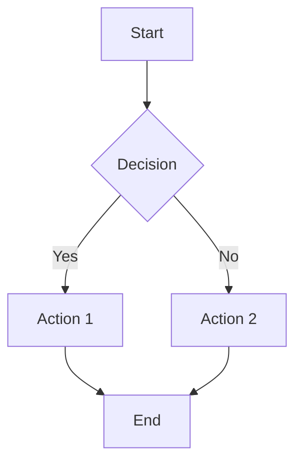
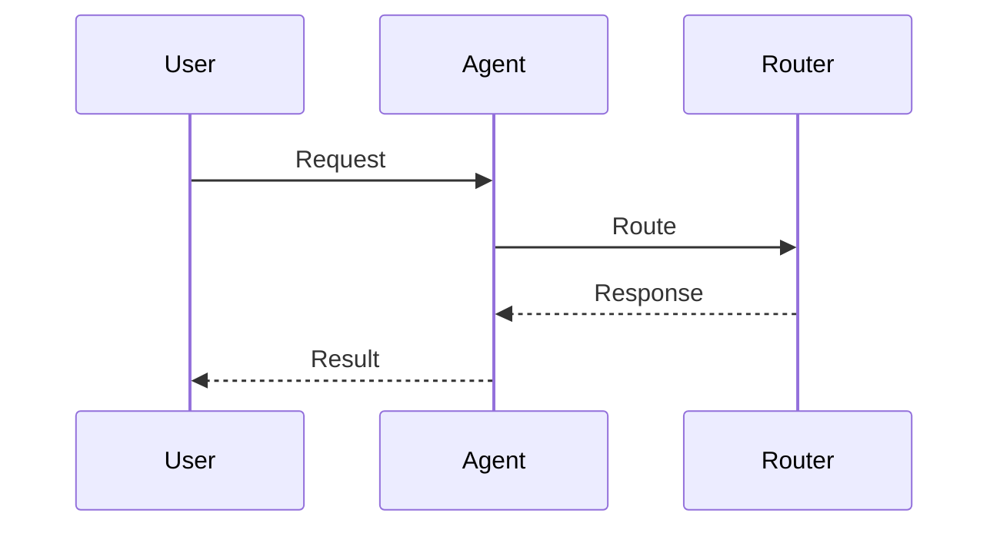
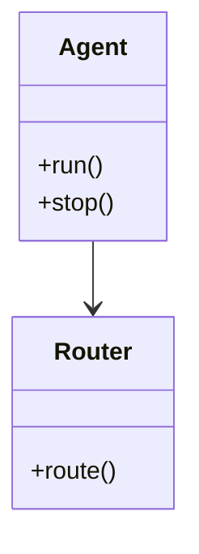
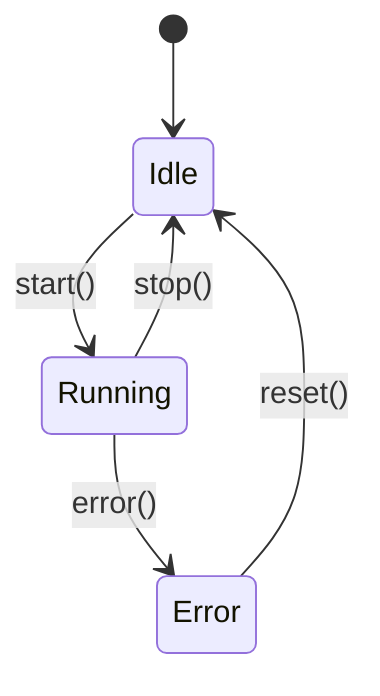
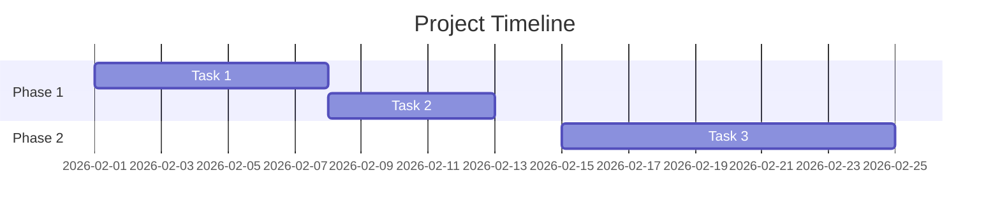
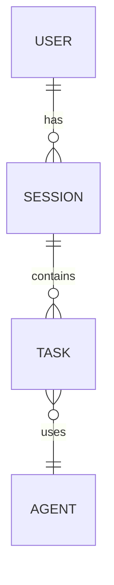
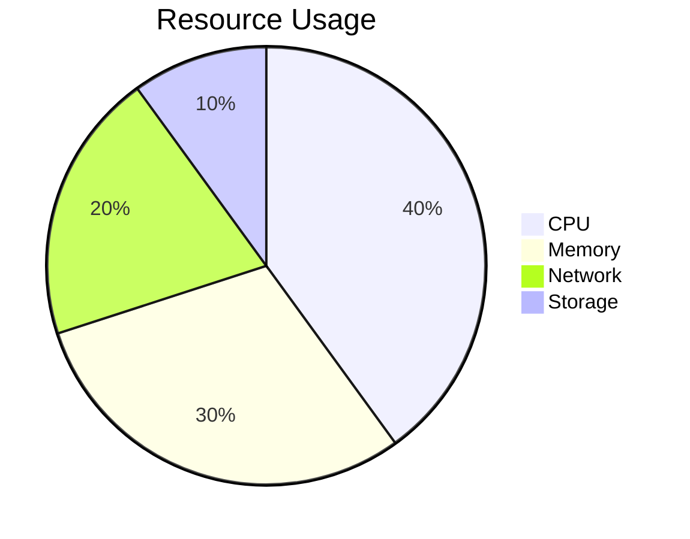

# Merged Fragmented Markdown

## Source: examples/code-playground-example.md

# CodePlayground Examples

This page demonstrates the CodePlayground component for interactive code examples.

---

## Python Example

<CodePlayground
  lang="python"
  title="Agent Example"
  code="from thegent import Agent\n\nagent = Agent('codex')\nresult = agent.run('Hello world')\nprint(result)"
/>

---

## Bash Example

<CodePlayground
  lang="bash"
  title="CLI Example"
  code="thegent run codex 'Fix this bug'\nthegent list agents\nthegent status"
/>

---

## JavaScript Example

<CodePlayground
  lang="javascript"
  title="API Example"
  code="const agent = new Agent('codex');\nconst result = await agent.run('Hello world');\nconsole.log(result);"
/>

---

## Features

- **Copy Code**: Click the 📋 button to copy code
- **Run Code**: Click ▶ Run to execute (ready for API integration)
- **Language Badge**: Shows the programming language
- **Output Display**: Shows execution results or errors
- **Dark Mode**: Automatically adapts to theme

---

**See Also**: [VITEPRESS_USAGE_GUIDE.md](../guides/VITEPRESS_USAGE_GUIDE.md)

---

## Source: examples/demo-gif-example.md

# Demo GIF Examples

This page demonstrates how to use the DemoGif component.

---

## CLI Demo

<DemoGif
  src="cli-demo.gif"
  alt="CLI Demo"
  caption="Running thegent CLI commands"
/>

---

## Web Demo

<DemoGif
  src="web-demo.gif"
  alt="Web Interface Demo"
  caption="Using thegent web interface"
/>

---

## Creating Demo GIFs

### Using VHS (Terminal Recordings)

1. Create a `.tape` file in `docs/demos/cli/`:

```tape
Output cli-demo.gif
Set FontSize 14
Set Width 1200
Set Height 600
Set Theme "Catppuccin Mocha"

Type "thegent run codex 'Hello world'"
Sleep 500ms
Enter
Sleep 2s
```

2. Generate GIF:
```bash
./scripts/generate-demo-gifs.sh
```

### Using Playwright (Browser Recordings)

1. Create a `.ts` file in `docs/demos/web/`:

```typescript
import { test } from '@playwright/test'

test('demo', async ({ page }) => {
  await page.goto('https://example.com')
  // ... record interactions
})
```

2. Generate GIF:
```bash
npx playwright test --gif
```

---

**See Also**:
- [VITEPRESS_USAGE_GUIDE.md](../guides/VITEPRESS_USAGE_GUIDE.md)
- [AUTOMATED_DEMOS.md](../guides/AUTOMATED_DEMOS.md)

---

## Source: examples/math-emoji-example.md

# Math & Emoji Examples

This page demonstrates math rendering and emoji support in VitePress.

---

## Math Support (KaTeX)

### Inline Math

You can use inline math like this: $E = mc^2$ or $\int_0^1 x^2 dx = \frac{1}{3}$.

### Block Math

Display math equations:

$$
\begin{aligned}
\nabla \times \vec{\mathbf{B}} -\, \frac1c\, \frac{\partial\vec{\mathbf{E}}}{\partial t} &= \frac{4\pi}{c}\vec{\mathbf{j}} \\
\nabla \cdot \vec{\mathbf{E}} &= 4 \pi \rho \\
\nabla \times \vec{\mathbf{E}}\, +\, \frac1c\, \frac{\partial\vec{\mathbf{B}}}{\partial t} &= \vec{\mathbf{0}} \\
\nabla \cdot \vec{\mathbf{B}} &= 0
\end{aligned}
$$

### Complex Equations

$$
\begin{pmatrix}
a & b \\
c & d
\end{pmatrix}
\begin{pmatrix}
x \\
y
\end{pmatrix}
=
\begin{pmatrix}
ax + by \\
cx + dy
\end{pmatrix}
$$

---

## Emoji Support

### Common Emojis

- :smile: Smile
- :heart: Heart
- :rocket: Rocket
- :fire: Fire
- :star: Star
- :thumbsup: Thumbs up
- :ok_hand: OK hand
- :muscle: Muscle
- :clap: Clap
- :tada: Celebration

### Technical Emojis

- :computer: Computer
- :keyboard: Keyboard
- :mouse: Mouse
- :floppy_disk: Floppy disk
- :cd: CD
- :dvd: DVD
- :file_folder: File folder
- :open_file_folder: Open folder
- :page_facing_up: Document
- :page_with_curl: Page

### Status Emojis

- :white_check_mark: Success
- :x: Error
- :warning: Warning
- :information_source: Info
- :question: Question
- :bulb: Idea
- :zap: Fast
- :lock: Secure
- :unlock: Unlock
- :key: Key

---

## Combined Usage

You can combine math and emojis: :rocket: The formula $v = \frac{d}{t}$ shows velocity calculation.

Or use emojis in code comments:

```python
def calculate_velocity(distance: float, time: float) -> float:
    """Calculate velocity :rocket:

    Uses the formula: $v = \frac{d}{t}$
    """
    return distance / time  # :zap: Fast calculation
```

---

## See Also

- [Mermaid Examples](./mermaid-example.md) - Diagram examples
- [Code Playground Examples](./code-playground-example.md) - Interactive code
- [Demo GIF Examples](./demo-gif-example.md) - Demo GIFs

---

## Source: examples/mermaid-example.md

# Mermaid Diagram Examples

This page demonstrates various Mermaid diagram types available in VitePress.

---

## Flowchart

````markdown

````

---

## Sequence Diagram

````markdown

````

---

## Class Diagram

````markdown

````

---

## State Diagram

````markdown

````

---

## Gantt Chart

````markdown

````

---

## ER Diagram

````markdown

````

---

## Pie Chart

````markdown

````

---

**See Also**: [VITEPRESS_USAGE_GUIDE.md](../guides/VITEPRESS_USAGE_GUIDE.md)

---

## Source: examples/tooltip-example.md

# Tooltip Component Examples

This page demonstrates the Tooltip component usage.

---

## Basic Usage

Hover over this text: <Tooltip content="This is a helpful tooltip!">tooltip example</Tooltip>

---

## Different Positions

- <Tooltip content="Top tooltip" position="top">Top</Tooltip>
- <Tooltip content="Bottom tooltip" position="bottom">Bottom</Tooltip>
- <Tooltip content="Left tooltip" position="left">Left</Tooltip>
- <Tooltip content="Right tooltip" position="right">Right</Tooltip>

---

## Technical Terms

- <Tooltip content="Application Programming Interface">API</Tooltip>
- <Tooltip content="Model Context Protocol">MCP</Tooltip>
- <Tooltip content="Representational State Transfer">REST</Tooltip>
- <Tooltip content="JavaScript Object Notation">JSON</Tooltip>

---

## Code Examples

```python
# Hover over the function name
def <Tooltip content="This function calculates the sum of two numbers">add</Tooltip>(a: int, b: int) -> int:
    return a + b
```

---

## See Also

- [Math & Emoji Examples](./math-emoji-example.md) - Math and emoji support
- [VitePress Usage Guide](../guides/VITEPRESS_USAGE_GUIDE.md) - Complete guide

---
