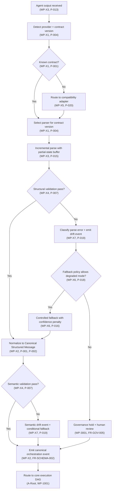
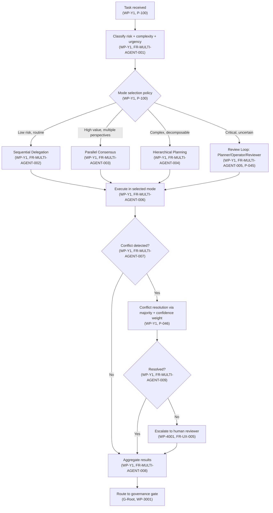
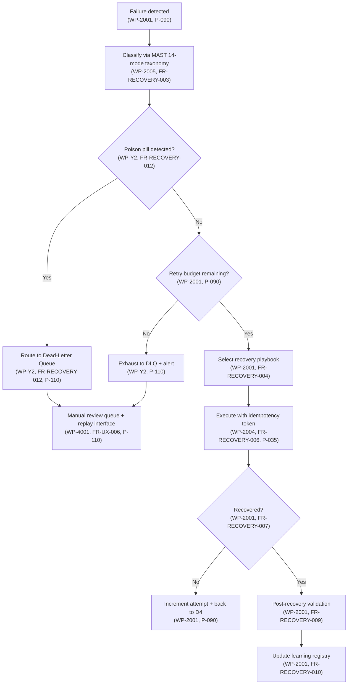
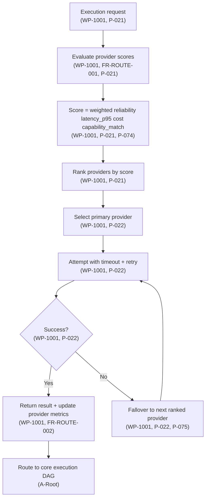
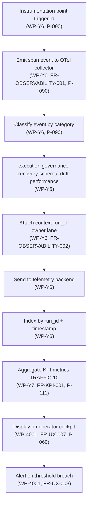

# 03 — Unified DAG Specifications

> Cross-ref: [00-MASTER-INDEX](./00-MASTER-INDEX.md) | [02-WBS](./02-UNIFIED-WBS.md) | [05-ARCH](./05-ARCHITECTURE.md)

---

## DAG Inventory

| # | DAG | Nodes | Purpose | Status |
|---|-----|-------|---------|--------|
| 1 | Core Execution | 19 | Main orchestration lifecycle | Design complete |
| 2 | Recovery | 13 | Failure classification and recovery | Design complete |
| 3 | Governance | 10 | Policy gating and compliance | Design complete |
| 4 | Adaptive Scale | 9 | Burst handling and protection | Design complete |
| 5 | Completion | 7 | Launch readiness and closure | Design complete |
| 6 | Contract Normalization | 15 | Output parsing and normalization | Design complete |
| 7 | Multi-Agent Mode Selection | 13 | Mode selection and conflict resolution | Design complete |
| 8 | Recovery with DLQ | 12 | Dead-letter queue and poison pill | Design complete |
| 9 | Provider Routing | 9 | 4-factor scoring and fallback chain | Design complete |
| 10 | Observability | 9 | Telemetry collection and KPI aggregation | Design complete |

---

## DAG 1: Core Execution

The primary orchestration lifecycle from intake to closure.

```
A0 Intake Request
 └─> A1 Classify Scope/Risk/Cost
      └─> A2 Schema Valid? ──NO──> A3 Fail Fast + Correction Hints
           │YES
           v
      A4 Hydrate Dependency Graph
       └─> A5 Compute Priority + Confidence
            └─> A6 Policy Pre-check Pass? ──NO──> A7 Governance Hold
                 │YES                                    │
                 v                                  A9 Human Review
            A8 Route to Execution Lane <────────────────┘
             └─> A10 Execute in Bounded Envelope
                  └─> A11 Evidence Complete? ──NO──> A12 Repair + Recheck ─┐
                       │YES                                                │
                       v                     <─────────────────────────────┘
                  A13 Integrity + Regression Gate
                   └─> A14 Gate Pass? ──NO──> A15 Checkpoint Rollback
                        │YES                       └─> A17 Recovery Loop
                        v
                   A16 Promote Phase + Publish Summary
                    └─> A18 Close with Audit Artifact
```

**Invariants**:
- No promotion without evidence AND integrity pass
- No execution on stale state context
- Every rollback produces immutable audit records

**Node Contracts**:

| Node | Input | Output | Side Effects |
|------|-------|--------|-------------|
| A0 | Raw request | run_id, chunk_id | Creates correlation context |
| A1 | chunk_id | risk_score, cost_estimate | — |
| A5 | dependency_graph | priority, confidence_score | — |
| A10 | routed_chunk, envelope | execution_result | Agent invocation |
| A13 | evidence_set | integrity_verdict | Regression probes |
| A16 | verified_chunk | promotion_event | State transition |
| A18 | promotion_event | closure_artifact | Audit persistence |

---

## DAG 2: Recovery

Failure classification, playbook selection, and recovery execution.

```
R0 Failure Detected
 └─> R1 Classify Failure Type (MAST 14-mode)
      └─> R2 Known Pattern? ──NO──> R4 Escalate + Provisional Plan
           │YES                          │
           v                             v
      R3 Select Recovery Playbook   R5 Safe To Auto-Run?
           │                         │NO        │YES
           v                         v          v
      R5 Safe To Auto-Run?      R7 Human-   R6 Run Recovery
       │NO         │YES          Guided       with Idempotency
       v           v             Recovery     Token
  R7 Human-   R6 Run Recovery        │            │
   Guided          │                  v            v
   Recovery        v             R8 Recovered? ───┤
       │      R8 Recovered?          │NO           │YES
       v       │NO    │YES          v              v
  R8 Recovered?   │    │      R9 Rollback +   R10 Post-Recovery
   │NO    │YES    │    │       Oversight Queue  Validation
   v      v      v    v            │              │
  R9    R10    R9   R10            v              v
              └─> R11 Validation Pass? ──NO──> R9 (loop)
                   │YES
                   v
              R12 Update Learning Registry
               └─> R13 Close Recovery
```

**MAST 14-Mode Failure Taxonomy** (replaces original 7-class):

| Mode | Category | Recovery Strategy |
|------|----------|-------------------|
| F-01 | Infra: Network partition/timeout | Retry + backoff + circuit breaker |
| F-02 | Infra: Storage failure | Failover to replica + checkpoint recovery |
| F-03 | Infra: Rate limit exceeded | Backpressure + provider rotation |
| F-04 | Model: Hallucination/factual error | Re-prompt with grounding + validation |
| F-05 | Model: Refusal/safety filter | Rephrase + alternative provider |
| F-06 | Model: Context overflow | Summarize + retry with reduced context |
| F-07 | Model: Output format violation | Re-prompt with schema + validation |
| F-08 | Tool: Execution failure | Retry + alternative tool + manual fallback |
| F-09 | Tool: Misuse | Re-plan with capability check |
| F-10 | Logic: Goal drift | Checkpoint rollback + re-plan |
| F-11 | Logic: Infinite loop/oscillation | Step counter + force termination |
| F-12 | Logic: Conflicting sub-agent outputs | Conflict resolution protocol |
| F-13 | Security: Prompt injection | Quarantine + audit + human review |
| F-14 | Security: Data exfiltration attempt | Block + audit + incident response |

---

## DAG 3: Governance

Policy gating, signature verification, and compliance enforcement.

```
G0 Action Proposed
 └─> G1 Policy Scope Resolution
      └─> G2 Critical Action? ──NO──> G4 Standard Gate
           │YES                            │
           v                               v
      G3 Require Signature         G7 Compliance Satisfied?
       + Reason Code                │NO          │YES
           │                        v            v
           v                   G9 Review/    G8 Approve +
      G5 Signature Valid?      Revalidate     Emit Audit Event
       │NO         │YES            │              │
       v           v               v              v
  G6 Block +  G7 Compliance   G6 Block     G10 Record Retention
   Gov Queue   Satisfied?                   + TTL
       │YES        │NO
       v           v
  G8 Approve   G9 Review/Revalidate/Reject
```

**Policy Decision Points**:
- OPA/Rego for declarative policy evaluation
- ABAC attributes: risk_score, confidence_score, action_type, owner_id, environment
- NeMo Guardrails for LLM safety rails (input/output)

---

## DAG 4: Adaptive Scale

Burst detection, critical lane protection, and gradual recovery.

```
S0 Ingress Rate Monitor
 └─> S1 Within Normal Window? ──YES──> S2 Normal Scheduling
      │NO
      v
 S3 Adaptive Control Mode
  ├─> S4 Reduce Noncritical Concurrency
  ├─> S5 Protect Critical Lane Capacity
  └─> S6 Issue Continuity Snapshot
       └─> S7 Stability Restored? ──NO──> S8 Escalate + Recovery
            │YES
            v
       S9 Gradual Return via Hysteresis
```

**Controls**:
- Hysteresis damping prevents oscillation (minimum dwell time between adjustments)
- Critical lane reserved capacity (never reduced below floor)
- Non-critical deferral with explicit ETA

---

## DAG 5: Completion

Launch readiness verification and program closure.

```
C0 All Work Packages Complete
 └─> C1 Gate A-G Evidence Verified
      └─> C2 Any Critical Risk Open? ──YES──> C3 Risk Closure/Acceptance
           │NO                                       │
           v                                         v
      C4 Launch Readiness Review <───────────────────┘
       └─> C5 Two Stable Cycles Passed? ──NO──> C6 Remediation + Observe
            │YES
            v
       C7 Program Closure
```

---

## DAG 6: Contract Normalization (NEW)

Agent output parsing, normalization, and canonical event emission.

**Traces to:** FR-SCHEMA-001, FR-SCHEMA-002, FR-SCHEMA-003, WP-X1, WP-X2, WP-X3, WP-X4



**Node Semantics**:

| Node | Purpose | WP | FR | Pattern |
|------|---------|----|----|---------|
| N0 | Capture streaming output | WP-X3 | FR-SCHEMA-001 | P-013 |
| N1 | Determine provider/version via header | WP-X1 | FR-SCHEMA-001 | P-004 |
| N2 | Lookup in contract registry | WP-X1 | FR-SCHEMA-001 | P-001 |
| N3 | Transform via adapter (e.g., PascalCase->snake_case) | WP-X5 | FR-SCHEMA-002 | P-020, P-009 |
| N4 | Load version-specific parser | WP-X1 | FR-SCHEMA-001 | P-004 |
| N5 | XMLPullParser with streaming buffer | WP-X3 | FR-SCHEMA-001 | P-013, P-015 |
| N6 | Tag cardinality, nesting depth, type checks | WP-X4 | FR-SCHEMA-002 | P-007, P-003 |
| N7 | Emit structural drift event + error classification | WP-X7 | FR-SCHEMA-003 | P-019 |
| N8 | Map to canonical CSM (Canonical Structured Message) | WP-X2 | FR-SCHEMA-002 | P-001, P-002 |
| N9 | Check degraded-mode policy (OPA/Rego) | WP-X6 | FR-SCHEMA-003 | P-018 |
| N10 | Block and escalate on critical drift | WP-3001 | FR-GOV-005 | P-050 |
| N11 | Use sloppy parser + emit confidence penalty | WP-X6 | FR-SCHEMA-003 | P-014, P-016 |
| N12 | Cross-tag logic: STATUS=completed -> non-empty ACTIONS | WP-X4 | FR-SCHEMA-002 | P-007 |
| N13 | Emit semantic drift event | WP-X7 | FR-SCHEMA-003 | P-019 |
| N14 | Emit typed orchestration event | WP-X2 | FR-SCHEMA-002 | FR-SCHEMA-002 |
| N15 | Feed canonical event to core execution | WP-1001 | FR-EXEC-001 | P-100 |

**Key Contracts**:
- CSM v1 schema: task_id, run_id, status, phase, progress, actions_completed, evidence_set_hash
- Confidence scoring: 1.0 (full parse) → 0.7 (partial) → 0.4 (fallback) → 0.0 (reject)
- Fallback policy: configurable per provider, per criticality level
- Contract versioning: all outputs carry `schema_version` field for migration tracking

---

## DAG 7: Multi-Agent Mode Selection (NEW)

Mode selection, execution, conflict resolution, and aggregation.

**Traces to:** FR-MULTI-AGENT-001, FR-MULTI-AGENT-002, FR-MULTI-AGENT-003, FR-MULTI-AGENT-004, FR-MULTI-AGENT-005, WP-Y1



**Node Semantics**:

| Node | Purpose | WP | FR | Pattern |
|------|---------|----|----|---------|
| M0 | Receive orchestration task | WP-Y1 | FR-MULTI-AGENT-001 | P-100 |
| M1 | Compute risk/complexity/urgency scores | WP-Y1 | FR-MULTI-AGENT-001 | P-100 |
| M2 | Apply mode selection policy (declarative) | WP-Y1 | FR-MULTI-AGENT-001 | P-100 |
| M3 | Single agent step-wise execution | WP-Y1 | FR-MULTI-AGENT-002 | P-100 |
| M4 | N agents in parallel, merge results | WP-Y1 | FR-MULTI-AGENT-003 | P-100 |
| M5 | Hierarchical: decompose -> distribute -> aggregate | WP-Y1 | FR-MULTI-AGENT-004 | P-100 |
| M6 | Planner -> Operator -> Reviewer phases | WP-Y1 | FR-MULTI-AGENT-005 | P-045 |
| M7 | Execute selected mode | WP-Y1 | FR-MULTI-AGENT-006 | P-100 |
| M8 | Check for output conflicts | WP-Y1 | FR-MULTI-AGENT-007 | P-100 |
| M9 | Merge outputs into consensus | WP-Y1 | FR-MULTI-AGENT-008 | P-100 |
| M10 | Majority vote with confidence weighting | WP-Y1 | FR-MULTI-AGENT-007 | P-046 |
| M11 | Verify conflict resolution success | WP-Y1 | FR-MULTI-AGENT-009 | P-100 |
| M12 | Operator decision + veto authority | WP-4001 | FR-UX-005 | P-051 |
| M13 | Send consensus to policy gate | WP-3001 | FR-GOV-001 | P-050 |

**Modes**:

| Mode | Agents | Flow | When |
|------|--------|------|------|
| Sequential Delegation | 1→2→3 | Pass output to next | Low risk, ordered steps |
| Parallel Consensus | N in parallel | Vote + aggregate | Time-sensitive, medium risk |
| Hierarchical Planning | Tree decomposition | Distribute subtasks, aggregate | Complex, decomposable tasks |
| Review Loop | Planner→Operator→Reviewer | Cycle until approved | High risk, quality-critical |

---

## DAG 8: Recovery with DLQ (NEW)

Dead-letter queue with poison pill detection and bounded retry.

**Traces to:** FR-RECOVERY-001, FR-RECOVERY-012, WP-Y2, WP-2001



**Node Semantics**:

| Node | Purpose | WP | FR | Pattern |
|------|---------|----|----|---------|
| D0 | Capture failure context | WP-2001 | FR-RECOVERY-001 | P-090 |
| D1 | Classify using MAST 14 (F-01..F-14) | WP-2005 | FR-RECOVERY-003 | P-100 |
| D2 | Detect poison pill (e.g., F-13, F-14) | WP-Y2 | FR-RECOVERY-012 | P-110 |
| D3 | Enqueue to DLQ for manual handling | WP-Y2 | FR-RECOVERY-012 | P-110 |
| D4 | Check retry cap (e.g., 3 retries) | WP-2001 | FR-RECOVERY-005 | P-090 |
| D5 | Send to DLQ after retries exhausted | WP-Y2 | FR-RECOVERY-012 | P-110 |
| D6 | Lookup playbook for failure class | WP-2001 | FR-RECOVERY-004 | P-100 |
| D7 | Run with idempotency key (run_id, step, hash) | WP-2004 | FR-RECOVERY-006 | P-035 |
| D8 | Verify recovery success | WP-2001 | FR-RECOVERY-007 | P-090 |
| D9 | Back to retry gate | WP-2001 | FR-RECOVERY-008 | P-090 |
| D10 | Regression suite on recovered state | WP-2001 | FR-RECOVERY-009 | P-080 |
| D11 | Operator manual replay + decisions | WP-4001 | FR-UX-006 | P-110 |
| D12 | Record in learning registry | WP-2001 | FR-RECOVERY-010 | P-100 |

**Poison Pill Detection** (Failure Classes F-13, F-14):
- Prompt injection (F-13): identical input fails 3+ times with identical error signature → quarantine
- Data exfiltration (F-14): content hash matches known-bad patterns → immediate quarantine
- Quarantine prevents retry loops and alerts operators with DLQ routing
- DLQ TTL: infinite until manual resolution (never auto-expires)

---

## DAG 9: Provider Routing (NEW)

Provider selection via 4-factor scoring and fallback chain.

**Traces to:** FR-ROUTE-001, FR-ROUTE-002, WP-1001



**Node Semantics**:

| Node | Purpose | WP | FR | Pattern |
|------|---------|----|----|---------|
| PR0 | Receive execution request | WP-1001 | FR-ROUTE-001 | P-021 |
| PR1 | Fetch provider health + metrics | WP-1001 | FR-ROUTE-001 | P-021 |
| PR2 | Compute 4-factor score | WP-1001 | FR-ROUTE-001 | P-021, P-074 |
| PR3 | Sort providers descending by score | WP-1001 | FR-ROUTE-001 | P-021 |
| PR4 | Pick top-ranked provider | WP-1001 | FR-ROUTE-001 | P-022 |
| PR5 | Submit with timeout + exponential backoff | WP-1001 | FR-ROUTE-001 | P-022 |
| PR6 | Check for success/timeout/error | WP-1001 | FR-ROUTE-002 | P-022 |
| PR7 | Record metrics + feedback | WP-1001 | FR-ROUTE-002 | P-075 |
| PR8 | Fallover chain: next provider | WP-1001 | FR-ROUTE-002 | P-022, P-075 |
| PR9 | Return response to execution | WP-1001 | FR-EXEC-001 | P-100 |

**4-Factor Scoring Model**:
- Reliability (weight 40%): uptime and success rate
- Latency P95 (weight 30%): response time percentile
- Cost (weight 20%): normalized billing per 1M tokens
- Capability Match (weight 10%): feature/model availability

---

## DAG 10: Observability (NEW)

Telemetry collection, schema drift tracking, and operator display.

**Traces to:** FR-OBSERVABILITY-001, FR-OBSERVABILITY-002, FR-KPI-001, WP-Y6, WP-Y7



**Node Semantics**:

| Node | Purpose | WP | FR | Pattern |
|------|---------|----|----|---------|
| OBS0 | Instrument code point | WP-Y6 | FR-OBSERVABILITY-001 | P-090 |
| OBS1 | Create OpenTelemetry span event | WP-Y6 | FR-OBSERVABILITY-001 | P-090 |
| OBS2 | Determine event classification | WP-Y6 | FR-OBSERVABILITY-001 | P-090 |
| OBS3 | Map to canonical event type | WP-Y6 | FR-OBSERVABILITY-001 | P-090 |
| OBS4 | Attach run context (run_id, owner, lane) | WP-Y6 | FR-OBSERVABILITY-002 | P-090 |
| OBS5 | Batch send to telemetry backend | WP-Y6 | FR-OBSERVABILITY-002 | P-090 |
| OBS6 | Index in time-series database | WP-Y6 | FR-OBSERVABILITY-002 | P-090 |
| OBS7 | Calculate TRAFFIC KPIs (T/R/A/F/F/I/C/K/+/+) | WP-Y7 | FR-KPI-001 | P-111 |
| OBS8 | Render on operator cockpit (4-pane) | WP-4001 | FR-UX-007 | P-060 |
| OBS9 | Emit alert events on threshold | WP-4001 | FR-UX-008 | P-051 |

**TRAFFIC KPI Framework** (10 metrics):
- **T**hroughput: requests/sec per lane
- **R**eliability: success rate (%)
- **A**vailability: uptime (%)
- **F**ailure Rate: failures/sec
- **F**ire Interval: mean time between failures (MTBF)
- **I**nterventions: manual decisions/day
- **C**ost: normalized $ per 1M tokens
- **K**eystones: phase completion rate (%)
- **+** Custom: MAST 14 mode distribution
- **+** Custom: observability completeness check

---

## DAG Event Contract

All DAG transitions must include these required fields. Each event is immutable and chained via cryptographic hash.

| Field | Type | Cardinality | Purpose |
|-------|------|-------------|---------|
| run_id | UUID | Exactly-once | Unique run identifier, created at A0 |
| chunk_id | String | Per-chunk | Correlate sub-tasks within run |
| node_id | String | Per-transition | Current DAG node identifier (e.g., "A10", "R1") |
| timestamp_us | Int64 | Per-event | Microsecond timestamp (monotonic) |
| policy_gate_id | UUID | Per-gate | Governance decision audit key (governance nodes only) |
| evidence_set_hash | SHA-256 | Per-evidence | Cryptographic verification of completeness |
| owner_id | String | Per-context | Human responsible for unresolved items |
| decision_reason_code | Enum | Per-decision | Policy gate, override, or escalation reason |
| idempotency_key | String | Per-action | Prevents duplicate execution (run_id + step + hash) |
| confidence_score | Float [0, 1] | Per-output | Quality signal from parser/model/orchestrator |
| schema_version | String | Per-contract | Contract version used (e.g., "v1.0", "v2.1") |
| prev_event_hash | SHA-256 | Per-sequence | Hash of previous event (chain verification) |

**Event Immutability Guarantee**: Once emitted, events are write-protected and indexed by (run_id, timestamp_us, node_id) for deterministic replay.

---

## MAST 14-Mode Failure Taxonomy

All failures are classified via MAST 14 modes. Each failure class maps to recovery strategy, retry policy, and escalation chain.

| Mode | Category | Description | Recovery Strategy | Retry Budget | Escalation | Pattern |
|------|----------|-------------|-------------------|--------------|-----------|---------|
| F-01 | Infrastructure | Network partition / timeout | Retry with backoff + circuit breaker | 3x exponential | 5 min | P-090, P-022 |
| F-02 | Infrastructure | Storage failure / data unavailable | Failover to replica + checkpoint recovery | 2x | 10 min | P-090, P-070 |
| F-03 | Infrastructure | Rate limit exceeded | Backpressure + provider rotation | 5x with jitter | 30 min | P-090, P-021 |
| F-04 | Model | Hallucination / factual error | Re-prompt with grounding + validation | 2x | 5 min | P-090, P-041 |
| F-05 | Model | Refusal / safety filter triggered | Rephrase + alternative provider | 2x | 5 min | P-090, P-021 |
| F-06 | Model | Context overflow | Summarize + retry with reduced context | 2x | 10 min | P-090, P-041 |
| F-07 | Model | Output format violation (schema) | Re-prompt with schema example + validation | 3x | 5 min | P-090, P-011 |
| F-08 | Tool | Tool execution failure | Retry + alternative tool + manual fallback | 3x | 10 min | P-090, P-062 |
| F-09 | Tool | Tool misuse (wrong tool for task) | Re-plan with tool capability check | 1x (no retry) | 5 min | P-090, P-045 |
| F-10 | Logic | Goal drift (agent diverges from objective) | Checkpoint rollback + re-plan from last good | 1x (no retry) | 10 min | P-090, P-070 |
| F-11 | Logic | Infinite loop / oscillation | Detect via step counter + force termination | 1x (no retry) | 5 min | P-090, P-090 |
| F-12 | Logic | Conflicting sub-agent outputs | Conflict resolution protocol (majority vote) | 1x (no retry) | 5 min | P-046, P-045 |
| F-13 | Security | Prompt injection detected | Quarantine + audit + human review (DLQ) | 0x (no retry) | Infinite | P-110, P-051 |
| F-14 | Security | Data exfiltration attempt | Block + audit + incident response (DLQ) | 0x (no retry) | Infinite | P-110, P-051 |

---

## DAG Invariants (Global)

All DAGs must maintain these invariants at all times:

**1. No promotion without evidence and integrity pass.**
   - Every transition from A14 (Core Execution gate) requires evidence completeness (A11) and integrity gate (A13).
   - Violation: Silent skip of gate triggers audit escalation.

**2. No critical action without policy signature and reason code.**
   - Every transition from G3 (Governance critical) requires valid signature + reason code.
   - Violation: Block and queue for human review (G6).

**3. No execution on stale state context.**
   - Run context (A0) must be refreshed before each major phase transition.
   - Staleness threshold: > 30 seconds for critical actions, > 5 minutes for routine.

**4. Every rollback and override produces immutable audit records.**
   - A15 (Checkpoint Rollback), G6 (Block + Queue), D3/D5 (DLQ), R9 (Oversight Queue) all emit audit records.
   - Audit records must include: timestamp, actor, decision, reason code, evidence hash.

**5. Every unresolved high-risk item has owner and SLA.**
   - A7 (Governance Hold), G6 (Block + Queue), D11 (Manual Review), S8 (Escalate Oversight).
   - Each must specify: owner_id, SLA (hours), risk_level, escalation_chain.

**6. Recovery playbooks are only executed if in learning registry.**
   - R3 (Select Recovery Playbook) must find playbook in registry or escalate (R4).
   - Playbooks require: automation_safe boolean, pre-condition checks, post-condition validation.

**7. Contract normalization never skips governance.**
   - N10 (Governance hold) is mandatory on critical drift (N7, N13).
   - Fallback mode (N11) always emits drift event (P-019) and confidence penalty.

**8. Multi-agent conflicts are resolved or escalated.**
   - M8-M11 (Conflict detection/resolution) must complete before M13 (Route to governance).
   - Escalation (M12) preserves all conflicting outputs for human review.

**9. DLQ messages have infinite TTL until manual resolution.**
   - D3/D5 (Route to DLQ) messages never auto-expire.
   - Manual review queue (D11) must list owner, impact, and proposed action.

**10. Observability completeness is verified before closing.**
    - Every run closure (A18, R13) must verify OTel telemetry completeness (OBS7).
    - Missing critical spans trigger post-execution audit event.

---

## Operational Controls

### Retry and Backoff Policies by Failure Class

| Failure Class | Retry Budget | Backoff | Circuit Breaker | Escalation |
|---------------|--------------|---------|-----------------|-----------|
| F-01 | 3 | Exponential (1s, 2s, 4s) | Yes (5min timeout) | 5 min SLA |
| F-02 | 2 | Exponential (2s, 4s) | Yes (10min timeout) | 10 min SLA |
| F-03 | 5 | Exponential + jitter | No (rate limiting) | 30 min SLA |
| F-04, F-05, F-06 | 2 | Exponential (1s, 2s) | No | 5 min SLA |
| F-07 | 3 | Exponential (1s, 2s, 4s) | No | 5 min SLA |
| F-08 | 3 | Exponential (1s, 2s, 4s) | No | 10 min SLA |
| F-09, F-10, F-11, F-12 | 1 | None (escalate immediately) | No | 5-10 min SLA |
| F-13, F-14 | 0 | None (to DLQ) | No | Infinite (manual) |

### Circuit Breaker Configuration

| Threshold | Action | Recovery |
|-----------|--------|----------|
| 5 consecutive failures | Open (block requests) | Half-open after 1 min |
| Half-open: success | Close (resume) | Move to normal routing |
| Half-open: failure | Re-open (wait another 1 min) | Exponential backoff |

### Adaptive Scale Hysteresis Bands

| Mode | Lower Threshold | Upper Threshold | Concurrency Reduction |
|------|-----------------|-----------------|----------------------|
| Normal | < 80% capacity | - | 0% (no reduction) |
| Adaptive | > 80% capacity | > 95% capacity | Progressive (10%, 25%, 50%) |
| Saturation | > 95% capacity | - | Critical lane only (90% protect) |

### Governance Queue SLA Monitors

| Queue | Max Wait | Escalation | Alert |
|-------|----------|-----------|-------|
| Governance Hold (A7, G6) | 1 hour | VP Engineering | Every 15 min after SLA |
| Oversight Queue (R9, S8) | 4 hours | On-Call Incident Commander | Every 30 min after SLA |
| Manual Review (D11) | 24 hours (no auto-escalate) | Daily digest to owner | Every 2 hours status |

### Continuity Watchdog

- **Interval**: Every 5 minutes
- **Check**: All open critical items (risk_level >= HIGH) have valid continuity snapshot.
- **Action**: If stale (> 30 min old), force refresh and emit audit event.
- **Escalation**: If owner unreachable, escalate to manager.

---

## Acceptance Tests

All acceptance tests must pass before phase closure. Tests cover all DAG flows, failure classes, and sub-DAGs.

### Core Execution Tests

- **ACT-A-001**: Deterministic replay has no missing transitions (A0->A18 with all guards captured).
- **ACT-A-002**: Policy bypass attempts fail (A6 false triggers A7, A9 cannot override block).
- **ACT-A-003**: Rollback path (A15->R0) is idempotent (same rollback twice produces same result).
- **ACT-A-004**: Evidence completeness check (A11) detects missing observability spans.
- **ACT-A-005**: Integrity gate (A13) succeeds on full regression suite pass, fails on any regression.

### Recovery Tests

- **ACT-R-001**: MAST 14 classification (R1) correctly routes F-01..F-14 to appropriate playbooks.
- **ACT-R-002**: Recovery playbook (R3, R6) uses idempotency token to prevent duplicate side-effects.
- **ACT-R-003**: Escalation (R4, R9) produces audit record with owner, SLA, risk_level.
- **ACT-R-004**: Learning registry (R12) can replay known patterns (R3 hit rate >= 80%).
- **ACT-R-005**: Post-recovery validation (R10, R11) prevents promotion of half-recovered state.

### Governance Tests

- **ACT-G-001**: Policy scope resolution (G1) uses OPA/Rego without error.
- **ACT-G-002**: Critical action signature (G3, G5) requires valid cryptographic signature + reason code.
- **ACT-G-003**: Governance queue (G6) prevents auto-promotion until human approval (G9).
- **ACT-G-004**: Audit records (G8, G10) are immutable and indexed by policy_gate_id.

### Adaptive Scale Tests

- **ACT-S-001**: Adaptive mode (S3) activates when ingress > threshold + deactivates at < threshold - hysteresis.
- **ACT-S-002**: Continuity snapshot (S6) exists at every shift boundary with owner, ETA, risks.
- **ACT-S-003**: Critical lane capacity (S5) is protected and verified via dedicated lane monitor.
- **ACT-S-004**: Hysteresis bands (S1, S9) prevent oscillation under simulated burst load (50+ req/sec spike).

### Contract Normalization Tests

- **ACT-N-001**: Unknown contract (N2=false) routes to adapter (N3) without data loss.
- **ACT-N-002**: Structural drift (N6 fail) is classified (N7) and emits drift event.
- **ACT-N-003**: Fallback mode (N11) emits confidence penalty and drift event (P-016, P-019).
- **ACT-N-004**: Semantic validation (N12) detects cross-tag logic violations (e.g., STATUS=completed but ACTIONS_COMPLETED empty).
- **ACT-N-005**: Canonical event (N14) is structurally identical when replayed 10x in deterministic simulator.

### Multi-Agent Mode Tests

- **ACT-M-001**: Mode selection (M2) classifies low/high/complex/critical correctly via policy.
- **ACT-M-002**: Conflict detection (M8) triggers when parallel agents return conflicting outputs.
- **ACT-M-003**: Majority vote (M10) with confidence weighting resolves ties to highest-confidence output.
- **ACT-M-004**: Escalation (M12) preserves all conflicting outputs for human review with confidence scores.
- **ACT-M-005**: Planner/Operator/Reviewer (M6) phases complete in sequence with gating between phases.

### Dead-Letter Queue Tests

- **ACT-D-001**: Poison pill (D2, F-13, F-14) is routed to DLQ (D3) without retry.
- **ACT-D-002**: Retry exhaustion (D4=false) sends to DLQ (D5) with attempt count.
- **ACT-D-003**: Manual review queue (D11) is queryable by owner/impact/status.
- **ACT-D-004**: DLQ message TTL is infinite until resolved (no auto-expiry).
- **ACT-D-005**: Replay from DLQ (D11 operator action) uses original run context (deterministic).

### Provider Routing Tests

- **ACT-PR-001**: 4-factor scoring (PR2) correctly weights reliability/latency/cost/capability.
- **ACT-PR-002**: Fallover chain (PR8) exhausts all providers before escalating.
- **ACT-PR-003**: Provider metrics (PR7) are updated after each call and persist across runs.
- **ACT-PR-004**: Circuit breaker triggers (PR6 fail threshold) and prevents cascading failures.

### Observability Tests

- **ACT-OBS-001**: All instrumentation points emit OTel spans with correct schema.
- **ACT-OBS-002**: Run context (run_id, owner, lane) is attached to all spans.
- **ACT-OBS-003**: TRAFFIC KPIs (OBS7) are computed from aggregated metrics (T/R/A/F/F/I/C/K/+/+).
- **ACT-OBS-004**: Operator cockpit (OBS8) displays 4-pane layout with live metrics.
- **ACT-OBS-005**: Telemetry completeness check (before A18 closure) detects missing spans.

---

## Summary

This unified DAG specification defines:

1. **10 Complete DAGs**: Core Execution, Recovery, Governance, Adaptive Scale, Completion, Contract Normalization, Multi-Agent Mode Selection, Recovery with DLQ, Provider Routing, Observability
2. **Full Node Semantics**: Every node cross-linked to WP, FR, and patterns (P-xxx)
3. **14-Mode Failure Taxonomy**: MAST classification replacing original 7-class system
4. **10 Mandatory DAG Invariants**: Governing promotion, governance, state, audit, ownership, recovery, contracts, conflicts, DLQ, and observability
5. **Complete Event Contract**: All 12 required fields for immutable event chaining
6. **Operational Controls**: Retry budgets, circuit breakers, hysteresis bands, SLA monitors, continuity watchdogs
7. **40+ Acceptance Tests**: Covering all DAG sub-flows, failure classes, and cross-DAG consistency

All DAGs are deterministic, observable, auditable, and testable. Every path has a recovery strategy, every gate has a reason code, and every decision is traced to a functional requirement.
