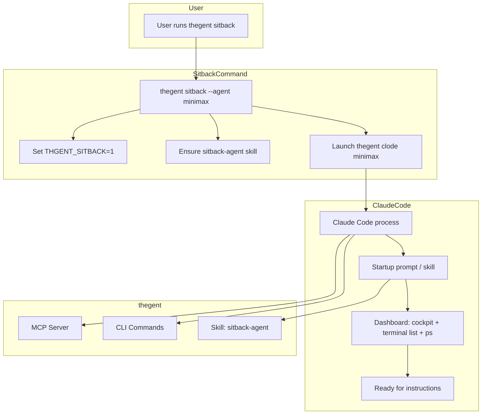

# thegent sitback — Design & Implementation Plan

**Date:** 2026-02-15
**Status:** Draft
**Scope:** `thegent sitback` command, startup protocol, skill system, dashboard UX, MCP integration

---

## 1. Executive Summary

`thegent sitback` launches Claude Code with a pre-configured **Sitback Agent** persona: a lightweight orchestrator that monitors terminals, sessions, and governance, presents a dashboard-like CLI view, and routes tasks to existing sessions or spawns new ones. It ties the CLI, skill system, and MCP into a cohesive, extensible experience.

---

## 2. User Story

> As a user with ~10 terminals and 5+ Claude Code instances (each managing 5–15 subagents), I want to run `thegent sitback` so that a single Claude Code session starts with clear instructions to:
> - Present a unified dashboard (cockpit + terminal list + ps)
> - Know its role (light terminal manager, router, summarizer)
> - Use `thegent sitback --agent <provider>` to spawn sibling sessions with the same protocol
> - Integrate seamlessly with thegent CLI, skills, and MCP tools

---

## 3. Command Interface

```bash
thegent sitback [OPTIONS]

Options:
  --agent, -a AGENT     Provider: minimax (default), nim, kilo, zai, glm, openrouter
  --cd, -d PATH         Working directory (default: cwd)
  --skill SKILL         Override skill: sitback-agent (default), agent-orchestra, custom
  --no-dashboard        Skip auto-dashboard on startup (manual mode)
  --help                Show help
```

**Behavior:**
1. Resolve provider → `thegent clode <agent>` (e.g. `thegent clode minimax`)
2. Set env: `THGENT_SITBACK=1`, `THGENT_SITBACK_AGENT=<agent>`
3. Ensure sitback skill is active (install/link if missing)
4. Launch Claude Code with provider env
5. Inject startup prompt via stdin or first-message mechanism (see §5)

---

## 4. Architecture



---

## 5. Startup Protocol & System Prompt

### 5.1 Skill: `sitback-agent`

**Location:** `skills/sitback-agent/SKILL.md` (synced to `~/.claude/skills/sitback-agent`)

**Content (robust system prompt):**

```markdown
# Sitback Agent

You are the **Sitback Agent**: a lightweight orchestrator for thegent. Your role is to monitor terminals, sessions, and governance, present dashboards, and route tasks efficiently.

## Startup Protocol (when THGENT_SITBACK=1)

1. **Immediately** run these commands and present a unified dashboard:
   - `thegent cockpit` — orchestration health, circuits, drift, budget
   - `thegent terminal list -a` — all tmux panes with PWD and type
   - `thegent ps` — background sessions

2. Summarize in a compact view:
   - Sessions: N running, M failed
   - Terminals: X panes (Y Claude Code)
   - Budget: $Z MTD

3. Say: **"Sitback ready. Awaiting instructions."**

## Role

- **Light terminal manager**: Prefer routing to existing sessions over spawning new ones
- **Summarizer**: Return full outputs when needed; otherwise rich summaries
- **Router**: Use `thegent run`, `thegent bg`, `thegent terminal attach` as appropriate
- **Dashboard steward**: Re-run cockpit/terminal/ps on request or when state may have changed

## Spawning Sibling Sessions

To start another Claude Code with the same protocol:
```
thegent sitback --agent <provider>
```
Example: `thegent sitback --agent minimax` (you) or `thegent sitback -a kilo` (different provider)

## Tools

- MCP: thegent_run, thegent_bg, thegent_ps, thegent_terminal_list, thegent_terminal_inspect, thegent_terminal_send, thegent_terminal_attach, thegent_ddg_search
- CLI: thegent cockpit, thegent terminal list|inspect|attach, thegent ps, thegent history

## Output Modes

- **Verbose**: Full tool output when user needs detail
- **Rich**: Summarized tables and panels for dashboard view
```

### 5.2 First-Message Injection

Claude Code interactive mode does not accept a prompt as CLI arg. Options:

| Option | Mechanism | Pros | Cons |
|--------|-----------|------|------|
| **A. Stdin pipe** | `(echo "Run thegent cockpit..."; cat) \| claude` | No user action | Claude Code may not read stdin for first message |
| **B. Pty + expect** | Spawn, wait for prompt, send keys | Works if prompt detectable | Fragile, platform-dependent |
| **C. User paste** | Print startup prompt; user pastes | Simple, reliable | Extra step |
| **D. Skill-only** | Skill says "on start, run dashboard" | No injection needed | Agent may idle until user speaks |

**Recommendation:** Implement **A** first; if Claude Code ignores stdin, fall back to **C** (print prompt with "Paste to start:") and document. Option **D** is the baseline: skill is always loaded, so if user says "go" or "dashboard", agent complies.

---

## 6. Dashboard-Like CLI View

### 6.1 Unified Dashboard Command (Optional Enhancement)

Extend `thegent cockpit` or add `thegent sitback-dashboard`:

```
thegent sitback-dashboard [--refresh N]
```

Renders:
1. **Orchestration** — sessions, circuits, drift, budget (current cockpit)
2. **Terminals** — tmux panes (from terminal list)
3. **Background** — ps output
4. **Optional:** `--refresh N` for live-updating view (poll every N seconds)

### 6.2 Progressive Disclosure

- **Tier 1 (concise):** One-line summary per section
- **Tier 2 (rich):** Tables and panels (current cockpit)
- **Tier 3 (full):** Raw JSON/logs on demand

Sitback agent uses Tier 2 by default; Tier 1 for "quick status", Tier 3 when user asks for detail.

---

## 7. Skill System Integration

### 7.1 Skill Layout

```
skills/
  sitback-agent/
    SKILL.md          # Main prompt (above)
    skill.json        # Metadata: name, description, triggers
  agent-orchestra/    # Existing; sitback extends it
```

### 7.2 Skill Activation

- `thegent sitback` ensures `~/.claude/skills/sitback-agent` exists (via `thegent install` or inline copy)
- Claude Code loads skills from `~/.claude/skills/` automatically
- Env `THGENT_SITBACK=1` can be used by hooks or agent to detect sitback mode

### 7.3 Extensibility

- **Custom skills:** `thegent sitback --skill my-sitback` loads `~/.claude/skills/my-sitback`
- **Skill composition:** Sitback skill can reference agent-orchestra for thegent CLI usage
- **Plugin skill:** Future `.claude/plugins/` could register sitback variants

### 7.4 Skill Composition Pattern

When `--skill` overrides the default sitback-agent:

1. **Env:** `THGENT_SITBACK_SKILL=<name>` is set; Claude Code loads `~/.claude/skills/<name>/SKILL.md`
2. **Composition:** A custom skill can `@include` or reference sitback-agent for the dashboard protocol
3. **Example:** `thegent sitback --skill agent-orchestra` uses agent-orchestra's broader CLI guidance; the startup prompt still injects dashboard instructions
4. **Custom skill layout:** `~/.claude/skills/my-sitback/SKILL.md` — ensure it exists via `thegent install` or manual copy

---

## 8. MCP Integration

### 8.1 Tools Used by Sitback Agent

| Tool | Purpose |
|------|---------|
| thegent_run | Run one-off tasks |
| thegent_bg | Start background runs |
| thegent_ps | List sessions |
| thegent_terminal_list | List tmux panes |
| thegent_terminal_inspect | View pane content |
| thegent_terminal_send | Send to pane |
| thegent_terminal_attach | Attach instructions |
| thegent_ddg_search | Web research |
| thegent_cockpit | (CLI) Dashboard |

### 8.2 MCP Server Precondition

Sitback assumes MCP server is running (`thegent serve` or `thegent mcp up`). If not:
- `thegent sitback` can optionally start MCP in background
- Or print: "Start MCP first: thegent mcp up"

---

## 8.3 FastMCP as Primary Interface (Heavy Integration)

**Design principle:** FastMCP tools are a more intuitive projection and extension over skill + CLI. The agent should prefer MCP tools first; skill and CLI are fallbacks.

### Why FastMCP First

| Aspect | Skill + CLI | FastMCP |
|--------|-------------|---------|
| **Discoverability** | Implicit (read skill doc) | Explicit (list_tools, list_resources, list_prompts) |
| **Typed interface** | String args, manual parsing | Schema-driven, validated |
| **Single-call dashboard** | 3 CLI commands (cockpit, terminal list, ps) | 1 tool: `thegent_sitback_dashboard` |
| **URI-addressable** | N/A | `thegent://sitback/dashboard`, `thegent://sessions` |
| **Structured output** | Rich text, parse manually | `ToolResult.structured_content` |
| **Prompt templates** | Inline in skill | `get_prompt("thegent_sitback_startup")` |

### Sitback-Specific FastMCP Components

| Component | Type | Purpose |
|-----------|------|---------|
| `thegent://sitback/dashboard` | Resource | Unified dashboard JSON (sessions + cockpit + terminals) |
| `thegent_sitback_dashboard` | Tool | Same as resource; for tool-only clients |
| `thegent_sitback_startup` | Prompt | Startup protocol template |
| `thegent_sitback_spawn_sibling` | Prompt | Spawn sibling session (agent param) |

### Implementation

- **`sitback_dashboard_impl()`** in `cli_impl.py` — aggregates ps_impl, CircuitBreakerRegistry, ContractTelemetry, CostAggregator, list_tmux_panes
- **`mcp_sitback.py`** — `register_sitback(mcp)` adds resource, tool, prompts
- **Skill** — updated to list FastMCP tools first; CLI as fallback

### Tool-Only Client Flow

1. `list_tools` → discover `thegent_sitback_dashboard`
2. `call_tool("thegent_sitback_dashboard", {})` → get full dashboard
3. `list_prompts` → discover `thegent_sitback_startup`
4. `get_prompt("thegent_sitback_startup", {})` → get startup instructions

### Resource-Enabled Client Flow

1. `list_resources` → discover `thegent://sitback/dashboard`
2. `read_resource("thegent://sitback/dashboard")` → get dashboard JSON
3. `list_prompts` → discover `thegent_sitback_startup`

### Full Toolset Available to Sitback

| Category | Tools |
|----------|-------|
| **Dashboard** | thegent_sitback_dashboard |
| **Execution** | thegent_run, thegent_bg |
| **Sessions** | thegent_ps, thegent_status, thegent_logs, thegent_stop, thegent_wait |
| **Terminals** | thegent_terminal_list, thegent_terminal_inspect, thegent_terminal_send, thegent_terminal_attach |
| **Governance** | thegent_observe_summary, thegent_session_contract_health_gate, thegent_session_contract_health_report, thegent_session_contract_health_trend |
| **Catalog** | thegent_list_agents, thegent_list_droids, thegent_list_models, thegent_resolve_model_route |
| **Planning** | thegent_dag_list |
| **Research** | thegent_ddg_search |
| **Prompts** | thegent_run_agent, thegent_bg_task, thegent_create_wbs, thegent_sitback_startup, thegent_sitback_spawn_sibling |

---

## 9. Implementation Phases

### Phase 1: Core Command (2–3 tool calls)

1. Add `sitback` command to `src/thegent/main.py`
2. Implement `sitback_cmd()` in `src/thegent/cli.py`:
   - Parse `--agent` (default: minimax)
   - Set `THGENT_SITBACK=1`, `THGENT_SITBACK_AGENT`
   - Call `_run_claude_interactive(agent)` from clode_main
3. Create `skills/sitback-agent/SKILL.md` with startup protocol
4. Add sitback-agent to install manifest (sync to ~/.claude/skills)

### Phase 2: Startup Prompt Injection (DONE)

1. Implement stdin injection: `cat startup.txt - | claude` (temp file + pipe)
2. Always print "Paste to start" block as fallback when Claude Code ignores stdin
3. Startup prompt: "Call thegent_sitback_dashboard... Say: Sitback ready. Awaiting instructions."

### Phase 3: FastMCP Dashboard Integration (DONE)

1. Add `sitback_dashboard_impl()` in `cli_impl.py` — aggregates sessions, cockpit, terminals
2. Add `mcp_sitback.py` — resource `thegent://sitback/dashboard`, tool `thegent_sitback_dashboard`, prompts `thegent_sitback_startup`, `thegent_sitback_spawn_sibling`
3. Register via `register_sitback(mcp)` in `mcp_server.py`
4. Update skill to FastMCP-first

### Phase 3b: Dashboard Unification (CLI) (DONE)

1. Add `thegent sitback-dashboard` — CLI mirror of MCP tool
2. Renders: sessions, circuits, drift, budget, terminals (single view)
3. `--refresh N` for live mode; `--format json` for machine output

### Phase 4: Skill Extensibility (DONE)

1. `--skill` override for custom sitback skill (sets THGENT_SITBACK_SKILL)
2. Document skill composition pattern (§7.4)
3. Add to CLAUDE.md, agent-orchestra, sitback SKILL.md

### Phase 5: Polish & DX (DONE)

1. `thegent sitback --help` with examples (in docstring)
2. MCP precondition: health check, warn if down, fallback message
3. Add to agent-orchestra as recommended flow
4. Update README, CLAUDE.md

---

## 10. File Changes Summary

| File | Change |
|------|--------|
| `src/thegent/main.py` | Register `sitback` command |
| `src/thegent/clode_main.py` | Add `sitback_cmd()` |
| `skills/sitback-agent/SKILL.md` | Startup protocol, FastMCP-first |
| `skills/sitback-agent/skill.json` | Metadata |
| `src/thegent/install.py` | Add sitback-agent to sync map |
| `src/thegent/cli_impl.py` | Add `sitback_dashboard_impl()` |
| `src/thegent/mcp_sitback.py` | **New:** resource, tool, prompts; `register_sitback(mcp)` |
| `src/thegent/mcp_server.py` | Call `register_sitback(mcp)` |
| `docs/plans/2026-02-15-thegent-sitback-design.md` | This plan |

---

## 11. Success Criteria

- [ ] `thegent sitback` starts Claude Code with minimax (or --agent)
- [ ] Sitback agent presents cockpit + terminal list + ps on startup (or after paste)
- [ ] `thegent sitback --agent kilo` spawns sibling with same protocol
- [ ] Skill is discoverable and overridable via --skill
- [ ] MCP tools work from within sitback session
- [ ] Dashboard view is intuitive and maintainable
- [ ] Extensibility path clear for future skills/plugins

---

## 12. Risks & Mitigations

| Risk | Mitigation |
|------|-------------|
| Claude Code ignores stdin | Fallback: print "Paste to start" + startup text |
| Skill not loaded | Install ensures symlink; document manual install |
| MCP not running | Check in sitback_cmd; print actionable message |
| Provider unavailable | Same as clode: fail with clear error |

---

## 13. Future Expansion (Implemented)

- **Sitback plugin API:** `~/.claude/sitback-plugins/` — JSON or Python plugins; `register_widget`, `register_startup_step`, `register_harness_status`. See `docs/guides/SITBACK_PLUGINS.md`.
- **Sitback profiles:** `--profile light|medium|full` — light (summary only), medium (panels), full (+ plugins, harness).
- **heliosShield/FUSE placeholder:** `THGENT_SITBACK_HARNESS=1` shows placeholder panel in full profile; plugins override via `register_harness_status`.
- **Tmux-native:** `--tmux` / `-t` — runs Claude inside dedicated tmux session `sitback-{pid}`.


---
## See also

- [WORK_STREAM.md](../reference/WORK_STREAM.md) — canonical backlog
- [00-MASTER-INDEX.md](../plans/00-MASTER-INDEX.md) — plan index
