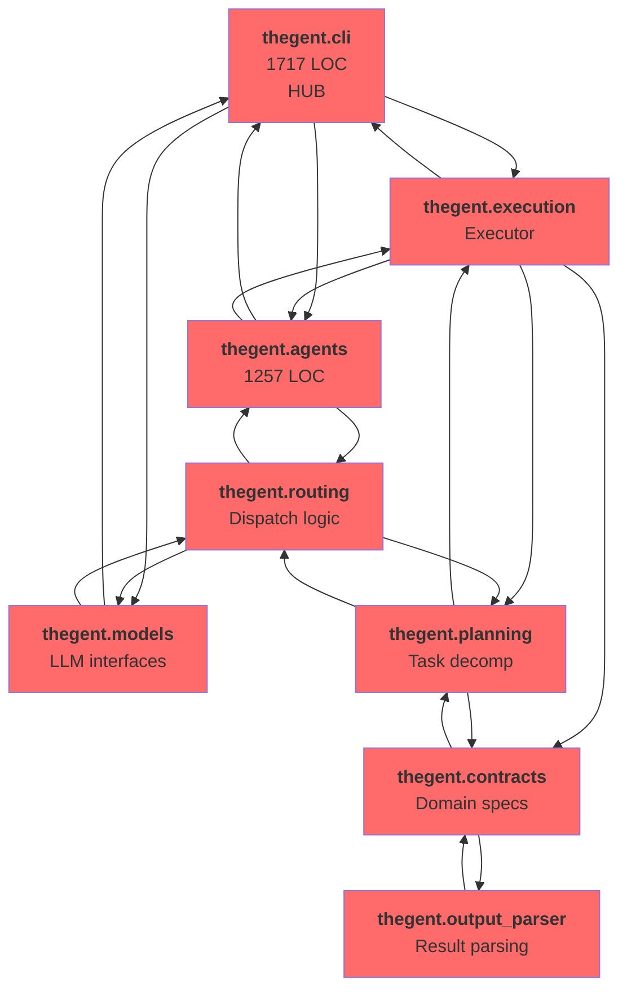
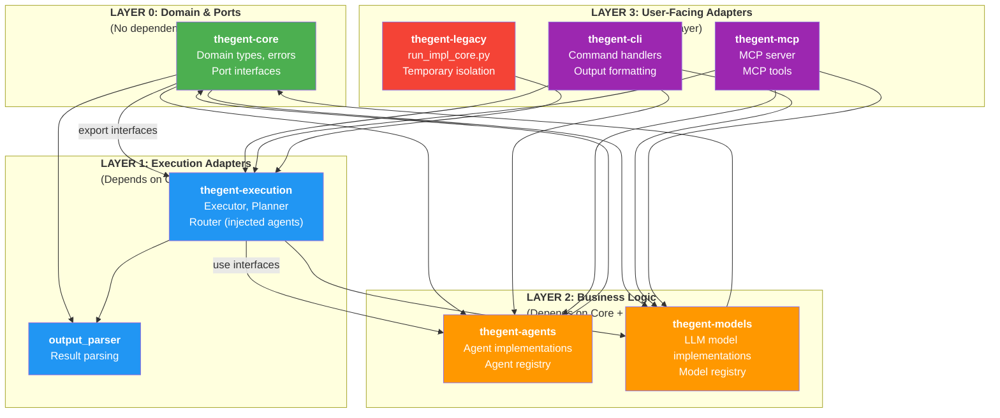
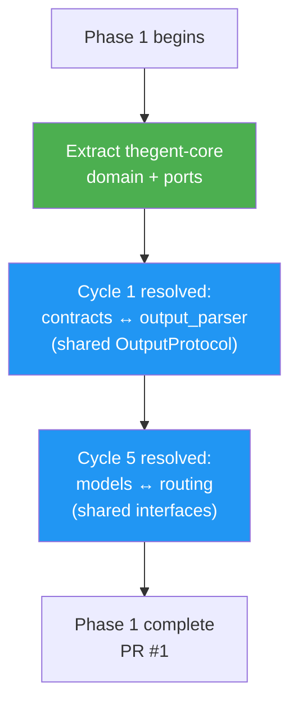
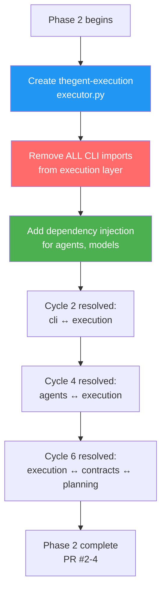
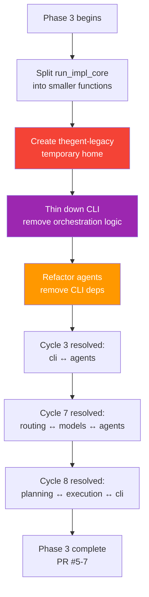
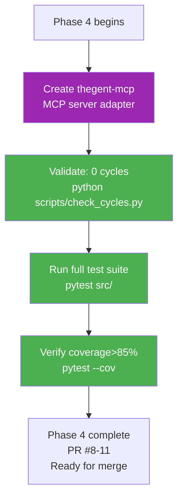

# Module Split Boundaries Specification

**Date**: 2026-04-24  
**Repository**: thegent  
**Purpose**: Define clear dependency boundaries using Mermaid diagrams for before/after remediation

---

## Current State (8 Circular Dependencies)

### Dependency Graph (Actual)



**Legend**:
- 🔴 Red: Modules with circular dependencies
- Arrow size indicates dependency weight
- Bold numbers: LOC in each module

### Cycle Summary

| Cycle | Modules | Type | Impact |
|-------|---------|------|--------|
| **1** | contracts ↔ output_parser | 2-way | Medium |
| **2** | cli ↔ execution | 2-way | High |
| **3** | cli ↔ agents | 2-way | High |
| **4** | agents ↔ execution | 2-way | Medium-High |
| **5** | models ↔ routing | 2-way | Medium |
| **6** | execution → contracts → planning → execution | 3-way | High |
| **7** | routing → models → agents → routing | 3-way | High |
| **8** | planning → execution → cli → planning | 3-way | Critical |

---

## Target State (5-Package Split, Zero Cycles)

### Layered Dependency Graph (Desired)



**Legend**:
- 🟢 Green: Core abstractions (no dependencies)
- 🔵 Blue: Execution layer (adapters)
- 🟠 Orange: Business logic (plugins)
- 🟣 Purple: User-facing adapters
- 🔴 Red: Temporary isolation

---

## Package Details

### Package 1: `thegent-core` (Layer 0)

**Purpose**: Domain types, error types, and port interfaces (no implementation)

**Contents**:
```
thegent_core/
├── domain/
│   ├── __init__.py
│   ├── contract.py          # Contract, Task, Spec types
│   ├── output.py            # OutputProtocol (shared)
│   ├── result.py            # Result<T, Error> type
│   └── types.py             # Common types (Run, Session, etc.)
├── ports/
│   ├── __init__.py
│   ├── agent.py             # AgentInterface
│   ├── model.py             # ModelInterface
│   ├── router.py            # RouterInterface
│   ├── logger.py            # LoggerInterface
│   └── event_bus.py         # EventBusInterface
└── errors/
    ├── __init__.py
    ├── execution.py         # ExecutionError
    └── agent.py             # AgentError
```

**Exports**:
```python
# thegent_core/__init__.py
from .domain import Contract, OutputProtocol, Result
from .ports import AgentInterface, ModelInterface, RouterInterface, LoggerInterface, EventBusInterface
from .errors import ExecutionError, AgentError
```

**Dependencies**: Python stdlib only (no external deps except typing)

**Test Coverage**: >95% (interfaces + domain logic)

**Metrics**:
- **LOC**: ~500 (very small, pure definitions)
- **Cycles**: 0 (guaranteed)

---

### Package 2: `thegent-execution` (Layer 1)

**Purpose**: Core orchestration engine (no CLI imports)

**Contents**:
```
thegent_execution/
├── __init__.py
├── executor.py              # Executor class (takes dependencies)
├── planner.py               # Task decomposer (refactored from planning/)
├── router.py                # Request router (refactored from routing/)
├── logger.py                # Logger adapter (wraps thegent_core.LoggerInterface)
├── event_bus.py             # Event dispatcher (wraps thegent_core.EventBusInterface)
└── orchestrator.py          # High-level orchestration helper
```

**Key Signature**:
```python
# thegent_execution/executor.py
from thegent_core import AgentInterface, ModelInterface, LoggerInterface, Result, Contract

class Executor:
    def __init__(
        self,
        agent_factory: AgentFactory,      # Injected
        model_factory: ModelFactory,      # Injected
        logger: LoggerInterface,          # Injected
        event_bus: Optional[EventBusInterface] = None,
    ):
        pass
    
    def run(self, contract: Contract) -> Result[Output, ExecutionError]:
        # Pure orchestration logic
        # No CLI imports, no direct agent/model references
        # Uses injected dependencies only
        pass
```

**Dependencies**:
- `thegent_core` ✅
- Python stdlib ✅
- `asyncio`, `dataclasses` ✅
- **No** `thegent.cli`, agents, models, or routing imports ✅

**Test Coverage**: >90% (unit + integration with mocks)

**Metrics**:
- **LOC**: ~1,200 (split from current 1,600 run_impl_core + routing + planning)
- **Cycles**: 0 (guaranteed, no upward imports)

**Breakup from Current**:
- `cli/services/run_execution_core_helpers.py` (1,623 LOC) → `executor.py` (refactored)
- `routing/dispatcher.py` → `router.py` (standalone)
- `planning/decompose.py` → `planner.py` (standalone)

---

### Package 3: `thegent-agents` (Layer 2)

**Purpose**: Agent implementations and registry (plugin pattern)

**Contents**:
```
thegent_agents/
├── __init__.py
├── registry.py              # Agent registry (service locator)
├── codex.py                 # CodexAgent (refactored from 1,257 LOC)
├── base.py                  # BaseAgent
└── types.py                 # Agent-specific types
```

**Key Signature**:
```python
# thegent_agents/registry.py
from thegent_core import AgentInterface

class AgentRegistry:
    def register(self, name: str, factory: Callable[..., AgentInterface]) -> None:
        pass
    
    def get(self, name: str) -> AgentInterface:
        # No CLI imports, returns interface
        pass

# Injected into executor
registry = AgentRegistry()
registry.register("codex", CodexAgent)
registry.register("claude", ClaudeAgent)
executor = Executor(agent_factory=registry.get)  # Dependency injection
```

**Dependencies**:
- `thegent_core` ✅
- **No** `thegent.cli`, execution, or models imports ✅
- Can call `thegent_execution` for result handling (checked at import time)

**Test Coverage**: >85% (agent logic + registry)

**Metrics**:
- **LOC**: ~1,500 (extracted from agents/)
- **Cycles**: 0 (no upward imports to execution or CLI)

---

### Package 4: `thegent-mcp` (Layer 3)

**Purpose**: MCP server adapter (same pattern as CLI)

**Contents**:
```
thegent_mcp/
├── __init__.py
├── server.py                # MCP server implementation
├── tools/
│   ├── __init__.py
│   ├── execution.py         # MCP execution tools
│   ├── models.py            # MCP model tools
│   └── agents.py            # MCP agent tools
└── types.py                 # MCP-specific types
```

**Key Signature**:
```python
# thegent_mcp/server.py
from thegent_execution import Executor
from thegent_core import LoggerInterface

class MCPServer:
    def __init__(self, executor: Executor, logger: LoggerInterface):
        self.executor = executor
    
    @tool
    def run_task(self, task: str) -> str:
        # Calls executor (not CLI)
        result = self.executor.run(...)
        return format_result(result)
```

**Dependencies**:
- `thegent_core` ✅
- `thegent_execution` ✅
- **No** internal `thegent.cli` or `thegent.mcp` circular dependencies ✅

**Test Coverage**: >85% (MCP tool behavior)

**Metrics**:
- **LOC**: ~400 (existing src/mcp/, refactored)
- **Cycles**: 0 (clean adapter pattern)

---

### Package 5: `thegent-legacy` (Layer 3 — Temporary)

**Purpose**: Temporary home for god function while it's being refactored

**Contents**:
```
thegent_legacy/
├── __init__.py
├── run_impl_core.py         # Original 1,023 LOC function (preserved as-is)
└── README.md                # "This module will be removed once run_impl_core is decomposed"
```

**Purpose**:
- Isolate `run_impl_core()` so it doesn't create new cycles
- Allow incremental refactoring (extract sub-functions, then move to execution layer)
- Eventually delete when fully decomposed

**Deprecation Note**:
```python
# thegent_legacy/__init__.py
"""
DEPRECATED: This module is a temporary home for run_impl_core().

run_impl_core is a 1,023-line god function that will be decomposed
into smaller, testable functions in thegent_execution over the next
2-3 weeks. Once decomposition is complete, this module will be deleted.

Do NOT add new code here; refactor run_impl_core instead.
"""
```

**Dependencies**: Only imports thegent_core (no upward deps to prevent cycles)

**Metrics**:
- **LOC**: ~1,100 (preserved as-is)
- **Cycles**: 0 (isolated, no two-way imports)
- **Planned removal**: Week 3-4 of remediation

---

## Import Rules (Enforced by `tach`)

```toml
# tach.toml (enforcement rules)

[build]
forbid_circular_dependencies = true

[modules]
"thegent_core" = {depends_on = []}

"thegent_execution" = {depends_on = ["thegent_core"]}
"thegent_agents" = {depends_on = ["thegent_core"]}
"thegent_models" = {depends_on = ["thegent_core"]}

"thegent_cli" = {depends_on = ["thegent_core", "thegent_execution", "thegent_agents", "thegent_models"]}
"thegent_mcp" = {depends_on = ["thegent_core", "thegent_execution", "thegent_agents", "thegent_models"]}
"thegent_legacy" = {depends_on = ["thegent_core"]}

# Block specific dangerous imports
[[forbidden_imports]]
path = "thegent_execution"
forbidden = ["thegent_cli", "thegent_agents", "thegent_models"]
message = "Execution engine must not import CLI or agent implementations"

[[forbidden_imports]]
path = "thegent_agents"
forbidden = ["thegent_cli", "thegent_execution"]
message = "Agent plugins must not import CLI or executor"
```

---

## Transition Plan (4 Weeks)

### Week 1: Extract Core + Resolve Cycles 1 & 5



### Week 2: Isolate Execution + Resolve Cycles 2, 4, 6



### Week 3: Reorganize CLI + Agents + Resolve Cycles 3, 7, 8



### Week 4: MCP + Integration + Final Validation



---

## Validation Checklist

Before considering a phase complete, verify:

- [ ] No new circular dependencies introduced (run `tach check`)
- [ ] All existing tests still pass (`pytest src/`)
- [ ] Code coverage >85% (new code + refactored code)
- [ ] All 1,308 existing tests passing
- [ ] No lint errors (`ruff check src/`)
- [ ] Type checking clean (`pyright src/`)
- [ ] Documentation updated (docstrings, module READMEs)
- [ ] PR has <500 LOC diffs per file (enforces focus)

---

## Related Documentation

- **Remediation Plan**: `circular_deps_remediation_plan.md` (detailed strategy)
- **Code Audit**: `THEGENT_CODE_AUDIT.md` (original findings)

---

**Status**: Specification ready for Phase 1 implementation  
**Next**: Begin Phase 1 (extract thegent-core)
