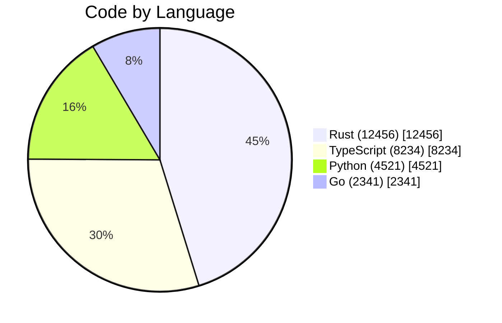
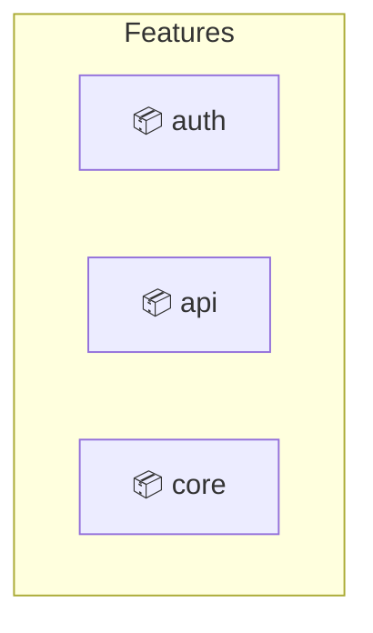

# Codebase Atlas Skill

Generate auto-updating visual maps of codebase structure that update on every commit/push.

## Overview

The codebase atlas system provides:

- **File Tree**: All files sorted by LOC (lines of code)
- **Folder Tree**: Directory hierarchy with aggregated LOC
- **Technology Tree**: Code distribution by programming language
- **Feature Tree**: Inferred feature modules from directory structure
- **User Tree**: Code ownership via git blame

## Commands

### CLI Usage

```bash
# Generate atlas for current repository
thegent atlas generate

# View specific atlas type
thegent atlas view file
thegent atlas view folder
thegent atlas view tech
thegent atlas view feature
thegent atlas view user

# Quick stats
thegent atlas stats

# Install git hooks for auto-generation
thegent atlas install-hooks

# Serve interactive web view
thegent atlas serve --port 8080
```

### Hook Installation

For auto-generation on every commit, install git hooks:

```bash
./scripts/install_hooks.sh
```

After installation:
- **post-commit hook**: Generates atlas after every commit (async, non-blocking)
- **pre-push hook**: Updates atlas before push (amends commit with atlas)

## Atlas Output Structure

```
.atlas/
├── README.md           # Index with all views
├── file_tree.md       # Files sorted by LOC
├── folder_tree.md     # Directory hierarchy
├── tech_tree.md       # By programming language (Mermaid)
├── feature_tree.md    # Inferred features
├── user_tree.md       # Code ownership
├── stats.json         # Raw statistics (JSON)
└── .atlas_hook_marker # Hook installation marker
```

## Configuration

### Environment Variables

| Variable | Default | Description |
|----------|---------|-------------|
| `ATLAS_DIR` | `.atlas` | Output directory |
| `ATLAS_QUIET` | `false` | Suppress output |
| `ATLAS_CONFIG` | - | Config file path |

### Config File

Place `atlas_config.yaml` in the output directory:

```yaml
atlas:
  version: "1.0.0"
  output_dir: ".atlas"

  exclude_patterns:
    - "**/node_modules/**"
    - "**/target/**"
    - "**/.git/**"

  generate:
    - file_tree: true
    - folder_tree: true
    - tech_tree: true
    - feature_tree: true
    - user_tree: true

  hooks:
    run_on_commit: true
    run_on_push: true
```

## Atlas Format Examples

### File Tree

```markdown
# File Tree

Files sorted by lines of code (LOC):

```
  2456 LOC │██████████████████████████████ Rust (src/main.rs)
  1234 LOC │██████████████                 Python (lib/utils.py)
   892 LOC │██████████                     TypeScript (web/index.ts)
```
```

### Technology Tree (Mermaid)



### Feature Tree



## Integration

### CI/CD

Add `.github/workflows/atlas.yml` to run in CI:

```yaml
name: Codebase Atlas

on:
  push:
    branches: [main]
  pull_request:
    branches: [main]

jobs:
  generate-atlas:
    runs-on: ubuntu-latest
    steps:
      - uses: actions/checkout@v4
      - name: Generate Atlas
        run: ./scripts/generate_codebase_atlas.sh
      - name: Upload Artifact
        uses: actions/upload-artifact@v4
        with:
          name: codebase-atlas
          path: .atlas/
```

### GitHub Pages

The atlas can be published to GitHub Pages:

```bash
# In docs/atlas/ directory
git commit -m "docs: update atlas"
git push
```

## Agent Usage

When working with the codebase, agents can:

1. **Quick orientation**: "Show me the file tree for this repo"
2. **Identify hotspots**: "Find the largest files in this codebase"
3. **Technology audit**: "What languages are used and how much of each?"
4. **Feature discovery**: "What are the main modules/packages?"
5. **Ownership analysis**: "Who owns the most code in this repo?"

## Technical Details

- Uses parallel processing (rayon) for large repos
- Memory-mapped file reading for performance
- Git ls-files for accurate tracked file list
- Respects .gitignore patterns
- Excludes binary files and common build artifacts

## See Also

- [phenotype-infrakit](https://github.com/phenotype/phenotype-infrakit) - Rust code stats library (`phenotype-code-stats` crate)
- [scripts/generate_codebase_atlas.sh](../scripts/generate_codebase_atlas.sh) - Generator script
