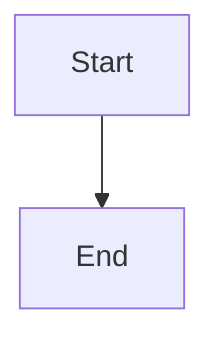

# Unified VitePress Docsite Template

A comprehensive, feature-rich VitePress template with enterprise-grade features.

## Features Included

| Feature | Description |
|---------|-------------|
| **i18n** | 5 locales: English, 简体中文, 繁體中文, فارسی, Pinglish |
| **Mermaid Diagrams** | Flowcharts, sequence diagrams, gantt charts |
| **KaTeX Math** | LaTeX math rendering |
| **Emoji Support** | Full emoji support in markdown |
| **Image Optimization** | AVIF/WebP conversion via imagetools |
| **Content Tabs** | Tabbed content blocks |
| **Video Embed** | Embed videos in markdown |
| **Cross-Project Links** | Link to other projects with `~project:/path` |
| **Local Search** | Built-in full-text search |
| **Algolia Search** | Optional Algolia integration via env vars |
| **Dark/Light Mode** | Automatic theme switching |
| **Code Highlighting** | GitHub light/dark themes |
| **Callout Components** | Tip, warning, danger, note boxes |
| **Last Updated** | Shows last updated timestamp |

## Quick Setup

### For New Project

```bash
# 1. Copy template
cp -r templates/vitepress-unified your-project/docs/.vitepress

# 2. Rename config template
mv docs/.vitepress/config.ts.template docs/.vitepress/config.ts
mv docs/.vitepress/package.json.template docs/.vitepress/package.json

# 3. Update placeholders in config.ts:
#    - {{PROJECT_NAME}} -> "myproject"
#    - {{PROJECT_DESCRIPTION}} -> "My project description"
#    - {{BASE_URL}} -> "/my-project/" (or "/" for root)
#    - {{GITHUB_REPO}} -> "username/repo" (optional)

# 4. Install dependencies
cd your-project
pnpm install

# 5. Build
pnpm docs:build
```

### For Existing Project

```bash
# Copy template files to existing .vitepress
cp templates/vitepress-unified/* your-project/docs/.vitepress/
cp -r templates/vitepress-unified/plugins your-project/docs/.vitepress/
cp -r templates/vitepress-unified/theme your-project/docs/.vitepress/

# Rename templates
mv config.ts.template config.ts
mv package.json.template package.json

# Update placeholders in config.ts
```

## Configuration

### Required Placeholders

| Placeholder | Description | Example |
|-------------|-------------|---------|
| `{{PROJECT_NAME}}` | Project name | "myproject" |
| `{{PROJECT_DESCRIPTION}}` | Project description | "My project docs" |
| `{{BASE_URL}}` | GitHub Pages base URL | "/myproject/" or "/" |
| `{{GITHUB_REPO}}` | GitHub repo for edit links | "username/repo" |

### Optional Environment Variables

```bash
# Algolia Search (optional)
VITEPRESS_ALGOLIA_APP_ID=your_app_id
VITEPRESS_ALGOLIA_API_KEY=your_api_key
VITEPRESS_ALGOLIA_INDEX_NAME=your_index
```

### Customizing Sidebar

Edit the `sidebar` object in `config.ts`:

```typescript
const sidebar = {
  '/guide/': [
    {
      text: 'Guide',
      collapsed: false,
      items: [
        { text: 'Getting Started', link: '/guide/' },
        { text: 'Installation', link: '/guide/installation' },
      ]
    }
  ],
  // Add more sections...
}
```

### Customizing Navigation

Edit the `nav` array in `config.ts`:

```typescript
const nav = [
  { text: 'Home', link: '/' },
  { text: 'Guide', link: '/guide/' },
  { text: 'API', link: '/api/' },
  // Add more items...
]
```

## Using Features

### Mermaid Diagrams

````markdown

````

### Math (KaTeX)

```markdown
Inline math: $E = mc^2$

Block math:
$$
\int_{-\infty}^{\infty} e^{-x^2} dx = \sqrt{\pi}
$$
```

### Content Tabs

````markdown
::: tabs
@tab npm
```bash
npm install
```
@tab pnpm
```bash
pnpm add
```
@tab yarn
```bash
yarn add
```
:::
````

### Video Embed

```markdown
@video[](https://example.com/video.mp4)
```

### Cross-Project Links

```markdown
See [thegent docs](~thegent:/guides/getting-started)
```

### Callouts

```markdown
<Callout type="tip" title="Pro Tip">
  This is helpful!
</Callout>
```

## GitHub Pages Deployment

### Option 1: GitHub Actions (Recommended)

Create `.github/workflows/docs.yml`:

```yaml
name: Docs
on:
  push:
    branches: [main]
    paths: ['docs/**']

jobs:
  deploy:
    runs-on: ubuntu-latest
    steps:
      - uses: actions/checkout@v4
      - uses: oven-sh/setup-bun@v2
      - run: bun install --frozen-lockfile
      - run: bun run docs:build
      - uses: actions/upload-pages-artifact@v3
        with:
          path: docs/.vitepress/dist
      - uses: actions/deploy-pages@v4
```

### Option 2: Manual Build

```bash
# Build
pnpm docs:build

# Output is in docs/.vitepress/dist/
# Deploy to gh-pages branch
```

## Commands

| Command | Description |
|---------|-------------|
| `pnpm docs:dev` | Dev server with hot reload |
| `pnpm docs:build` | Build for production |
| `pnpm docs:preview` | Preview built site |

## Directory Structure

```
vitepress-unified/
├── config.ts.template      # Main config (rename to config.ts)
├── package.json.template    # Dependencies (rename to package.json)
├── plugins/
│   ├── content-tabs.ts     # Content tabs plugin
│   ├── cross-project-links.ts # Cross-project links
│   └── video-embed.ts      # Video embed plugin
├── theme/
│   ├── index.ts            # Theme entry
│   ├── custom.css          # Custom styles
│   └── components/
│       └── Callout.vue     # Callout component
└── SETUP.md               # This file
```

## Troubleshooting

### Build fails with missing dependency

```bash
pnpm install
```

### Search not working

Ensure `search: { provider: 'local' }` is in themeConfig, or set Algolia env vars.

### Mermaid diagrams not rendering

Ensure `vitepress-plugin-mermaid` is in dependencies and config uses `withMermaid()`.

### Images not loading

Check `base` URL in config matches your deployment path.

## Migration from Old Template

If migrating from `vitepress-full`:

1. Copy new `config.ts.template` 
2. Update placeholders
3. Copy `plugins/` folder
4. Rebuild: `pnpm install && pnpm docs:build`

## License

MIT
